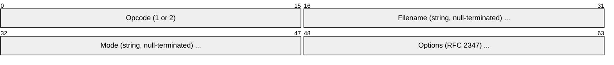
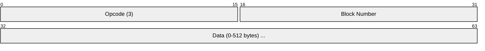
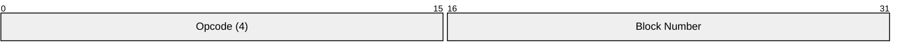
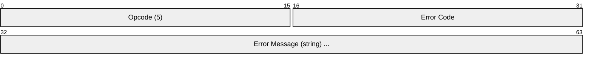
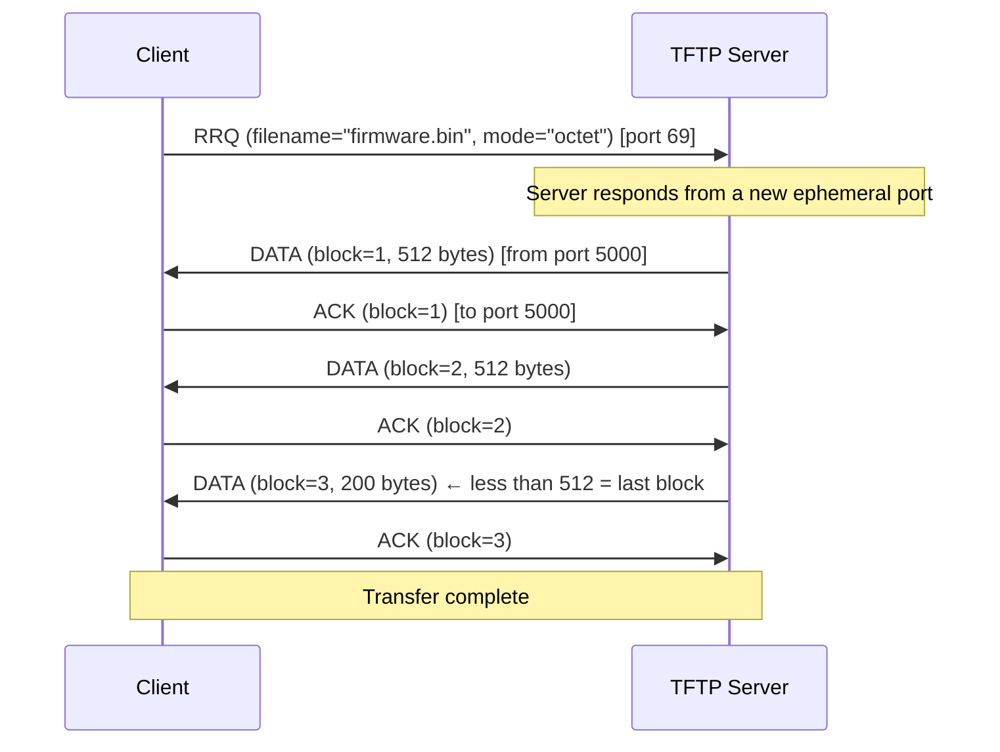
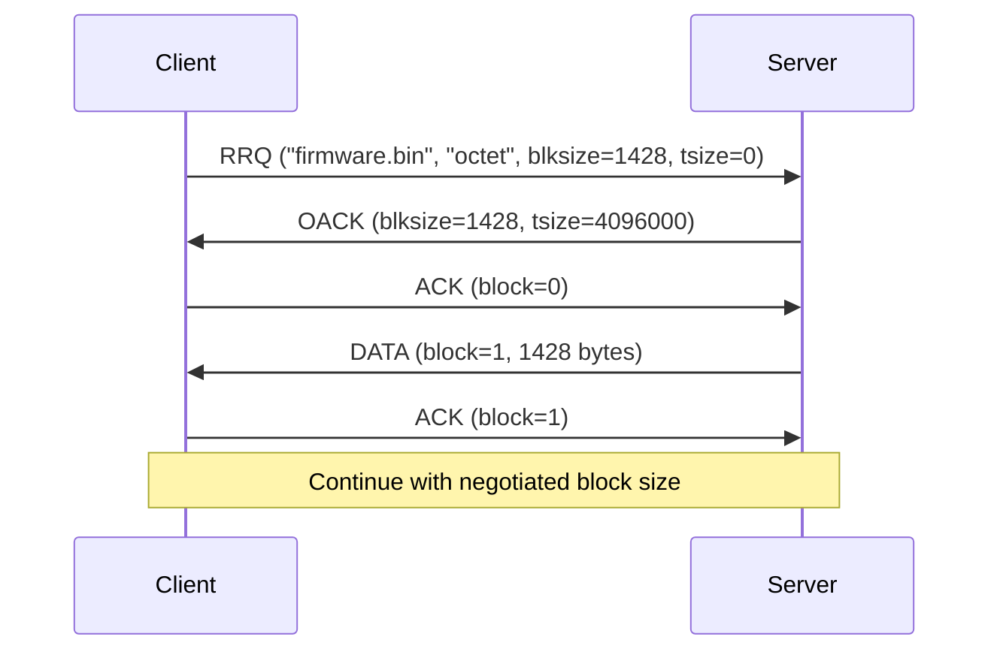
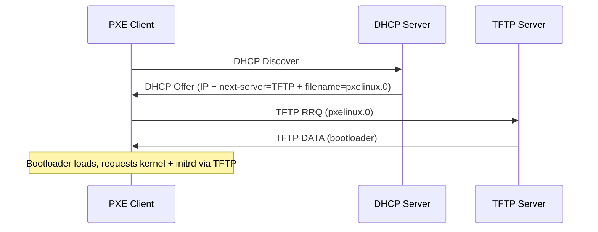
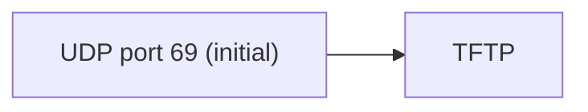

# TFTP (Trivial File Transfer Protocol)

> **Standard:** [RFC 1350](https://www.rfc-editor.org/rfc/rfc1350) | **Layer:** Application (Layer 7) | **Wireshark filter:** `tftp`

TFTP is a minimal file transfer protocol that uses UDP with no authentication, no directory listing, and no encryption. Its simplicity makes it ideal for bootstrapping — PXE network booting, firmware updates on embedded devices, and provisioning IP phones and network equipment. TFTP fits in a very small code footprint, making it implementable on devices with minimal resources. It uses a simple stop-and-wait acknowledgment scheme for reliability over UDP.

## Packet Types

| Opcode | Name | Direction | Description |
|--------|------|-----------|-------------|
| 1 | RRQ | Client → Server | Read Request (download a file) |
| 2 | WRQ | Client → Server | Write Request (upload a file) |
| 3 | DATA | Either | Data block (512 bytes, or less for last block) |
| 4 | ACK | Either | Acknowledge a data block |
| 5 | ERROR | Either | Error message |
| 6 | OACK | Server → Client | Option Acknowledgment (RFC 2347) |

## RRQ / WRQ Format

## DATA Format

## ACK Format

## ERROR Format

## Read Transfer (Download)

The last DATA packet has fewer than 512 bytes (or exactly 0), signaling end of file.

## Error Codes

| Code | Name | Description |
|------|------|-------------|
| 0 | Not defined | See error message |
| 1 | File not found | Requested file does not exist |
| 2 | Access violation | Permission denied |
| 3 | Disk full | No space for write |
| 4 | Illegal operation | Unknown opcode or bad request |
| 5 | Unknown transfer ID | Wrong source port (session mismatch) |
| 6 | File already exists | File exists (for write) |
| 7 | No such user | User authentication failed (rarely used) |
| 8 | Option negotiation failed | Requested option rejected |

## Transfer Modes

| Mode | Description |
|------|-------------|
| `netascii` | ASCII text with CR/LF conversion |
| `octet` | Raw binary (most common) |
| `mail` | Email delivery (obsolete) |

## Options (RFC 2347)

| Option | RFC | Description |
|--------|-----|-------------|
| blksize | RFC 2348 | Block size (8-65464 bytes, default 512) |
| tsize | RFC 2349 | Transfer size (total file size in bytes) |
| timeout | RFC 2349 | Retransmission timeout in seconds (1-255) |
| windowsize | RFC 7440 | Number of blocks sent before waiting for ACK |

### Option Negotiation

## Common Uses

| Use Case | Description |
|----------|-------------|
| PXE Boot | BIOS/UEFI downloads bootloader via TFTP after DHCP |
| Cisco IOS | Firmware upload/download on routers/switches |
| VoIP Phones | Configuration file provisioning |
| Firmware Updates | Embedded device firmware loading |
| Network Equipment | Configuration backup/restore |

### PXE Boot Flow

## TFTP vs FTP vs HTTP

| Feature | TFTP | FTP | HTTP |
|---------|------|-----|------|
| Transport | UDP | TCP | TCP |
| Port | 69 | 21 + data | 80/443 |
| Authentication | None | Username/password | Optional |
| Directory listing | No | Yes | No (application-dependent) |
| File size limit | ~32MB (16-bit block#) or larger with options | None | None |
| Encryption | None | FTPS | HTTPS |
| Code footprint | Tiny (~1KB) | Large | Large |
| Use case | Bootstrapping, firmware | General file transfer | Web, APIs |

## Encapsulation

The initial request goes to port 69. The server responds from a random ephemeral port, and the rest of the transfer uses that port.

## Standards

| Document | Title |
|----------|-------|
| [RFC 1350](https://www.rfc-editor.org/rfc/rfc1350) | The TFTP Protocol (Revision 2) |
| [RFC 2347](https://www.rfc-editor.org/rfc/rfc2347) | TFTP Option Extension |
| [RFC 2348](https://www.rfc-editor.org/rfc/rfc2348) | TFTP Blocksize Option |
| [RFC 2349](https://www.rfc-editor.org/rfc/rfc2349) | TFTP Timeout and Transfer Size Options |
| [RFC 7440](https://www.rfc-editor.org/rfc/rfc7440) | TFTP Windowsize Option |

## See Also

- [FTP](ftp.md) — full-featured file transfer alternative
- [DHCP](../naming/dhcp.md) — works with TFTP for PXE boot (next-server option)
- [UDP](../transport-layer/udp.md) — TFTP transport
