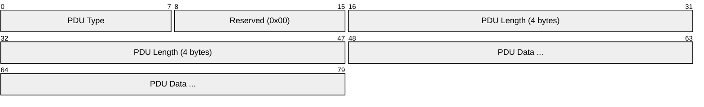
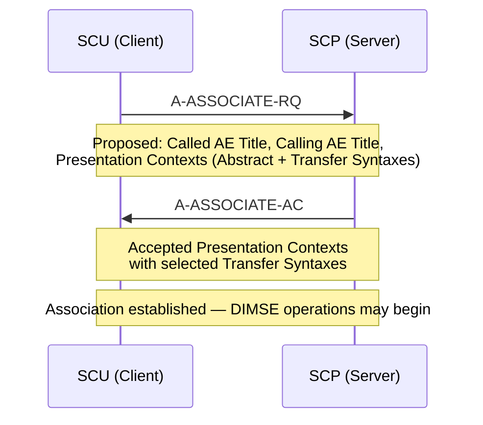
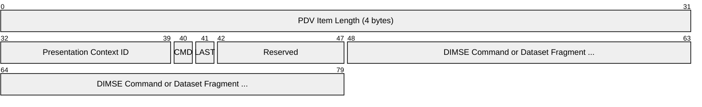
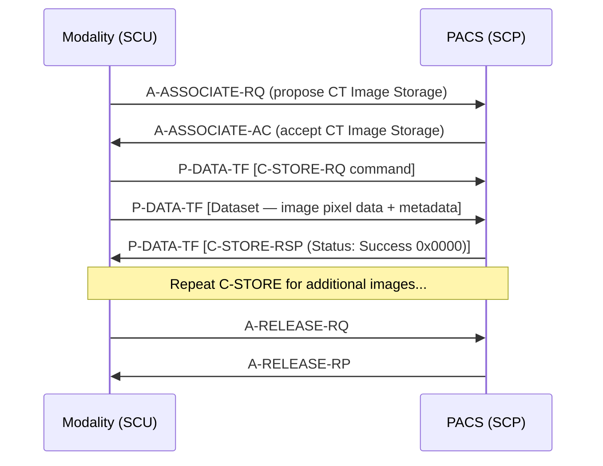
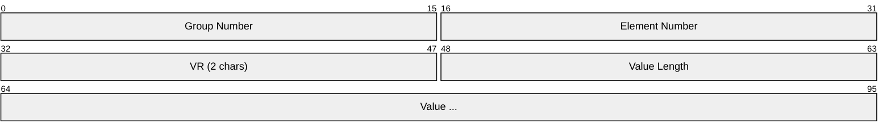
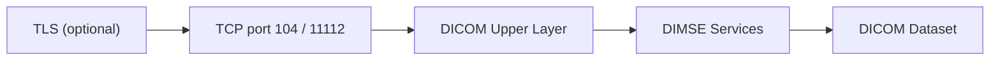

# DICOM (Digital Imaging and Communications in Medicine)

> **Standard:** [NEMA PS3 / ISO 12052](https://www.dicomstandard.org/current) | **Layer:** Application (Layer 7) | **Wireshark filter:** `dicom`

DICOM is the universal standard for storing, transmitting, and displaying medical images and associated data. It defines both a file format and a network protocol that enables interoperability between imaging devices (CT, MRI, X-ray, ultrasound), PACS servers, workstations, and clinical systems. The DICOM network protocol uses an Upper Layer Protocol based on ISO 8822 (OSI Association) over TCP, typically on port 104 or 11112. Communication follows a Service Class User (SCU) / Service Class Provider (SCP) model where the SCU initiates requests and the SCP fulfills them.

## PDU (Protocol Data Unit) Structure

Every DICOM network message is wrapped in a PDU:

The PDU header is 6 bytes: 1 byte type, 1 byte reserved, and 4 bytes for the length of the remaining data (big-endian).

## Key Fields

| Field | Size | Description |
|-------|------|-------------|
| PDU Type | 1 byte | Identifies the PDU type (0x01-0x07) |
| Reserved | 1 byte | Always 0x00 |
| PDU Length | 4 bytes | Length of the PDU data field (excludes the 6-byte header) |
| PDU Data | Variable | Content depends on PDU type |

## PDU Types

| Type | Hex | Name | Direction | Description |
|------|-----|------|-----------|-------------|
| 0x01 | 01 | A-ASSOCIATE-RQ | SCU -> SCP | Association request with proposed presentation contexts |
| 0x02 | 02 | A-ASSOCIATE-AC | SCP -> SCU | Association accepted with negotiated contexts |
| 0x03 | 03 | A-ASSOCIATE-RJ | SCP -> SCU | Association rejected with reason code |
| 0x04 | 04 | P-DATA-TF | Either | Transfer of command and data fragments |
| 0x05 | 05 | A-RELEASE-RQ | Either | Request graceful release of association |
| 0x06 | 06 | A-RELEASE-RP | Either | Confirm release of association |
| 0x07 | 07 | A-ABORT | Either | Abrupt termination of association |

## Association Negotiation

Before any image data is exchanged, the SCU and SCP must establish an Association. The SCU proposes one or more Presentation Contexts, each pairing an Abstract Syntax (what service/data) with one or more Transfer Syntaxes (how the data is encoded).

### A-ASSOCIATE-RQ Contents

| Item | Description |
|------|-------------|
| Application Context | Always "1.2.840.10008.3.1.1.1" (DICOM Application Context) |
| Called AE Title | Application Entity title of the SCP (up to 16 chars) |
| Calling AE Title | Application Entity title of the SCU (up to 16 chars) |
| Presentation Contexts | List of proposed Abstract Syntax + Transfer Syntax pairs |
| User Information | Max PDU length, implementation class UID, implementation version |

### Common Transfer Syntaxes

| UID | Name | Description |
|-----|------|-------------|
| 1.2.840.10008.1.2 | Implicit VR Little Endian | Default transfer syntax (required) |
| 1.2.840.10008.1.2.1 | Explicit VR Little Endian | Most commonly used |
| 1.2.840.10008.1.2.2 | Explicit VR Big Endian | Retired in 2024 |
| 1.2.840.10008.1.2.4.50 | JPEG Baseline | Lossy JPEG compression |
| 1.2.840.10008.1.2.4.70 | JPEG Lossless | Lossless JPEG compression |
| 1.2.840.10008.1.2.4.80 | JPEG-LS Lossless | JPEG-LS lossless compression |
| 1.2.840.10008.1.2.4.90 | JPEG 2000 Lossless | JPEG 2000 lossless compression |
| 1.2.840.10008.1.2.4.91 | JPEG 2000 | JPEG 2000 lossy compression |

## P-DATA-TF and Presentation Data Values

The P-DATA-TF PDU carries the actual DIMSE commands and datasets, wrapped in Presentation Data Value (PDV) items:

| Field | Size | Description |
|-------|------|-------------|
| PDV Item Length | 4 bytes | Length of this PDV item (includes context ID and message header) |
| Presentation Context ID | 1 byte | Odd number (1, 3, 5...) referencing a negotiated context |
| Message Control Header | 1 byte | Bit 0: Command (1) or Dataset (0); Bit 1: Last fragment (1) or not (0) |
| Fragment | Variable | DIMSE command elements or dataset fragment |

## DIMSE Services

DICOM Message Service Element (DIMSE) defines the operations available over an association. They are split into composite (C-) and normalized (N-) services:

### Composite Services (C-DIMSE)

| Service | Description | SCU Action | SCP Action |
|---------|-------------|------------|------------|
| C-STORE | Store an image/object | Sends an instance | Stores the instance |
| C-FIND | Query for matching objects | Sends query keys | Returns matching results |
| C-MOVE | Retrieve objects (via sub-association) | Requests retrieval | Sends via C-STORE to destination |
| C-GET | Retrieve objects (on same association) | Requests retrieval | Sends via C-STORE back to SCU |
| C-ECHO | Verify connectivity | Sends echo request | Returns echo response |

### Normalized Services (N-DIMSE)

| Service | Description |
|---------|-------------|
| N-CREATE | Create a managed SOP instance |
| N-SET | Modify attributes of a managed instance |
| N-GET | Retrieve attributes of a managed instance |
| N-ACTION | Request an action on a managed instance |
| N-EVENT-REPORT | Report an event from SCP to SCU |
| N-DELETE | Delete a managed SOP instance |

## C-STORE Flow

The most common DICOM operation is C-STORE, used to send images from a modality to a PACS:

## Common SOP Classes

| SOP Class | UID | Description |
|-----------|-----|-------------|
| CT Image Storage | 1.2.840.10008.5.1.4.1.1.2 | Computed Tomography images |
| MR Image Storage | 1.2.840.10008.5.1.4.1.1.4 | Magnetic Resonance images |
| CR Image Storage | 1.2.840.10008.5.1.4.1.1.1 | Computed Radiography images |
| US Image Storage | 1.2.840.10008.5.1.4.1.1.6.1 | Ultrasound images |
| DX Image Storage | 1.2.840.10008.5.1.4.1.1.1.1 | Digital X-Ray images |
| SC Image Storage | 1.2.840.10008.5.1.4.1.1.7 | Secondary Capture (screenshots, scanned docs) |
| RT Structure Set | 1.2.840.10008.5.1.4.1.1.481.3 | Radiation therapy structure sets |
| Verification | 1.2.840.10008.1.1 | C-ECHO verification SOP class |
| Patient Root Q/R Find | 1.2.840.10008.5.1.4.1.2.1.1 | C-FIND at patient root level |
| Study Root Q/R Find | 1.2.840.10008.5.1.4.1.2.2.1 | C-FIND at study root level |

## Data Element Format

DICOM datasets (both in files and network transfers) consist of Data Elements:

| Field | Size | Description |
|-------|------|-------------|
| Group Number | 2 bytes | Tag group (e.g., 0010 = Patient, 0020 = Study) |
| Element Number | 2 bytes | Tag element within the group |
| VR | 2 bytes | Value Representation — data type (Explicit VR only) |
| Value Length | 2 or 4 bytes | Length of the value field |
| Value | Variable | The actual data |

### Common Tags

| Tag | Name | VR | Description |
|-----|------|----|-------------|
| (0008,0060) | Modality | CS | CT, MR, CR, US, DX, etc. |
| (0010,0010) | Patient's Name | PN | Patient name |
| (0010,0020) | Patient ID | LO | Patient identifier |
| (0020,000D) | Study Instance UID | UI | Unique study identifier |
| (0020,000E) | Series Instance UID | UI | Unique series identifier |
| (0008,0018) | SOP Instance UID | UI | Unique image/object identifier |
| (7FE0,0010) | Pixel Data | OW/OB | The image pixel data |

### Value Representations (VR)

| VR | Name | Description |
|----|------|-------------|
| AE | Application Entity | AE title (max 16 chars) |
| CS | Code String | Enumerated values (max 16 chars) |
| DA | Date | YYYYMMDD format |
| DS | Decimal String | Numeric string |
| IS | Integer String | Integer as string |
| LO | Long String | Character string (max 64 chars) |
| OB | Other Byte | Byte stream |
| OW | Other Word | 16-bit word stream |
| PN | Person Name | Name in family^given^middle^prefix^suffix format |
| SQ | Sequence | Nested sequence of datasets |
| UI | Unique Identifier | UID string (max 64 chars) |
| UL | Unsigned Long | 32-bit unsigned integer |
| US | Unsigned Short | 16-bit unsigned integer |

## Encapsulation

DICOM runs directly over TCP. Port 104 is the well-known port; 11112 is commonly used as an unprivileged alternative. TLS support was added in the DICOM 2017 edition for secure transport.

## Standards

| Document | Title |
|----------|-------|
| [NEMA PS3.1-PS3.22](https://www.dicomstandard.org/current) | DICOM Standard (22 parts) |
| [PS3.7](https://dicom.nema.org/medical/dicom/current/output/html/part07.html) | Part 7: Message Exchange (DIMSE, PDU definitions) |
| [PS3.8](https://dicom.nema.org/medical/dicom/current/output/html/part08.html) | Part 8: Network Communication Support for Message Exchange (Upper Layer) |
| [PS3.4](https://dicom.nema.org/medical/dicom/current/output/html/part04.html) | Part 4: Service Class Specifications (C-STORE, C-FIND, etc.) |
| [PS3.5](https://dicom.nema.org/medical/dicom/current/output/html/part05.html) | Part 5: Data Structures and Encoding (Data Elements, VRs) |
| [PS3.6](https://dicom.nema.org/medical/dicom/current/output/html/part06.html) | Part 6: Data Dictionary (tag definitions) |
| [ISO 12052](https://www.iso.org/standard/43218.html) | Health informatics — Digital imaging and communication in medicine |

## See Also

- [HL7](hl7.md) — healthcare messaging (often paired with DICOM in clinical workflows)
- [TCP](../transport-layer/tcp.md)
- [TLS](../security/tls.md) — optional encryption for DICOM connections
