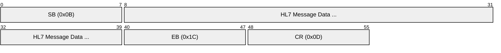
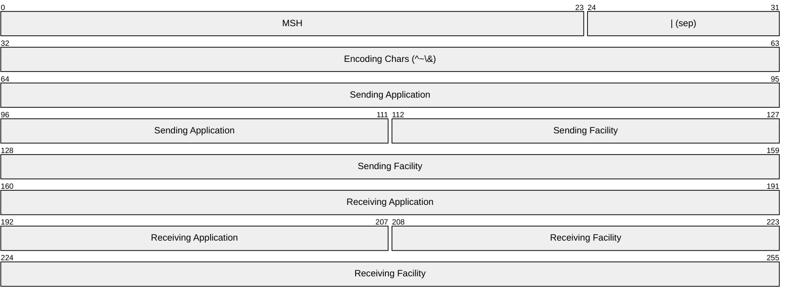
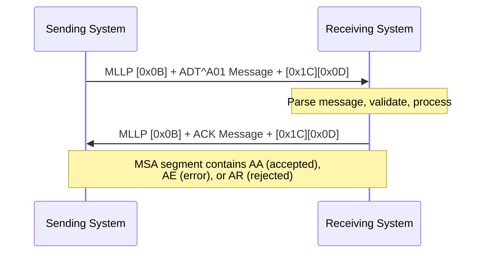
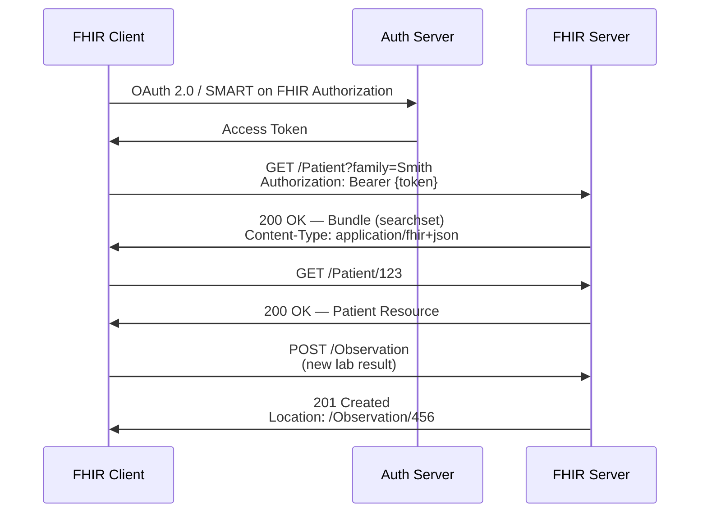
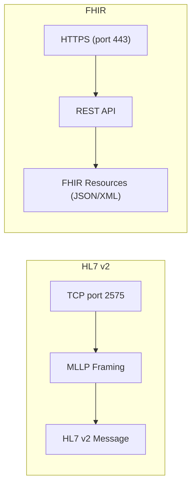

# HL7 (Health Level Seven) — v2 Messaging & FHIR

> **Standard:** [HL7 v2.x](https://www.hl7.org/implement/standards/product_section.cfm?section=13) / [HL7 FHIR R4](https://hl7.org/fhir/R4/) | **Layer:** Application (Layer 7) | **Wireshark filter:** `hl7`

HL7 is the most widely adopted family of standards for exchanging clinical and administrative healthcare data between systems. HL7 v2 is a pipe-delimited messaging protocol transported over TCP using MLLP (Minimum Lower Layer Protocol), and remains the workhorse of hospital integration engines worldwide. HL7 FHIR (Fast Healthcare Interoperability Resources) is the modern successor, using RESTful HTTP/HTTPS with JSON or XML resources. Both standards are maintained by Health Level Seven International.

---

## Part 1: HL7 v2 Messaging

### MLLP Framing

HL7 v2 messages are transmitted over TCP using MLLP (Minimum Lower Layer Protocol), which wraps each message with start and end markers:



| Field | Hex | Description |
|-------|-----|-------------|
| Start Block (SB) | 0x0B | Vertical Tab — marks beginning of HL7 message |
| HL7 Message | — | The complete HL7 v2 message (segments separated by `\r`) |
| End Block (EB) | 0x1C | File Separator — marks end of HL7 message |
| Carriage Return (CR) | 0x0D | Follows EB to complete the MLLP frame |

MLLP typically runs on TCP port 2575, though any port may be configured.

### Message Structure

An HL7 v2 message is a sequence of segments, each on its own line (separated by `\r`). Fields within a segment are separated by `|`, components by `^`, sub-components by `&`, and repetitions by `~`.

```
MSH|^~\&|SendingApp|SendingFac|ReceivingApp|ReceivingFac|20260321120000||ADT^A01^ADT_A01|MSG00001|P|2.5.1
EVN|A01|20260321120000
PID|1||MRN12345^^^Hospital^MR||Doe^John^A||19800115|M|||123 Main St^^Springfield^IL^62701
PV1|1|I|ICU^201^A||||1234^Smith^Jane^Dr|||MED||||||||V00001|||||||||||||||||||||20260321120000
```

### MSH (Message Header) Segment

The MSH segment is always the first segment and defines the message metadata:



### MSH Key Fields

| Position | Field | Description |
|----------|-------|-------------|
| MSH-1 | Field Separator | Always `\|` |
| MSH-2 | Encoding Characters | Component `^`, repetition `~`, escape `\`, sub-component `&` |
| MSH-3 | Sending Application | Name of the sending system |
| MSH-4 | Sending Facility | Organization/facility of sender |
| MSH-5 | Receiving Application | Name of the receiving system |
| MSH-6 | Receiving Facility | Organization/facility of receiver |
| MSH-7 | Date/Time of Message | YYYYMMDDHHMMSS format |
| MSH-9 | Message Type | Type^Trigger Event^Structure (e.g., ADT^A01^ADT_A01) |
| MSH-10 | Message Control ID | Unique identifier for this message |
| MSH-11 | Processing ID | P = Production, D = Debugging, T = Training |
| MSH-12 | Version ID | HL7 version (e.g., 2.5.1, 2.7) |

### Common Segment Types

| Segment | Name | Description |
|---------|------|-------------|
| MSH | Message Header | Message metadata, type, version, encoding |
| EVN | Event Type | Trigger event details and timestamps |
| PID | Patient Identification | Demographics, MRN, name, DOB, gender, address |
| PV1 | Patient Visit | Encounter/visit details, location, attending physician |
| NK1 | Next of Kin | Emergency contacts and relationships |
| OBR | Observation Request | Order details (lab, radiology, procedure) |
| OBX | Observation Result | Individual result values with units and status |
| ORC | Common Order | Order control information (new, cancel, replace) |
| AL1 | Allergy Information | Patient allergies |
| DG1 | Diagnosis | Diagnosis codes (ICD-10) |
| IN1 | Insurance | Insurance coverage information |
| MSA | Message Acknowledgment | ACK/NAK response to received message |

### Common Message Types

| Type | Trigger | Name | Description |
|------|---------|------|-------------|
| ADT | A01 | Admit | Patient admitted to inpatient |
| ADT | A02 | Transfer | Patient transferred between units |
| ADT | A03 | Discharge | Patient discharged |
| ADT | A04 | Register | Outpatient registration |
| ADT | A08 | Update Patient | Demographics update |
| ORM | O01 | Order Message | New order (lab, radiology, pharmacy) |
| ORU | R01 | Observation Result | Lab/diagnostic results |
| SIU | S12 | Schedule Notification | Appointment scheduling |
| MDM | T02 | Document Notification | Clinical document available |
| ACK | — | Acknowledgment | Confirms receipt and processing of a message |

### HL7 v2 Message Exchange



### ACK Codes (MSA-1)

| Code | Name | Description |
|------|------|-------------|
| AA | Application Accept | Message received and processed successfully |
| AE | Application Error | Message received but processing error occurred |
| AR | Application Reject | Message rejected (invalid format, unknown type) |
| CA | Commit Accept | Enhanced mode — committed to safe storage |
| CE | Commit Error | Enhanced mode — commit failed |
| CR | Commit Reject | Enhanced mode — commit rejected |

---

## Part 2: HL7 FHIR (Fast Healthcare Interoperability Resources)

FHIR is a modern, web-native standard for healthcare data exchange. It uses RESTful HTTP/HTTPS with resources represented in JSON or XML. FHIR is the foundation of national interoperability mandates (US ONC, EU EHDS) and is supported by all major EHR vendors.

### FHIR REST Operations

| HTTP Method | Operation | URL Pattern | Description |
|-------------|-----------|-------------|-------------|
| GET | Read | `/Patient/123` | Read a specific resource by ID |
| GET | Search | `/Patient?name=Smith` | Search for matching resources |
| POST | Create | `/Patient` | Create a new resource (server assigns ID) |
| PUT | Update | `/Patient/123` | Update a resource (client provides full resource) |
| DELETE | Delete | `/Patient/123` | Delete a resource |
| GET | vRead | `/Patient/123/_history/2` | Read a specific version |
| GET | History | `/Patient/123/_history` | Retrieve version history |
| POST | Operation | `/Patient/$everything` | Invoke a named operation |

### Core Resources

| Resource | Description |
|----------|-------------|
| Patient | Demographics, identifiers, contact information |
| Practitioner | Healthcare provider details |
| Encounter | A patient visit or interaction |
| Observation | Lab results, vital signs, clinical measurements |
| Condition | Diagnoses, problems, health concerns |
| MedicationRequest | Prescription / medication order |
| DiagnosticReport | Report grouping observations (lab panel, radiology) |
| AllergyIntolerance | Allergy and intolerance records |
| Procedure | Clinical procedures performed |
| Immunization | Vaccination records |
| DocumentReference | Reference to a clinical document (CDA, PDF) |
| Bundle | Collection of resources (transaction, batch, searchset) |

### FHIR REST Flow



### Search Parameters and Modifiers

| Parameter | Example | Description |
|-----------|---------|-------------|
| Simple | `?name=Smith` | Search by name |
| Token | `?identifier=MRN\|12345` | Search by system+value identifier |
| Date | `?birthdate=gt1990-01-01` | Date comparison (gt, lt, ge, le, eq) |
| Reference | `?subject=Patient/123` | Search by referenced resource |
| Chained | `?subject:Patient.name=Smith` | Search through references |
| Include | `?_include=Observation:subject` | Include referenced resources in results |
| Modifier | `?name:exact=Smith` | Exact match modifier |
| Reverse include | `?_revinclude=Observation:subject` | Include resources that reference this |

### Bundle Types

| Type | Description |
|------|-------------|
| searchset | Results of a search operation |
| transaction | Atomic set of operations (all succeed or all fail) |
| batch | Independent set of operations (each processed individually) |
| document | Clinical document (Composition + referenced resources) |
| message | FHIR messaging (MessageHeader + payload resources) |
| collection | Arbitrary collection of resources |

### SMART on FHIR Authorization

SMART on FHIR defines an OAuth 2.0-based authorization framework for FHIR. It supports EHR-launched and standalone application authorization flows with clinical scopes.

| Scope | Example | Description |
|-------|---------|-------------|
| patient/ | `patient/Patient.read` | Access data for the current patient context |
| user/ | `user/Observation.write` | Access data the user is authorized to see |
| launch | `launch` | Request EHR launch context |
| openid fhirUser | `openid fhirUser` | Get the identity of the logged-in user |

---

## HL7 v2 vs FHIR Comparison

| Aspect | HL7 v2 | FHIR |
|--------|--------|------|
| Format | Pipe-delimited text segments | JSON / XML resources |
| Transport | MLLP over TCP | HTTP/HTTPS (REST) |
| Data Model | Segments and fields (positional) | Resources with named elements |
| Query | Limited (QBP messages) | Rich RESTful search with parameters |
| Security | TLS (transport only) | OAuth 2.0, SMART on FHIR |
| Adoption | ~95% of US hospitals (legacy) | Growing rapidly; mandated for new APIs |
| Versioning | v2.1 through v2.9 | DSTU2, STU3, R4, R4B, R5 |
| Default Port | 2575 (MLLP) | 443 (HTTPS) |
| Interoperability | Point-to-point, high variability | Standardized REST API, better consistency |
| Tooling | Integration engines (Mirth, Rhapsody) | Standard HTTP libraries, FHIR SDKs |

## Encapsulation



## Standards

| Document | Title |
|----------|-------|
| [HL7 v2.5.1](https://www.hl7.org/implement/standards/product_section.cfm?section=13) | HL7 Version 2.5.1 Messaging Standard |
| [HL7 v2.7](https://www.hl7.org/implement/standards/product_section.cfm?section=13) | HL7 Version 2.7 Messaging Standard |
| [HL7 FHIR R4](https://hl7.org/fhir/R4/) | FHIR Release 4 (normative, most widely deployed) |
| [HL7 FHIR R5](https://hl7.org/fhir/R5/) | FHIR Release 5 |
| [SMART on FHIR](https://docs.smarthealthit.org/) | SMART App Launch Framework (OAuth 2.0 for FHIR) |
| [IHE Profiles](https://profiles.ihe.net/) | Integration profiles using HL7 v2 and FHIR |
| [US Core IG](https://www.hl7.org/fhir/us/core/) | US Core FHIR Implementation Guide (ONC/CMS mandated) |

## See Also

- [DICOM](dicom.md) — medical imaging protocol (often integrated with HL7 in clinical workflows)
- [HTTP](../web/http.md) — transport for FHIR REST API
- [TLS](../security/tls.md) — encrypts both MLLP and HTTPS connections
- [TCP](../transport-layer/tcp.md) — transport layer for MLLP
