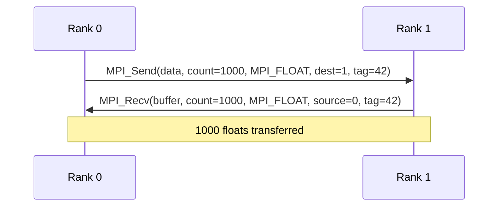
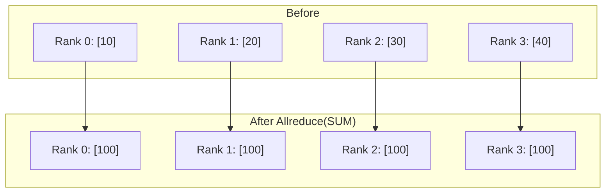
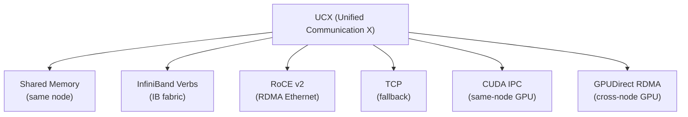

# MPI (Message Passing Interface)

> **Standard:** [MPI Forum (mpi-forum.org)](https://www.mpi-forum.org/docs/) | **Layer:** Application / Middleware | **Wireshark filter:** Depends on transport (TCP, InfiniBand, or RDMA)

MPI is the standard API and wire protocol for parallel computing across distributed systems. It defines how processes exchange messages, perform collective operations, and synchronize in high-performance computing (HPC) clusters. MPI has been the backbone of scientific computing, weather simulation, molecular dynamics, and computational fluid dynamics for 30 years. With GPU-aware MPI implementations, it's also used in AI/ML training (alongside or as an alternative to NCCL).

## Core Concepts

| Concept | Description |
|---------|-------------|
| Rank | Unique process ID within a communicator (0 to N-1) |
| Communicator | Group of processes that can communicate (MPI_COMM_WORLD = all) |
| Tag | Integer label to distinguish messages between the same rank pair |
| Datatype | MPI_INT, MPI_FLOAT, MPI_DOUBLE, or user-defined |
| Buffer | Application memory containing message data |

## Point-to-Point Operations

| Function | Description |
|----------|-------------|
| MPI_Send | Blocking send — returns after buffer is safe to reuse |
| MPI_Recv | Blocking receive — returns after message is in buffer |
| MPI_Isend | Non-blocking send — returns immediately (check with MPI_Wait) |
| MPI_Irecv | Non-blocking receive — returns immediately |
| MPI_Sendrecv | Simultaneous send and receive (avoids deadlock) |
| MPI_Probe | Check if a message is available without receiving it |

### Send/Receive Flow



## Collective Operations

| Operation | Description | Communication Pattern |
|-----------|-------------|----------------------|
| MPI_Bcast | One rank sends same data to all | One → all |
| MPI_Scatter | One rank sends different data to each | One → all (partitioned) |
| MPI_Gather | All ranks send data to one | All → one |
| MPI_Allgather | Gather from all, result on all | All → all |
| MPI_Reduce | Combine from all to one (sum, max, min) | All → one |
| MPI_Allreduce | Reduce + broadcast (result on all) | All → all |
| MPI_Alltoall | Each rank sends different data to each other | All → all (transposed) |
| MPI_Barrier | Synchronize all ranks (block until everyone arrives) | Synchronization |
| MPI_Scan | Prefix reduction (each rank gets partial result) | All → all (ordered) |
| MPI_Reduce_scatter | Reduce + scatter results | All → all (partitioned) |

### MPI_Allreduce



## Reduction Operations

| Operation | Description |
|-----------|-------------|
| MPI_SUM | Sum of all values |
| MPI_PROD | Product of all values |
| MPI_MAX | Maximum value |
| MPI_MIN | Minimum value |
| MPI_MAXLOC | Maximum value + location (rank) |
| MPI_MINLOC | Minimum value + location (rank) |
| MPI_LAND | Logical AND |
| MPI_LOR | Logical OR |
| MPI_BAND | Bitwise AND |
| MPI_BOR | Bitwise OR |

## Communication Modes

| Mode | Function | Behavior |
|------|----------|----------|
| Standard | MPI_Send | Implementation decides buffering |
| Buffered | MPI_Bsend | User-provided buffer, always returns immediately |
| Synchronous | MPI_Ssend | Returns only after matching receive has started |
| Ready | MPI_Rsend | Assumes receive already posted (undefined if not) |

## Wire Protocol

MPI itself is an API specification — implementations choose the wire protocol based on available hardware:

| Transport | Implementation | When Used |
|-----------|---------------|-----------|
| Shared memory | All | Same-node communication (fastest) |
| TCP/IP | OpenMPI (tcp BTL), MPICH (tcp) | Between nodes on Ethernet (fallback) |
| InfiniBand Verbs | OpenMPI (openib), MVAPICH | Between nodes on IB fabric |
| UCX (Unified Communication X) | OpenMPI, MPICH | Auto-selects best transport (IB, RoCE, shared mem) |
| libfabric (OFI) | MPICH, Intel MPI | Abstract transport interface |
| RDMA (RoCE v2) | UCX, libfabric | Ethernet with RDMA capability |

### UCX Transport Selection



## MPI for AI/ML

| Use Case | MPI Role |
|----------|---------|
| Data Parallel Training | MPI_Allreduce for gradient sync (or NCCL) |
| Pipeline Parallelism | MPI_Send/Recv between pipeline stages |
| Model Parallelism | MPI_Allgather for parameter sharing |
| Horovod | MPI + NCCL hybrid for distributed training |
| DeepSpeed | MPI for process management, NCCL for GPU communication |

### GPU-Aware MPI

Modern MPI implementations can send/receive directly from GPU memory:

```c
// GPU buffer — no need to copy to host first
float *gpu_gradients;  // CUDA device pointer
MPI_Allreduce(gpu_gradients, gpu_result, count, MPI_FLOAT, MPI_SUM, MPI_COMM_WORLD);
// Data moved directly between GPUs via GPUDirect RDMA
```

## Job Launch

| Launcher | Description |
|----------|-------------|
| `mpirun -np 8 ./app` | OpenMPI/MPICH process launcher |
| `srun --ntasks=8 ./app` | SLURM workload manager |
| `torchrun --nproc_per_node=4` | PyTorch distributed launcher (uses MPI or Gloo) |

## MPI vs NCCL

| Feature | MPI | NCCL |
|---------|-----|------|
| Scope | General HPC | GPU deep learning only |
| CPU support | Yes (primary) | No (GPU only) |
| GPU support | Via GPU-aware MPI | Native |
| NVLink optimization | Manual (UCX) | Automatic |
| Collectives | Full set + custom | Focused set (AllReduce, AllGather, etc.) |
| Point-to-point | Full support | Send/Recv only |
| Topology awareness | Limited (UCX helps) | Automatic (NVLink, PCIe, IB detection) |
| Use in training | Horovod, some DeepSpeed | PyTorch DDP, FSDP, Megatron |

## Implementations

| Implementation | Vendor | Notes |
|---------------|--------|-------|
| OpenMPI | Open source | Most portable, UCX support |
| MPICH | ANL (open source) | Reference implementation |
| MVAPICH | Ohio State | Optimized for InfiniBand and GPU |
| Intel MPI | Intel | Based on MPICH, optimized for Intel hardware |
| NVIDIA HPC-X | NVIDIA | OpenMPI + UCX, optimized for NVIDIA |
| Microsoft MPI | Microsoft | Windows HPC |

## Standards

| Document | Title |
|----------|-------|
| [MPI 4.1 Standard](https://www.mpi-forum.org/docs/mpi-4.1/mpi41-report.pdf) | MPI: A Message-Passing Interface Standard Version 4.1 |
| [MPI Forum](https://www.mpi-forum.org/) | MPI Forum (standards body) |

## See Also

- [RDMA / RoCE](rdma.md) — high-performance transport MPI uses
- [NCCL](nccl.md) — GPU-specific collective library (often used alongside MPI)
- [TCP](../transport-layer/tcp.md) — fallback MPI transport
- [SCTP](../transport-layer/sctp.md) — multi-stream transport (some MPI implementations)
