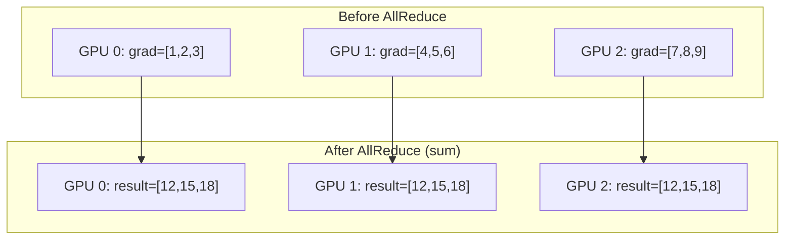
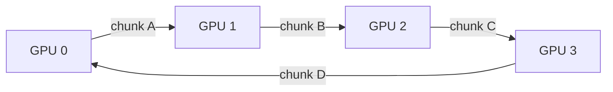
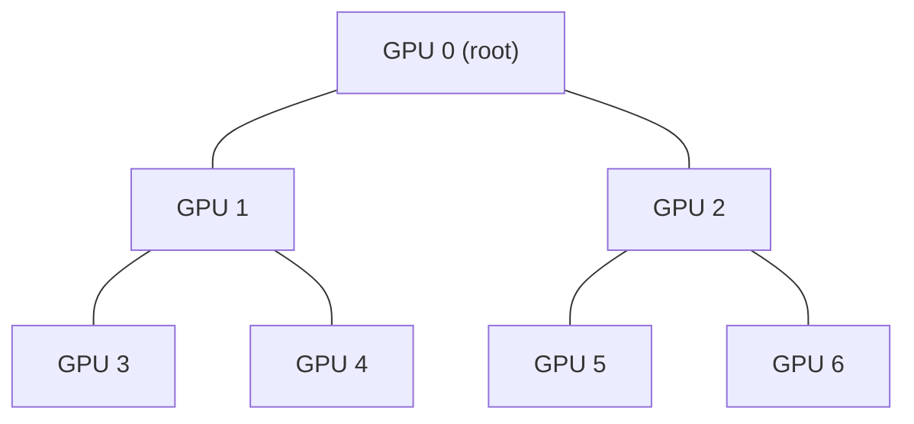
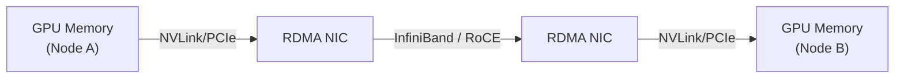
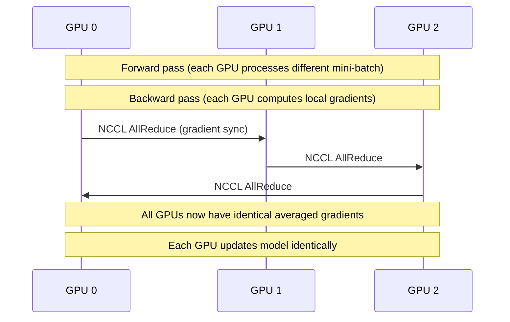

# NCCL (NVIDIA Collective Communication Library)

> **Standard:** [NVIDIA NCCL (developer.nvidia.com)](https://developer.nvidia.com/nccl) | **Layer:** Application / Transport | **Wireshark filter:** `roce` or `tcp` (NCCL uses RDMA or TCP as transport)

NCCL (pronounced "nickel") is NVIDIA's library for multi-GPU and multi-node collective communication, optimized for deep learning training. It implements collective operations (AllReduce, AllGather, Broadcast, etc.) that are the core of distributed training — when hundreds of GPUs need to synchronize gradients after each training step. NCCL automatically selects the optimal communication path: NVLink (intra-node GPU-to-GPU), PCIe, InfiniBand RDMA, RoCE, or TCP.

## Collective Operations

| Operation | Description | AI/ML Use |
|-----------|-------------|-----------|
| AllReduce | Reduce (sum/max/min) + broadcast to all | **Gradient aggregation** (most critical) |
| AllGather | Gather data from all, distribute to all | Model parallelism, embedding tables |
| ReduceScatter | Reduce + scatter results across ranks | ZeRO optimizer (DeepSpeed) |
| Broadcast | One rank sends to all others | Model initialization, checkpoint loading |
| Reduce | Combine from all to one rank | Loss aggregation |
| AllToAll | Each rank sends different data to each other rank | Expert routing (Mixture of Experts) |
| Send/Recv | Point-to-point between two ranks | Pipeline parallelism |

### AllReduce (the critical operation)

Every GPU ends up with the same summed gradients — ready to update the model.

## Communication Topology

NCCL automatically builds optimal communication topologies:

### Ring AllReduce

Data is split into chunks and pipelined around a ring. After 2×(N-1) steps, all GPUs have the full result. Bandwidth-optimal for large messages.

### Tree AllReduce

Lower latency for small messages (log N steps vs 2N for ring).

### NCCL Auto-Selection

NCCL detects the hardware topology and selects the best algorithm:

| Message Size | Algorithm | Why |
|-------------|-----------|-----|
| Small (<256KB) | Tree | Lower latency (fewer rounds) |
| Medium | Ring | Good balance |
| Large (>4MB) | Ring | Bandwidth-optimal |
| Very large | Pipeline/chunked ring | Overlaps computation and communication |

## Transport Hierarchy

NCCL selects the fastest available transport for each GPU pair:

| Transport | Bandwidth | Latency | When Used |
|-----------|-----------|---------|-----------|
| NVLink (intra-node) | 600-900 GB/s (NVLink 4.0) | < 1 µs | GPUs on same node with NVLink |
| PCIe (intra-node) | 32-64 GB/s (Gen4/5) | ~1 µs | GPUs on same node without NVLink |
| InfiniBand RDMA | 25-50 GB/s (per port) | 1-2 µs | GPUs on different nodes (IB fabric) |
| RoCE v2 | 12.5-50 GB/s | 2-5 µs | GPUs on different nodes (Ethernet) |
| TCP/IP | 1-12.5 GB/s | 20-50 µs | Fallback (no RDMA available) |
| GPUDirect RDMA | InfiniBand speed | ~2 µs | GPU memory → RNIC → network (bypasses host) |
| NVLink + NVSwitch | 900 GB/s all-to-all | < 1 µs | DGX/HGX systems (full bisection) |

### GPUDirect RDMA

No host CPU or system memory involved — tensor data moves directly from GPU to GPU across the network.

## NCCL in Training Frameworks

| Framework | How NCCL is Used |
|-----------|-----------------|
| PyTorch (DDP) | `torch.distributed` backend="nccl" — AllReduce gradients |
| PyTorch (FSDP) | Sharded AllGather/ReduceScatter for model parallelism |
| DeepSpeed (ZeRO) | ReduceScatter/AllGather for optimizer state sharding |
| Megatron-LM | Tensor/Pipeline parallelism, AllReduce within TP groups |
| TensorFlow | `tf.distribute.Strategy` with NCCL |
| JAX | `jax.distributed` with NCCL |
| Horovod | AllReduce across GPUs/nodes via NCCL |

### Data Parallelism (AllReduce)

## Environment Variables

| Variable | Description |
|----------|-------------|
| `NCCL_DEBUG=INFO` | Enable NCCL logging (topology, transports, performance) |
| `NCCL_IB_DISABLE=1` | Disable InfiniBand (force TCP fallback) |
| `NCCL_SOCKET_IFNAME=eth0` | Select network interface |
| `NCCL_P2P_LEVEL=NVL` | NVLink peer-to-peer policy |
| `NCCL_NET_GDR_LEVEL=5` | GPUDirect RDMA level |
| `NCCL_ALGO=Ring` | Force specific algorithm |
| `NCCL_PROTO=Simple` | Protocol: Simple, LL (low-latency), or LL128 |
| `NCCL_CROSS_NIC=1` | Allow cross-NIC communication (multi-NIC nodes) |

## NCCL vs Other Collective Libraries

| Feature | NCCL | MPI (OpenMPI/MVAPICH) | Gloo (PyTorch) |
|---------|------|----------------------|----------------|
| GPU-aware | Native (GPU memory) | Via GPU-aware MPI | CPU only (+ GPU staging) |
| NVLink optimization | Automatic | Manual | No |
| GPUDirect RDMA | Automatic | Supported (config required) | No |
| Topology detection | Automatic (NVLink, PCIe, IB) | Manual | Limited |
| Use case | GPU training | General HPC | CPU training, fallback |
| Vendor | NVIDIA | Open source | Meta (PyTorch) |

## Standards

NCCL is not a standards-body protocol — it's a proprietary NVIDIA library with public API:

| Resource | Description |
|----------|-------------|
| [NCCL Documentation](https://docs.nvidia.com/deeplearning/nccl/) | Official API and usage guide |
| [NCCL GitHub](https://github.com/NVIDIA/nccl) | Open-source implementation |
| [NCCL Tests](https://github.com/NVIDIA/nccl-tests) | Performance benchmarking tools |

## See Also

- [RDMA / RoCE](rdma.md) — network transport NCCL uses for inter-node communication
- [MPI](mpi.md) — general HPC collective communication
- [DDS / ROS 2](../robotics/dds.md) — pub/sub middleware (different domain)
- [gRPC](../web/grpc.md) — used by ML serving (Triton), not training
