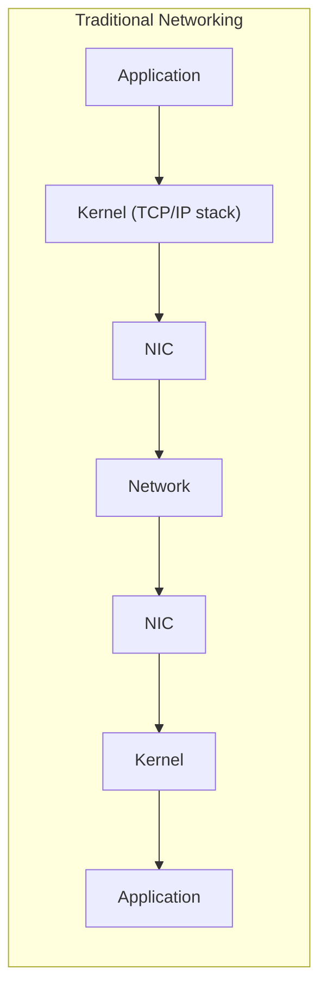
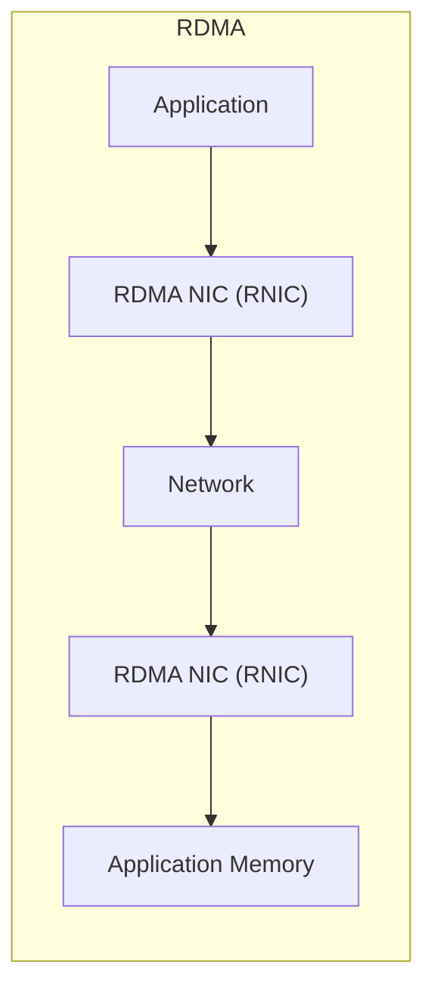
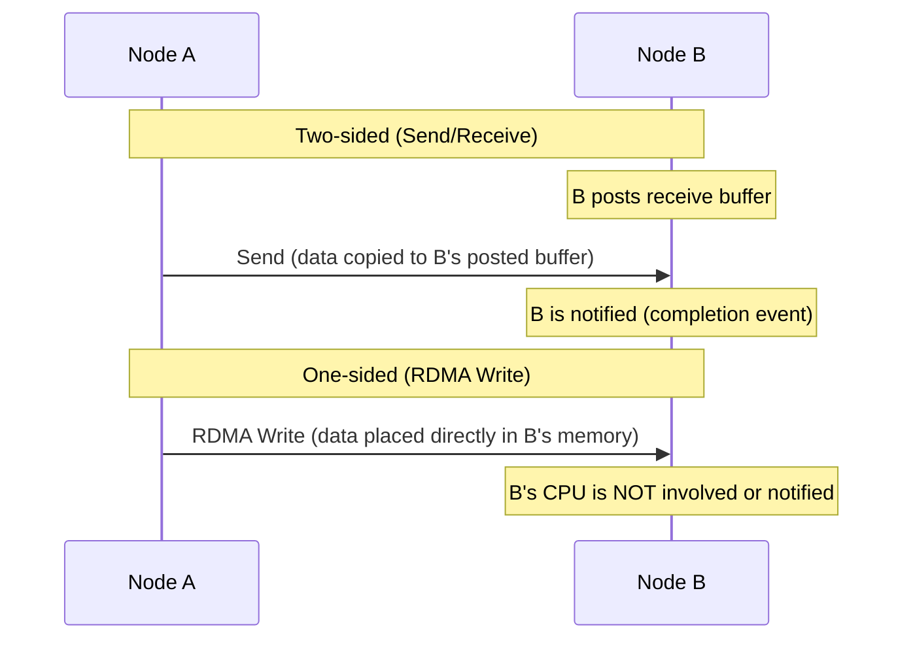
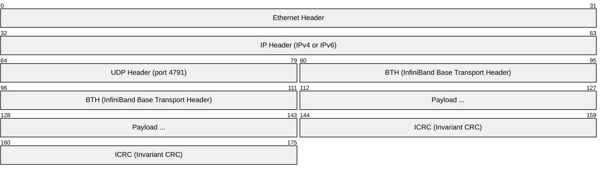
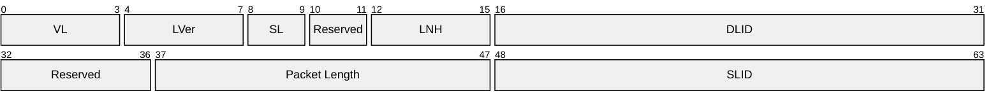
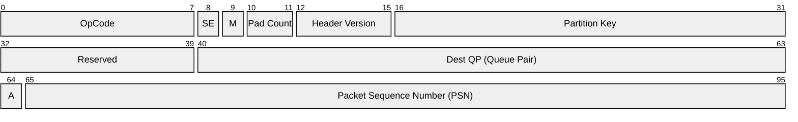
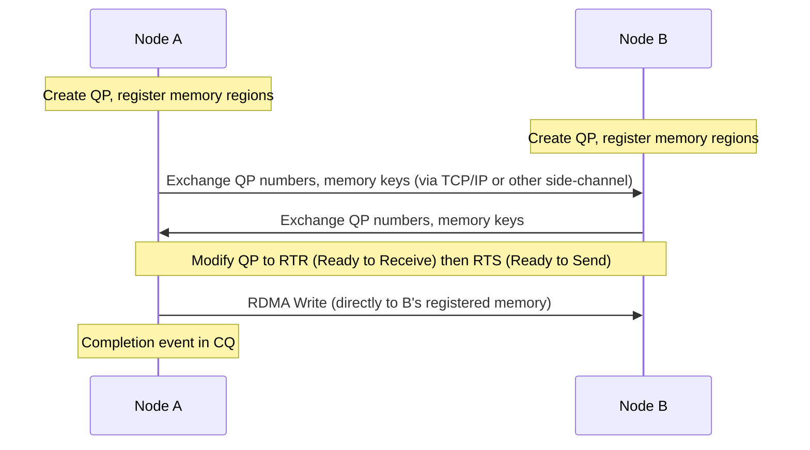
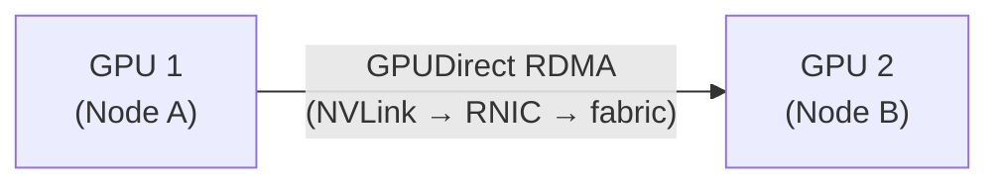

# RDMA / RoCE / InfiniBand (Remote Direct Memory Access)

> **Standard:** [InfiniBand Architecture Specification](https://www.infinibandta.org/) / [RoCE v2 (Annex A17)](https://www.roceinitiative.org/) | **Layer:** Transport / Network (Layers 3-4) | **Wireshark filter:** `infiniband` or `roce`

RDMA (Remote Direct Memory Access) allows one computer to read from or write to another computer's memory directly, bypassing both operating systems' CPU, caches, and kernel network stacks. This achieves microsecond latencies and near-line-rate throughput — critical for AI/ML training clusters, HPC, and high-frequency trading. RDMA operates over three physical transports: InfiniBand (native), RoCE (RDMA over Converged Ethernet), and iWARP (RDMA over TCP).

## How RDMA Works

The application registers memory regions with the RNIC. Data moves directly between application memory and the network — **zero kernel involvement**, zero CPU copies.

## RDMA Operations (Verbs)

| Operation | Type | Description |
|-----------|------|-------------|
| Send/Receive | Two-sided | Sender sends, receiver must post a receive buffer |
| RDMA Write | One-sided | Write directly to remote memory (remote CPU unaware) |
| RDMA Read | One-sided | Read directly from remote memory (remote CPU unaware) |
| Atomic Compare-and-Swap | One-sided | Atomic CAS on remote memory |
| Atomic Fetch-and-Add | One-sided | Atomic add on remote memory |

### One-Sided vs Two-Sided

## Transport Types

### InfiniBand

| Parameter | Value |
|-----------|-------|
| Physical | Dedicated InfiniBand fabric (not Ethernet) |
| Speeds | SDR (10G), DDR (20G), QDR (40G), FDR (56G), EDR (100G), HDR (200G), NDR (400G), XDR (800G) |
| Latency | < 1 µs |
| Topology | Fat-tree, Dragonfly (with InfiniBand switches) |
| Connector | QSFP, QSFP56, OSFP |
| Vendor | NVIDIA/Mellanox (dominant) |

### RoCE v2 (RDMA over Converged Ethernet)

| Parameter | Value |
|-----------|-------|
| Physical | Standard Ethernet (25G, 50G, 100G, 200G, 400G) |
| Encapsulation | UDP/IP + InfiniBand transport headers |
| UDP port | 4791 |
| Latency | 2-5 µs (slightly more than native IB) |
| Requires | Lossless Ethernet (PFC/ECN — DCB) or congestion-tolerant RoCE |
| Advantage | Uses existing Ethernet switches and cabling |

### iWARP (Internet Wide Area RDMA Protocol)

| Parameter | Value |
|-----------|-------|
| Physical | Standard Ethernet |
| Encapsulation | TCP/IP (no lossless Ethernet required) |
| Latency | 5-10 µs (TCP overhead) |
| Advantage | Works over any TCP/IP network (even WAN) |
| Disadvantage | Higher latency, lower throughput than RoCE |

## InfiniBand Headers

### Local Route Header (LRH)

### Base Transport Header (BTH)

### Key Concepts

| Concept | Description |
|---------|-------------|
| Queue Pair (QP) | A send queue + receive queue — the fundamental communication endpoint |
| Completion Queue (CQ) | Notifications when operations complete |
| Memory Region (MR) | Registered memory that the RNIC can access directly |
| Protection Domain (PD) | Isolates QPs and MRs for security |
| R-Key / L-Key | Remote/local keys authorizing memory access |
| Partition Key (P-Key) | Network isolation (like VLANs for InfiniBand) |

## RDMA Connection Setup

## AI/ML Use Case

GPU clusters use RDMA (InfiniBand or RoCE) for:

| Operation | Description |
|-----------|-------------|
| All-Reduce | Aggregate gradients across all GPUs (training) |
| All-Gather | Collect model parameters from all GPUs |
| Point-to-point | Transfer tensors between specific GPUs |
| GPUDirect RDMA | RDMA directly from GPU memory (bypasses host CPU entirely) |

## Performance Comparison

| Transport | Latency | Throughput (per port) | CPU Overhead |
|-----------|---------|----------------------|-------------|
| TCP/IP | 20-50 µs | 10-100 Gbps | High (kernel copies) |
| RoCE v2 | 2-5 µs | 25-400 Gbps | Near zero |
| InfiniBand | < 1 µs | 100-400 Gbps (NDR) | Near zero |
| iWARP | 5-10 µs | 10-100 Gbps | Low |

## Standards

| Document | Title |
|----------|-------|
| [InfiniBand Architecture Spec](https://www.infinibandta.org/) | InfiniBand Architecture Specification |
| [RoCE v2 (Annex A17)](https://www.roceinitiative.org/) | RDMA over Converged Ethernet v2 |
| [RFC 5040](https://www.rfc-editor.org/rfc/rfc5040) | RDMA Protocol Verbs (iWARP) |
| [RFC 5041](https://www.rfc-editor.org/rfc/rfc5041) | DDP — Direct Data Placement (iWARP) |
| [RFC 5042](https://www.rfc-editor.org/rfc/rfc5042) | MPA — Marker PDU Aligned (iWARP) |

## See Also

- [Ethernet](../link-layer/ethernet.md) — RoCE runs over Ethernet
- [UDP](../transport-layer/udp.md) — RoCE v2 uses UDP port 4791
- [NCCL](nccl.md) — NVIDIA's collective communication library (uses RDMA)
- [MPI](mpi.md) — HPC message passing (uses RDMA transports)
