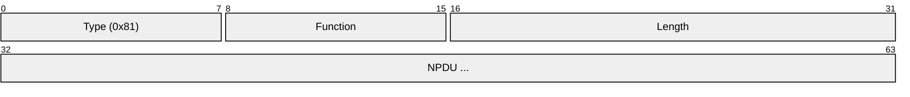
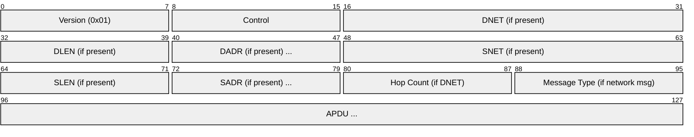
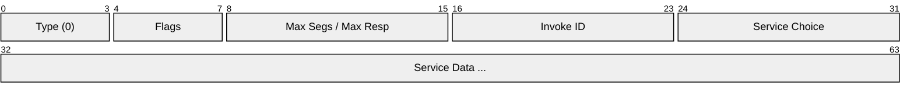
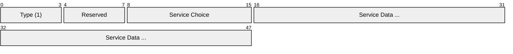
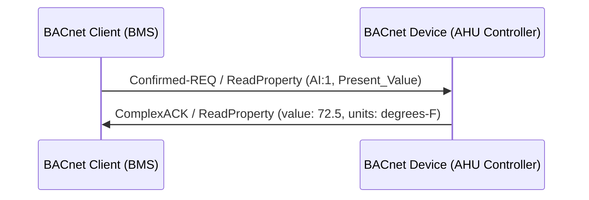
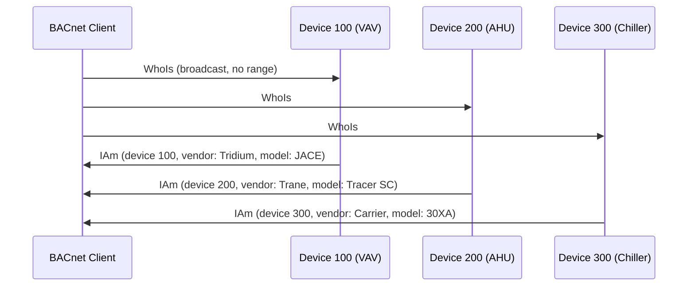
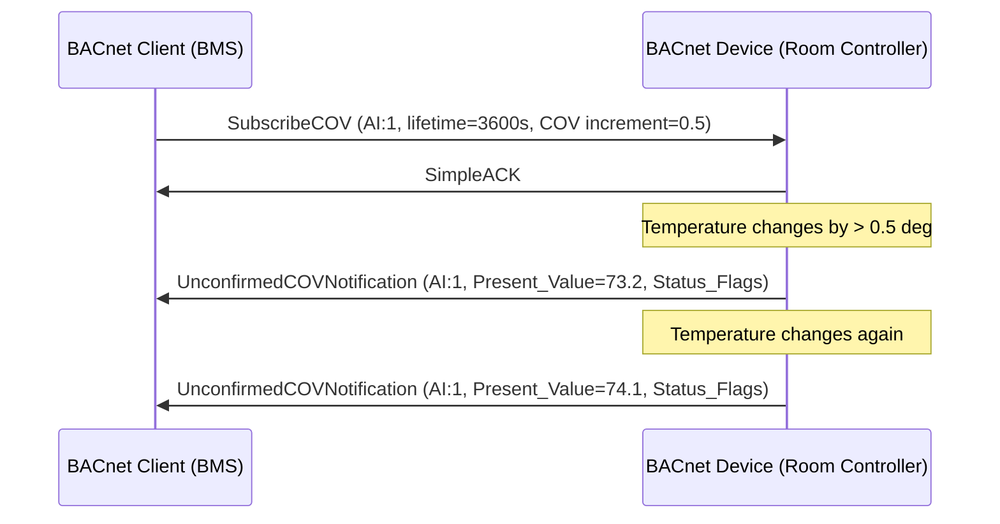
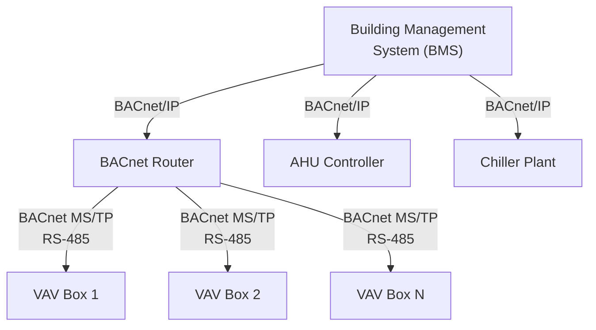
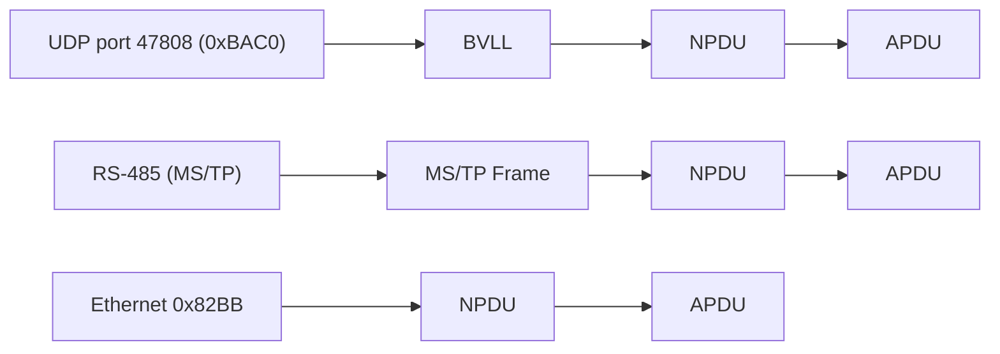

# BACnet (Building Automation and Control Networks)

> **Standard:** [ASHRAE 135 / ISO 16484-5](https://bacnet.org/) | **Layer:** Application (Layer 7) | **Wireshark filter:** `bacnet` or `bacapp`

BACnet is the dominant communication protocol for building automation systems (BAS), connecting HVAC controllers, lighting systems, fire/life safety panels, access control, elevators, and energy metering equipment. Developed by ASHRAE (American Society of Heating, Refrigerating and Air-Conditioning Engineers), BACnet provides a vendor-neutral way for building devices to share data and coordinate control. It defines an object-oriented data model, a set of application services, and multiple network transport options: BACnet/IP (UDP port 47808), BACnet MS/TP (master-slave/token-passing over RS-485), BACnet Ethernet (native 802.3), and BACnet/SC (Secure Connect, TLS-based). BACnet is required by many building codes and green building standards.

## Data Link Options

| Variant | Transport | Speed | Description |
|---------|-----------|-------|-------------|
| BACnet/IP | UDP port 47808 (0xBAC0) | 10/100/1000 Mbps | IP-based, most common in modern buildings |
| BACnet MS/TP | RS-485 | 9.6-115.2 kbps | Master-slave/token-passing, field-level wiring |
| BACnet Ethernet | Ethernet 802.3 (EtherType 0x82BB) | 10/100 Mbps | Native Ethernet (no IP), legacy |
| BACnet ARCnet | ARCnet | 2.5 Mbps | Legacy token-passing (rare) |
| BACnet/SC | TLS over WebSocket | 10/100/1000 Mbps | Secure Connect (modern, encrypted) |

## BACnet/IP (BVLL Header)

BACnet/IP wraps BACnet messages in a BACnet Virtual Link Layer (BVLL) header:

### BVLL Functions

| Code | Name | Description |
|------|------|-------------|
| 0x00 | BVLC-Result | Acknowledgment |
| 0x01 | Write-Broadcast-Distribution-Table | Configure BBMD table |
| 0x04 | Forwarded-NPDU | BBMD-forwarded broadcast |
| 0x09 | Original-Broadcast-NPDU | Broadcast on local subnet |
| 0x0A | Original-Unicast-NPDU | Unicast message |
| 0x0B | Distribute-Broadcast-To-Network | Request BBMD to distribute |

## NPDU (Network Protocol Data Unit)

The NPDU provides network-layer routing between BACnet networks:

### NPDU Key Fields

| Field | Size | Description |
|-------|------|-------------|
| Version | 8 bits | Always 0x01 |
| Control | 8 bits | Flags: DNET present, SNET present, expecting reply, network message, priority |
| DNET | 16 bits | Destination network number (0xFFFF = global broadcast) |
| DLEN | 8 bits | Destination MAC address length (0 = broadcast on DNET) |
| DADR | Variable | Destination MAC address |
| SNET | 16 bits | Source network number |
| SLEN | 8 bits | Source MAC address length |
| SADR | Variable | Source MAC address |
| Hop Count | 8 bits | Decremented by each router (prevents loops) |

### NPDU Control Bits

| Bit | Name | Description |
|-----|------|-------------|
| 7 | Network Layer Message | 1 = network layer message, 0 = APDU follows |
| 5 | Destination Specifier | 1 = DNET/DLEN/DADR present |
| 3 | Source Specifier | 1 = SNET/SLEN/SADR present |
| 2 | Expecting Reply | 1 = reply expected |
| 1-0 | Priority | 00 = normal, 01 = urgent, 10 = critical, 11 = life safety |

## APDU (Application Protocol Data Unit)

### APDU Types

| Type | Value | Name | Description |
|------|-------|------|-------------|
| 0 | 0x0 | Confirmed-REQ | Request that expects a response |
| 1 | 0x1 | Unconfirmed-REQ | Request with no response expected |
| 2 | 0x2 | SimpleACK | Acknowledgment (no data) |
| 3 | 0x3 | ComplexACK | Acknowledgment with return data |
| 4 | 0x4 | SegmentACK | Acknowledge a segment of a segmented message |
| 5 | 0x5 | Error | Service error response |
| 6 | 0x6 | Reject | Message rejected (protocol error) |
| 7 | 0x7 | Abort | Abort a transaction |

### Confirmed Request APDU

### Unconfirmed Request APDU

## Application Services

### Object Access Services

| Code | Name | Type | Description |
|------|------|------|-------------|
| 12 | ReadProperty | Confirmed | Read a single property of an object |
| 14 | ReadPropertyMultiple | Confirmed | Read multiple properties in one request |
| 15 | WriteProperty | Confirmed | Write a single property |
| 16 | WritePropertyMultiple | Confirmed | Write multiple properties in one request |
| 6 | CreateObject | Confirmed | Dynamically create an object |
| 7 | DeleteObject | Confirmed | Dynamically delete an object |

### Alarm and Event Services

| Code | Name | Type | Description |
|------|------|------|-------------|
| 5 | SubscribeCOV | Confirmed | Subscribe to Change of Value notifications |
| 2 | ConfirmedCOVNotification | Confirmed | COV notification (expects ACK) |
| 3 | UnconfirmedCOVNotification | Unconfirmed | COV notification (fire and forget) |
| 0 | AcknowledgeAlarm | Confirmed | Acknowledge an alarm condition |

### Device and Network Services

| Code | Name | Type | Description |
|------|------|------|-------------|
| 8 | WhoIs | Unconfirmed | Discover devices (broadcast) |
| 0 | IAm | Unconfirmed | Device announcement (response to WhoIs) |
| 7 | WhoHas | Unconfirmed | Find which device has a specific object |
| 1 | IHave | Unconfirmed | Response to WhoHas |
| 18 | ReinitializeDevice | Confirmed | Warm/cold start a device |
| 20 | TimeSynchronization | Unconfirmed | Synchronize device clock |

### File Services

| Code | Name | Type | Description |
|------|------|------|-------------|
| 6 | AtomicReadFile | Confirmed | Read data from a file object |
| 7 | AtomicWriteFile | Confirmed | Write data to a file object |

## Object Model

Every BACnet device exposes its data as a collection of objects, each with a set of standard properties:

### Common Object Types

| Type ID | Name | Description |
|---------|------|-------------|
| 0 | Analog Input | Sensor reading (temperature, pressure, humidity) |
| 1 | Analog Output | Control output (valve position, fan speed) |
| 2 | Analog Value | Internal setpoint or calculated value |
| 3 | Binary Input | Digital sensor (switch, occupancy, status) |
| 4 | Binary Output | Digital control (relay, on/off) |
| 5 | Binary Value | Internal boolean (mode, enable/disable) |
| 8 | Device | The device itself (required, one per device) |
| 10 | File | File access (firmware, logs) |
| 13 | Multi-state Input | Enumerated input (operating mode) |
| 14 | Multi-state Output | Enumerated output (fan speed setting) |
| 17 | Schedule | Weekly schedule with exceptions |
| 6 | Calendar | Date-based schedule (holidays, special events) |
| 20 | Trend Log | Historical data logging |
| 15 | Notification Class | Alarm routing configuration |
| 19 | Program | Programmable logic within the device |
| 12 | Loop | PID control loop |

### Standard Properties (all objects)

| Property | Description |
|----------|-------------|
| Object_Identifier | Unique ID: (Object_Type, Instance_Number) |
| Object_Name | Human-readable unique name |
| Object_Type | Type of object (Analog Input, Binary Output, etc.) |
| Present_Value | Current value of the object |
| Status_Flags | In_Alarm, Fault, Overridden, Out_of_Service |
| Description | Optional text description |
| Units | Engineering units (degrees-C, percent, etc.) |
| Reliability | Sensor/communication reliability indication |

## Typical Flow

### ReadProperty

### WhoIs / IAm Discovery

### SubscribeCOV (Change of Value)

## MS/TP (Master-Slave / Token-Passing)

BACnet MS/TP runs over RS-485 using a token-passing scheme among masters with polling of slaves:

| Feature | Description |
|---------|-------------|
| Physical | RS-485, half-duplex, up to 4000 ft (1200 m) |
| Baud | 9600, 19200, 38400, 57600, 76800, 115200 |
| Addressing | 0-127 master, 128-254 slave, 255 broadcast |
| Token | Passed among masters in address order |
| Max Masters | 128 (configurable) |
| Max Info Frames | Configurable limit per token hold |

## BACnet Network Architecture

## Encapsulation

## Standards

| Document | Title |
|----------|-------|
| [ASHRAE 135](https://bacnet.org/buy/) | BACnet -- A Data Communication Protocol for Building Automation and Control Networks |
| [ISO 16484-5](https://www.iso.org/standard/71935.html) | Building automation and control systems -- Data communication protocol |
| [ISO 16484-6](https://www.iso.org/standard/71936.html) | Data communication conformance testing |
| [ASHRAE 135.1](https://bacnet.org/) | Method of Test for Conformance to BACnet |
| [Addendum BJ (BACnet/SC)](https://bacnet.org/) | BACnet Secure Connect (TLS-based transport) |

## See Also

- [Modbus](modbus.md) -- simpler industrial protocol, also used in buildings
- [OPC UA](opcua.md) -- platform-independent industrial interoperability
- [RS-485](../serial/rs485.md) -- physical layer for BACnet MS/TP
- [UDP](../transport-layer/udp.md) -- transport for BACnet/IP
