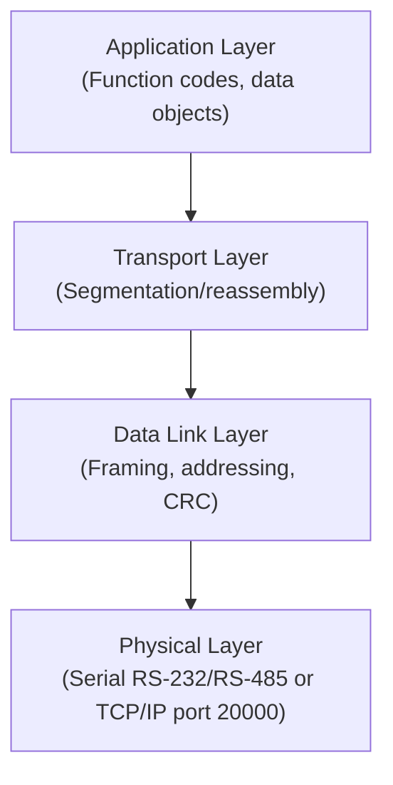
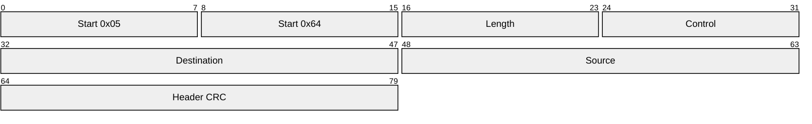
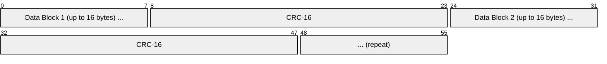
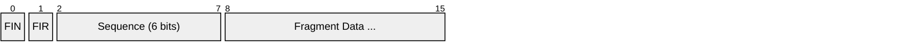
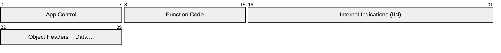
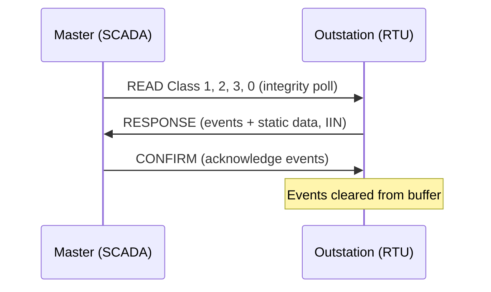
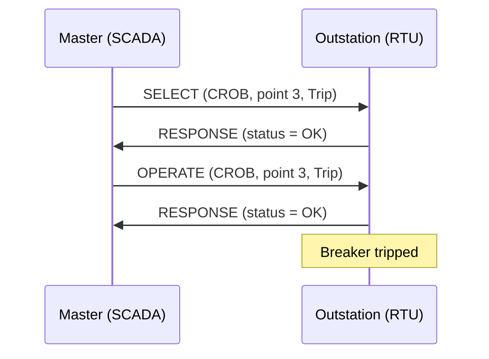
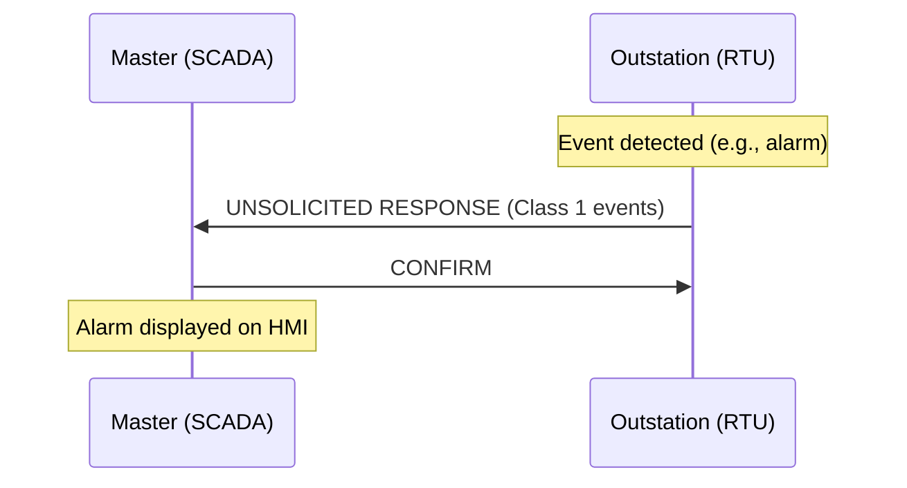

# DNP3 (Distributed Network Protocol 3)

> **Standard:** [IEEE 1815](https://standards.ieee.org/standard/1815-2012.html) | **Layer:** Data Link / Transport / Application | **Wireshark filter:** `dnp3`

DNP3 is a telemetry protocol designed for communication between SCADA masters, RTUs, and IEDs in electric utility, water/wastewater, and oil/gas systems. Developed by Westronic (now GE) in the early 1990s based on early IEC 60870-5 drafts, DNP3 provides reliable data acquisition and control over noisy, low-bandwidth serial and IP links. It features a three-layer architecture (Data Link, Transport, Application), time-stamped event reporting, unsolicited responses, and Secure Authentication for critical infrastructure protection. DNP3 is the dominant SCADA protocol in North America.

## Protocol Stack

## Data Link Layer Frame

All DNP3 communication is built on Data Link frames. Each frame begins with a fixed 10-byte header followed by optional data blocks, each with its own CRC:

### Frame Header (10 bytes)

| Field | Size | Description |
|-------|------|-------------|
| Start Bytes | 16 bits | Always 0x0564 — identifies a DNP3 frame |
| Length | 8 bits | Number of octets following (excluding CRCs) — minimum 5 |
| Control | 8 bits | Direction, flow control, function code |
| Destination | 16 bits | Destination address (0-65519; 65520-65535 reserved) |
| Source | 16 bits | Source address |
| Header CRC | 16 bits | CRC-16 over the first 8 header bytes |

### Data Blocks

After the header, data is sent in blocks of up to 16 bytes, each followed by a 2-byte CRC:

This per-block CRC scheme enables detection and localization of errors on noisy serial links.

### Data Link Control Byte

| Bit | Name | Description |
|-----|------|-------------|
| 7 | DIR | Direction: 1 = master-to-outstation, 0 = outstation-to-master |
| 6 | PRM | Primary: 1 = from initiator, 0 = from responder |
| 5 | FCB | Frame Count Bit — alternates for duplicate detection |
| 4 | FCV / DFC | FCV (primary): FCB valid; DFC (secondary): Data Flow Control |
| 3-0 | Function | Data link function code |

### Data Link Function Codes

**Primary (PRM=1):**

| Code | Name | Description |
|------|------|-------------|
| 0 | RESET_LINK | Reset link state |
| 1 | RESET_USER | Reset user process |
| 2 | TEST_LINK | Test link connectivity |
| 3 | USER_DATA_CONFIRM | Confirmed user data |
| 4 | USER_DATA_NO_CONFIRM | Unconfirmed user data |
| 9 | REQUEST_LINK_STATUS | Query link status |

**Secondary (PRM=0):**

| Code | Name | Description |
|------|------|-------------|
| 0 | ACK | Positive acknowledgment |
| 1 | NACK | Negative acknowledgment |
| 11 | LINK_STATUS | Link status response |
| 15 | NOT_SUPPORTED | Function not supported |

## Transport Layer

The Transport Layer segments application messages into Data Link frames and reassembles them at the receiver. Each transport segment has a 1-byte header:

| Field | Size | Description |
|-------|------|-------------|
| FIN | 1 bit | 1 = final segment of the message |
| FIR | 1 bit | 1 = first segment of the message |
| Sequence | 6 bits | Sequence number (0-63, wraps around) |
| Fragment Data | Variable | Portion of the Application Layer message |

A single-fragment message has both FIR=1 and FIN=1. Multi-fragment messages use FIR=1 on the first, FIN=1 on the last, and incrementing sequence numbers.

## Application Layer

### Application Request Header

### Application Response Header

| Field | Size | Description |
|-------|------|-------------|
| App Control | 8 bits | FIR, FIN, CON (confirm), UNS (unsolicited), sequence |
| Function Code | 8 bits | Operation requested or performed |
| IIN | 16 bits | Internal Indications — response only (device status flags) |
| Object Data | Variable | Data objects with group, variation, qualifier, and values |

### Application Control Byte

| Bit | Name | Description |
|-----|------|-------------|
| 7 | FIR | First fragment of application message |
| 6 | FIN | Final fragment of application message |
| 5 | CON | Confirm requested — receiver must send Application Confirm |
| 4 | UNS | Unsolicited response (outstation-initiated) |
| 3-0 | Sequence | Application-layer sequence number (0-15) |

## Function Codes

| Code | Name | Direction | Description |
|------|------|-----------|-------------|
| 0x00 | Confirm | Both | Application-layer acknowledgment |
| 0x01 | Read | Request | Read data objects |
| 0x02 | Write | Request | Write data objects |
| 0x03 | Select | Request | Select a control point (first step of SBO) |
| 0x04 | Operate | Request | Operate a selected control point |
| 0x05 | Direct Operate | Request | Operate immediately (no select) |
| 0x06 | Direct Operate No Ack | Request | Operate without application confirm |
| 0x07 | Immediate Freeze | Request | Freeze counter values |
| 0x08 | Immediate Freeze No Ack | Request | Freeze counters, no confirm |
| 0x0D | Cold Restart | Request | Full device restart |
| 0x0E | Warm Restart | Request | Partial restart (reload configuration) |
| 0x14 | Enable Unsolicited | Request | Enable unsolicited responses for specified classes |
| 0x15 | Disable Unsolicited | Request | Disable unsolicited responses |
| 0x16 | Assign Class | Request | Assign objects to event classes |
| 0x81 | Response | Response | Normal response to a request |
| 0x82 | Unsolicited Response | Response | Outstation-initiated event report |

## Data Objects (Groups and Variations)

DNP3 data is organized by group (type of data) and variation (encoding format):

| Group | Name | Common Variations |
|-------|------|-------------------|
| 1 | Binary Input | 1 = packed, 2 = with flags |
| 2 | Binary Input Event | 1 = without time, 2 = with absolute time |
| 3 | Double-Bit Binary Input | 1 = packed, 2 = with flags |
| 10 | Binary Output | 1 = packed, 2 = with flags |
| 12 | Binary Output Command (CROB) | 1 = control relay output block |
| 20 | Counter | 1 = 32-bit with flags, 5 = 32-bit no flags |
| 22 | Counter Event | 1 = 32-bit with flags and time |
| 30 | Analog Input | 1 = 32-bit, 3 = 32-bit no flags, 5 = float |
| 32 | Analog Input Event | 1 = 32-bit with time, 7 = float with time |
| 40 | Analog Output Status | 1 = 32-bit, 3 = float |
| 41 | Analog Output Command | 1 = 32-bit, 3 = float |
| 50 | Time and Date | 1 = absolute time (48-bit ms since epoch) |
| 60 | Class Data | 1 = Class 0 (static), 2/3/4 = Class 1/2/3 (events) |
| 80 | Internal Indications | 1 = packed format |
| 120 | Authentication | Secure Authentication objects |

### Internal Indications (IIN) Bits

| Byte | Bit | Name | Description |
|------|-----|------|-------------|
| 1 | 7 | BROADCAST | Message was broadcast |
| 1 | 6 | CLASS_1 | Class 1 events available |
| 1 | 5 | CLASS_2 | Class 2 events available |
| 1 | 4 | CLASS_3 | Class 3 events available |
| 1 | 3 | NEED_TIME | Outstation needs time sync |
| 1 | 2 | LOCAL_CONTROL | Some outputs in local override |
| 1 | 1 | DEVICE_TROUBLE | Abnormal condition |
| 1 | 0 | DEVICE_RESTART | Outstation restarted |
| 2 | 7 | NO_FUNC_CODE | Function code not supported |
| 2 | 6 | OBJECT_UNKNOWN | Requested object unknown |
| 2 | 5 | PARAM_ERROR | Parameter error in request |
| 2 | 4 | EVENT_OVERFLOW | Event buffer overflow |
| 2 | 1 | CONFIG_CORRUPT | Configuration corrupt |

## Communication Flow

### Integrity Poll (Class 0 + Events)

### Select-Before-Operate (SBO)

### Unsolicited Response

## DNP3 over TCP/IP

When carried over TCP (port 20000), the Data Link frames are sent directly inside TCP segments — no additional encapsulation header is needed. The start bytes (0x0564) serve as frame synchronization.

## Secure Authentication (SA)

DNP3 Secure Authentication (SAv5, IEEE 1815) adds challenge-response authentication to prevent spoofing and replay attacks on critical control operations:

| Feature | Description |
|---------|-------------|
| HMAC-SHA-256 | Cryptographic authentication of critical messages |
| Challenge-Response | Master challenges outstation (or vice versa) before critical ops |
| Aggressive Mode | HMAC sent with request (reduces round trips) |
| Key Update | Periodic update of session keys via Authority |
| User Management | Multiple users with individual credentials |

## Standards

| Document | Title |
|----------|-------|
| [IEEE 1815-2012](https://standards.ieee.org/standard/1815-2012.html) | IEEE Standard for Electric Power Systems Communications — DNP3 |
| [IEEE 1815.1](https://standards.ieee.org/standard/1815_1-2015.html) | DNP3 — Mapping to IEC 61850 |
| [DNP3 Specification](https://www.dnp.org/) | DNP Users Group technical documents |
| [NERC CIP](https://www.nerc.com/) | Critical Infrastructure Protection standards (US power grid) |

## See Also

- [Modbus](modbus.md) — simpler SCADA protocol, also widely used in utilities
- [PROFIBUS](profibus.md) — European industrial fieldbus standard
- [RS-232](../serial/rs232.md) — common serial transport for DNP3
- [RS-485](../serial/rs485.md) — multi-drop serial transport for DNP3
- [TCP](../transport-layer/tcp.md) — transport for DNP3/IP (port 20000)
