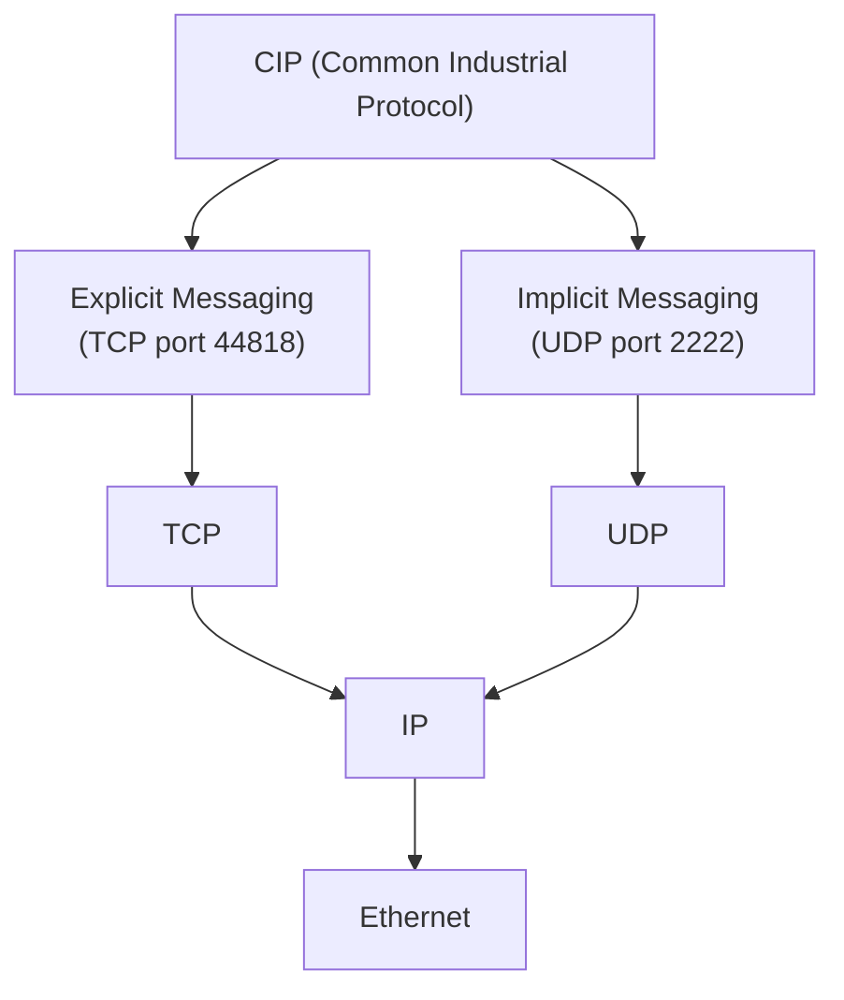
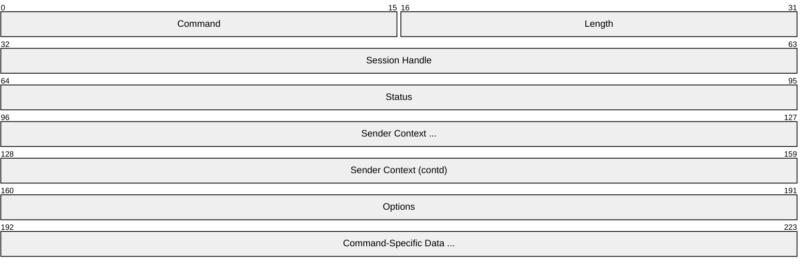
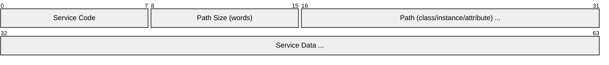
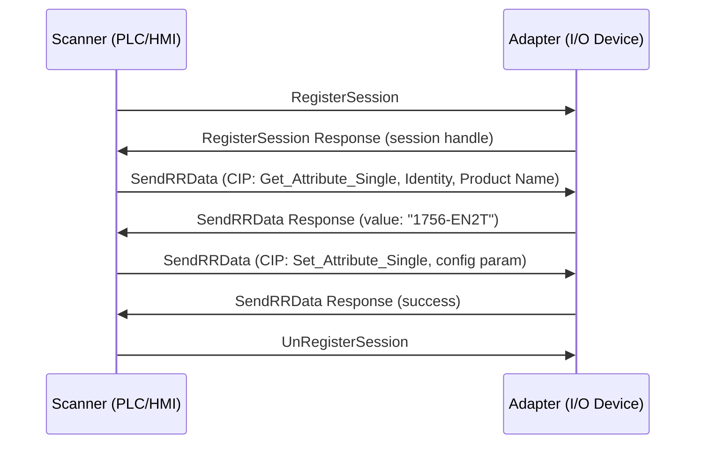
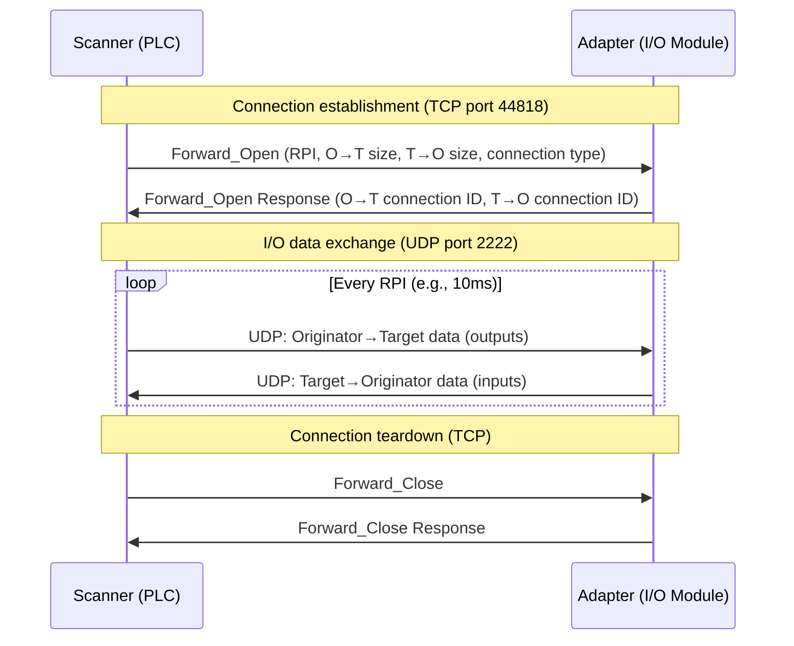
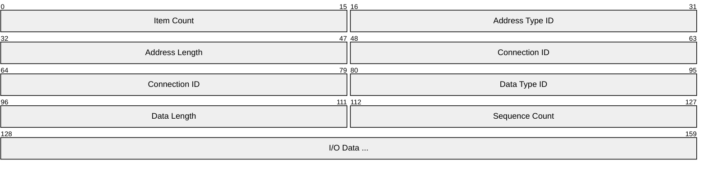
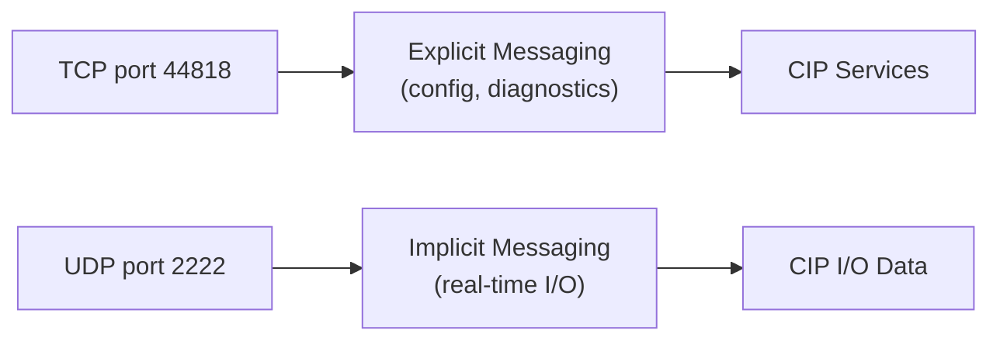

# EtherNet/IP (EtherNet/Industrial Protocol)

> **Standard:** [IEC 61158 / ODVA](https://www.odva.org/technology-standards/key-technologies/ethernet-ip/) | **Layer:** Application (Layer 7) | **Wireshark filter:** `enip`

EtherNet/IP is an industrial network protocol that runs the Common Industrial Protocol (CIP) over standard Ethernet, TCP/IP, and UDP/IP. Developed by Rockwell Automation and managed by ODVA, it is one of the most widely deployed industrial Ethernet protocols, particularly in North American manufacturing. EtherNet/IP uses TCP port 44818 for explicit messaging (configuration, diagnostics, non-time-critical data) and UDP port 2222 for implicit messaging (real-time I/O data exchange for control loops). It leverages standard Ethernet infrastructure -- no special hardware required -- making it easy to integrate with enterprise IT networks.

## Architecture

EtherNet/IP layers CIP on top of standard TCP/IP and UDP/IP:

## Encapsulation Header

Every EtherNet/IP message begins with a 24-byte encapsulation header:

## Key Fields

| Field | Size | Description |
|-------|------|-------------|
| Command | 16 bits | Encapsulation command code |
| Length | 16 bits | Length of command-specific data (bytes following this header) |
| Session Handle | 32 bits | Session identifier (assigned by target on RegisterSession) |
| Status | 32 bits | Status code (0 = success) |
| Sender Context | 64 bits | Originator context (echoed back in response) |
| Options | 32 bits | Reserved (must be 0) |

## Encapsulation Commands

| Code | Name | Transport | Description |
|------|------|-----------|-------------|
| 0x0001 | ListTargets | TCP | List accessible targets (legacy) |
| 0x0004 | ListServices | TCP | Query supported services (CIP encapsulation) |
| 0x0063 | ListIdentity | TCP/UDP | Discover devices on the network |
| 0x0064 | ListInterfaces | TCP | List interface information |
| 0x0065 | RegisterSession | TCP | Open a session (get session handle) |
| 0x0066 | UnRegisterSession | TCP | Close a session |
| 0x006F | SendRRData | TCP | Send explicit CIP request/response (Request-Reply) |
| 0x0070 | SendUnitData | TCP | Send connected explicit message |

## CIP (Common Industrial Protocol)

CIP is the application-layer protocol shared by EtherNet/IP, DeviceNet, and ControlNet. It uses an object-oriented model where every device is a collection of objects, each with attributes and services.

### CIP Message Structure

### Common CIP Services

| Code | Name | Description |
|------|------|-------------|
| 0x01 | Get_Attribute_All | Read all attributes of an object instance |
| 0x0E | Get_Attribute_Single | Read a single attribute |
| 0x02 | Set_Attribute_All | Write all attributes |
| 0x10 | Set_Attribute_Single | Write a single attribute |
| 0x03 | Get_Attribute_List | Read a list of attributes |
| 0x04 | Set_Attribute_List | Write a list of attributes |
| 0x05 | Reset | Reset the device or object |
| 0x08 | Create | Create an object instance |
| 0x09 | Delete | Delete an object instance |
| 0x4B | Read_Tag | Read a tag value (Logix-specific) |
| 0x4C | Read_Tag_Fragmented | Read a large tag value in fragments |
| 0x4D | Write_Tag | Write a tag value (Logix-specific) |
| 0x4E | Write_Tag_Fragmented | Write a large tag value in fragments |
| 0x52 | Forward_Open | Establish a CIP connection |
| 0x4E | Forward_Close | Tear down a CIP connection |

### Common CIP Objects

| Class ID | Name | Description |
|----------|------|-------------|
| 0x01 | Identity | Device name, vendor, serial number |
| 0x02 | Message Router | Routes CIP messages to target objects |
| 0x04 | Assembly | Groups I/O data into assemblies |
| 0x06 | Connection Manager | Manages CIP connections (Forward_Open/Close) |
| 0xF5 | TCP/IP Interface | IP address, gateway, DNS configuration |
| 0xF6 | Ethernet Link | MAC address, link speed, counters |

## Explicit Messaging (TCP)

Explicit messaging is used for configuration, diagnostics, and non-time-critical operations. It follows a request-response pattern over a TCP session:

## Implicit Messaging (UDP -- I/O Connections)

Implicit messaging is for real-time cyclic I/O data exchange. A CIP connection is first established via Forward_Open over TCP, then I/O data flows over UDP:

### Implicit Message (Common Packet Format)

## Connection Parameters

| Parameter | Description |
|-----------|-------------|
| RPI (Requested Packet Interval) | Cyclic update rate in microseconds (typical: 2-100 ms) |
| O->T Size | Originator-to-Target data size (outputs) |
| T->O Size | Target-to-Originator data size (inputs) |
| Connection Type | Point-to-point or multicast |
| Transport Class | Class 0 (UDP, no sequence), Class 1 (UDP, sequenced), Class 3 (TCP) |
| Priority | Scheduled, high, low, urgent |

## Device Profiles

EtherNet/IP devices conform to CIP device profiles:

| Device Type | Code | Description |
|-------------|------|-------------|
| AC Drive | 0x02 | Variable frequency drives |
| Motor Overload | 0x03 | Motor protection |
| Discrete I/O | 0x07 | Digital input/output modules |
| Analog I/O | 0x0A | Analog input/output modules |
| PLC | 0x0E | Programmable logic controllers |
| HMI | 0x18 | Human-machine interfaces |
| Managed Switch | 0x2C | Managed Ethernet switches |

## Encapsulation

## Standards

| Document | Title |
|----------|-------|
| [IEC 61158](https://www.iec.ch/) | Industrial communication networks -- Fieldbus specifications |
| [The EtherNet/IP Specification](https://www.odva.org/technology-standards/key-technologies/ethernet-ip/) | ODVA EtherNet/IP Adaptation of CIP |
| [The CIP Specification](https://www.odva.org/technology-standards/key-technologies/common-industrial-protocol-cip/) | Common Industrial Protocol (CIP) |
| [IEEE 802.3](https://www.ieee802.org/3/) | Standard Ethernet (physical/data link layer) |

## See Also

- [Modbus](modbus.md) -- simpler register-based industrial protocol
- [PROFINET](profinet.md) -- Siemens industrial Ethernet (comparable to EtherNet/IP)
- [OPC UA](opcua.md) -- platform-independent industrial interoperability
- [Ethernet](../link-layer/ethernet.md) -- underlying data link layer
