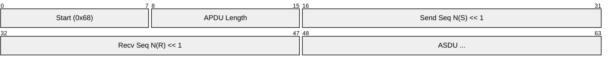
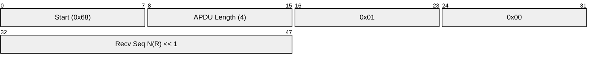
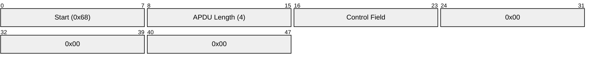
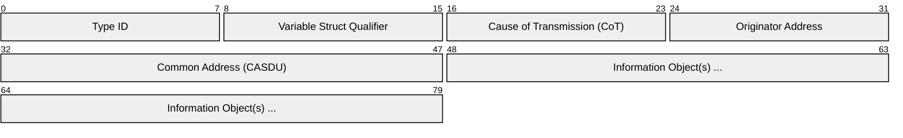
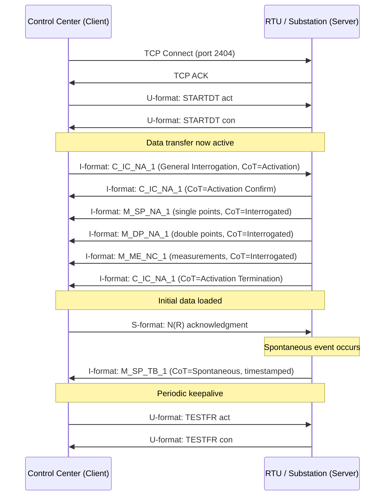

# IEC 60870-5-104

> **Standard:** [IEC 60870-5-104](https://webstore.iec.ch/en/publication/5540) | **Layer:** Application (Layer 7) | **Wireshark filter:** `iec60870_104`

IEC 60870-5-104 (commonly called IEC 104) is a SCADA telecontrol protocol used by power utilities, water systems, and other critical infrastructure for communication between control centers and remote terminal units (RTUs) or substations. It adapts the serial-based IEC 60870-5-101 protocol for TCP/IP networks, preserving the same application-layer ASDU (Application Service Data Unit) format while adding a TCP transport layer. IEC 104 runs on TCP port 2404 and provides balanced (bidirectional) communication with built-in link supervision.

## APDU Structure

The Application Protocol Data Unit (APDU) consists of an APCI (Application Protocol Control Information) header followed by an optional ASDU. There are three APDU formats: I-format (information transfer), S-format (supervisory), and U-format (unnumbered control).

### I-Format APDU (Information Transfer)

### S-Format APDU (Supervisory)

### U-Format APDU (Unnumbered Control)

## APCI Key Fields

| Field | Size | Description |
|-------|------|-------------|
| Start byte | 8 bits | Always 0x68 |
| APDU Length | 8 bits | Length of remaining bytes (max 253) |
| Control Field 1 | 8 bits | Determines format: bit 0 = 0 for I-format, bits 0-1 = 01 for S-format, bits 0-1 = 11 for U-format |
| Control Field 2 | 8 bits | Continuation of control |
| Control Field 3 | 8 bits | Receive sequence number (low byte) |
| Control Field 4 | 8 bits | Receive sequence number (high byte) |

### APDU Format Identification

| Bit Pattern (Control Field 1) | Format | Purpose |
|-------------------------------|--------|---------|
| xxxxxxx0 | I-format | Information transfer (carries ASDU) |
| 000000x1 | S-format | Supervisory acknowledgment |
| 000000x1 (specific patterns) | U-format | Link control (STARTDT, STOPDT, TESTFR) |

### U-Format Commands

| Control Byte | Command | Direction | Description |
|-------------|---------|-----------|-------------|
| 0x07 | STARTDT act | Client -> Server | Activate data transfer |
| 0x0B | STARTDT con | Server -> Client | Confirm data transfer activation |
| 0x13 | STOPDT act | Client -> Server | Stop data transfer |
| 0x23 | STOPDT con | Server -> Client | Confirm data transfer stop |
| 0x43 | TESTFR act | Either | Test frame (keepalive) |
| 0x83 | TESTFR con | Either | Test frame confirmation |

## ASDU Structure

The ASDU is carried inside I-format APDUs and contains the actual telecontrol data:

### ASDU Key Fields

| Field | Size | Description |
|-------|------|-------------|
| Type Identification | 8 bits | Defines the type and format of information objects |
| Variable Structure Qualifier | 8 bits | Bit 7: SQ flag (0 = each object has IOA, 1 = sequence); bits 0-6: number of objects |
| Cause of Transmission | 8 bits | Why this ASDU was sent |
| Originator Address | 8 bits | Source identifier (0 if unused) |
| Common Address (CASDU) | 16 bits | Station/RTU address (1-65534; 0 = not used, 65535 = broadcast) |
| Information Object Address (IOA) | 24 bits | Specific point address within the station |
| Information Element(s) | Variable | Data values depending on Type ID |

## Common Type Identifications

### Monitor Direction (Server to Client)

| Type ID | Name | Description |
|---------|------|-------------|
| 1 | M_SP_NA_1 | Single-point information (1 bit status) |
| 3 | M_DP_NA_1 | Double-point information (2 bit status) |
| 5 | M_ST_NA_1 | Step position information (transformer tap) |
| 7 | M_BO_NA_1 | Bitstring of 32 bits |
| 9 | M_ME_NA_1 | Measured value, normalized (-1.0 to +1.0) |
| 11 | M_ME_NB_1 | Measured value, scaled (integer) |
| 13 | M_ME_NC_1 | Measured value, short floating point (IEEE 754) |
| 15 | M_IT_NA_1 | Integrated totals (counter values) |
| 30 | M_SP_TB_1 | Single-point with CP56Time2a timestamp |
| 31 | M_DP_TB_1 | Double-point with CP56Time2a timestamp |
| 34 | M_ME_TD_1 | Measured normalized with CP56Time2a |
| 36 | M_ME_TF_1 | Measured float with CP56Time2a |

### Control Direction (Client to Server)

| Type ID | Name | Description |
|---------|------|-------------|
| 45 | C_SC_NA_1 | Single command (ON/OFF) |
| 46 | C_DC_NA_1 | Double command (ON/OFF with transient states) |
| 47 | C_RC_NA_1 | Regulating step command (HIGHER/LOWER) |
| 48 | C_SE_NA_1 | Set-point command, normalized value |
| 50 | C_SE_NC_1 | Set-point command, short floating point |
| 58 | C_SC_TA_1 | Single command with CP56Time2a |
| 59 | C_DC_TA_1 | Double command with CP56Time2a |

### System Commands

| Type ID | Name | Description |
|---------|------|-------------|
| 100 | C_IC_NA_1 | Interrogation command (general or group) |
| 101 | C_CI_NA_1 | Counter interrogation command |
| 102 | C_RD_NA_1 | Read command |
| 103 | C_CS_NA_1 | Clock synchronization command |
| 104 | C_TS_NA_1 | Test command |
| 105 | C_RP_NA_1 | Reset process command |
| 107 | C_TS_TA_1 | Test command with CP56Time2a |

## Cause of Transmission (CoT)

| Code | Name | Description |
|------|------|-------------|
| 1 | Periodic/cyclic | Periodic transmission |
| 2 | Background | Background scan |
| 3 | Spontaneous | Spontaneous value change |
| 4 | Initialized | After station initialization |
| 5 | Request | Response to a request or interrogation |
| 6 | Activation | Command activation |
| 7 | Activation confirm | Confirmation of activation |
| 8 | Deactivation | Command deactivation |
| 9 | Deactivation confirm | Confirmation of deactivation |
| 10 | Activation termination | End of command execution |
| 20 | Interrogated by station | Response to general interrogation |
| 37 | Interrogated by group 1 | Response to group 1 interrogation |
| 44 | Unknown type ID | Negative: type not supported |
| 45 | Unknown CoT | Negative: cause not supported |
| 46 | Unknown CASDU | Negative: address not known |
| 47 | Unknown IOA | Negative: object address not known |

## Connection Startup

## Connection Parameters

| Parameter | Default | Description |
|-----------|---------|-------------|
| t0 | 30 s | TCP connection establishment timeout |
| t1 | 15 s | Timeout for send or test APDUs |
| t2 | 10 s | Timeout for acknowledging received I-format APDUs (t2 < t1) |
| t3 | 20 s | Timeout for sending TESTFR if no data activity |
| k | 12 | Max outstanding unacknowledged I-format APDUs sent |
| w | 8 | Max I-format APDUs received before sending S-format ACK (w < k) |

## Quality Descriptor

Each information object includes quality bits:

| Bit | Name | Description |
|-----|------|-------------|
| 0 | OV | Overflow |
| 4 | BL | Blocked |
| 5 | SB | Substituted |
| 6 | NT | Not topical (value not current) |
| 7 | IV | Invalid (value is not usable) |

## IEC 101 vs IEC 104

| Feature | IEC 60870-5-101 | IEC 60870-5-104 |
|---------|-----------------|-----------------|
| Transport | Serial (RS-232/485) | TCP/IP (port 2404) |
| Link layer | FT1.2 framing | APCI (start 0x68) |
| Addressing | Link address + CASDU | IP address + CASDU |
| Mode | Unbalanced or balanced | Balanced only |
| ASDU format | Same | Same |
| Type IDs | Same set | Same set |
| Flow control | Link-level | Sequence numbers (N(S)/N(R)) |

## Encapsulation

## Standards

| Document | Title |
|----------|-------|
| [IEC 60870-5-104](https://webstore.iec.ch/en/publication/5540) | Telecontrol equipment and systems -- Network access for IEC 60870-5-101 |
| [IEC 60870-5-101](https://webstore.iec.ch/en/publication/5538) | Companion standard for basic telecontrol tasks |
| [IEC 60870-5-5](https://webstore.iec.ch/en/publication/5534) | Basic application functions |
| [IEC 62351-3](https://webstore.iec.ch/en/publication/6907) | Security: TLS profiles for TCP/IP-based protocols |

## See Also

- [Modbus](modbus.md) -- simpler industrial protocol, often complementary
- [IEC 61850](iec61850.md) -- modern substation automation standard
