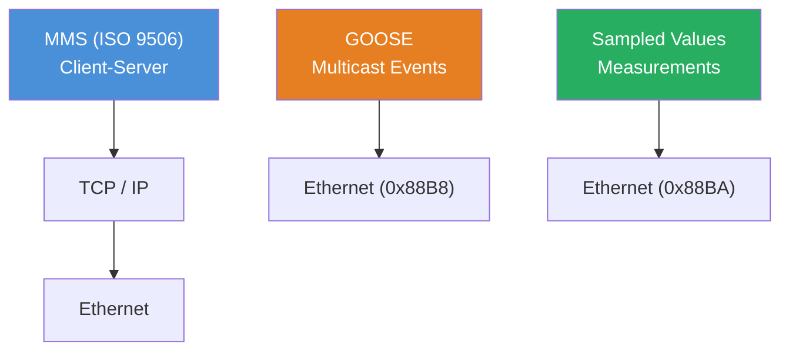
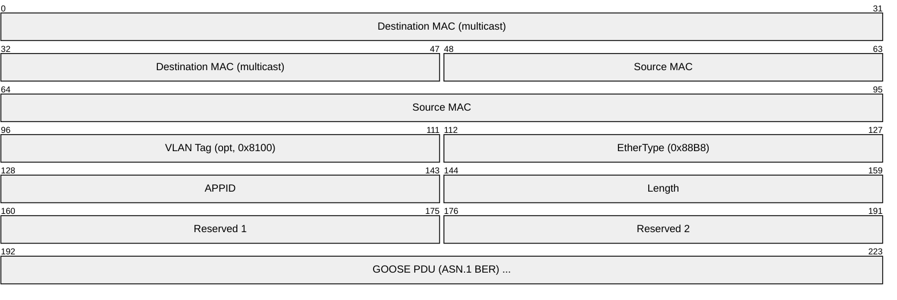
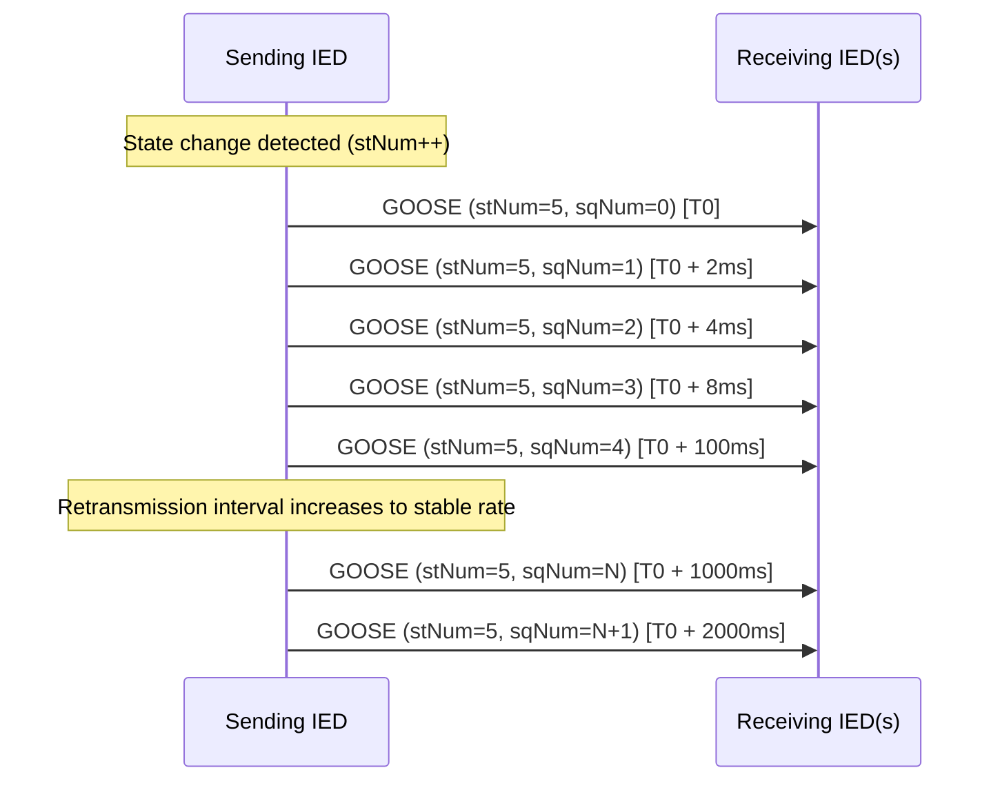
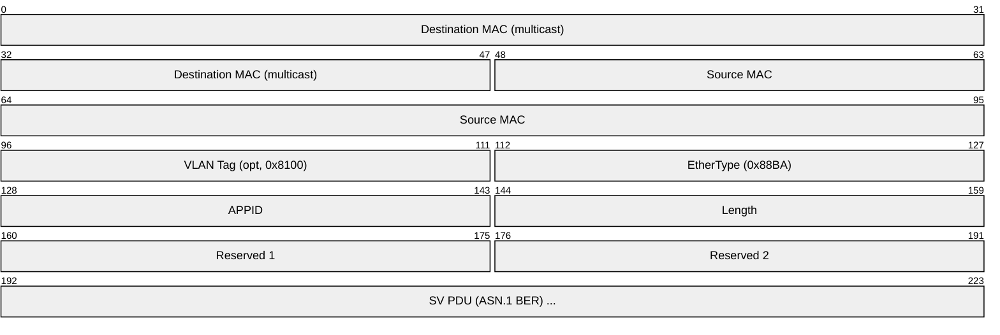
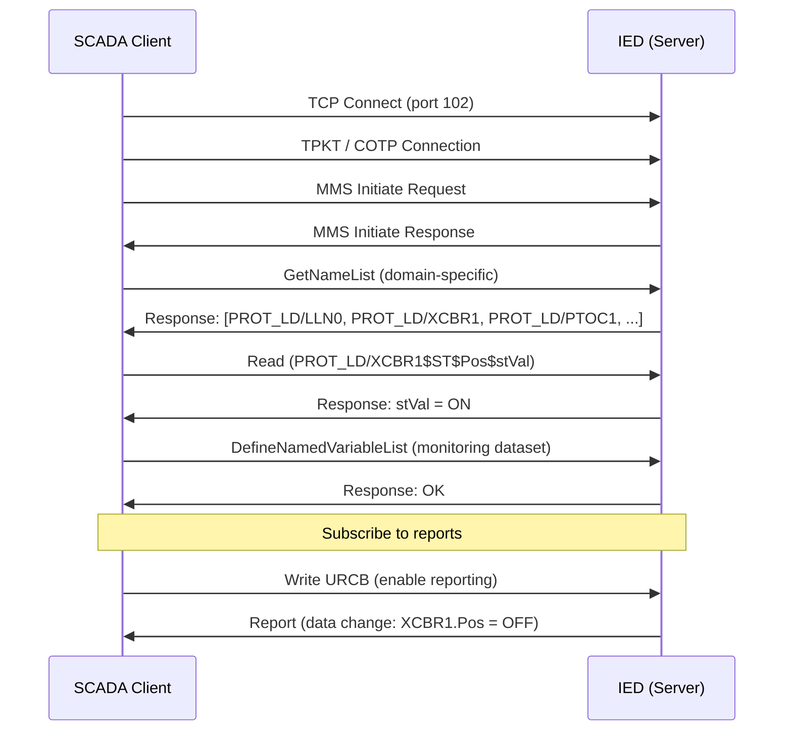
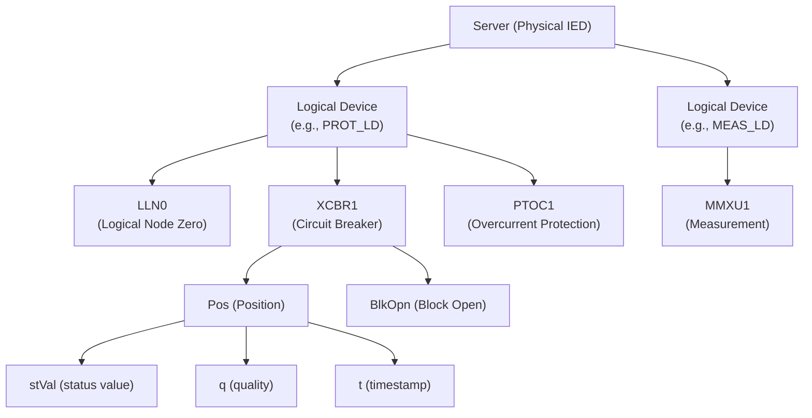
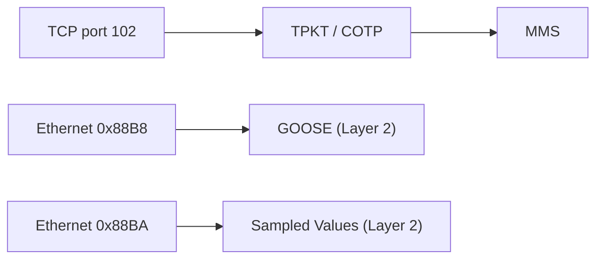

# IEC 61850

> **Standard:** [IEC 61850](https://webstore.iec.ch/en/publication/6028) | **Layer:** Application / Data Link (varies by service) | **Wireshark filter:** `goose` or `sv` or `mms`

IEC 61850 is the international standard for communication in electrical substations and smart grids. It defines a unified data model, configuration language, and multiple communication services mapped to different protocols: MMS (Manufacturing Message Specification) over TCP/IP for client-server SCADA, GOOSE (Generic Object Oriented Substation Event) over Ethernet for fast peer-to-peer event distribution, and Sampled Values (SV) over Ethernet for streaming measurement data. IEC 61850 replaces legacy protocols with a single, object-oriented approach to power system automation.

## Protocol Stack

## GOOSE Frame

GOOSE is a Layer 2 multicast protocol (EtherType 0x88B8) for fast event distribution with less than 4 ms delivery. It is used for tripping signals, interlocking, and protection coordination.

### GOOSE Key Fields

| Field | Size | Description |
|-------|------|-------------|
| Destination MAC | 48 bits | Multicast address (01-0C-CD-01-xx-xx) |
| Source MAC | 48 bits | Sending IED MAC address |
| VLAN Tag | 32 bits | Optional 802.1Q priority tagging (typically priority 4) |
| EtherType | 16 bits | 0x88B8 identifies GOOSE |
| APPID | 16 bits | Application identifier (0x0000-0x3FFF) |
| Length | 16 bits | Total length from APPID to end of PDU |
| Reserved 1 | 16 bits | Reserved (simulation bit in Edition 2) |
| Reserved 2 | 16 bits | Reserved |
| GOOSE PDU | Variable | ASN.1 BER encoded payload |

### GOOSE PDU Fields (ASN.1 BER)

| Field | Description |
|-------|-------------|
| gocbRef | GOOSE Control Block reference (e.g., `IED1LD0/LLN0$GO$gcb01`) |
| timeAllowedtoLive | Milliseconds before GOOSE is considered stale |
| datSet | Dataset reference containing the values |
| goID | GOOSE identifier string |
| t | Timestamp (UTC) of the event |
| stNum | State number (increments on value change) |
| sqNum | Sequence number (increments with each retransmission, resets to 0 on stNum change) |
| test | Test flag (TRUE = test mode) |
| confRev | Configuration revision |
| ndsCom | Needs commissioning flag |
| numDatSetEntries | Number of data entries |
| allData | Ordered list of data values |

### GOOSE Retransmission

GOOSE uses a retransmission scheme with exponential backoff to ensure reliability without acknowledgments:

## Sampled Values (SV) Frame

SV (EtherType 0x88BA) streams digitized current and voltage samples from merging units to protection relays at rates of 4000 or 4800 samples/second per channel.

### SV Key Fields

| Field | Size | Description |
|-------|------|-------------|
| EtherType | 16 bits | 0x88BA identifies Sampled Values |
| APPID | 16 bits | Application identifier (0x4000-0x7FFF) |
| Length | 16 bits | Total length from APPID to end of PDU |
| savPdu | Variable | Contains one or more ASDU sequences |
| svID | String | Sampled Value stream identifier |
| smpCnt | 16 bits | Sample counter (0-4799 for 4800 smp/s) |
| confRev | 32 bits | Configuration revision |
| smpSynch | 8 bits | Synchronization quality (0=none, 1=local, 2=global) |
| seqData | Variable | Encoded measurement samples (I_a, I_b, I_c, I_n, V_a, V_b, V_c, V_n) |

### Sampling Rates

| Standard | Rate | Application |
|----------|------|-------------|
| IEC 61850-9-2 | 4000 samples/s | Protection |
| IEC 61850-9-2 | 4800 samples/s | Power quality / metering |
| IEC 61850-9-2LE | 80 samples/cycle | Simplified profile (4000 or 4800 smp/s) |

## MMS (Manufacturing Message Specification)

MMS (ISO 9506) provides client-server access to the data model over TCP/IP (port 102 via TPKT/COTP). SCADA systems use MMS to read values, write setpoints, and manage devices.

### MMS Services

| Service | Description |
|---------|-------------|
| GetNameList | Browse available objects (Logical Devices, Logical Nodes, Data Objects) |
| Read | Read one or more data attribute values |
| Write | Write a value to a data attribute |
| GetVariableAccessAttributes | Query the type and structure of a data object |
| DefineNamedVariableList | Create a named list of variables for grouped access |
| GetNamedVariableListAttributes | Query the contents of a named variable list |
| Report (BRCB/URCB) | Subscribe to data change reports (buffered or unbuffered) |
| Control | Operate / Select-Before-Operate / Cancel commands |
| GetServerDirectory | Discover the data model of an IED |
| FileOpen / FileRead / FileClose | Access disturbance recordings and configuration files |

### MMS Client-Server Flow

## Data Model

IEC 61850 organizes all substation data in a hierarchical object model:

### Common Logical Node Classes

| Prefix | Category | Examples |
|--------|----------|---------|
| L | System LNs | LLN0 (logical node zero), LPHD (physical device) |
| A | Automatic Control | ATCC (tap changer controller), ARCO (reactive power) |
| C | Supervisory Control | CSWI (switch controller), CILO (interlocking) |
| G | Generic References | GGIO (generic I/O) |
| I | Interfacing | IHMI (human-machine interface) |
| M | Metering/Measurement | MMXU (measurement), MMTR (metering), MSQI (sequence/imbalance) |
| P | Protection | PTOC (overcurrent), PDIF (differential), PTOV (overvoltage), PTUV (undervoltage) |
| R | Protection-Related | RREC (auto-reclosing), RBRF (breaker failure) |
| S | Sensors/Monitoring | SIML (insulation monitor), SARC (arc detection) |
| T | Instrument Transformers | TCTR (current transformer), TVTR (voltage transformer) |
| X | Switchgear | XCBR (circuit breaker), XSWI (disconnect switch) |
| Y | Power Transformers | YPTR (power transformer), YLTC (load tap changer) |

### Functional Constraints (FC)

| FC | Category | Description |
|----|----------|-------------|
| ST | Status | Runtime status values (read-only) |
| MX | Measured Values | Analog measurements |
| CO | Control | Operable points (commands) |
| SP | Setting | Configurable parameters |
| SG | Setting Group | Active setting group |
| CF | Configuration | Fixed configuration data |
| DC | Description | Textual descriptions and naming |
| EX | Extended | Extended definition |

## SCL (Substation Configuration Language)

SCL is the XML-based configuration language defined in IEC 61850-6. It describes the complete substation model, communication configuration, and IED capabilities.

### SCL File Types

| Extension | Name | Description |
|-----------|------|-------------|
| .icd | IED Capability Description | IED template from manufacturer |
| .ssd | System Specification Description | Substation single-line diagram and LN allocation |
| .scd | Substation Configuration Description | Complete configured system (all IEDs + communication) |
| .cid | Configured IED Description | Final per-IED configuration for download |
| .sed | System Exchange Description | Information exchange between projects |

## Edition 1 vs Edition 2

| Feature | Edition 1 (2003) | Edition 2 (2010+) |
|---------|------------------|-------------------|
| Data model | Basic LN classes | Extended LN classes, new domains (hydro, DER, wind) |
| Services | Core services | Enhanced security, time sync, service tracking |
| GOOSE simulation | Not supported | Simulation bit in Reserved 1 field |
| Redundancy | Not standardized | PRP / HSR (IEC 62439-3) |
| Security | Not addressed | Role-based access, TLS, GDSP (IEC 62351) |
| SCL | Version 1.0 | Version 2007, extended schema |
| Testing | Basic conformance | Edition 2 conformance with PIXIT/PICS |

## Encapsulation

## Standards

| Document | Title |
|----------|-------|
| [IEC 61850-5](https://webstore.iec.ch/en/publication/6012) | Communication requirements for functions and device models |
| [IEC 61850-6](https://webstore.iec.ch/en/publication/6013) | Configuration description language (SCL) |
| [IEC 61850-7-1](https://webstore.iec.ch/en/publication/6014) | Principles and models |
| [IEC 61850-7-2](https://webstore.iec.ch/en/publication/6015) | Abstract communication service interface (ACSI) |
| [IEC 61850-7-3](https://webstore.iec.ch/en/publication/6016) | Common data classes |
| [IEC 61850-7-4](https://webstore.iec.ch/en/publication/6017) | Compatible logical node classes and data object classes |
| [IEC 61850-8-1](https://webstore.iec.ch/en/publication/6021) | Mapping to MMS and Ethernet |
| [IEC 61850-9-2](https://webstore.iec.ch/en/publication/6024) | Sampled Values over Ethernet |
| [IEC 62351](https://webstore.iec.ch/en/publication/6905) | Security for IEC 61850 and other power system protocols |
| [IEC 62439-3](https://webstore.iec.ch/en/publication/7018) | PRP and HSR network redundancy |

## See Also

- [Modbus](modbus.md) -- widely used industrial protocol often found alongside IEC 61850
- [PROFIBUS](profibus.md) -- alternative industrial fieldbus
- [Ethernet](../link-layer/ethernet.md) -- transport for GOOSE and SV
