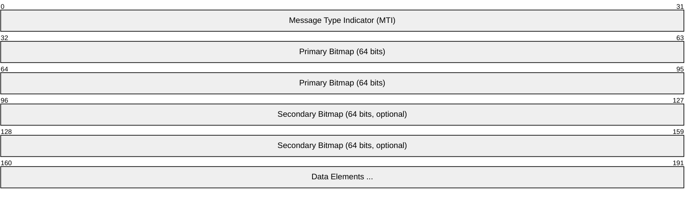
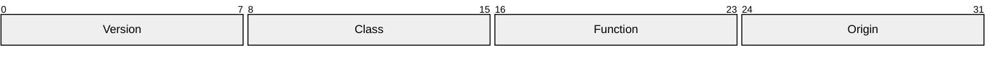
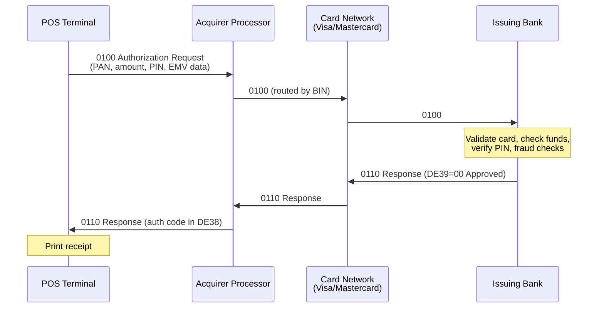
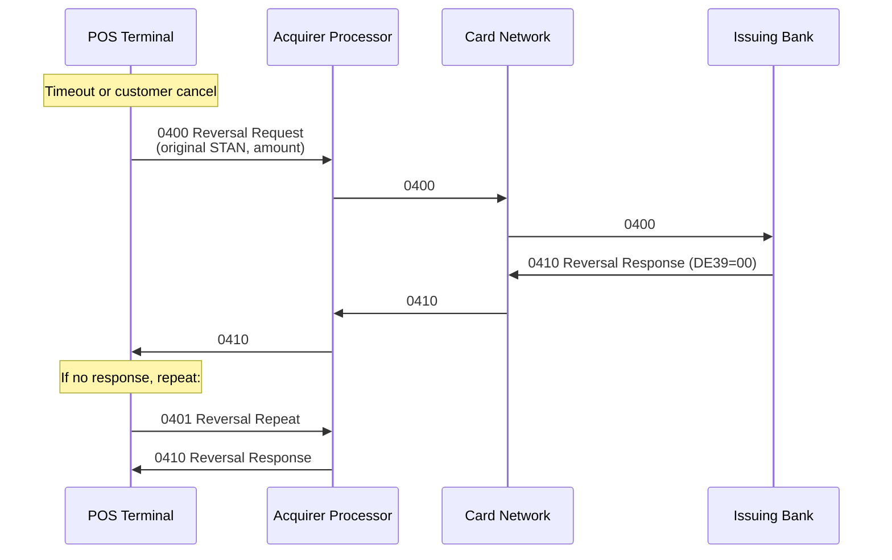

# ISO 8583 (Financial Transaction Card Messaging)

> **Standard:** [ISO 8583:2003](https://www.iso.org/standard/31628.html) | **Layer:** Application (Layer 7) | **Wireshark filter:** Limited (typically over proprietary transports)

ISO 8583 is the international standard for financial transaction card-originated messages. It defines the message format used between card-accepting devices (ATMs, POS terminals) and card issuers for authorization, clearing, and settlement of payment card transactions. Virtually every swipe, dip, or tap of a credit or debit card worldwide generates ISO 8583 messages. The protocol is implemented by payment networks (Visa, Mastercard, UnionPay), acquirer processors, and issuing banks, typically carried over proprietary TCP-based transports with TLS encryption.

## Message Structure

Every ISO 8583 message consists of three parts: a Message Type Indicator, one or two Bitmaps, and the Data Elements indicated by the bitmap.



| Field | Size | Description |
|-------|------|-------------|
| MTI | 4 bytes | Message type: version, class, function, origin |
| Primary Bitmap | 8 bytes (64 bits) | Indicates presence of data elements 1-64 |
| Secondary Bitmap | 8 bytes (64 bits) | Indicates presence of data elements 65-128 (present if bit 1 is set) |
| Data Elements | Variable | Transaction data fields as indicated by bitmap |

## Message Type Indicator (MTI)

The MTI is a 4-digit code where each digit has a specific meaning:



### Version (Digit 1)

| Value | Meaning |
|-------|---------|
| 0 | ISO 8583:1987 |
| 1 | ISO 8583:1993 |
| 2 | ISO 8583:2003 |

### Message Class (Digit 2)

| Value | Meaning |
|-------|---------|
| 1 | Authorization |
| 2 | Financial (presentment/clearing) |
| 3 | File actions |
| 4 | Reversal / chargeback |
| 5 | Reconciliation |
| 6 | Administrative |
| 8 | Network management |

### Function (Digit 3)

| Value | Meaning |
|-------|---------|
| 0 | Request |
| 1 | Request response |
| 2 | Advice |
| 3 | Advice response |
| 4 | Notification |
| 5 | Notification acknowledgment |

### Origin (Digit 4)

| Value | Meaning |
|-------|---------|
| 0 | Acquirer |
| 1 | Acquirer repeat |
| 2 | Issuer |
| 3 | Issuer repeat |
| 4 | Other |
| 5 | Other repeat |

### Common MTI Values

| MTI | Description |
|-----|-------------|
| 0100 | Authorization request |
| 0110 | Authorization response |
| 0200 | Financial request (purchase) |
| 0210 | Financial response |
| 0400 | Reversal request |
| 0410 | Reversal response |
| 0420 | Reversal advice |
| 0430 | Reversal advice response |
| 0800 | Network management request |
| 0810 | Network management response |

## Bitmap

Each bit in the bitmap corresponds to a data element number. If the bit is set (1), that data element is present in the message. Bit 1 of the primary bitmap indicates whether a secondary bitmap follows.

```
Primary Bitmap:   bits 1-64  (8 bytes)
Secondary Bitmap: bits 65-128 (8 bytes, present if bit 1 = 1)
```

Example: A bitmap of `F2 3C 44 81 08 E0 80 00` indicates that data elements 1, 2, 3, 4, 7, 11, 12, 13, 14, 22, 25, 32, 35, 37, 38, 39, 41, 42, 43, 49, and 52 are present.

## Key Data Elements

| DE | Name | Format | Description |
|----|------|--------|-------------|
| 2 | Primary Account Number (PAN) | n..19 | Card number (up to 19 digits) |
| 3 | Processing Code | n 6 | Transaction type + account types (e.g., 00 = purchase, 01 = cash advance, 20 = refund) |
| 4 | Amount, Transaction | n 12 | Transaction amount in minor units (cents) |
| 7 | Transmission Date & Time | n 10 | MMDDhhmmss |
| 11 | System Trace Audit Number (STAN) | n 6 | Unique transaction identifier from terminal |
| 12 | Local Transaction Time | n 6 | hhmmss |
| 13 | Local Transaction Date | n 4 | MMDD |
| 14 | Expiration Date | n 4 | YYMM |
| 22 | POS Entry Mode | n 3 | How card data was read (e.g., 05 = chip, 07 = contactless, 90 = magstripe) |
| 23 | Card Sequence Number | n 3 | Distinguishes cards with same PAN |
| 25 | POS Condition Code | n 2 | Transaction environment (e.g., 00 = normal, 08 = mail/phone order, 59 = e-commerce) |
| 32 | Acquiring Institution ID | n..11 | Acquirer identifier |
| 35 | Track 2 Data | z..37 | Magnetic stripe track 2 equivalent data |
| 37 | Retrieval Reference Number (RRN) | an 12 | Unique reference for reconciliation |
| 38 | Authorization ID Response | an 6 | Auth code returned by issuer |
| 39 | Response Code | an 2 | Action code (00 = approved, 05 = declined, etc.) |
| 41 | Card Acceptor Terminal ID | ans 8 | Terminal identifier |
| 42 | Card Acceptor ID Code | ans 15 | Merchant identifier |
| 43 | Card Acceptor Name/Location | ans 40 | Merchant name and location |
| 49 | Currency Code, Transaction | n 3 | ISO 4217 currency code (840 = USD, 978 = EUR) |
| 52 | PIN Block | b 8 | Encrypted PIN data (8 bytes binary) |
| 54 | Additional Amounts | ans..120 | Balances, surcharges, cashback |
| 55 | ICC/EMV Data | ans..999 | Chip card data (TLV-encoded EMV tags) |

## Response Codes (DE39)

| Code | Meaning |
|------|---------|
| 00 | Approved |
| 01 | Refer to card issuer |
| 03 | Invalid merchant |
| 05 | Do not honor (declined) |
| 12 | Invalid transaction |
| 13 | Invalid amount |
| 14 | Invalid card number |
| 30 | Format error |
| 41 | Lost card — pick up |
| 43 | Stolen card — pick up |
| 51 | Insufficient funds |
| 54 | Expired card |
| 55 | Incorrect PIN |
| 57 | Transaction not permitted |
| 61 | Exceeds withdrawal limit |
| 65 | Exceeds frequency limit |
| 75 | PIN tries exceeded |
| 91 | Issuer unavailable |
| 96 | System malfunction |

## Authorization Flow



## Reversal Flow



## POS Entry Mode (DE22)

| Code | Description |
|------|-------------|
| 01 | Manual key entry |
| 02 | Magnetic stripe read |
| 05 | Chip card read (ICC) |
| 07 | Contactless chip (NFC/EMV) |
| 10 | Credential on file |
| 79 | Chip fallback to magnetic stripe |
| 80 | Chip fallback to manual entry |
| 90 | Magnetic stripe — full track data |
| 91 | Contactless magnetic stripe |

## Processing Code (DE3)

The 6-digit processing code encodes the transaction type and the accounts affected:

| Digits | Meaning |
|--------|---------|
| 1-2 | Transaction type: 00 = purchase, 01 = cash advance, 09 = purchase with cashback, 20 = refund, 30 = balance inquiry |
| 3-4 | From account: 00 = default, 10 = savings, 20 = checking, 30 = credit |
| 5-6 | To account: same as above |

## Encoding

ISO 8583 does not mandate a single encoding; implementations vary:

| Format | Description |
|--------|-------------|
| Binary | Fields packed as raw binary values |
| BCD (packed) | Digits packed two per byte (nibble-encoded) |
| ASCII | Digits as ASCII characters (one byte per digit) |
| EBCDIC | Used on IBM mainframes |

Variable-length fields include a length prefix (LLVAR = 2-digit length, LLLVAR = 3-digit length) before the data.

## Standards

| Document | Title |
|----------|-------|
| [ISO 8583:2003](https://www.iso.org/standard/31628.html) | Financial transaction card originated messages — Interchange message specifications |
| [ISO 8583-1:2003](https://www.iso.org/standard/31628.html) | Part 1: Messages, data elements and code values |
| [ISO 8583-2:1998](https://www.iso.org/standard/31629.html) | Part 2: Application and registration procedures for ICCs |
| [ISO 8583-3:2003](https://www.iso.org/standard/31630.html) | Part 3: Maintenance procedures |
| [EMV Specifications](https://www.emvco.com/) | Chip card data carried in DE55 |

## See Also

- [TLS](../security/tls.md) -- transport encryption for ISO 8583 connections
- [TCP](../transport-layer/tcp.md) -- underlying transport for online authorization
- [NFC](../wireless/nfc.md) -- contactless card interface (EMV Contactless)
