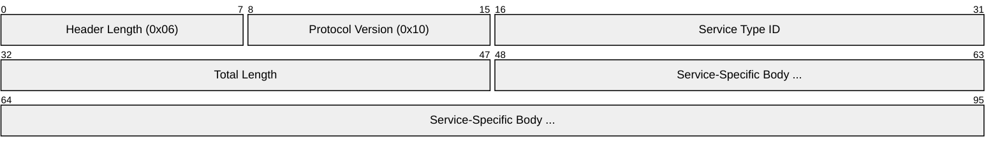
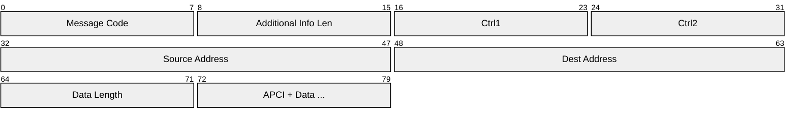
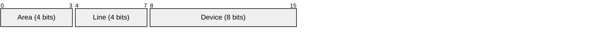
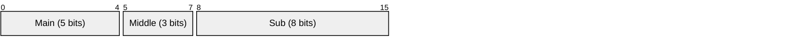
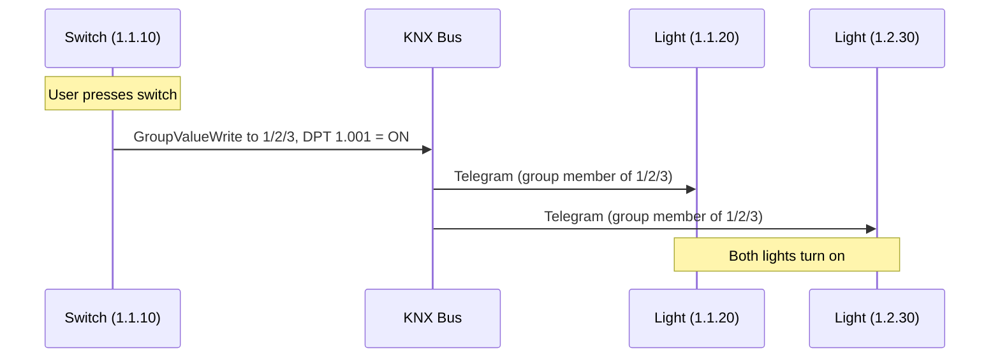
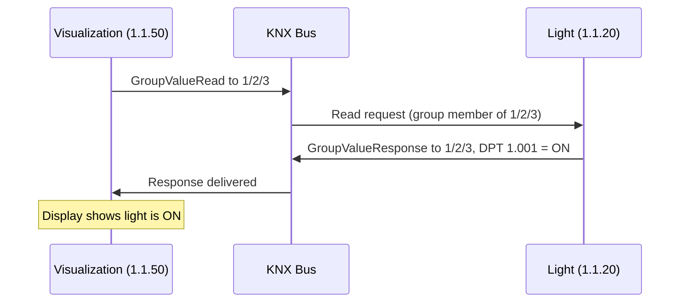
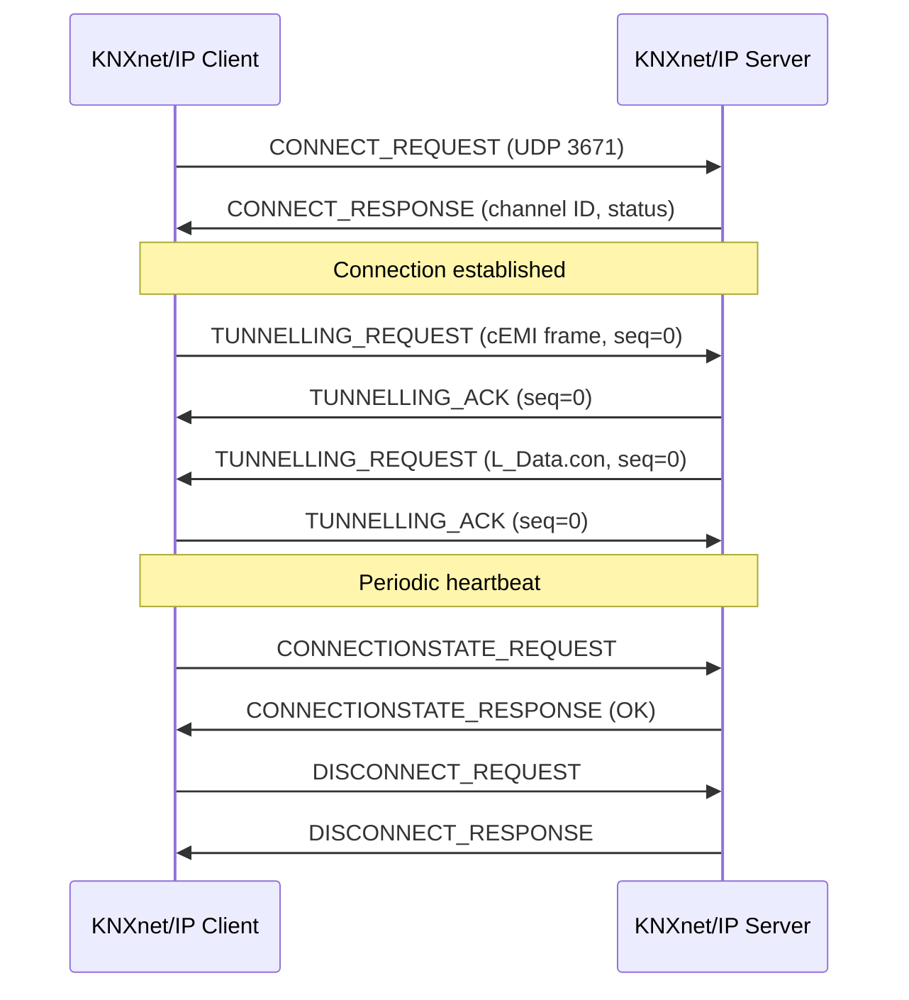
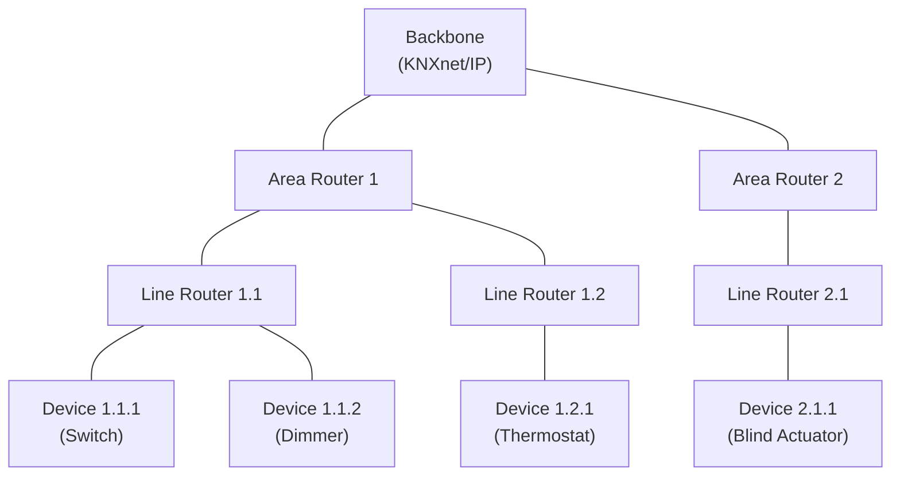

# KNX

> **Standard:** [ISO/IEC 14543-3](https://www.iso.org/standard/59482.html) / [EN 50090](https://www.knx.org/knx-en/for-professionals/index.php) | **Layer:** Full stack (Physical through Application) | **Wireshark filter:** `knxnetip` or `knx`

KNX is the leading open standard for building and home automation in Europe and worldwide. It connects lighting, blinds, HVAC, security, energy management, and audio/video systems. KNX emerged from the merger of three earlier standards (EIB, BatiBUS, EHS) and is managed by the KNX Association. Devices communicate via a common bus using a producer-consumer model with group addresses, enabling multi-vendor interoperability through standardized Datapoint Types (DPTs).

## Media

KNX supports multiple physical media, all carrying the same application-layer telegrams:

| Medium | Designation | Speed | Topology | Notes |
|--------|-------------|-------|----------|-------|
| Twisted Pair | KNX TP | 9600 bps | Free (bus/tree/star) | Most common; bus-powered (29V DC) |
| Powerline | KNX PL | 1200 bps | Existing mains wiring | Spread-frequency shift keying |
| Radio Frequency | KNX RF | 16384 bps | Mesh / star | 868 MHz (Europe) |
| IP | KNXnet/IP | Ethernet speed | LAN / WAN | Tunnelling and routing over UDP |

## KNXnet/IP Header (UDP port 3671)

KNXnet/IP encapsulates KNX telegrams over IP networks. All KNXnet/IP packets share a common header:

| Field | Size | Description |
|-------|------|-------------|
| Header Length | 8 bits | Always 0x06 (6 bytes) |
| Protocol Version | 8 bits | Always 0x10 (v1.0) |
| Service Type ID | 16 bits | Identifies the KNXnet/IP service |
| Total Length | 16 bits | Total frame length including header (bytes) |
| Body | Variable | Service-specific data |

### Service Type IDs

| Code | Service | Description |
|------|---------|-------------|
| 0x0201 | SEARCH_REQUEST | Discover KNXnet/IP servers on LAN |
| 0x0202 | SEARCH_RESPONSE | Server responds with description |
| 0x0205 | CONNECT_REQUEST | Open a tunnelling or routing connection |
| 0x0206 | CONNECT_RESPONSE | Server confirms connection |
| 0x0207 | CONNECTIONSTATE_REQUEST | Heartbeat check |
| 0x0208 | CONNECTIONSTATE_RESPONSE | Heartbeat reply |
| 0x0209 | DISCONNECT_REQUEST | Tear down connection |
| 0x020A | DISCONNECT_RESPONSE | Confirm disconnect |
| 0x0420 | TUNNELLING_REQUEST | Tunnelled cEMI frame (point-to-point) |
| 0x0421 | TUNNELLING_ACK | Acknowledge tunnelled frame |
| 0x0530 | ROUTING_INDICATION | Multicast cEMI frame (routing) |
| 0x0531 | ROUTING_LOST_MESSAGE | Notification of lost multicast frames |

## cEMI Frame (Common External Message Interface)

The cEMI frame is the standard format for KNX telegrams exchanged over KNXnet/IP:

| Field | Size | Description |
|-------|------|-------------|
| Message Code | 8 bits | 0x11 = L_Data.req, 0x29 = L_Data.ind, 0x2E = L_Data.con |
| Additional Info Length | 8 bits | Length of optional additional info (typically 0x00) |
| Ctrl1 | 8 bits | Frame type, repeat, broadcast, priority, ack request |
| Ctrl2 | 8 bits | Address type (individual/group), hop count, extended frame format |
| Source Address | 16 bits | Individual address of sender (Area.Line.Device) |
| Destination Address | 16 bits | Individual or group address of target |
| Data Length | 8 bits | Length of APDU in bytes |
| APDU | Variable | Application Protocol Data Unit (APCI + data) |

### Ctrl1 Byte

| Bit | Name | Description |
|-----|------|-------------|
| 7 | Frame Type | 1 = standard frame, 0 = extended frame |
| 6 | — | Reserved |
| 5 | Repeat | 0 = repeat on error, 1 = do not repeat |
| 4 | System Broadcast | 1 = domain broadcast, 0 = system broadcast |
| 3-2 | Priority | 00 = system, 01 = alarm, 10 = high, 11 = low |
| 1 | Ack Request | 0 = no L2 ack, 1 = request ack |
| 0 | Confirm | 0 = no error (positive confirm) |

### Ctrl2 Byte

| Bit | Name | Description |
|-----|------|-------------|
| 7 | Address Type | 0 = individual (unicast), 1 = group (multicast) |
| 6-4 | Hop Count | Remaining hops (decremented by routers, default 6) |
| 3-0 | Extended Frame Format | 0x0 = standard frame |

## Addressing

### Individual Address (Area.Line.Device)

Each KNX device has a unique individual address encoded in 16 bits:

| Field | Bits | Range | Example |
|-------|------|-------|---------|
| Area | 4 | 1-15 | Building floor |
| Line | 4 | 0-15 | Room / segment |
| Device | 8 | 0-255 | Device on the line |

Example: `1.2.3` = Area 1, Line 2, Device 3

### Group Address

Group addresses connect function points (e.g., a switch to a light). They can be 2-level or 3-level:

**3-Level (most common):**

| Notation | Meaning | Example |
|----------|---------|---------|
| Main/Middle/Sub | 3-level group | 1/2/3 = Lighting / Floor 2 / Lamp 3 |
| Main/Sub | 2-level group | 1/3 = Lighting / Lamp 3 |
| Free | 16-bit value | 0-65535 |

## APCI Types (Application Protocol Control Information)

The APCI field identifies the service requested in the telegram:

| APCI Code | Name | Description |
|-----------|------|-------------|
| 0x000 | GroupValueRead | Request the current value of a group object |
| 0x040 | GroupValueResponse | Reply with the current value |
| 0x080 | GroupValueWrite | Write a new value to a group object |
| 0x0C0 | IndividualAddrWrite | Set a device's individual address (during commissioning) |
| 0x100 | IndividualAddrRead | Query a device's individual address |
| 0x140 | IndividualAddrResponse | Reply with individual address |
| 0x300 | ADCRead | Read ADC channel |
| 0x3C0 | MemoryRead | Read device memory |
| 0x3C8 | MemoryResponse | Reply with memory contents |
| 0x3D0 | MemoryWrite | Write to device memory |
| 0x3E0 | DeviceDescrRead | Read device descriptor |

## Datapoint Types (DPTs)

DPTs standardize how values are encoded in KNX telegrams, ensuring interoperability between different manufacturers:

| DPT | Name | Size | Encoding | Example |
|-----|------|------|----------|---------|
| 1.xxx | Boolean | 1 bit | 0/1 | Switch On/Off, True/False |
| 2.xxx | Control + Boolean | 2 bits | Control + value | Dimming step |
| 3.xxx | 3-bit Control | 4 bits | Control + 3-bit step | Dimmer (brighter/darker) |
| 5.xxx | 8-bit Unsigned | 1 byte | 0-255 | Scaling (0-100%), angle (0-360) |
| 7.xxx | 16-bit Unsigned | 2 bytes | 0-65535 | Pulse counter |
| 9.xxx | 16-bit Float | 2 bytes | 0.01 resolution float | Temperature (-273..+670760) |
| 10.xxx | Time | 3 bytes | Day + hour:min:sec | Time of day |
| 11.xxx | Date | 3 bytes | Day/month/year | Date |
| 12.xxx | 32-bit Unsigned | 4 bytes | 0-4294967295 | Counter |
| 13.xxx | 32-bit Signed | 4 bytes | Signed integer | Energy (Wh) |
| 14.xxx | 32-bit Float | 4 bytes | IEEE 754 | Electrical current (A) |
| 16.xxx | String | 14 bytes | ASCII / ISO 8859-1 | Text display |

## Communication Flow

### GroupValueWrite (Switching a Light)

### GroupValueRead (Status Request)

## KNXnet/IP Tunnelling Connection

## Topology

- **Backbone:** connects areas (typically KNXnet/IP or TP)
- **Area:** up to 15 lines, connected via area router
- **Line:** up to 256 devices, connected via line router
- **Maximum:** 15 areas x 15 lines x 256 devices = 57,600 devices

## Standards

| Document | Title |
|----------|-------|
| [ISO/IEC 14543-3](https://www.iso.org/standard/59482.html) | Home Electronic Systems (HES) — KNX |
| [EN 50090](https://www.knx.org/knx-en/for-professionals/index.php) | Home and Building Electronic Systems (HBES) |
| [KNX Standard v2.1](https://my.knx.org/en/shop/knx-specifications) | Full KNX system specification |
| [KNXnet/IP](https://www.knx.org/knx-en/for-professionals/index.php) | KNX communication over IP networks |

## See Also

- [Modbus](modbus.md) — industrial automation protocol, simpler register-based model
- [PROFIBUS](profibus.md) — European fieldbus for factory and process automation
- [Zigbee](../wireless/zigbee.md) — wireless mesh protocol also used in home automation
- [BLE](../wireless/ble.md) — Bluetooth Low Energy, another smart-home transport
