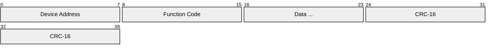
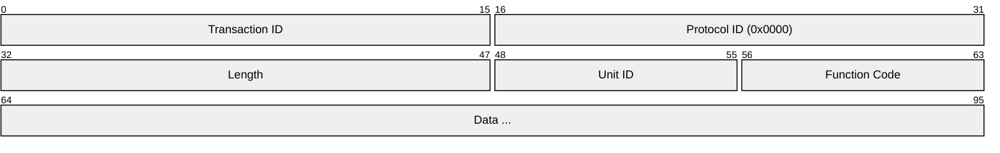
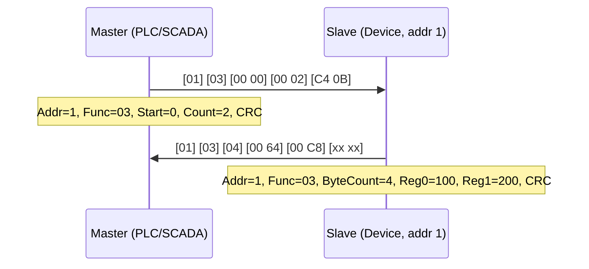
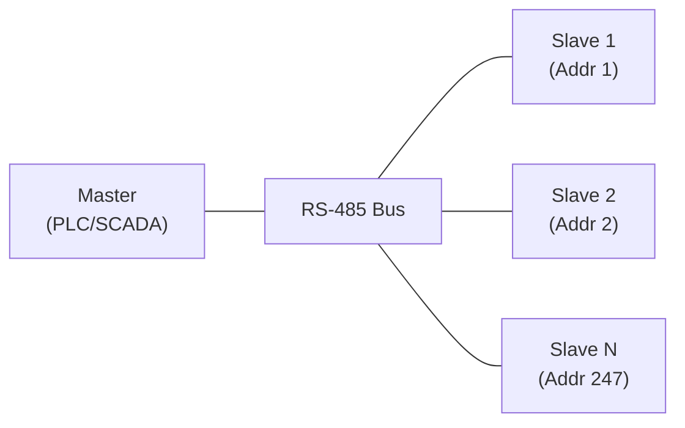
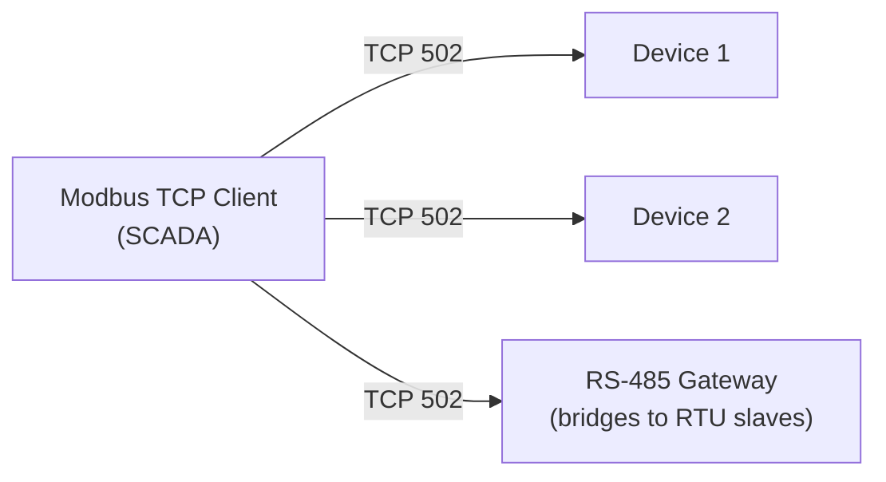
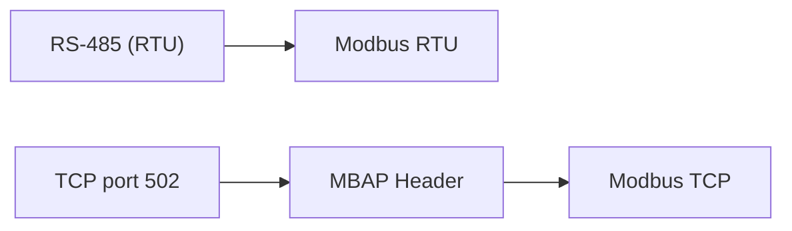

# Modbus

> **Standard:** [Modbus Protocol Specification (Modbus.org)](https://modbus.org/specs.php) | **Layer:** Application (Layer 7) | **Wireshark filter:** `modbus` or `mbtcp`

Modbus is the most widely used industrial communication protocol, connecting PLCs, sensors, actuators, HMIs, and SCADA systems. Developed by Modicon (now Schneider Electric) in 1979, its simplicity and open specification led to near-universal adoption. Modbus defines a master-slave request-response model with a simple register-based data model. It runs over serial (RTU/ASCII on RS-485) and TCP/IP (Modbus TCP).

## Variants

| Variant | Transport | Framing | Error Check |
|---------|-----------|---------|-------------|
| Modbus RTU | RS-485 / RS-232 | Binary, timing-based | CRC-16 |
| Modbus ASCII | RS-485 / RS-232 | ASCII hex, `:` delimited | LRC |
| Modbus TCP | TCP/IP (port 502) | MBAP header | TCP checksum |

## Modbus RTU Frame

| Field | Size | Description |
|-------|------|-------------|
| Device Address | 8 bits | Slave address (1-247); 0 = broadcast |
| Function Code | 8 bits | Operation to perform |
| Data | Variable | Request/response parameters |
| CRC-16 | 16 bits | Cyclic redundancy check (LSB first) |

RTU frames are delimited by silence gaps of ≥ 3.5 character times (~3.6 ms at 9600 baud).

## Modbus TCP Frame (MBAP Header)

| Field | Size | Description |
|-------|------|-------------|
| Transaction ID | 16 bits | Matches requests to responses |
| Protocol ID | 16 bits | Always 0x0000 for Modbus |
| Length | 16 bits | Bytes following (Unit ID + PDU) |
| Unit ID | 8 bits | Slave address (for serial gateway bridging) |
| Function Code | 8 bits | Operation to perform |
| Data | Variable | Request/response parameters |

No CRC — TCP provides error detection.

## Function Codes

| Code | Name | Description |
|------|------|-------------|
| 0x01 | Read Coils | Read 1-2000 discrete outputs (bits) |
| 0x02 | Read Discrete Inputs | Read 1-2000 discrete inputs (bits) |
| 0x03 | Read Holding Registers | Read 1-125 registers (16-bit words) |
| 0x04 | Read Input Registers | Read 1-125 input registers (16-bit words) |
| 0x05 | Write Single Coil | Write one discrete output (0x0000 or 0xFF00) |
| 0x06 | Write Single Register | Write one 16-bit register |
| 0x0F | Write Multiple Coils | Write 1-1968 discrete outputs |
| 0x10 | Write Multiple Registers | Write 1-123 registers |
| 0x17 | Read/Write Multiple Registers | Atomic read + write in one transaction |
| 0x2B | Read Device Identification | Query device model, vendor, etc. |

### Exception Responses

If a request fails, the slave returns the function code with bit 7 set (0x80 + function code) and an exception code:

| Code | Name | Description |
|------|------|-------------|
| 0x01 | Illegal Function | Function code not supported |
| 0x02 | Illegal Data Address | Register address out of range |
| 0x03 | Illegal Data Value | Value out of range |
| 0x04 | Server Device Failure | Unrecoverable error |
| 0x06 | Server Device Busy | Slave is processing a long operation |

## Data Model

| Type | Address Range | Access | Size | Description |
|------|--------------|--------|------|-------------|
| Coils | 00001-09999 | Read/Write | 1 bit | Discrete outputs (relays, LEDs) |
| Discrete Inputs | 10001-19999 | Read only | 1 bit | Discrete inputs (switches, sensors) |
| Input Registers | 30001-39999 | Read only | 16 bits | Analog inputs (ADC values) |
| Holding Registers | 40001-49999 | Read/Write | 16 bits | Configuration, setpoints, outputs |

Note: Addresses in the PDU are 0-based (0x0000-0xFFFF). The 5-digit convention above is for documentation only.

## Request/Response Example

### Read Holding Registers (0x03)

## Communication

### RTU Master-Slave

### TCP Client-Server

## Encapsulation

## Standards

| Document | Title |
|----------|-------|
| [Modbus Application Protocol](https://modbus.org/specs.php) | Modbus Application Protocol Specification V1.1b3 |
| [Modbus over TCP/IP](https://modbus.org/specs.php) | Modbus Messaging on TCP/IP Implementation Guide V1.0b |
| [Modbus over Serial](https://modbus.org/specs.php) | Modbus over Serial Line Specification V1.02 |
| [Modbus/TCP Security](https://modbus.org/specs.php) | Modbus/TCP Security Protocol Specification |

## See Also

- [RS-485](../serial/rs485.md) — physical layer for Modbus RTU
- [TCP](../transport-layer/tcp.md) — transport for Modbus TCP
- [PROFIBUS](profibus.md) — alternative industrial fieldbus
- [UART](../serial/uart.md) — framing for Modbus RTU/ASCII
