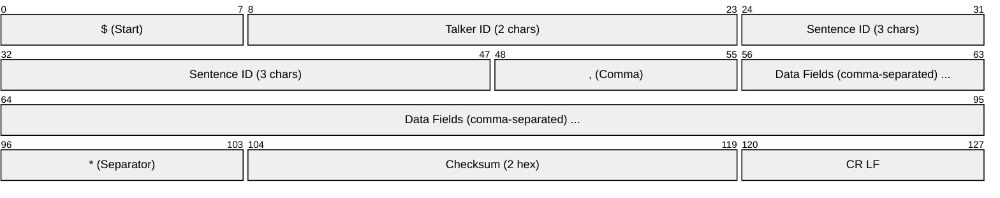
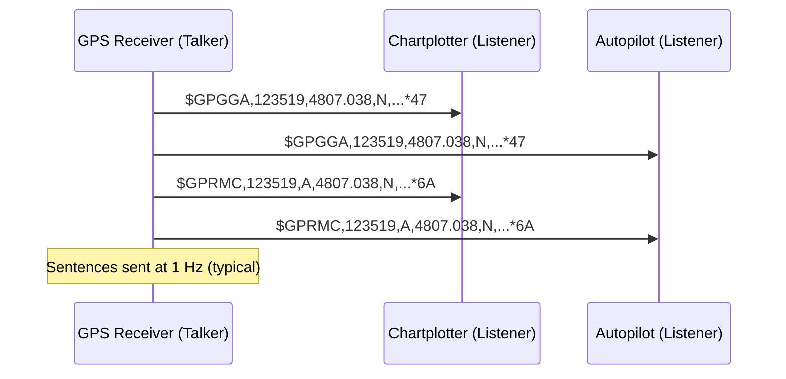
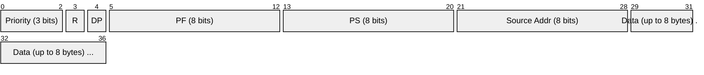
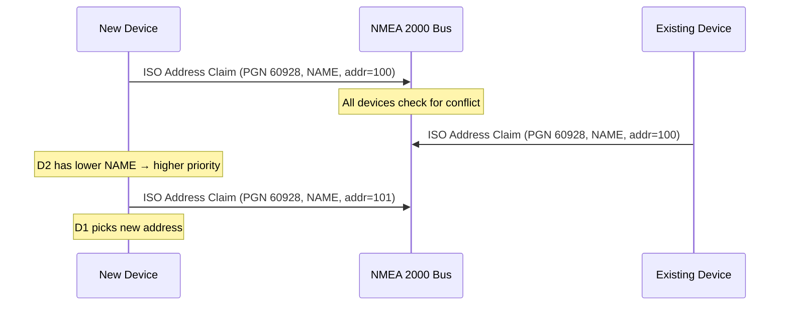
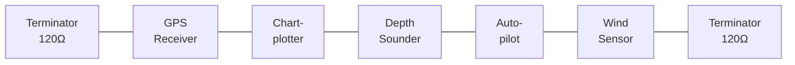
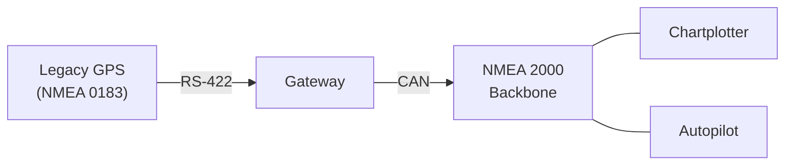

# NMEA 0183 / NMEA 2000

> **Standard:** [NMEA 0183 v4.11](https://www.nmea.org/content/STANDARDS/NMEA_0183_Standard) / [NMEA 2000 (IEC 61162-3)](https://www.nmea.org/content/STANDARDS/NMEA_2000) | **Layer:** Application / Physical | **Wireshark filter:** `nmea_0183`

NMEA 0183 and NMEA 2000 are communication standards developed by the National Marine Electronics Association for interconnecting marine electronics — GPS receivers, chartplotters, depth sounders, autopilots, AIS transponders, and wind instruments. NMEA 0183 uses human-readable ASCII sentences over serial links and is the most widely supported marine data format. NMEA 2000 is its modern successor, using a binary format over CAN bus for higher speed, multi-talker networking, and plug-and-play device connectivity.

---

## NMEA 0183

### Sentence Structure

Every NMEA 0183 sentence follows a fixed ASCII format:

```
$TalkerID SentenceID , field1 , field2 , ... *checksum CR LF
```



| Field | Size | Description |
|-------|------|-------------|
| Start | 1 byte | `$` for standard sentences, `!` for encapsulated (AIS) |
| Talker ID | 2 bytes | Identifies the source device type |
| Sentence ID | 3 bytes | Identifies the data type |
| Data Fields | Variable | Comma-separated ASCII values (may be empty) |
| Checksum | 3 bytes | `*` followed by 2-char hex XOR of all bytes between `$` and `*` |
| Terminator | 2 bytes | CR (0x0D) + LF (0x0A) |

Maximum sentence length: 82 characters (including `$` and CR LF).

### Talker IDs

| ID | Source Device |
|----|---------------|
| GP | GPS receiver |
| GN | GNSS (multi-constellation) |
| GL | GLONASS |
| GA | Galileo |
| GB | BeiDou |
| HC | Heading — magnetic compass |
| HE | Heading — gyro (north-seeking) |
| II | Integrated instrumentation |
| SD | Depth sounder |
| WI | Weather instruments |
| AI | AIS (Automatic Identification System) |
| EC | ECDIS (Electronic Chart Display) |

### Common Sentences

| Sentence | Name | Key Data |
|----------|------|----------|
| GGA | Global Positioning System Fix | Time, lat, lon, fix quality, satellites, HDOP, altitude |
| RMC | Recommended Minimum Specific GNSS | Time, status, lat, lon, speed, course, date, mag var |
| GSV | GNSS Satellites in View | Satellite count, PRN, elevation, azimuth, SNR |
| GSA | GNSS DOP and Active Satellites | Fix mode, satellite PRNs, PDOP, HDOP, VDOP |
| VTG | Track Made Good and Ground Speed | True course, magnetic course, speed (knots and km/h) |
| GLL | Geographic Position — Lat/Lon | Latitude, longitude, time, status |
| ZDA | Time and Date | UTC time, day, month, year, timezone |
| HDT | Heading True | True heading from gyrocompass |
| MWV | Wind Speed and Angle | Wind angle, reference (R/T), speed, units |
| DBT | Depth Below Transducer | Depth in feet, meters, fathoms |
| MTW | Mean Temperature of Water | Temperature in Celsius |
| XTE | Cross-Track Error | Deviation from planned route |

### Sentence Examples

**GGA — GPS Fix Data:**

```
$GPGGA,123519,4807.038,N,01131.000,E,1,08,0.9,545.4,M,47.0,M,,*47
```

| Field | Value | Meaning |
|-------|-------|---------|
| 123519 | 12:35:19 UTC | Fix time |
| 4807.038,N | 48°07.038' N | Latitude |
| 01131.000,E | 11°31.000' E | Longitude |
| 1 | GPS fix | Fix quality (0=invalid, 1=GPS, 2=DGPS, 4=RTK) |
| 08 | 8 | Satellites used |
| 0.9 | 0.9 | HDOP (horizontal dilution of precision) |
| 545.4,M | 545.4 meters | Altitude above MSL |

**RMC — Recommended Minimum:**

```
$GPRMC,123519,A,4807.038,N,01131.000,E,022.4,084.4,230394,003.1,W*6A
```

| Field | Value | Meaning |
|-------|-------|---------|
| 123519 | 12:35:19 UTC | Fix time |
| A | Active | Status (A=active/valid, V=void) |
| 4807.038,N | 48°07.038' N | Latitude |
| 01131.000,E | 11°31.000' E | Longitude |
| 022.4 | 22.4 knots | Speed over ground |
| 084.4 | 84.4° | Course over ground (true) |
| 230394 | 23 Mar 1994 | Date (ddmmyy) |
| 003.1,W | 3.1° West | Magnetic variation |

### Fix Quality Values

| Value | Description |
|-------|-------------|
| 0 | Invalid / no fix |
| 1 | GPS fix (Standard Positioning Service) |
| 2 | DGPS fix (Differential GPS) |
| 4 | RTK Fixed (centimeter accuracy) |
| 5 | RTK Float (decimeter accuracy) |
| 6 | Estimated (dead reckoning) |

### Physical Layer

| Parameter | Standard | High Speed |
|-----------|----------|------------|
| Electrical | [RS-422](../serial/rs422.md) (differential) | RS-422 |
| Baud Rate | 4800 bps | 38400 bps |
| Data Bits | 8 | 8 |
| Parity | None | None |
| Stop Bits | 1 | 1 |
| Topology | One talker, many listeners | One talker, many listeners |

NMEA 0183 is unidirectional: one talker drives the bus, and multiple listeners receive. Bidirectional communication requires separate talker/listener pairs.

### NMEA 0183 Communication



---

## NMEA 2000

NMEA 2000 is a modern marine networking standard built on [CAN](../bus/can.md) (Controller Area Network). It replaces NMEA 0183's one-talker serial model with a multi-master bus where any device can transmit.

### Comparison

| Feature | NMEA 0183 | NMEA 2000 |
|---------|-----------|-----------|
| Format | ASCII text | Binary (CAN frames) |
| Speed | 4800 / 38400 bps | 250 kbps |
| Topology | Point-to-point (1 talker : N listeners) | Multi-drop bus (N devices) |
| Physical Layer | RS-422 | CAN 2.0B (DeviceNet Micro-C) |
| Max Devices | 1 talker per wire | 50 devices per backbone |
| Power | Separate power wiring | Bus-powered (12V DC on backbone) |
| Addressing | None (talker ID only) | Source address (0-251), NAME (64-bit) |
| Plug and Play | No | Yes (address claiming) |

### NMEA 2000 Frame (CAN Extended Frame)

NMEA 2000 uses 29-bit CAN extended identifiers. The identifier encodes priority, PGN, and source address:



| Field | Size | Description |
|-------|------|-------------|
| Priority | 3 bits | 0 (highest) to 7 (lowest); default 6 for most data |
| Reserved | 1 bit | Reserved, set to 0 |
| Data Page | 1 bit | Selects PGN page (0 or 1) |
| PF | 8 bits | PDU Format — determines PGN and addressing mode |
| PS | 8 bits | PDU Specific — destination address (PF < 240) or group extension (PF >= 240) |
| Source Address | 8 bits | Sender's address (claimed via ISO 11783-5) |
| Data | 0-8 bytes | Payload (single frame) or Transport Protocol for larger messages |

### PGN (Parameter Group Number)

The PGN is a 18-bit identifier (including DP, PF, PS for broadcast PGNs) that identifies the type of data:

| PGN | Name | Rate | Key Data |
|-----|------|------|----------|
| 59392 | ISO Acknowledgment | On demand | Response to request |
| 59904 | ISO Request | On demand | Request a specific PGN |
| 60928 | ISO Address Claim | On demand | 64-bit NAME, source address |
| 126992 | System Time | 1 Hz | Date, time, time source |
| 127250 | Vessel Heading | 10 Hz | Heading, deviation, variation |
| 127257 | Attitude | 10 Hz | Yaw, pitch, roll |
| 128259 | Speed — Water | 1 Hz | Speed through water |
| 128267 | Water Depth | 1 Hz | Depth below transducer, offset |
| 129025 | Position — Rapid Update | 10 Hz | Latitude, longitude |
| 129026 | COG/SOG — Rapid Update | 10 Hz | Course over ground, speed over ground |
| 129029 | GNSS Position Data | 1 Hz | Full position fix with DOP, satellites |
| 129038 | AIS Class A Position | Event | AIS target position and status |
| 130306 | Wind Data | 1 Hz | Wind speed, angle, reference |
| 130310 | Environmental Parameters | 0.5 Hz | Water temp, air temp, pressure |
| 130312 | Temperature | 0.5 Hz | Temperature source, value |

### Multi-Frame Transport

CAN frames carry at most 8 bytes. NMEA 2000 messages longer than 8 bytes use the ISO 11783 Transport Protocol:

**Fast Packet:** For messages up to 223 bytes. The first frame contains a sequence counter and total length; subsequent frames carry 7 data bytes each.

**Multi-Packet (TP):** For messages larger than 223 bytes. Uses BAM (Broadcast Announce Message) or connection-based transfer with flow control.

### Address Claiming



### Bus Topology



- Backbone: DeviceNet Micro-C connectors, shielded twisted pair + power
- Drop cables: up to 6 m from backbone T-connector to device
- Backbone length: up to 200 m
- 120 ohm termination at each end (same as CAN)

---

## NMEA 0183 to NMEA 2000 Gateway

Many vessels run both protocols. Gateways translate between ASCII sentences and binary PGNs:



### Sentence-to-PGN Mapping

| NMEA 0183 | NMEA 2000 PGN | Data |
|-----------|---------------|------|
| GGA | 129029 | GNSS position |
| RMC | 129025 + 129026 | Position, COG, SOG |
| HDT | 127250 | Heading |
| MWV | 130306 | Wind data |
| DBT | 128267 | Water depth |
| MTW | 130312 | Water temperature |
| VTG | 129026 | Course and speed |

## Standards

| Document | Title |
|----------|-------|
| [NMEA 0183 v4.11](https://www.nmea.org/content/STANDARDS/NMEA_0183_Standard) | Standard for Interfacing Marine Electronic Devices |
| [NMEA 2000](https://www.nmea.org/content/STANDARDS/NMEA_2000) | NMEA 2000 Network Standard |
| [IEC 61162-1](https://www.iec.ch/) | Maritime navigation — Digital interfaces — Part 1: Single talker (NMEA 0183) |
| [IEC 61162-3](https://www.iec.ch/) | Maritime navigation — Digital interfaces — Part 3: Serial data instrument interconnection (NMEA 2000) |
| [SAE J1939](https://www.sae.org/) | CAN-based vehicle bus (NMEA 2000 inherits transport protocol) |

## See Also

- [CAN](../bus/can.md) — physical and data link layer for NMEA 2000
- [RS-422](../serial/rs422.md) — physical layer for NMEA 0183
- [RS-232](../serial/rs232.md) — alternative serial interface for NMEA 0183 (common on PCs)
- [UART](../serial/uart.md) — framing for NMEA 0183 serial communication
