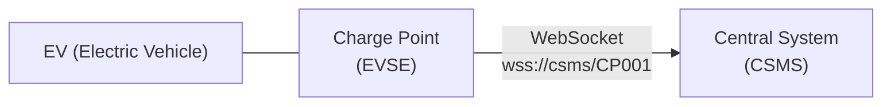
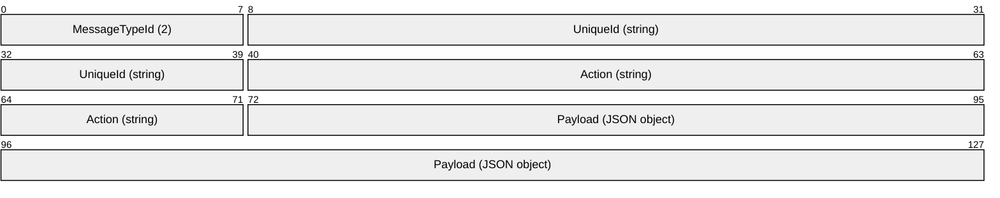
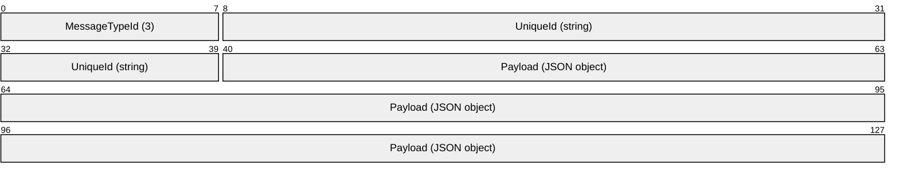
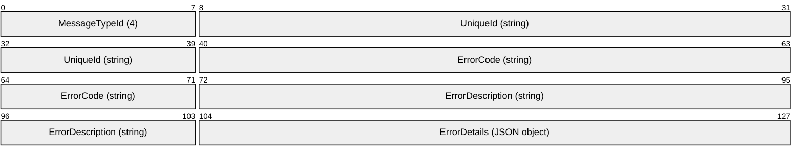
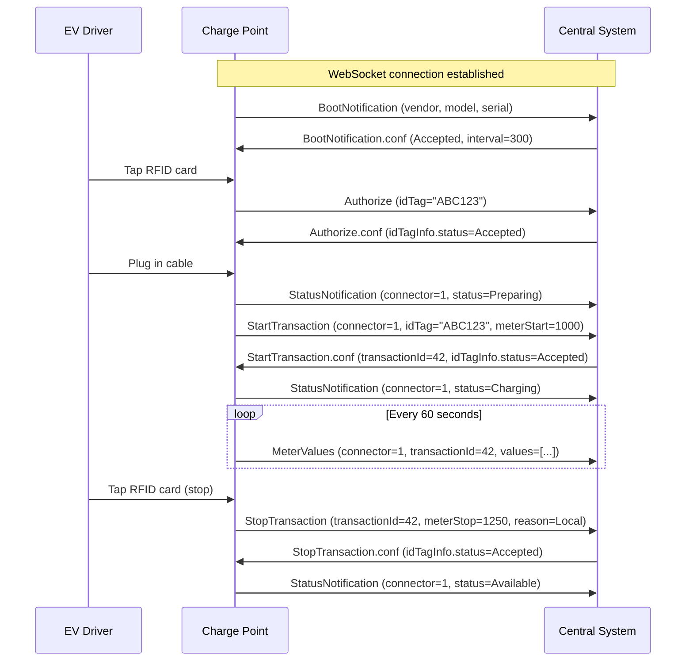
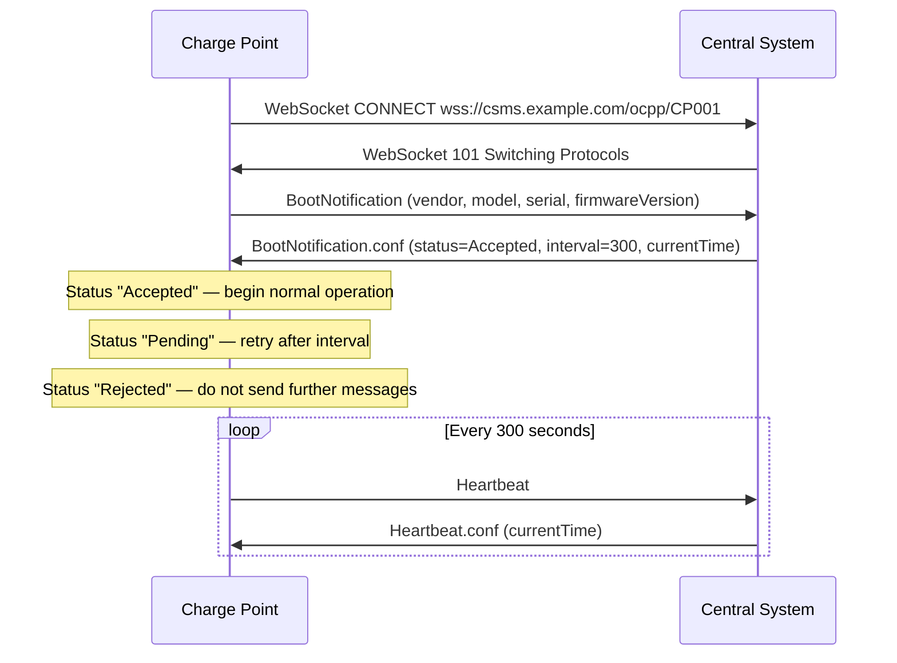
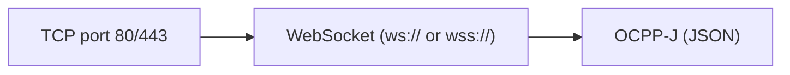

# OCPP (Open Charge Point Protocol)

> **Standard:** [Open Charge Alliance OCPP 2.0.1](https://openchargealliance.org/protocols/open-charge-point-protocol/) | **Layer:** Application (Layer 7) | **Wireshark filter:** `websocket`

OCPP is the dominant open protocol for communication between electric vehicle (EV) charging stations and central management systems (CSMS). Developed by the Open Charge Alliance, it enables operators to remotely monitor, configure, and control charge points -- starting/stopping sessions, collecting meter data, managing firmware, and authorizing users. OCPP 1.6 (the most widely deployed version) supports SOAP or JSON over WebSocket. OCPP 2.0.1 uses JSON over WebSocket exclusively and adds ISO 15118 Plug & Charge, improved security profiles, and a comprehensive device model.

## Architecture



The Charge Point initiates a persistent WebSocket connection to the Central System. The Charge Point identity is encoded in the WebSocket URI path (e.g., `wss://csms.example.com/ocpp/CP001`).

## Message Structure (OCPP-J / JSON)

OCPP-J defines three message types as JSON arrays:

### CALL (Request)



```json
[2, "19223201", "BootNotification", {"chargePointVendor":"Vendor","chargePointModel":"Model"}]
```

### CALLRESULT (Response)



```json
[3, "19223201", {"status":"Accepted","currentTime":"2025-01-15T10:00:00Z","interval":300}]
```

### CALLERROR (Error Response)



```json
[4, "19223201", "InternalError", "An unexpected error occurred", {}]
```

## Message Types

| MessageTypeId | Name | Description |
|---------------|------|-------------|
| 2 | CALL | Request from either party |
| 3 | CALLRESULT | Successful response matching a CALL's UniqueId |
| 4 | CALLERROR | Error response matching a CALL's UniqueId |

## Key Actions (OCPP 1.6)

### Charge Point → Central System

| Action | Description |
|--------|-------------|
| BootNotification | Charge point registers on startup; receives heartbeat interval |
| Heartbeat | Periodic keepalive; Central System returns current time |
| Authorize | Validate an RFID tag or ID token before charging |
| StartTransaction | Report that a charging session has begun (includes meter start) |
| StopTransaction | Report that a charging session has ended (includes meter stop, reason) |
| MeterValues | Periodic or clock-aligned energy/power meter readings |
| StatusNotification | Report connector status changes (Available, Occupied, Faulted, etc.) |
| DiagnosticsStatusNotification | Report diagnostics upload progress |
| FirmwareStatusNotification | Report firmware update progress |

### Central System → Charge Point

| Action | Description |
|--------|-------------|
| RemoteStartTransaction | Remotely start a charging session |
| RemoteStopTransaction | Remotely stop a charging session |
| Reset | Soft or hard reset of the charge point |
| ChangeConfiguration | Change a configuration key (e.g., heartbeat interval) |
| GetConfiguration | Read configuration keys |
| UnlockConnector | Remotely unlock a connector (e.g., stuck cable) |
| UpdateFirmware | Instruct charge point to download and install firmware |
| GetDiagnostics | Request upload of diagnostic logs |
| ChangeAvailability | Set connector to operative or inoperative |
| SetChargingProfile | Apply a charging schedule (power limits over time) |
| ClearChargingProfile | Remove a charging profile |
| TriggerMessage | Request charge point to send a specific message immediately |

## Charging Session Flow



## Boot Notification Flow



## Connector Statuses

| Status | Description |
|--------|-------------|
| Available | Connector is free and operative |
| Preparing | Cable plugged in, awaiting authorization |
| Charging | Actively delivering energy |
| SuspendedEVSE | Charging suspended by charge point (e.g., load balancing) |
| SuspendedEV | Charging suspended by vehicle (battery management) |
| Finishing | Transaction stopping, cable still connected |
| Reserved | Connector reserved for a specific user |
| Unavailable | Connector is inoperative |
| Faulted | Hardware or communication error |

## OCPP 2.0.1 Enhancements

| Feature | Description |
|---------|-------------|
| ISO 15118 (Plug & Charge) | Certificate-based EV authentication -- no RFID needed |
| Device Model | Structured component/variable model replaces flat configuration keys |
| Security Profiles | Four defined security levels (see below) |
| Display Messages | Central system can push messages to charge point display |
| Transaction Events | Richer transaction lifecycle (Started, Updated, Ended) |
| Cost Updates | Real-time running cost display to EV driver |
| Local Authorization Cache | Synchronized authorization list for offline operation |
| Reservations | Reserve a specific EVSE or connector |

## Security Profiles

| Profile | Name | Description |
|---------|------|-------------|
| 0 | Unsecured | No transport security (ws://) -- not recommended |
| 1 | Basic Authentication | HTTP Basic Auth over TLS (wss://) |
| 2 | TLS with Server Certificate | Charge point validates CSMS certificate |
| 3 | TLS with Client Certificate | Mutual TLS -- both sides present X.509 certificates |

## Error Codes

| Code | Description |
|------|-------------|
| NotImplemented | Requested action is not implemented |
| NotSupported | Requested action is recognized but not supported |
| InternalError | Internal error in the receiving party |
| ProtocolError | Payload does not conform to the schema |
| SecurityError | Security policy violation |
| FormationViolation | Malformed message (not valid JSON array) |
| PropertyConstraintViolation | Property value violates a constraint |
| OccurrenceConstraintViolation | Required field missing or extra field present |
| TypeConstraintViolation | Field type does not match schema |
| GenericError | Any other error |

## OCPP 1.6 vs 2.0.1

| Feature | OCPP 1.6 | OCPP 2.0.1 |
|---------|----------|------------|
| Transport | SOAP or JSON/WebSocket | JSON/WebSocket only |
| Configuration | Flat key-value pairs | Structured device model (Component/Variable) |
| ISO 15118 | Not supported | Native Plug & Charge support |
| Security | Basic Auth or TLS | Four defined security profiles |
| Transactions | Start/Stop model | Event-based (Started/Updated/Ended) |
| Display messages | Not supported | Push messages to EVSE screen |
| Smart charging | Basic profiles | Enhanced with cost updates |

## Encapsulation



## Standards

| Document | Title |
|----------|-------|
| [OCPP 2.0.1](https://openchargealliance.org/protocols/open-charge-point-protocol/) | Open Charge Point Protocol 2.0.1 Specification |
| [OCPP 1.6](https://openchargealliance.org/protocols/open-charge-point-protocol/) | OCPP 1.6 (JSON & SOAP editions) -- most widely deployed |
| [ISO 15118](https://www.iso.org/standard/69113.html) | Vehicle-to-Grid Communication Interface |
| [OCPP Security Whitepaper](https://openchargealliance.org/) | Security recommendations for OCPP implementations |

## See Also

- [Modbus](modbus.md) -- alternative industrial protocol (some older EVSE use Modbus)
- [PROFIBUS](profibus.md) -- industrial fieldbus
