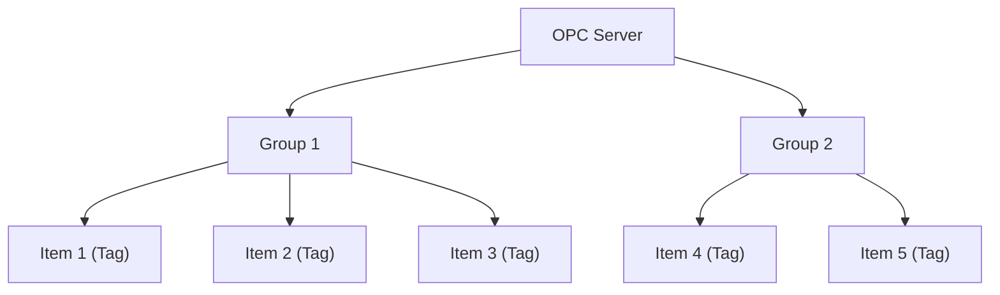
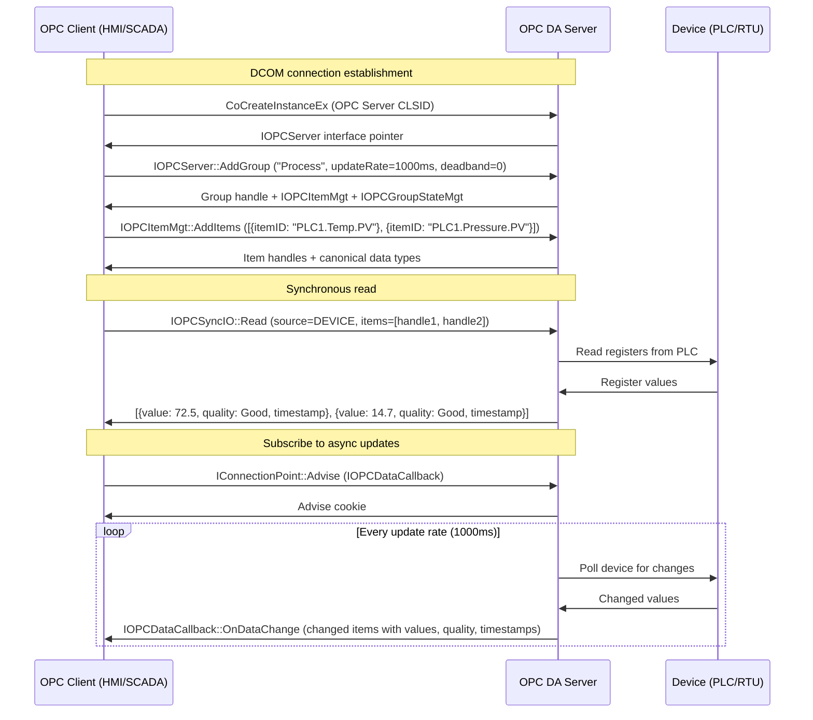
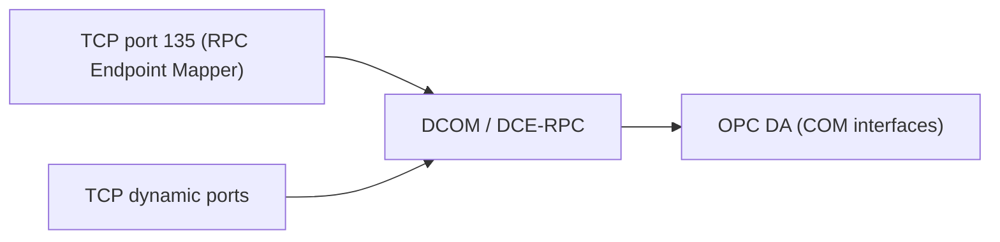

# OPC DA (OPC Data Access / OPC Classic)

> **Standard:** [OPC DA 3.0 Specification (OPC Foundation)](https://opcfoundation.org/developer-tools/specifications-classic) | **Layer:** Application (Layer 7) | **Wireshark filter:** `dcerpc`

OPC Data Access (OPC DA) is a set of COM/DCOM-based specifications for real-time data exchange between industrial automation devices and software applications. Developed by the OPC Foundation starting in 1996, OPC DA became the de facto standard for connecting SCADA, DCS, HMI, and historian systems to PLCs, RTUs, and field devices on Windows platforms. "OPC" originally stood for "OLE for Process Control" (OLE = Object Linking and Embedding). Despite being superseded by OPC UA (Unified Architecture), OPC DA remains widely deployed in legacy industrial environments. OPC DA relies on Microsoft DCOM (Distributed Component Object Model) for network communication, inheriting both its capabilities and its configuration complexity.

## Architecture

OPC DA uses a three-tier object model built on COM:

| Object | Description |
|--------|-------------|
| Server | Represents a connection to an OPC DA server process; manages groups |
| Group | A logical collection of items with shared update rate and deadband; manages items |
| Item | A single data point (tag) — maps to a sensor, register, or variable in the device |

## OPC DA Interfaces (COM)

The OPC DA specification defines these key COM interfaces:

| Interface | Description |
|-----------|-------------|
| `IOPCServer` | Create/remove groups, get server status, browse address space |
| `IOPCItemMgt` | Add, remove, and configure items within a group |
| `IOPCGroupStateMgt` | Get/set group properties (update rate, active state, deadband) |
| `IOPCSyncIO` | Synchronous read/write — blocks until complete |
| `IOPCAsyncIO2` | Asynchronous read/write — results delivered via callback |
| `IOPCDataCallback` | Client-side callback interface for async results and subscription data |
| `IOPCBrowseServerAddressSpace` | Browse available tags in the server's address space |
| `IConnectionPointContainer` | Standard COM interface for event subscription (advise/unadvise) |

## Item Properties

Each OPC item has the following properties:

| Property | Description |
|----------|-------------|
| Item ID | String identifier (tag name, e.g., `PLC1.Temperature.PV`) |
| Access Path | Optional hint for how to reach the item in the device |
| Value | Current data value (stored as a COM VARIANT) |
| Quality | Quality of the value (Good, Bad, Uncertain — with substatus) |
| Timestamp | UTC time when the value was last updated |
| Data Type | Requested/canonical VARIANT type (VT_R4, VT_I2, VT_BOOL, VT_BSTR, etc.) |
| Access Rights | Readable, writable, or both |

## Quality Codes

Quality is a 16-bit field following the OPC quality model:

### Quality Bits

| Value | Quality | Description |
|-------|---------|-------------|
| 00 | Bad | Value is not usable |
| 01 | Uncertain | Value is questionable |
| 10 | N/A | Reserved |
| 11 | Good | Value is reliable |

### Common Substatus Values

| Quality | Substatus | Code | Description |
|---------|-----------|------|-------------|
| Bad | Non-Specific | 0x00 | General bad quality |
| Bad | Config Error | 0x04 | Server configuration error |
| Bad | Not Connected | 0x08 | Input source not connected |
| Bad | Device Failure | 0x0C | Hardware failure detected |
| Bad | Sensor Failure | 0x10 | Sensor calibration failure |
| Bad | Last Known | 0x14 | Communication lost; showing last good value |
| Bad | Comm Failure | 0x18 | Communication failure with device |
| Bad | Out of Service | 0x1C | Item is not in service |
| Uncertain | Non-Specific | 0x40 | General uncertain quality |
| Uncertain | Last Usable | 0x44 | Value is old but may still be valid |
| Uncertain | Sensor Not Accurate | 0x50 | Sensor reading outside normal range |
| Uncertain | Engineering Units Exceeded | 0x54 | Value outside configured limits |
| Uncertain | Sub-Normal | 0x58 | Multiple sources, fewer than required are good |
| Good | Non-Specific | 0xC0 | Value is good |
| Good | Local Override | 0xD8 | Value set locally (manual mode) |

## Data Types (VARIANT Mapping)

OPC DA uses COM VARIANT types for data exchange:

| VARIANT Type | Code | Industrial Use |
|-------------|------|----------------|
| VT_BOOL | 0x000B | Digital I/O, alarms |
| VT_I1 / VT_UI1 | 0x0010 / 0x0011 | 8-bit integer values |
| VT_I2 / VT_UI2 | 0x0002 / 0x0012 | 16-bit registers (Modbus-style) |
| VT_I4 / VT_UI4 | 0x0003 / 0x0013 | 32-bit counters, accumulators |
| VT_R4 | 0x0004 | 32-bit float (temperature, pressure) |
| VT_R8 | 0x0005 | 64-bit float (high-precision measurements) |
| VT_BSTR | 0x0008 | String tags, device descriptions |
| VT_DATE | 0x0007 | Timestamps, schedule data |
| VT_ARRAY \| VT_* | 0x2000+ | Array of any above type |

## Connect, Add Group, Read Flow

## OPC DA Specifications

The OPC Classic family includes several specifications:

| Specification | Description |
|--------------|-------------|
| OPC DA 1.0 | Original Data Access specification (1996) |
| OPC DA 2.05a | Added async I/O, connection points, browse |
| OPC DA 3.0 | Added item deadband, browse filters, keep-alive |
| OPC HDA | Historical Data Access — retrieve time-series history |
| OPC A&E | Alarms and Events — subscribe to alarms, events, conditions |
| OPC DX | Data Exchange — server-to-server data transfer |
| OPC XML-DA | XML/SOAP-based Data Access (web services variant) |
| OPC Commands | Execute commands on devices |

## DCOM Security Configuration

OPC DA's reliance on DCOM requires careful security configuration:

| Setting | Description |
|---------|-------------|
| Launch Permissions | Which users/groups can start the OPC server process |
| Access Permissions | Which users/groups can connect to a running OPC server |
| Authentication Level | None, Connect, Call, Packet, Packet Integrity, Packet Privacy |
| Identity | Account the OPC server runs as (Interactive User, Local System, custom) |
| DCOM Port Range | Configurable dynamic RPC port range (default: 1024-65535) |
| Firewall | Requires TCP 135 (RPC Endpoint Mapper) + dynamic ports |

## OPC DA vs OPC UA

| Feature | OPC DA (Classic) | OPC UA |
|---------|-----------------|--------|
| Transport | DCOM/DCE-RPC (Windows only) | TCP binary, HTTPS, WebSocket (cross-platform) |
| Platform | Windows only | Windows, Linux, macOS, embedded |
| Security | DCOM security (NTLM/Kerberos) | X.509 certificates, user tokens, encryption |
| Data model | Flat tag namespace (Server/Group/Item) | Rich information model (nodes, references, types) |
| Discovery | DCOM OPCEnum service | Local Discovery Server (LDS), Global Discovery Server (GDS) |
| Historical data | Separate OPC HDA spec | Integrated into UA (Historical Access) |
| Alarms | Separate OPC A&E spec | Integrated into UA (Alarms and Conditions) |
| Firewall traversal | Difficult (dynamic RPC ports) | Single port (4840 default) |
| Configuration | DCOM settings (dcomcnfg), error-prone | Certificate exchange, more consistent |
| Performance | Fast on local network | Comparable; pub/sub mode for high-throughput |
| Standard | OPC Foundation proprietary | IEC 62541 (international standard) |

## Encapsulation

## Standards

| Document | Title |
|----------|-------|
| [OPC DA 3.0](https://opcfoundation.org/developer-tools/specifications-classic) | OPC Data Access Custom Interface Specification 3.00 |
| [OPC DA 2.05a](https://opcfoundation.org/developer-tools/specifications-classic) | OPC Data Access Custom Interface Specification 2.05a |
| [OPC Common](https://opcfoundation.org/developer-tools/specifications-classic) | OPC Common Definitions and Interfaces |
| [MS-DCOM](https://learn.microsoft.com/en-us/openspecs/windows_protocols/ms-dcom/) | Microsoft Distributed Component Object Model Protocol |

## See Also

- [Modbus](modbus.md) -- simpler industrial protocol often accessed via OPC DA servers
- [PROFIBUS](profibus.md) -- fieldbus protocol commonly wrapped by OPC DA
