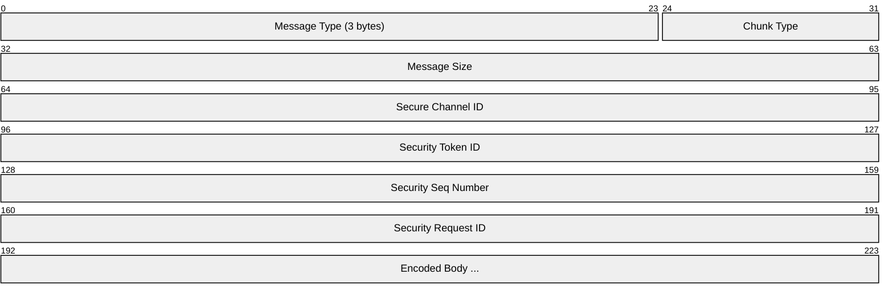
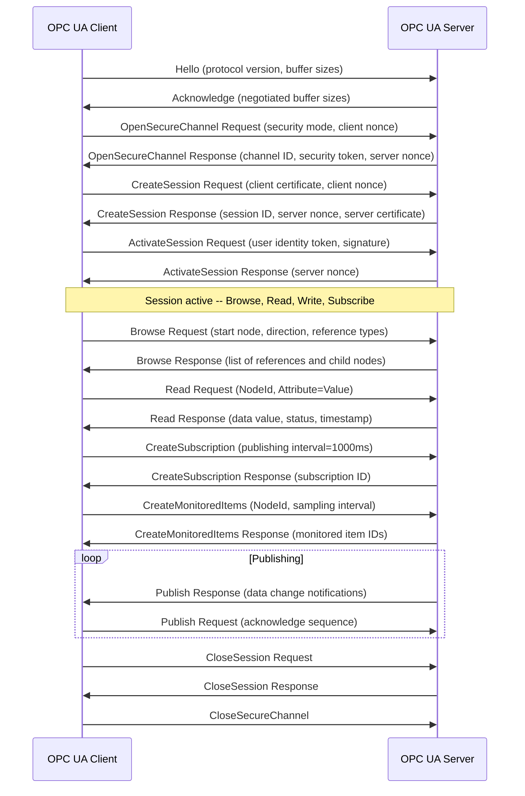
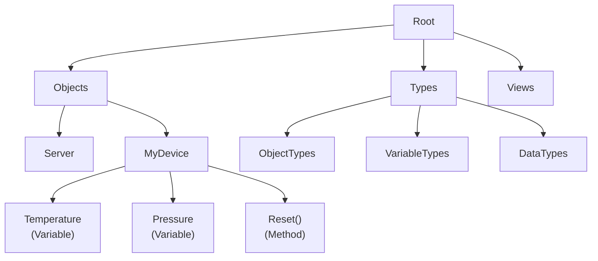
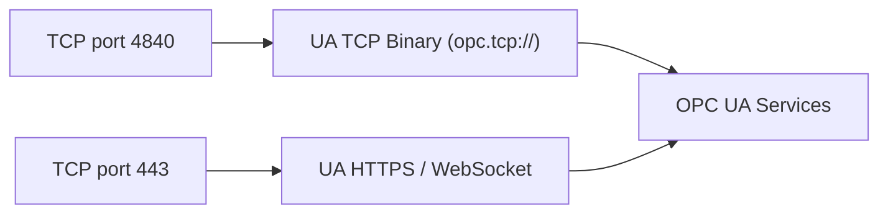

# OPC UA (Open Platform Communications Unified Architecture)

> **Standard:** [IEC 62541](https://opcfoundation.org/about/opc-technologies/opc-ua/) | **Layer:** Application (Layer 7) | **Wireshark filter:** `opcua`

OPC UA is a platform-independent, service-oriented architecture for industrial communication. It provides secure, reliable transport of both real-time data and historical data between sensors, PLCs, SCADA systems, MES, ERP, and cloud platforms. Unlike its predecessor OPC Classic (which was tightly coupled to Windows COM/DCOM), OPC UA runs on any operating system and supports two transport bindings: a high-performance binary protocol (`opc.tcp://`) and HTTPS for firewall-friendly deployments. OPC UA includes a rich information model, built-in security (X.509 certificates, encryption, signing), and is widely adopted as the interoperability standard for Industry 4.0 and IIoT.

## Transport Bindings

| Binding | URL Scheme | Port | Description |
|---------|-----------|------|-------------|
| UA TCP Binary | `opc.tcp://` | 4840 (default) | Native binary encoding, highest performance |
| HTTPS | `https://` | 443 | JSON or binary over HTTPS, firewall-friendly |
| WebSocket | `opc.wss://` | 443 | Binary over WebSockets (added in v1.04) |

## Message Header (UA Secure Conversation)

## Key Fields

| Field | Size | Description |
|-------|------|-------------|
| Message Type | 3 bytes | Three ASCII characters identifying the message (HEL, ACK, OPN, CLO, MSG) |
| Chunk Type | 1 byte | 'F' = final, 'C' = intermediate chunk, 'A' = abort |
| Message Size | 4 bytes | Total size of the message including header |
| Secure Channel ID | 4 bytes | Identifies the secure channel (assigned by server) |
| Security Token ID | 4 bytes | Identifies the security token for this message |
| Security Seq Number | 4 bytes | Monotonically increasing sequence number (anti-replay) |
| Security Request ID | 4 bytes | Matches requests to responses |

## Message Types

| Type | Name | Description |
|------|------|-------------|
| HEL | Hello | Client initiates connection, declares buffer sizes |
| ACK | Acknowledge | Server acknowledges Hello, confirms buffer sizes |
| OPN | OpenSecureChannel | Establish or renew a secure channel (key exchange) |
| CLO | CloseSecureChannel | Tear down the secure channel |
| MSG | Message | Application-layer service request or response |
| ERR | Error | Transport-level error |

## Services

OPC UA defines service sets grouped by function:

### Discovery

| Service | Description |
|---------|-------------|
| FindServers | Locate OPC UA servers on the network |
| GetEndpoints | Query a server's supported endpoints and security policies |

### SecureChannel

| Service | Description |
|---------|-------------|
| OpenSecureChannel | Create or renew a secure channel (nonces, security mode) |
| CloseSecureChannel | Release the secure channel |

### Session

| Service | Description |
|---------|-------------|
| CreateSession | Establish an application session (returns server nonce) |
| ActivateSession | Authenticate the user (username/password, X.509, token) |
| CloseSession | End the session |

### Node Management

| Service | Description |
|---------|-------------|
| Browse | Navigate the address space (discover nodes and references) |
| BrowseNext | Continue a Browse with continuation point |
| TranslateBrowsePathsToNodeIds | Resolve a path (e.g., "Objects/MyDevice/Temperature") to a NodeId |

### Attribute

| Service | Description |
|---------|-------------|
| Read | Read one or more attribute values from nodes |
| Write | Write one or more attribute values to nodes |
| HistoryRead | Read historical data or events |
| HistoryUpdate | Insert, replace, or delete historical data |

### Subscription / Monitored Items

| Service | Description |
|---------|-------------|
| CreateSubscription | Set up a subscription with publishing interval |
| CreateMonitoredItems | Attach items to a subscription (with sampling interval, filter) |
| Publish | Client requests queued notifications from the server |
| Republish | Re-request a missed notification |
| ModifySubscription | Change subscription parameters |
| DeleteSubscription | Remove a subscription |

### Method

| Service | Description |
|---------|-------------|
| Call | Invoke a method on a node (RPC-style) |

## Session Establishment

## Information Model

OPC UA organizes data in an address space of typed nodes connected by references:

### Node Classes

| Node Class | Description |
|------------|-------------|
| Object | Container or physical/logical thing (e.g., a device, folder) |
| Variable | Holds a data value (e.g., temperature, setpoint) |
| Method | Callable function on an object |
| ObjectType | Defines the structure and behavior of objects |
| VariableType | Defines the type of variable values |
| ReferenceType | Defines the semantics of a reference |
| DataType | Defines data types (Int32, String, custom structures) |
| View | A subset of the address space |

### Node Attributes

| Attribute | Description |
|-----------|-------------|
| NodeId | Unique identifier (namespace index + identifier) |
| BrowseName | Non-localized name for browsing |
| DisplayName | Localized human-readable name |
| NodeClass | Object, Variable, Method, etc. |
| Value | Current data value (Variables only) |
| DataType | Data type of the value |
| AccessLevel | Read, Write, HistoryRead, etc. |

### Address Space Structure

## Security Model

OPC UA security operates at two layers:

### Transport Security

| Security Mode | Signing | Encryption | Description |
|--------------|---------|------------|-------------|
| None | No | No | No security (testing only) |
| Sign | Yes | No | Messages are signed but not encrypted |
| SignAndEncrypt | Yes | Yes | Full protection (production default) |

### Security Policies

| Policy URI | Algorithm | Key Length |
|-----------|-----------|------------|
| None | -- | -- |
| Basic256Sha256 | AES-256-CBC + RSA-SHA256 | 2048+ bit |
| Aes128_Sha256_RsaOaep | AES-128-CBC + RSA-SHA256 | 2048+ bit |
| Aes256_Sha256_RsaPss | AES-256-CBC + RSA-PSS-SHA256 | 2048+ bit |

### User Authentication

| Token Type | Description |
|------------|-------------|
| Anonymous | No user identity |
| UserName | Username and password |
| X509 | Client X.509 certificate |
| IssuedToken | External token (e.g., Kerberos, JWT) |

## Encapsulation

## Standards

| Document | Title |
|----------|-------|
| [IEC 62541](https://opcfoundation.org/about/opc-technologies/opc-ua/) | OPC Unified Architecture (multi-part) |
| [IEC 62541-3](https://opcfoundation.org/) | Address Space Model |
| [IEC 62541-4](https://opcfoundation.org/) | Services |
| [IEC 62541-6](https://opcfoundation.org/) | Mappings (Binary, XML, HTTPS) |
| [IEC 62541-7](https://opcfoundation.org/) | Profiles |
| [OPC 10000 Series](https://opcfoundation.org/developer-tools/documents) | OPC Foundation Specifications |

## See Also

- [Modbus](modbus.md) -- simple register-based industrial protocol
- [PROFINET](profinet.md) -- Siemens real-time industrial Ethernet
- [EtherNet/IP](ethernetip.md) -- Rockwell/ODVA industrial Ethernet
- [MQTT](../messaging/mqtt.md) -- lightweight pub/sub often paired with OPC UA in IIoT
