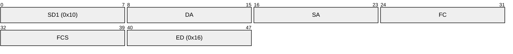
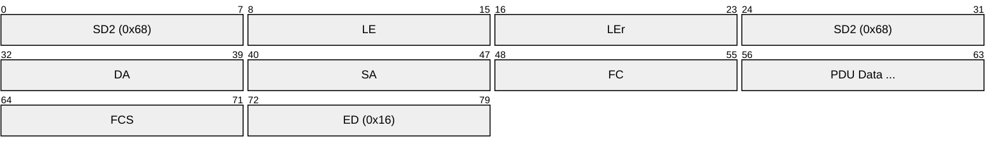
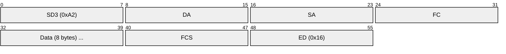
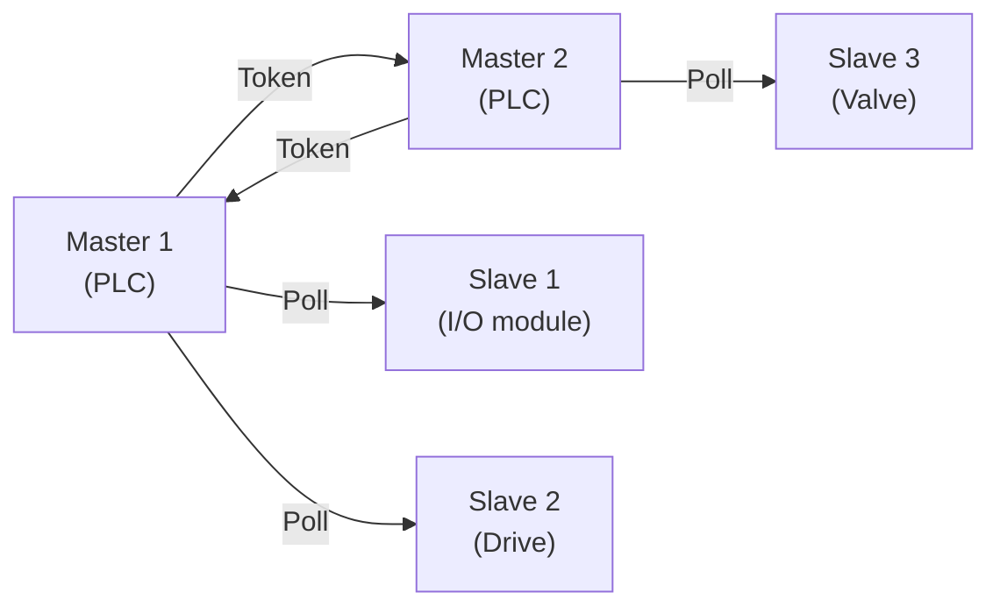
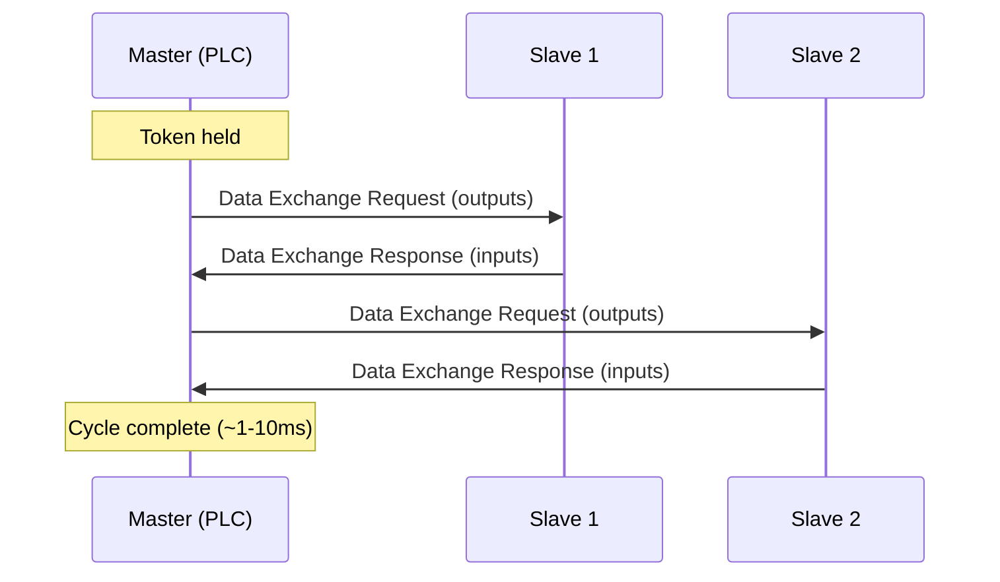

# PROFIBUS (Process Field Bus)

> **Standard:** [IEC 61158 / IEC 61784](https://www.profibus.com/technology/profibus) | **Layer:** Physical / Data Link / Application | **Wireshark filter:** `profibus`

PROFIBUS is a fieldbus standard for industrial automation, connecting PLCs, sensors, actuators, drives, and remote I/O. It was developed in Germany in the late 1980s and became one of the most widely deployed industrial networks. PROFIBUS comes in two main variants: PROFIBUS DP (Decentralized Peripherals) for fast I/O communication, and PROFIBUS PA (Process Automation) for process instrumentation in hazardous areas. It uses a hybrid token-passing and master-slave access scheme over RS-485.

## Variants

| Variant | Physical Layer | Speed | Application |
|---------|---------------|-------|-------------|
| PROFIBUS DP | [RS-485](../serial/rs485.md) | 9.6 kbps - 12 Mbps | Factory automation, fast I/O |
| PROFIBUS PA | MBP (Manchester, IEC 61158-2) | 31.25 kbps | Process automation, intrinsically safe |
| PROFIBUS FMS | RS-485 | 9.6 kbps - 1.5 Mbps | Cell-level communication (legacy) |

## Frame (Telegram) Types

PROFIBUS defines four frame formats:

### SD1 — Fixed Length, No Data

### SD2 — Variable Length, With Data

### SD3 — Fixed Length, 8 Data Bytes

### SD4 — Token

## Key Fields

| Field | Size | Description |
|-------|------|-------------|
| SD | 8 bits | Start Delimiter (identifies frame type) |
| DA | 8 bits | Destination Address (0-126, 127 = broadcast) |
| SA | 8 bits | Source Address (0-125) |
| FC | 8 bits | Frame Control (frame type, FCV, FCB) |
| LE / LEr | 8 bits each | Length and repeated length (SD2 — for validation) |
| PDU | Variable | Protocol Data Unit (user data + DSAP/SSAP) |
| FCS | 8 bits | Frame Check Sequence (sum of DA+SA+FC+PDU mod 256) |
| ED | 8 bits | End Delimiter (always 0x16) |

## Field Details

### Frame Control (FC)

| Bit | Name | Description |
|-----|------|-------------|
| 7-6 | Frame Type | 00=Request, 01=Ack/Response, 10=Reserved, 11=Reserved |
| 5 | FCV | Frame Count Bit Valid |
| 4 | FCB/ACD | Frame Count Bit (request) / Access Delay (response) |
| 3-0 | Function Code | SAP, data exchange type |

### Addresses

| Address | Purpose |
|---------|---------|
| 0-125 | Station addresses (masters and slaves) |
| 126 | Default address (unconfigured devices) |
| 127 | Broadcast / global |

### Bus Access — Token Passing + Master-Slave

- **Masters** (Class 1/2) pass a token ring among themselves
- When a master holds the token, it polls its **slaves**
- Slaves only respond when polled — they never initiate

### PROFIBUS DP Cycle

### Speed vs Distance

| Bit Rate | Max Segment Length |
|----------|-------------------|
| 9.6 kbps | 1200 m |
| 93.75 kbps | 1200 m |
| 187.5 kbps | 1000 m |
| 500 kbps | 400 m |
| 1.5 Mbps | 200 m |
| 3 Mbps | 100 m |
| 6 Mbps | 100 m |
| 12 Mbps | 100 m |

Up to 3 repeaters can extend the total network to 4 segments.

## GSD Files

Each PROFIBUS device provides a GSD (General Station Description) file that describes its configuration parameters, supported data lengths, and diagnostic capabilities. The master's configuration tool imports GSD files to set up the network.

## Standards

| Document | Title |
|----------|-------|
| [IEC 61158](https://www.iec.ch/) | Industrial communication networks — Fieldbus specifications |
| [IEC 61784-1](https://www.iec.ch/) | Communication profile family 3 (PROFIBUS) |
| [PROFIBUS Specification](https://www.profibus.com/technology/profibus) | PROFIBUS International technical documentation |

## See Also

- [RS-485](../serial/rs485.md) — physical layer for PROFIBUS DP
- [CAN](../bus/can.md) — alternative industrial bus
- [Ethernet](../link-layer/ethernet.md) — PROFINET is the Ethernet-based successor
