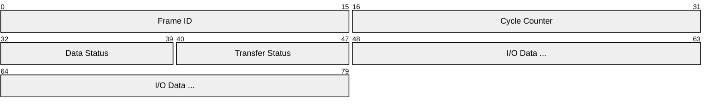
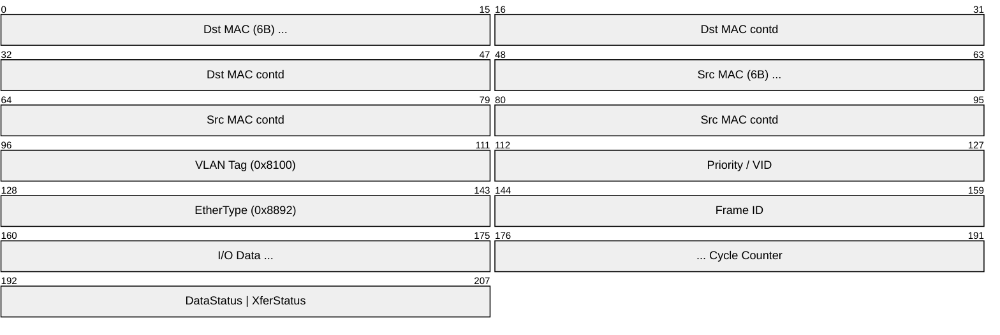
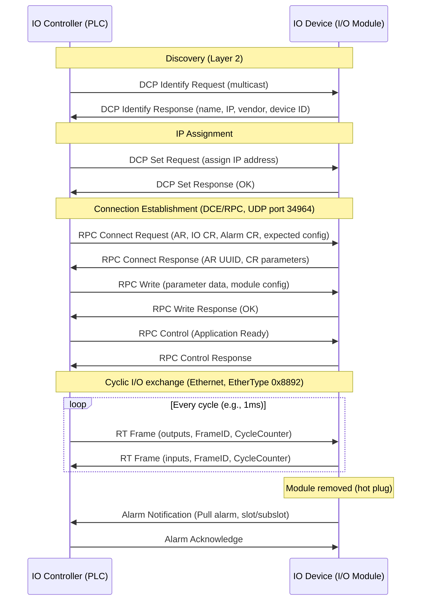
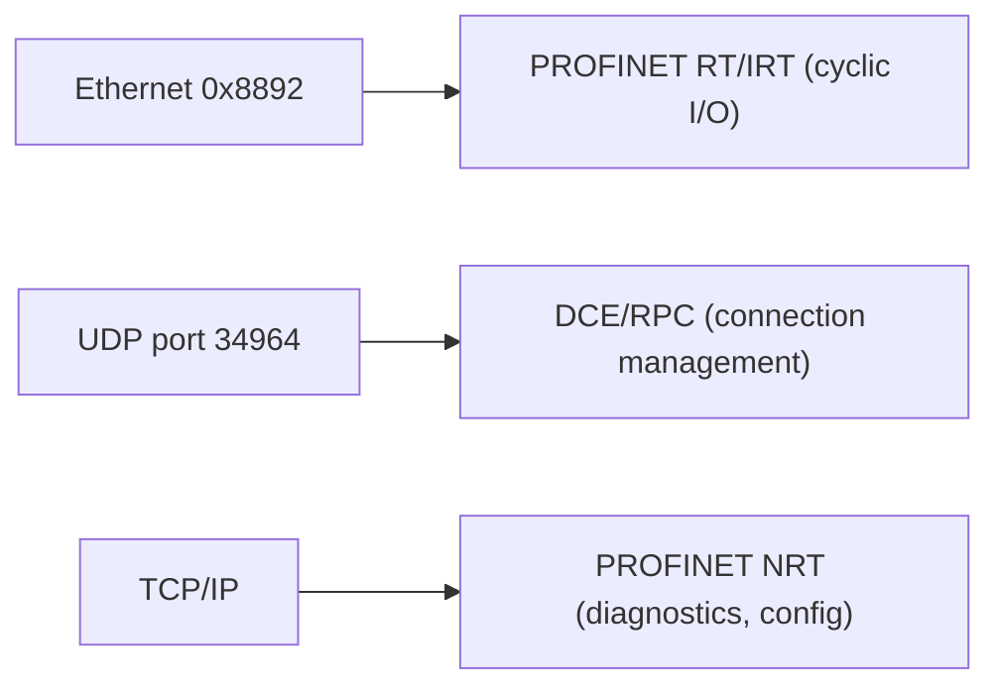

# PROFINET (Process Field Network)

> **Standard:** [IEC 61158 / IEC 61784](https://www.profibus.com/technology/profinet) | **Layer:** Application (Layer 7) / Data Link (Layer 2) | **Wireshark filter:** `pn_rt` or `pn_io`

PROFINET is an industrial Ethernet standard developed by Siemens and PROFIBUS International (PI) for real-time automation. It is the Ethernet-based successor to PROFIBUS and the most widely deployed industrial Ethernet protocol in Europe. PROFINET defines three performance classes: NRT (non-real-time, standard TCP/IP), RT (real-time, prioritized Ethernet frames), and IRT (isochronous real-time, hardware-synchronized for motion control with jitter under 1 microsecond). PROFINET uses standard Ethernet hardware for NRT and RT, while IRT requires special ASICs. Device descriptions are provided through GSD (General Station Description) files in GSDML (XML) format.

## Performance Classes

| Class | Name | Cycle Time | Jitter | Transport | Use Case |
|-------|------|-----------|--------|-----------|----------|
| NRT | Non-Real-Time | 100+ ms | Unbounded | Standard TCP/IP | Diagnostics, configuration, parameterization |
| RT (Class 1) | Real-Time | 1-10 ms | ~1 ms | VLAN-prioritized Ethernet frames | Standard I/O, typical factory automation |
| IRT (Class 3) | Isochronous Real-Time | 250 us - 1 ms | < 1 us | Time-slotted Ethernet (hardware) | Motion control, synchronized drives |

## RT Frame Structure

PROFINET RT frames are standard Ethernet frames (EtherType 0x8892) with VLAN priority tagging:

The full Ethernet frame wrapping:

## Key Fields

| Field | Size | Description |
|-------|------|-------------|
| EtherType | 16 bits | 0x8892 (PROFINET) |
| Frame ID | 16 bits | Identifies the data relationship (I/O CR, alarm, etc.) |
| I/O Data | Variable | Process data (inputs or outputs) |
| Cycle Counter | 16 bits | Incrementing counter for freshness detection |
| Data Status | 8 bits | Validity and state of the I/O data |
| Transfer Status | 8 bits | Provider/consumer transfer status |

## Field Details

### Frame ID Ranges

| Range | Name | Description |
|-------|------|-------------|
| 0x0000-0x00FF | Reserved | Not used |
| 0x0100-0x7FFF | RT Class 3 (IRT) | Isochronous real-time frames |
| 0x8000-0xBFFF | RT Class 1 (RT) | Real-time cyclic I/O |
| 0xC000-0xFBFF | RT Class 1 (RT) | Real-time cyclic I/O (multicast) |
| 0xFC01 | Alarm High | High-priority alarms |
| 0xFE01 | Alarm Low | Low-priority alarms |
| 0xFEFC | DCP Hello | Discovery and Configuration Protocol |
| 0xFEFD | DCP Get/Set | DCP requests and responses |
| 0xFEFE | DCP Identify | DCP device identification |
| 0xFEFF | DCP Identify Response | DCP identification response |

### Data Status

| Bit | Name | Description |
|-----|------|-------------|
| 0 | State | 0 = backup, 1 = primary |
| 1 | Redundancy | 0 = non-redundant, 1 = redundant |
| 2 | Data Valid | 0 = invalid, 1 = valid |
| 4 | Provider State | 0 = stop, 1 = run |
| 5 | Station Problem Indicator | 0 = problem detected, 1 = OK |

## Communication Relationships (CR)

PROFINET uses Application Relationships (AR) and Communication Relationships (CR) to manage connections:

| CR Type | Description |
|---------|-------------|
| IO CR | Cyclic I/O data exchange (RT or IRT) |
| Record Data CR | Acyclic read/write of parameters (via RPC) |
| Alarm CR | Alarm notifications (process, diagnostic, pull/plug) |

## Connection Establishment (Context Management)

PROFINET uses DCE/RPC (Distributed Computing Environment / Remote Procedure Call) over UDP for connection management:

## Discovery and Configuration Protocol (DCP)

DCP operates at Layer 2 (no IP required) for device discovery and IP assignment:

| Service | Description |
|---------|-------------|
| Identify | Multicast query to find devices by name or parameters |
| Get | Read device parameters (name, IP, vendor, device type) |
| Set | Assign IP address, device name, or reset to factory |
| Hello | Announcement sent by a device at startup |

## Device Model

| Concept | Description |
|---------|-------------|
| IO Controller | Typically a PLC; initiates connections and sends outputs |
| IO Device | Field device (I/O module, drive, sensor) providing inputs |
| IO Supervisor | Engineering station for diagnostics and commissioning |
| Slot / Subslot | Modular addressing (slot = module, subslot = channel) |
| Station Name | Unique DNS-style name assigned to each device |

## GSD / GSDML Files

Each PROFINET device provides a GSDML file (GSD Markup Language, XML-based) describing:
- Device identity (vendor ID, device ID, hardware/firmware versions)
- Available modules and submodules
- Supported I/O data sizes and cycle times
- Diagnostic capabilities and alarms
- IRT support and port configuration

The IO Controller's engineering tool imports GSDML files to configure the network.

## IRT (Isochronous Real-Time)

IRT reserves time slots in the Ethernet frame cycle for deterministic delivery:

| Phase | Description |
|-------|-------------|
| IRT Phase (red) | Reserved, time-slotted PROFINET IRT frames (hardware-forwarded) |
| RT Phase (orange) | Standard PROFINET RT frames (prioritized) |
| NRT Phase (green) | Standard TCP/IP traffic (best effort) |

IRT requires PROFINET-capable switches with hardware support for time-slot synchronization (PTCP -- Precision Transparent Clock Protocol).

## Encapsulation

## Standards

| Document | Title |
|----------|-------|
| [IEC 61158](https://www.iec.ch/) | Industrial communication networks -- Fieldbus specifications |
| [IEC 61784-2](https://www.iec.ch/) | Communication profile family 3 (PROFINET) |
| [PROFINET Specification](https://www.profibus.com/technology/profinet) | PI (PROFIBUS & PROFINET International) technical documentation |
| [IEC 61158-5-10](https://www.iec.ch/) | PROFINET IO application layer |
| [IEC 61158-6-10](https://www.iec.ch/) | PROFINET IO application layer protocol specification |

## See Also

- [EtherNet/IP](ethernetip.md) -- ODVA/Rockwell industrial Ethernet (comparable to PROFINET)
- [PROFIBUS](profibus.md) -- predecessor fieldbus (RS-485 based)
- [OPC UA](opcua.md) -- platform-independent industrial interoperability
- [Ethernet](../link-layer/ethernet.md) -- underlying data link layer
- [EtherCAT](../robotics/ethercat.md) -- Beckhoff real-time Ethernet (processing on the fly)
