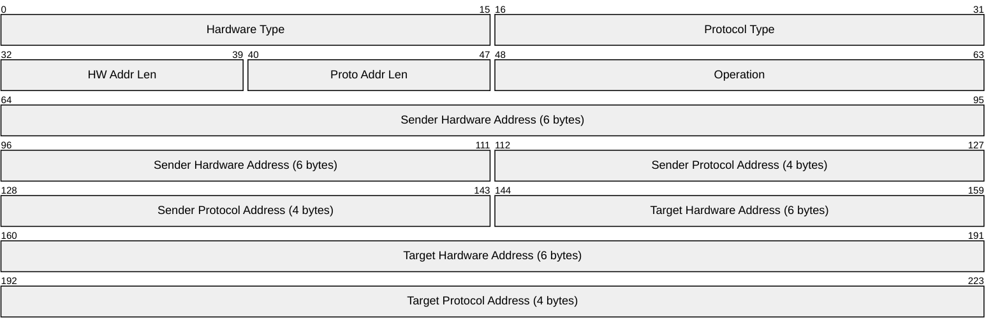

# ARP (Address Resolution Protocol)

> **Standard:** [RFC 826](https://www.rfc-editor.org/rfc/rfc826) | **Layer:** Data Link (Layer 2) | **Wireshark filter:** `arp`

ARP maps a network-layer address (IPv4) to a link-layer address (MAC). When a host needs to send a packet to an IP address on the local network, it broadcasts an ARP request asking "who has this IP?" The owner replies with its MAC address, which the sender caches for future use. ARP is essential for IPv4 over Ethernet but is not used with IPv6, which replaces it with Neighbor Discovery Protocol (NDP via ICMPv6).

## Packet

The diagram above shows ARP for IPv4 over Ethernet (the most common case). The address fields are variable-length in the general specification, sized by the HW Addr Len and Proto Addr Len fields.

## Key Fields

| Field | Size | Description |
|-------|------|-------------|
| Hardware Type | 16 bits | Link-layer type (1 = Ethernet) |
| Protocol Type | 16 bits | Network-layer protocol (0x0800 = IPv4) |
| HW Addr Len | 8 bits | Length of hardware address in bytes (6 for Ethernet) |
| Proto Addr Len | 8 bits | Length of protocol address in bytes (4 for IPv4) |
| Operation | 16 bits | ARP operation code |
| Sender HW Address | Variable | MAC address of the sender |
| Sender Proto Address | Variable | IP address of the sender |
| Target HW Address | Variable | MAC address of the target (zero in requests) |
| Target Proto Address | Variable | IP address of the target |

## Field Details

### Operation

| Value | Meaning |
|-------|---------|
| 1 | ARP Request |
| 2 | ARP Reply |
| 3 | RARP Request |
| 4 | RARP Reply |
| 5 | DRARP Request |
| 6 | DRARP Reply |
| 8 | InARP Request |
| 9 | InARP Reply |

### Hardware Type

| Value | Type |
|-------|------|
| 1 | Ethernet |
| 6 | IEEE 802 |
| 15 | Frame Relay |
| 20 | Serial Line |

### Gratuitous ARP

A host may send an ARP reply for its own IP address without being asked. This is used to:
- Announce a new IP-to-MAC mapping (e.g., after a failover)
- Detect IP address conflicts
- Update stale ARP caches on the network

## Encapsulation

ARP packets are carried directly in Ethernet frames with EtherType `0x0806`. ARP is not carried over IP — it operates below IP to resolve the addresses IP needs.

## Standards

| Document | Title |
|----------|-------|
| [RFC 826](https://www.rfc-editor.org/rfc/rfc826) | An Ethernet Address Resolution Protocol |
| [RFC 5227](https://www.rfc-editor.org/rfc/rfc5227) | IPv4 Address Conflict Detection |
| [RFC 5494](https://www.rfc-editor.org/rfc/rfc5494) | IANA Allocation Guidelines for ARP |

## See Also

- [Ethernet](ethernet.md)
- [IPv4](../network-layer/ip.md)
- [IPv6](../network-layer/ipv6.md) — uses NDP instead of ARP
