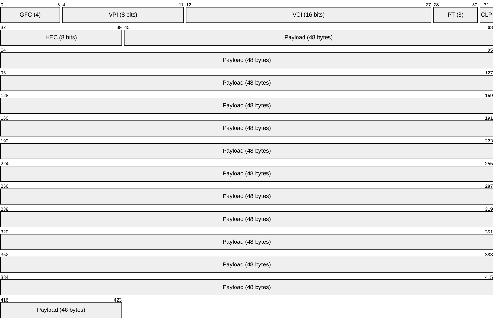
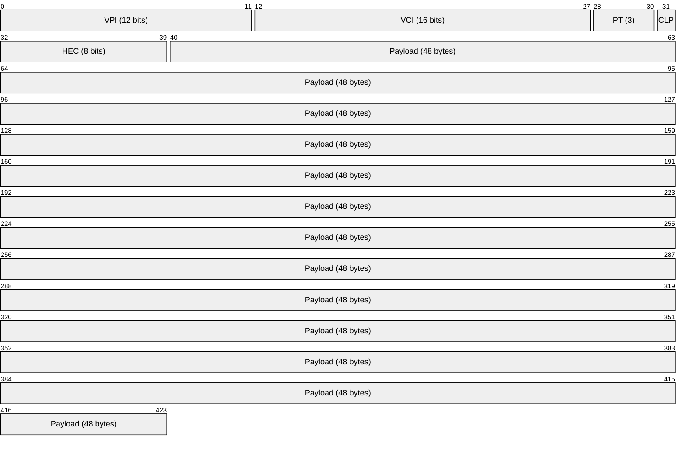
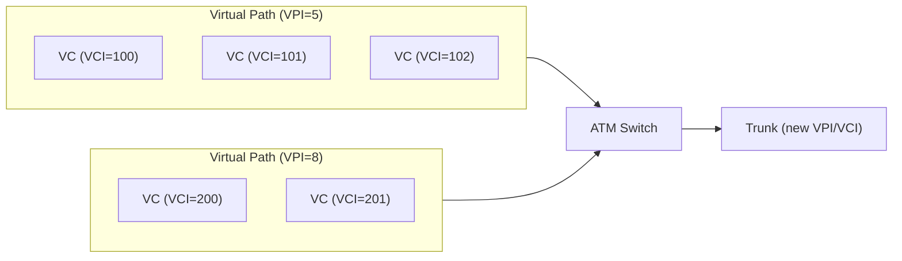
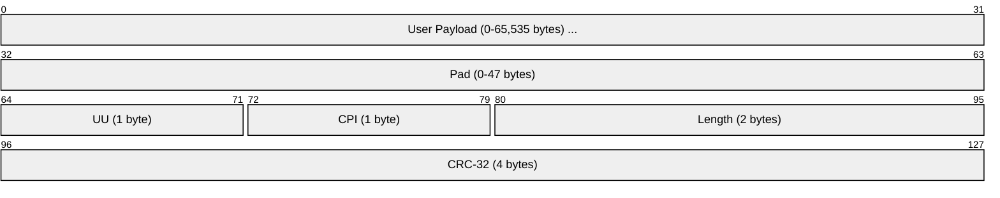
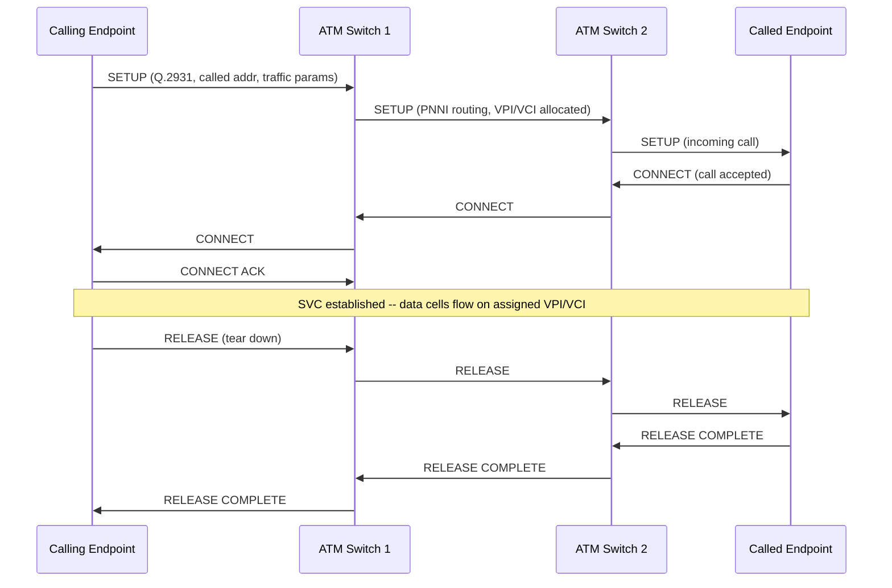
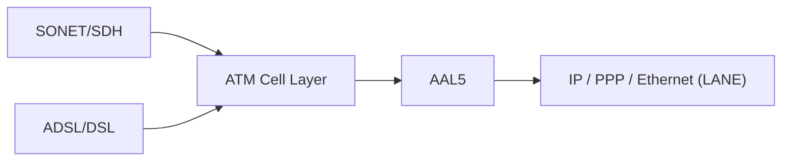

# ATM (Asynchronous Transfer Mode)

> **Standard:** [ITU-T I.361](https://www.itu.int/rec/T-REC-I.361) | **Layer:** Data Link (Layer 2) | **Wireshark filter:** `atm`

ATM is a cell-based switching protocol that transports data in fixed-size 53-byte cells (5-byte header + 48-byte payload). Developed in the late 1980s as the backbone of Broadband ISDN (B-ISDN), ATM was designed to carry voice, video, and data over a single network using hardware-based switching with deterministic latency. ATM dominated telco backbone networks and DSL access in the 1990s but was ultimately displaced by MPLS in the core and Ethernet in the LAN. Its legacy persists in DSL (ADSL uses ATM cells) and in concepts it pioneered such as QoS traffic classes and virtual circuit switching.

## UNI Cell (User-Network Interface)

## NNI Cell (Network-Network Interface)

The key difference: UNI cells have a 4-bit GFC field and 8-bit VPI. NNI cells eliminate GFC and expand VPI to 12 bits, providing a larger switching space for inter-switch trunks.

## Key Fields

| Field | Size | Description |
|-------|------|-------------|
| GFC | 4 bits | Generic Flow Control (UNI only) -- local flow control, rarely used |
| VPI | 8 bits (UNI) / 12 bits (NNI) | Virtual Path Identifier -- first level of the switching hierarchy |
| VCI | 16 bits | Virtual Channel Identifier -- second level, identifies an individual connection within a VP |
| PT | 3 bits | Payload Type -- distinguishes user data from OAM cells |
| CLP | 1 bit | Cell Loss Priority -- 1 = cell may be dropped during congestion |
| HEC | 8 bits | Header Error Control -- CRC-8 over the header, can correct single-bit errors |

## Payload Type (PT)

| PT Value | Meaning |
|----------|---------|
| 000 | User data, no congestion, SDU type 0 |
| 001 | User data, no congestion, SDU type 1 |
| 010 | User data, congestion experienced, SDU type 0 |
| 011 | User data, congestion experienced, SDU type 1 |
| 100 | OAM F5 segment (VC-level management, this segment only) |
| 101 | OAM F5 end-to-end (VC-level management, full path) |
| 110 | Resource management cell |
| 111 | Reserved |

## Reserved VPI/VCI Values

| VPI | VCI | Purpose |
|-----|-----|---------|
| 0 | 0 | Idle / unassigned cell |
| 0 | 5 | Signaling (Q.2931) |
| 0 | 16 | ILMI (Integrated Local Management Interface) |
| X | 3 | OAM F4 segment (VP-level) |
| X | 4 | OAM F4 end-to-end (VP-level) |

## VPI/VCI Switching Hierarchy

ATM uses a two-level switching hierarchy. A Virtual Path (VP) is a bundle of Virtual Channels (VCs), allowing network operators to switch entire bundles at VP cross-connects without examining individual VCI values:

## AAL (ATM Adaptation Layers)

AAL layers segment upper-layer data into 48-byte cell payloads and reassemble on the receiving side:

| AAL | Traffic Type | Use Case | Payload Details |
|-----|-------------|----------|-----------------|
| AAL1 | CBR (constant bit rate) | Circuit emulation (T1/E1 over ATM) | 47 bytes data + 1 byte SAR header (SN + SNP) |
| AAL2 | VBR-rt (variable bit rate, real-time) | Low-rate voice, multiplexes multiple short packets per cell | CPS packets with CID, LI, UUI, HEC fields |
| AAL3/4 | VBR (originally separate, merged) | Variable-length data with MID multiplexing | MID field allows interleaved sessions on one VCI |
| AAL5 | Best-effort data | IP over ATM, DSL (most common) | CPCS-PDU with pad, UU, CPI, length, CRC-32 |

### AAL5 CPCS-PDU

AAL5 is by far the most widely used adaptation layer. The user payload is padded to a 48-byte boundary and a trailer is appended:

| Field | Size | Description |
|-------|------|-------------|
| User Payload | 0-65,535 bytes | Upper-layer PDU (e.g., IP packet) |
| Pad | 0-47 bytes | Padding to align trailer on 48-byte cell boundary |
| UU | 1 byte | CPCS User-to-User indication |
| CPI | 1 byte | Common Part Indicator (alignment, usually 0x00) |
| Length | 2 bytes | Length of the user payload (not including pad or trailer) |
| CRC-32 | 4 bytes | CRC over payload + pad + UU + CPI + Length |

The entire CPCS-PDU is segmented into 48-byte chunks, each placed in an ATM cell. The last cell is marked with PT bit 0 set to 1 (SDU type 1) to signal end of PDU.

## Traffic Classes

| Class | Name | Description |
|-------|------|-------------|
| CBR | Constant Bit Rate | Fixed bandwidth, low latency (voice, video, circuit emulation) |
| rt-VBR | Real-Time Variable Bit Rate | Bursty real-time traffic with peak/sustained rate guarantees |
| nrt-VBR | Non-Real-Time VBR | Bursty data with bandwidth guarantee but relaxed delay |
| ABR | Available Bit Rate | Flow-controlled best-effort with minimum rate guarantee |
| UBR | Unspecified Bit Rate | Pure best-effort, no guarantees (IP traffic) |

## SVC Setup (Switched Virtual Circuit)

PVCs (Permanent Virtual Circuits) skip this signaling -- VPI/VCI values are provisioned by the network operator.

## OAM (Operations, Administration, and Maintenance)

ATM OAM operates at two hierarchical levels:

| OAM Level | Scope | Cell Identification |
|-----------|-------|---------------------|
| F4 (VP level) | Monitors an entire Virtual Path | VCI=3 (segment), VCI=4 (end-to-end) on the target VPI |
| F5 (VC level) | Monitors a single Virtual Channel | PT=100 (segment), PT=101 (end-to-end) |

OAM cell functions include: loopback (connectivity verification), continuity check, alarm indication signal (AIS), remote defect indication (RDI), and performance monitoring (block error counts, cell loss/misinsert).

## ATM over Physical Layers

| Physical Layer | Speed | Description |
|----------------|-------|-------------|
| SONET STS-3c / SDH STM-1 | 155.52 Mbps | Most common ATM trunk interface |
| SONET STS-12c / SDH STM-4 | 622.08 Mbps | Higher-speed trunk |
| SONET STS-48c / SDH STM-16 | 2.488 Gbps | Backbone links |
| DS-3 (T3) | 44.736 Mbps | ATM over T3 trunks |
| ADSL | 0.5-8 Mbps down | ATM cells as DSL transport (before PTM in VDSL2) |
| 25.6 Mbps UTP | 25.6 Mbps | ATM to the desktop (ATM Forum, never widely adopted) |

## IP over ATM

| Approach | Description |
|----------|-------------|
| Classical IP (RFC 2225) | IP hosts on a single ATM LIS (Logical IP Subnet), uses ATMARP to resolve IP to ATM addresses |
| LANE (LAN Emulation) | Emulates Ethernet/Token Ring over ATM -- BUS, LES, LECS components |
| MPOA (Multi-Protocol Over ATM) | Combines LANE with NHRP to create direct ATM shortcuts across subnet boundaries |
| PPPoA (RFC 2364) | PPP over ATM (AAL5) -- used for DSL broadband access |

## ATM vs MPLS

| Feature | ATM | MPLS |
|---------|-----|------|
| Switching unit | Fixed 53-byte cell | Variable-length packet |
| Header overhead | 5 bytes per 48-byte payload (9.4% tax) | 4-byte label on existing packets |
| QoS model | Native traffic classes (CBR, VBR, ABR, UBR) | DiffServ/IntServ, Traffic Engineering |
| Hardware | Dedicated ATM switches | Runs on existing IP routers |
| Scalability | N-squared VC mesh problem | Label-switched paths, better aggregation |
| Complexity | High (signaling, AAL, ILMI, PNNI) | Lower (LDP/RSVP-TE, leverages IP control plane) |

ATM lost because its fixed cell size imposed a constant overhead tax, its complexity was enormous, and MPLS delivered equivalent traffic engineering on top of the existing IP infrastructure without requiring a forklift upgrade.

## Encapsulation

## Standards

| Document | Title |
|----------|-------|
| [ITU-T I.361](https://www.itu.int/rec/T-REC-I.361) | B-ISDN ATM Layer Specification |
| [ITU-T I.363.5](https://www.itu.int/rec/T-REC-I.363.5) | B-ISDN ATM Adaptation Layer -- AAL5 |
| [ITU-T I.363.1](https://www.itu.int/rec/T-REC-I.363.1) | B-ISDN ATM Adaptation Layer -- AAL1 |
| [ITU-T Q.2931](https://www.itu.int/rec/T-REC-Q.2931) | B-ISDN DSS2 -- UNI Layer 3 Signaling |
| [ATM Forum UNI 4.0](https://www.broadband-forum.org/) | User-Network Interface Specification v4.0 |
| [RFC 2225](https://www.rfc-editor.org/rfc/rfc2225) | Classical IP and ARP over ATM |
| [RFC 2684](https://www.rfc-editor.org/rfc/rfc2684) | Multiprotocol Encapsulation over AAL5 |
| [RFC 2364](https://www.rfc-editor.org/rfc/rfc2364) | PPP over AAL5 (PPPoA) |

## See Also

- [PPP](ppp.md) -- PPPoA carries PPP over ATM AAL5
- [Ethernet](ethernet.md) -- replaced ATM in LANs; LANE emulated Ethernet over ATM
- [HDLC](hdlc.md) -- bit-oriented framing that influenced ATM's predecessors
- [Frame Relay](framerelay.md) -- contemporary WAN protocol, also displaced by MPLS
- [STP](stp.md) -- Layer 2 loop prevention (Ethernet world ATM sought to replace)
