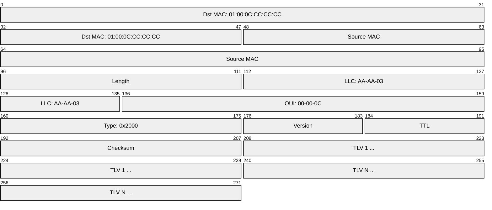
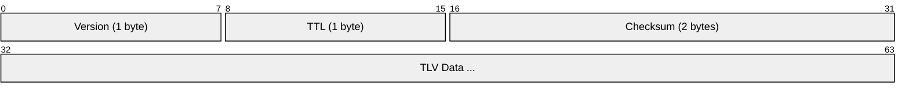
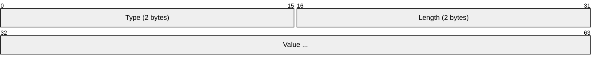
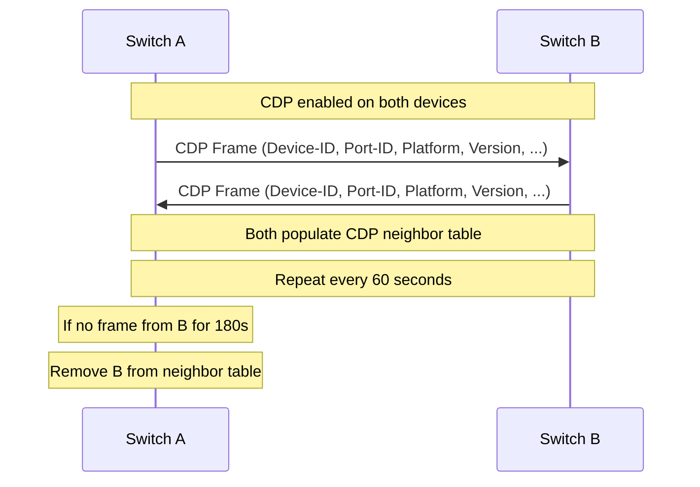
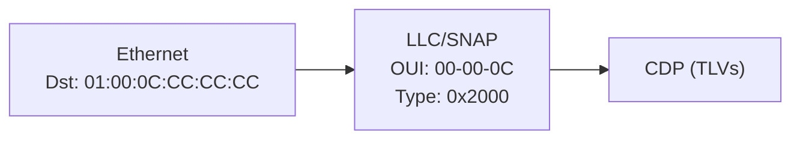

# CDP (Cisco Discovery Protocol)

> **Standard:** Cisco proprietary (no RFC) | **Layer:** Data Link (Layer 2) | **Wireshark filter:** `cdp`

CDP is a Cisco proprietary Layer 2 protocol that enables directly connected Cisco devices to discover each other and share information about their hardware, software, and network configuration. Each device periodically sends CDP frames containing TLV (Type-Length-Value) data to a well-known multicast address. CDP operates independently of Layer 3 protocols, making it useful for discovering neighbors even before IP addressing is configured. It is enabled by default on most Cisco devices.

## Frame

CDP is encapsulated using SNAP (Subnetwork Access Protocol) on Ethernet:

## CDP Header

## Key Fields

| Field | Size | Description |
|-------|------|-------------|
| Version | 1 byte | CDP version (1 or 2; version 2 is current) |
| TTL | 1 byte | Time to live in seconds (default 180) |
| Checksum | 2 bytes | Checksum over the entire CDP payload |
| TLVs | Variable | One or more Type-Length-Value fields |

## TLV Format

Each TLV consists of a 4-byte header followed by variable-length data:

| Field | Size | Description |
|-------|------|-------------|
| Type | 2 bytes | TLV type code |
| Length | 2 bytes | Total TLV length including type and length fields |
| Value | Variable | TLV-specific data |

## TLV Types

| Type | Name | Description |
|------|------|-------------|
| 0x0001 | Device-ID | Hostname of the sending device |
| 0x0002 | Addresses | Layer 3 addresses (IP, etc.) of the device |
| 0x0003 | Port-ID | Interface name the CDP frame was sent from |
| 0x0004 | Capabilities | Device type flags (router, switch, host, etc.) |
| 0x0005 | Version | Software version string (IOS version, etc.) |
| 0x0006 | Platform | Hardware platform (e.g., WS-C3560-48PS) |
| 0x0007 | IP Prefix | DEPRECATED: IP network prefixes |
| 0x0008 | Protocol Hello | Protocol-specific hello (e.g., Cluster Management) |
| 0x0009 | VTP Management Domain | VTP domain name configured on the device |
| 0x000A | Native VLAN | Native VLAN ID of the sending interface |
| 0x000B | Duplex | Duplex setting (0 = half, 1 = full) |
| 0x000E | VoIP VLAN Reply | Voice VLAN ID for VoIP phone provisioning |
| 0x000F | VoIP VLAN Query | Request for voice VLAN information |
| 0x0010 | Power | Power consumption of the device (in milliwatts) |
| 0x0011 | MTU | MTU of the sending interface |
| 0x0012 | Trust Bitmap | Extended trust QoS bitmap |
| 0x0013 | Untrusted Port CoS | CoS value for untrusted ports |
| 0x0014 | System Name | System name (different from Device-ID) |
| 0x0015 | System OID | SNMP system object identifier |
| 0x0016 | Management Addresses | Addresses for SNMP and other management |
| 0x0017 | Location | Physical location string |
| 0x0019 | Power Available | PoE power available on the port (in milliwatts) |

### Capabilities Bitmap

| Bit | Capability |
|-----|-----------|
| 0x01 | Router |
| 0x02 | Transparent Bridge |
| 0x04 | Source-Route Bridge |
| 0x08 | Switch (Layer 2) |
| 0x10 | Host |
| 0x20 | IGMP capable |
| 0x40 | Repeater |

## Timing

| Parameter | Default |
|-----------|---------|
| Advertisement interval | 60 seconds |
| Holdtime (TTL) | 180 seconds (3x advertisement interval) |
| CDPv2 enabled | Yes (default on Cisco devices) |

## Neighbor Discovery

## CDP vs LLDP

| Feature | CDP | LLDP |
|---------|-----|------|
| Standard | Cisco proprietary | IEEE 802.1AB (vendor-neutral) |
| Multicast address | 01:00:0C:CC:CC:CC | 01:80:C2:00:00:0E |
| Encapsulation | SNAP (EtherType 0x2000) | Ethernet (EtherType 0x88CC) |
| Default interval | 60 seconds | 30 seconds |
| Default holdtime | 180 seconds | 120 seconds |
| Data format | TLV (2-byte type) | TLV (7-bit type, 9-bit length) |
| Multi-vendor | Cisco only | All vendors |
| VoIP VLAN | Native support | LLDP-MED extension |
| PoE negotiation | Power TLVs | IEEE 802.3 TLVs |
| IPv6 support | Limited | Full support |

## Security Considerations

CDP is enabled by default on Cisco devices and discloses significant information about the network:

| Risk | Detail |
|------|--------|
| Information disclosure | Exposes hostname, IOS version, IP addresses, platform, VLAN info |
| Reconnaissance | Attackers on the LAN can passively collect CDP frames |
| Version fingerprinting | Software version reveals known vulnerabilities |
| Topology mapping | Port-ID and Device-ID reveal network topology |
| DoS (CDP flooding) | Sending large numbers of bogus CDP frames can exhaust the neighbor table |

Best practices:
- Disable CDP on ports facing untrusted networks (e.g., user access ports, internet-facing interfaces)
- Use `no cdp enable` on a per-interface basis or `no cdp run` globally
- Consider migrating to LLDP for multi-vendor environments
- Use CDP only on inter-switch and inter-router links where discovery is needed

## Encapsulation

CDP frames are **not forwarded** by switches — they are consumed by the directly connected neighbor only, identical to LLDP behavior.

## Standards

| Document | Title |
|----------|-------|
| Cisco proprietary | No IETF RFC or IEEE standard |
| [Wireshark CDP](https://wiki.wireshark.org/CDP) | Wireshark protocol reference for CDP |

## See Also

- [LLDP](lldp.md) — vendor-neutral alternative to CDP
- [Ethernet](ethernet.md) — CDP runs on Ethernet LANs
- [STP](stp.md) — another Layer 2 protocol on Cisco switches
- [802.1Q](vlan8021q.md) — Native VLAN advertised via CDP
