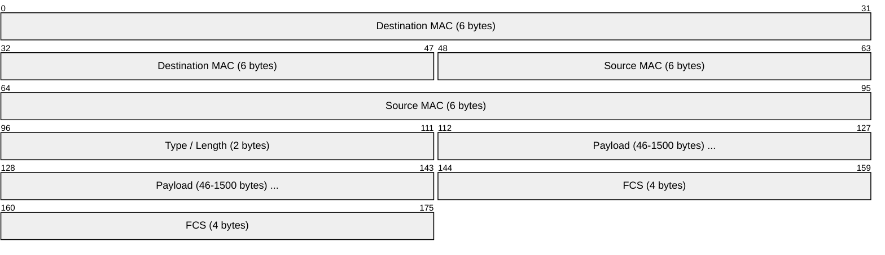
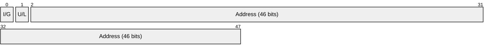
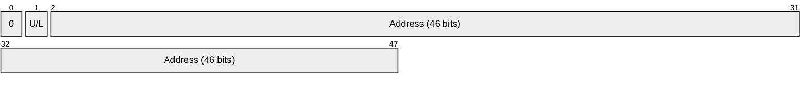
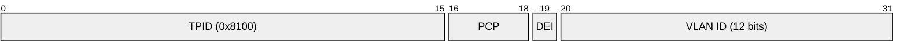
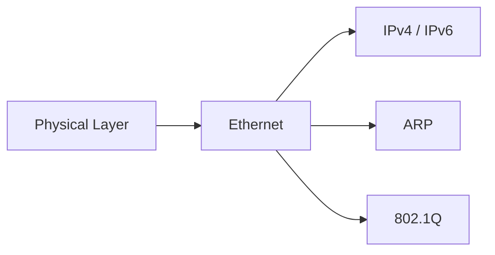

# Ethernet (IEEE 802.3)

> **Standard:** [IEEE 802.3](https://standards.ieee.org/standard/802_3-2022.html) | **Layer:** Data Link (Layer 2) | **Wireshark filter:** `eth`

Ethernet is the dominant wired LAN technology, defining framing and physical-layer signaling for local network communication. Developed by Robert Metcalfe and David Boggs at Xerox PARC in the 1970s, it originally used CSMA/CD for media access. Modern switched Ethernet operates in full-duplex mode, making CSMA/CD largely historical.

The terms "Ethernet" and IEEE 802.3 are often used interchangeably, though they differ slightly: Ethernet II uses a Type field while 802.3 uses a Length field, distinguished by the field's value.

## Frame

Note: The Preamble (7 bytes) and Start Frame Delimiter (1 byte) precede the frame but are typically stripped by hardware before the packet reaches software.

## Key Fields

| Field | Size | Description |
|-------|------|-------------|
| Destination MAC | 6 bytes | MAC address of the receiving device |
| Source MAC | 6 bytes | MAC address of the sending device |
| Type / Length | 2 bytes | EtherType (`>= 0x0600`) or payload length (`<= 1500`) |
| Payload | 46-1500 bytes | Upper-layer protocol data (LLC/SNAP or direct) |
| FCS | 4 bytes | CRC-32 error check over the entire frame |

## Field Details

### Destination MAC Address

| Bit | Field | Values |
|-----|-------|--------|
| 0 | I/G (Individual/Group) | 0 = Unicast, 1 = Multicast/Broadcast |
| 1 | U/L (Universal/Local) | 0 = Universally administered (OUI), 1 = Locally administered |

Broadcast address: `FF:FF:FF:FF:FF:FF`

### Source MAC Address

The first bit is always 0 (source is always unicast).

### Type / Length

The interpretation depends on the value:

| Value | Interpretation |
|-------|---------------|
| `<= 1500` (0x05DC) | IEEE 802.3 Length field — payload size in bytes |
| `>= 1536` (0x0600) | Ethernet II Type field — identifies upper-layer protocol |

Common EtherType values:

| EtherType | Protocol |
|-----------|----------|
| `0x0800` | [IPv4](../network-layer/ip.md) |
| `0x0806` | [ARP](../network-layer/arp.md) |
| `0x8100` | IEEE 802.1Q (VLAN tag) |
| `0x86DD` | [IPv6](../network-layer/ipv6.md) |
| `0x8847` | MPLS (unicast) |
| `0x88CC` | LLDP |

### IEEE 802.1Q VLAN Tag (optional)

When present, a 4-byte VLAN tag is inserted between the Source MAC and the original Type/Length field:

| Field | Size | Description |
|-------|------|-------------|
| TPID | 16 bits | Tag Protocol Identifier, set to `0x8100` |
| PCP | 3 bits | Priority Code Point (802.1p QoS) |
| DEI | 1 bit | Drop Eligible Indicator |
| VID | 12 bits | VLAN Identifier (0-4095) |

## Ethernet Standards

| Standard | Speed | Medium |
|----------|-------|--------|
| 10BASE-T | 10 Mbps | Twisted pair |
| 100BASE-TX | 100 Mbps | Twisted pair |
| 1000BASE-T | 1 Gbps | Twisted pair |
| 10GBASE-T | 10 Gbps | Twisted pair |
| 25GBASE-CR | 25 Gbps | Twinaxial copper |
| 40GBASE-SR4 | 40 Gbps | Multi-mode fiber |
| 100GBASE-SR4 | 100 Gbps | Multi-mode fiber |
| 400GBASE-SR8 | 400 Gbps | Multi-mode fiber |

## Encapsulation

## Standards

| Document | Title |
|----------|-------|
| [IEEE 802.3-2022](https://standards.ieee.org/standard/802_3-2022.html) | IEEE Standard for Ethernet |
| [IEEE 802.1Q-2022](https://standards.ieee.org/standard/802_1Q-2022.html) | IEEE Standard for VLANs |
| [RFC 894](https://www.rfc-editor.org/rfc/rfc894) | A Standard for the Transmission of IP Datagrams over Ethernet Networks |
| [RFC 1042](https://www.rfc-editor.org/rfc/rfc1042) | A Standard for the Transmission of IP Datagrams over IEEE 802 Networks |

## See Also

- [IPv4](../network-layer/ip.md)
- [IPv6](../network-layer/ipv6.md)
- [ARP](../network-layer/arp.md)
