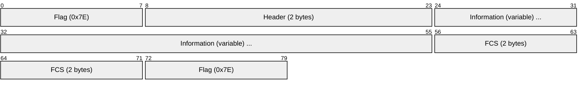
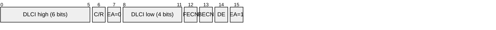
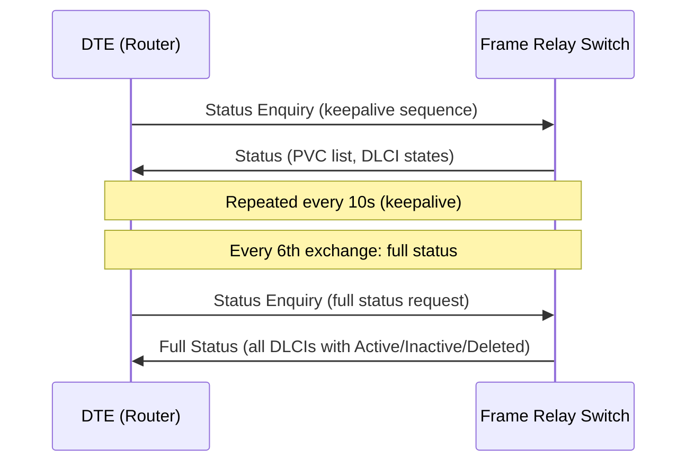
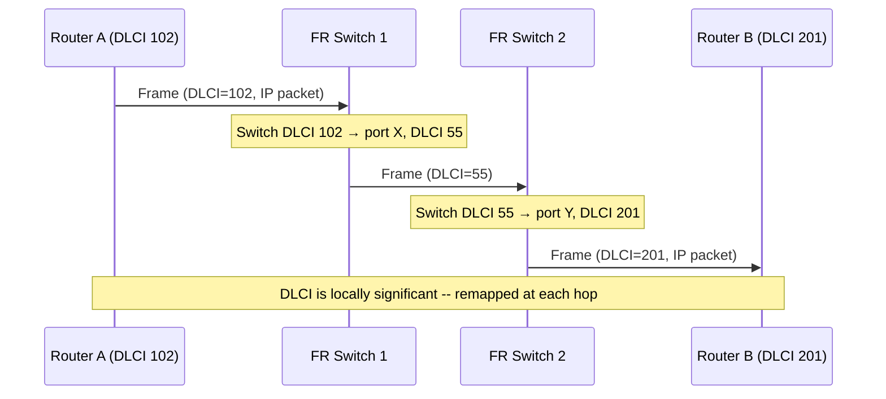
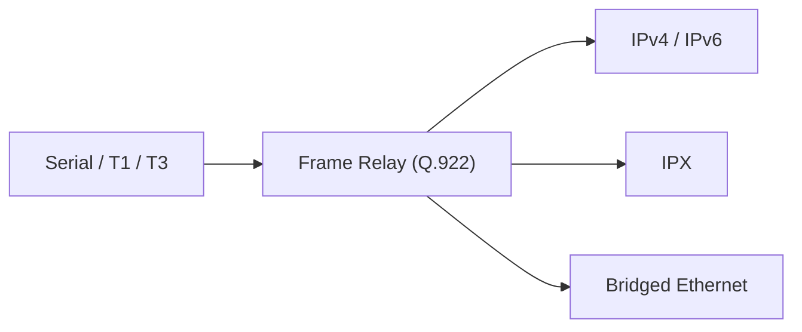

# Frame Relay

> **Standard:** [ITU-T Q.922](https://www.itu.int/rec/T-REC-Q.922) | **Layer:** Data Link (Layer 2) | **Wireshark filter:** `fr`

Frame Relay is a packet-switched WAN protocol that provides connection-oriented, statistically multiplexed data transport over virtual circuits. Developed in the early 1990s as a faster, simpler successor to X.25, Frame Relay strips away X.25's hop-by-hop error recovery and flow control, relying instead on upper-layer protocols (TCP) to handle retransmission. This made Frame Relay switches far simpler and faster. Frame Relay was the dominant WAN technology for enterprise site-to-site connectivity throughout the 1990s and early 2000s, eventually displaced by MPLS VPNs and Ethernet WAN services.

## Frame

## Header (2-Byte Standard)

## Key Fields

| Field | Size | Description |
|-------|------|-------------|
| Flag | 8 bits | HDLC frame delimiter `0x7E` |
| DLCI | 10 bits (standard 2-byte header) | Data Link Connection Identifier -- identifies the PVC or SVC |
| C/R | 1 bit | Command/Response -- application-specific, passed transparently |
| EA | 1 bit per byte | Extended Address -- 0 = more address bytes follow, 1 = last byte |
| FECN | 1 bit | Forward Explicit Congestion Notification -- set by network toward receiver |
| BECN | 1 bit | Backward ECN -- set by network toward sender |
| DE | 1 bit | Discard Eligible -- marks frames that may be dropped during congestion |
| Information | Variable (up to 4096 bytes typical) | Upper-layer payload |
| FCS | 16 bits | Frame Check Sequence (CRC-16-CCITT) |

The 2-byte header yields a 10-bit DLCI (values 0-1023). Extended headers of 3 or 4 bytes expand the DLCI to 16 or 23 bits using additional EA bytes, though the 2-byte format is overwhelmingly common.

## Reserved DLCIs

| DLCI | Purpose |
|------|---------|
| 0 | Signaling (Q.933, ANSI T1.617 Annex D) |
| 1-15 | Reserved |
| 16-1007 | User data circuits (PVCs and SVCs) |
| 1008-1022 | Reserved |
| 1023 | LMI (Cisco proprietary, "Gang of Four" LMI) |

## Congestion Management

Frame Relay uses three mechanisms to signal congestion:

| Mechanism | Direction | Description |
|-----------|-----------|-------------|
| FECN | Toward receiver | Switch sets FECN=1 in frames traveling through a congested node |
| BECN | Toward sender | Switch sets BECN=1 in frames traveling opposite to congestion |
| DE | Set by edge or network | Marks excess-burst frames as eligible for discard |

When a sender receives frames with BECN=1, it should reduce its transmission rate. When a receiver sees FECN=1, it may signal the sender through upper-layer protocols.

## Traffic Contract

| Parameter | Description |
|-----------|-------------|
| CIR (Committed Information Rate) | Guaranteed throughput the network will deliver (bits/sec) |
| Bc (Committed Burst Size) | Maximum data allowed during the measurement interval Tc (bits) |
| Be (Excess Burst Size) | Additional data above Bc that may be transmitted but marked DE (bits) |
| Tc (Measurement Interval) | Bc / CIR -- the time window for burst measurement |

Frames sent within the CIR are delivered normally. Frames in the Be range are marked DE=1 and delivered if capacity allows. Frames exceeding CIR + Be may be dropped immediately.

## LMI (Local Management Interface)

LMI provides keepalive and PVC status signaling between a DTE (router) and the Frame Relay switch:

### LMI Types

| LMI Type | Signaling DLCI | Standard |
|----------|---------------|----------|
| Cisco ("Gang of Four") | 1023 | Original de facto standard (Cisco, DEC, StrataCom, NorTel) |
| ANSI T1.617 Annex D | 0 | ANSI standard |
| ITU Q.933 Annex A | 0 | ITU-T standard |

All three are functionally similar but use different DLCI values and slightly different message encoding. Both ends must use the same LMI type.

### PVC States

| State | Meaning |
|-------|---------|
| Active | PVC is operational end-to-end |
| Inactive | PVC exists locally but the remote end is down |
| Deleted | PVC has been removed from the switch configuration |

## PVC vs SVC

| Feature | PVC (Permanent Virtual Circuit) | SVC (Switched Virtual Circuit) |
|---------|---|----|
| Setup | Provisioned by operator | Established on demand (Q.933 signaling) |
| DLCI assignment | Static, configured | Dynamic, assigned during call setup |
| Availability | Always present | Created and torn down as needed |
| Use case | Dedicated site-to-site links | On-demand connections (rarely deployed) |

PVCs were used almost exclusively in practice. Frame Relay SVCs saw minimal real-world deployment.

## Inverse ARP

Inverse ARP (RFC 2390) allows a router to discover the network-layer address (e.g., IP) of the remote device on a DLCI without manual configuration. This is the reverse of regular ARP -- given a DLCI (Layer 2), Inverse ARP discovers the IP address (Layer 3):

| Step | Action |
|------|--------|
| 1 | Router learns DLCI from LMI Status message |
| 2 | Router sends Inverse ARP Request on the DLCI |
| 3 | Remote router responds with its IP address |
| 4 | Local router creates a dynamic DLCI-to-IP mapping |

## PVC Data Flow

DLCI values have **local significance only**. Each switch remaps the DLCI as the frame traverses the network. Router A knows its circuit as DLCI 102, Router B knows the same circuit as DLCI 201, and the switches use different DLCIs internally.

## Subinterfaces

Frame Relay routers commonly use subinterfaces to solve split-horizon and broadcast replication issues on multipoint circuits:

| Type | Description |
|------|-------------|
| Point-to-Point | One subinterface per DLCI -- each acts as a separate link; solves split-horizon for routing protocols |
| Multipoint | Multiple DLCIs on one subinterface -- behaves like a shared network segment |

## Frame Relay vs ATM vs MPLS

| Feature | Frame Relay | ATM | MPLS |
|---------|-------------|-----|------|
| Switching unit | Variable-length frame | Fixed 53-byte cell | Variable-length packet |
| Max frame/cell | ~4096 bytes | 48-byte payload | MTU of underlying link |
| Addressing | DLCI (10-bit typical) | VPI/VCI (8+16 bits) | 20-bit label |
| Congestion signaling | FECN, BECN, DE | CLP, EFCI, ABR rate control | ECN, WRED, QoS via EXP bits |
| QoS | CIR/Bc/Be traffic contract | Native CBR/VBR/ABR/UBR classes | DiffServ, Traffic Engineering |
| Error recovery | None (relies on upper layers) | None (relies on upper layers) | None (relies on upper layers) |
| Heyday | 1990s-2000s | Late 1990s | 2000s-present |

## Why Frame Relay Died

Frame Relay was displaced by two technologies: MPLS in the WAN core (providing equivalent virtual circuit service with better traffic engineering and integration with IP routing) and Carrier Ethernet / Metro Ethernet services that offered higher bandwidth at lower cost. Most carriers stopped selling new Frame Relay circuits by the mid-2000s, and the last major Frame Relay networks were decommissioned by the mid-2010s.

## Encapsulation

## Standards

| Document | Title |
|----------|-------|
| [ITU-T Q.922](https://www.itu.int/rec/T-REC-Q.922) | ISDN Data Link Layer for Frame Mode Bearer Services |
| [ITU-T Q.933](https://www.itu.int/rec/T-REC-Q.933) | Signaling for Frame Relay Switched Virtual Circuits |
| [ANSI T1.617](https://webstore.ansi.org/) | Signaling Specification for Frame Relay Bearer Service |
| [FRF.1.2](https://www.broadband-forum.org/) | Frame Relay Forum -- UNI Implementation Agreement |
| [FRF.16](https://www.broadband-forum.org/) | Multilink Frame Relay UNI/NNI |
| [RFC 2390](https://www.rfc-editor.org/rfc/rfc2390) | Inverse ARP |
| [RFC 2427](https://www.rfc-editor.org/rfc/rfc2427) | Multiprotocol Interconnect over Frame Relay |

## See Also

- [HDLC](hdlc.md) -- Frame Relay's framing is derived from HDLC/Q.922
- [ATM](atm.md) -- contemporary cell-based WAN protocol, also displaced by MPLS
- [PPP](ppp.md) -- alternative point-to-point WAN encapsulation
- [Ethernet](ethernet.md) -- Carrier Ethernet replaced Frame Relay for enterprise WAN
- [ARP](arp.md) -- Frame Relay uses Inverse ARP (RFC 2390) for address resolution
