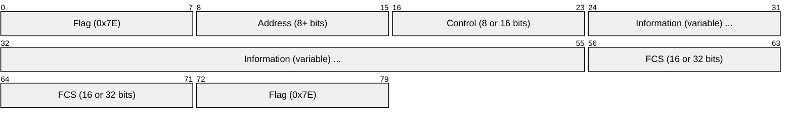
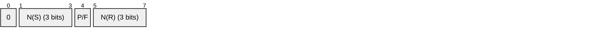
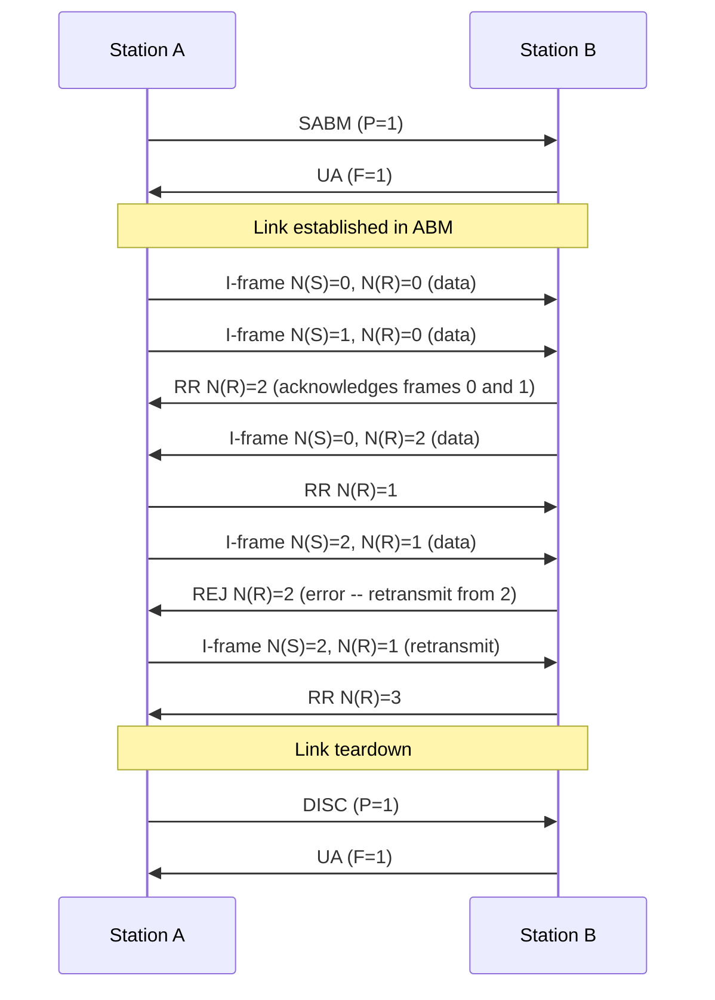
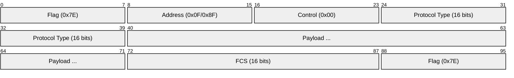
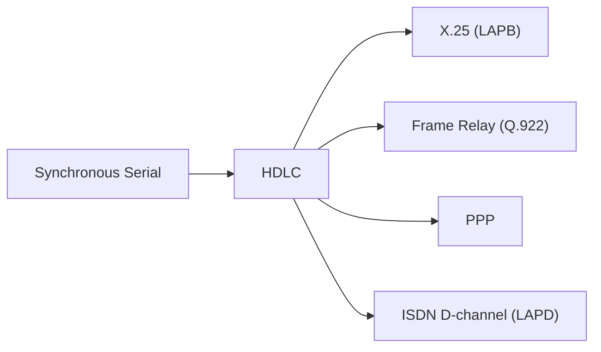

# HDLC (High-Level Data Link Control)

> **Standard:** [ISO 13239](https://www.iso.org/standard/37010.html) | **Layer:** Data Link (Layer 2) | **Wireshark filter:** `hdlc`

HDLC is a bit-oriented, synchronous data link protocol standardized by ISO. It provides framing, error detection, flow control, and reliable delivery over point-to-point and multipoint links. HDLC is one of the most influential protocols ever designed -- it serves as the foundation for PPP, Frame Relay, LAPB (X.25), LAPD (ISDN D-channel), LAPM (V.42 modems), Cisco HDLC, and IBM's SDLC. Nearly every WAN protocol from the 1980s through the 2000s carried DNA from HDLC's frame structure.

## Frame

## Key Fields

| Field | Size | Description |
|-------|------|-------------|
| Flag | 8 bits | Frame delimiter `0x7E` (01111110) -- marks start and end of frame |
| Address | 8 bits (basic) or multibyte | Identifies station; `0xFF` = all-stations broadcast |
| Control | 8 bits (basic) or 16 bits (extended) | Frame type, sequence numbers, poll/final bit |
| Information | Variable | Payload data (present in I-frames and some U-frames) |
| FCS | 16 bits (CRC-CCITT) or 32 bits (CRC-32) | Frame Check Sequence for error detection |

## Bit Stuffing

The flag pattern `01111110` (0x7E) must never appear within the frame body. HDLC achieves this through bit stuffing:

- **Transmitter:** After any five consecutive 1-bits in the data, insert a 0-bit
- **Receiver:** After five consecutive 1-bits, remove the following 0-bit
- **Result:** Six consecutive 1s can only appear as part of a flag or abort (seven 1s = abort)

This is distinct from PPP's byte-stuffing approach over async links, which escapes `0x7E` using `0x7D` followed by the byte XORed with `0x20`.

## Control Field

The control byte identifies three frame types based on its first one or two bits:

### I-Frame (Information Transfer)

| Field | Description |
|-------|-------------|
| Bit 0 = 0 | Identifies I-frame |
| N(S) | Send sequence number (modulo 8 or modulo 128 in extended) |
| P/F | Poll/Final bit -- command polls for response; response marks final frame |
| N(R) | Receive sequence number -- acknowledges all frames up to N(R)-1 |

### S-Frame (Supervisory)

| Type | Code | Name | Description |
|------|------|------|-------------|
| 00 | RR | Receive Ready | Acknowledges frames, ready for more |
| 01 | REJ | Reject | Go-Back-N -- retransmit from N(R) onward |
| 10 | RNR | Receive Not Ready | Acknowledges frames, requests pause (flow control) |
| 11 | SREJ | Selective Reject | Retransmit only the single frame N(R) |

### U-Frame (Unnumbered)

The five type bits (split around P/F) encode the command or response:

| Type Bits | Name | Direction | Description |
|-----------|------|-----------|-------------|
| 00 100 | SABM | Command | Set Asynchronous Balanced Mode (8-bit sequence) |
| 11 100 | SABME | Command | Set ABM Extended (16-bit control, 128-bit sequence) |
| 00 000 | UI | Command | Unnumbered Information (connectionless data) |
| 01 000 | DISC | Command | Disconnect -- terminate the link |
| 00 110 | UA | Response | Unnumbered Acknowledge (accepts SABM/DISC) |
| 00 001 | DM | Response | Disconnected Mode -- link is down |
| 10 001 | FRMR | Response | Frame Reject -- protocol error (invalid frame received) |

## Operating Modes

| Mode | Abbreviation | Description |
|------|-------------|-------------|
| Normal Response Mode | NRM | Secondary station transmits only when polled by primary (legacy, master/slave) |
| Asynchronous Response Mode | ARM | Secondary can transmit without being polled, but primary manages the link |
| Asynchronous Balanced Mode | ABM | Both stations are peers with equal control -- **most common mode** (used by PPP, LAPB, LAPD) |

## Windowing

| Mode | Sequence Bits | Window Size | Control Field |
|------|---------------|-------------|---------------|
| Basic (modulo 8) | 3-bit N(S), N(R) | Up to 7 outstanding frames | 8-bit control |
| Extended (modulo 128) | 7-bit N(S), N(R) | Up to 127 outstanding frames | 16-bit control |

Extended mode is established via SABME and is used on high-bandwidth or high-latency links where a 7-frame window is insufficient.

## ABM Session

## HDLC Derivatives

| Protocol | Based On | Key Differences from HDLC |
|----------|----------|---------------------------|
| PPP (RFC 1661) | HDLC framing | Address always 0xFF, Control always 0x03 (UI), adds Protocol field, LCP negotiation, byte stuffing on async links |
| LAPB (X.25 L2) | HDLC ABM | Strict ABM operation, 8 or 128 sequence, basis of X.25 reliable link layer |
| LAPD (ISDN Q.921) | HDLC ABM | 2-byte address with SAPI + TEI for ISDN D-channel multiplexing |
| LAPM (V.42) | HDLC ABM | Error-correcting mode for modem connections |
| Frame Relay (Q.922) | HDLC | Replaces Address/Control with DLCI-based header, no error recovery (relay only) |
| Cisco HDLC | HDLC | Adds 2-byte proprietary protocol type field after Control (similar to PPP but incompatible) |
| SDLC (IBM SNA) | Predecessor | IBM's original protocol that HDLC was derived from; NRM only, single-byte address |

## Cisco HDLC

Cisco's proprietary HDLC variant is the default encapsulation on Cisco serial interfaces. It adds a 2-byte protocol type field after the standard HDLC Control byte:

Because the protocol type field is proprietary, Cisco HDLC is incompatible with other vendors' HDLC implementations. Both ends of a serial link must use the same encapsulation -- this is a common misconfiguration when connecting Cisco to non-Cisco equipment (use PPP instead).

## Encapsulation

## Standards

| Document | Title |
|----------|-------|
| [ISO 13239:2002](https://www.iso.org/standard/37010.html) | HDLC -- Consolidated procedures and elements |
| [ISO 3309:1979](https://www.iso.org/standard/8590.html) | HDLC -- Frame structure (original, superseded by ISO 13239) |
| [ITU-T Q.921](https://www.itu.int/rec/T-REC-Q.921) | LAPD -- ISDN data link layer |
| [ITU-T Q.922](https://www.itu.int/rec/T-REC-Q.922) | ISDN data link layer for Frame Relay bearer service |
| [RFC 1661](https://www.rfc-editor.org/rfc/rfc1661) | PPP (Point-to-Point Protocol) |
| [RFC 1662](https://www.rfc-editor.org/rfc/rfc1662) | PPP in HDLC-like Framing |

## See Also

- [PPP](ppp.md) -- the most widely deployed HDLC derivative
- [Frame Relay](framerelay.md) -- uses HDLC-derived framing with DLCI addressing
- [Ethernet](ethernet.md) -- the LAN counterpart to HDLC's WAN role
- [STP](stp.md) -- Layer 2 loop prevention for bridged networks
