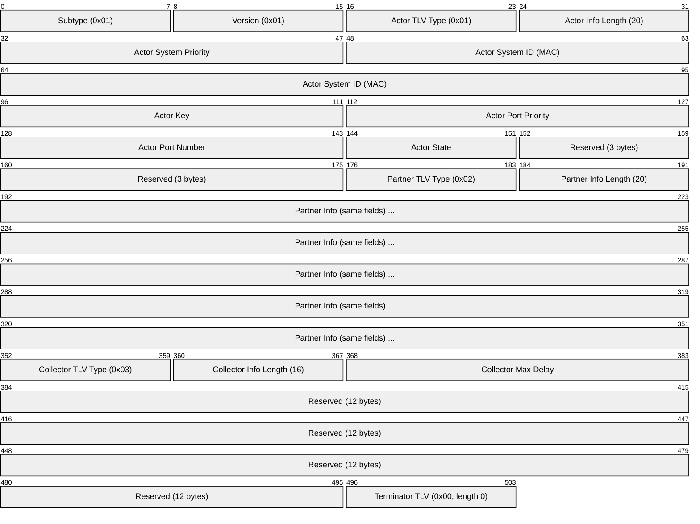
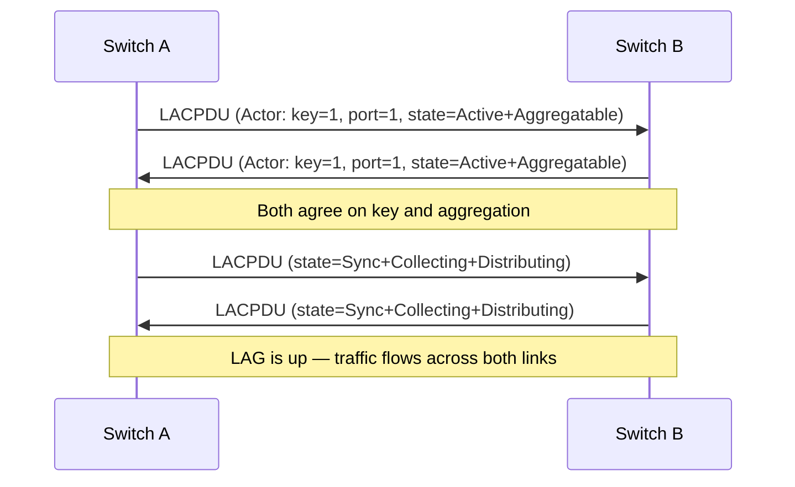
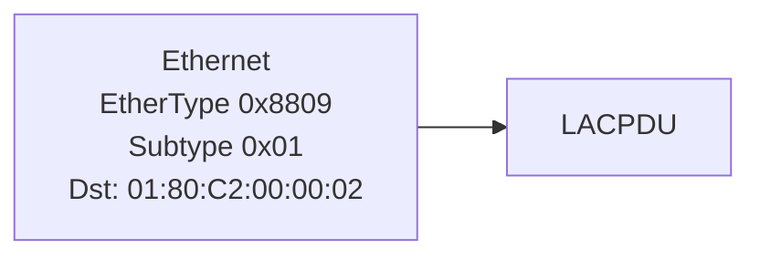

# LACP (Link Aggregation Control Protocol)

> **Standard:** [IEEE 802.1AX-2020](https://standards.ieee.org/standard/802_1AX-2020.html) | **Layer:** Data Link (Layer 2) | **Wireshark filter:** `lacp`

LACP dynamically negotiates the bundling of multiple physical Ethernet links into a single logical link (Link Aggregation Group — LAG). This provides increased bandwidth, redundancy, and automatic failover. LACP ensures both ends agree on which links are part of the bundle and detects link failures. It is the standard alternative to static port channeling and is supported by virtually all managed switches, servers, and storage arrays.

## LACPDU

LACPDUs are 110 bytes, sent to the multicast address `01:80:C2:00:00:02` with EtherType `0x8809` (Slow Protocols).

## Key Fields

| Field | Size | Description |
|-------|------|-------------|
| Subtype | 8 bits | 0x01 = LACP |
| Actor System Priority | 16 bits | Priority of the local system (lower = higher priority) |
| Actor System ID | 6 bytes | MAC address of the local system |
| Actor Key | 16 bits | Administrative key grouping eligible ports |
| Actor Port Priority | 16 bits | Priority of this port (lower = preferred) |
| Actor Port Number | 16 bits | Port identifier |
| Actor State | 8 bits | State flags (see below) |
| Partner fields | — | Mirrored information from the remote end |
| Collector Max Delay | 16 bits | Maximum delay before collecting frames (in 10µs units) |

## State Flags

| Bit | Name | Description |
|-----|------|-------------|
| 0 | Activity | 1 = Active LACP (initiates), 0 = Passive (responds only) |
| 1 | Timeout | 1 = Short timeout (3s), 0 = Long timeout (90s) |
| 2 | Aggregation | 1 = Port can be aggregated |
| 3 | Synchronization | 1 = Port is in sync with partner |
| 4 | Collecting | 1 = Port is collecting (receiving) frames |
| 5 | Distributing | 1 = Port is distributing (sending) frames |
| 6 | Defaulted | 1 = Using default partner info (no LACPDU received) |
| 7 | Expired | 1 = Partner info has expired |

## Negotiation

### Periodic Exchange

| Mode | LACPDU Interval |
|------|----------------|
| Short timeout | Every 1 second (detect failure in 3s) |
| Long timeout | Every 30 seconds (detect failure in 90s) |

## LAG Formation Rules

For ports to aggregate:
1. Both ends must have matching **Actor Key** values
2. Both ends must have the **Aggregation** flag set
3. At least one end must be in **Active** mode (both can be active)
4. Links must be the same speed and duplex
5. Maximum ports per LAG varies by platform (typically 8-16)

## Load Distribution

Traffic is distributed across member links using a hash of frame fields:

| Hash Input | Method |
|------------|--------|
| Source MAC | L2 hash |
| Destination MAC | L2 hash |
| Source + Dest MAC | L2 hash |
| Source + Dest IP | L3 hash |
| Source + Dest IP + L4 ports | L3+L4 hash (best distribution) |

The hash determines which member link carries each flow — all packets of the same flow take the same link (preserving order).

## LACP Modes

| Local Mode | Remote Mode | Result |
|------------|-------------|--------|
| Active | Active | LAG forms (both initiate) |
| Active | Passive | LAG forms (active initiates) |
| Passive | Passive | No LAG (neither initiates) |

## Encapsulation

LACPDUs are slow protocol frames — they are **not forwarded** by bridges.

## Standards

| Document | Title |
|----------|-------|
| [IEEE 802.1AX-2020](https://standards.ieee.org/standard/802_1AX-2020.html) | Link Aggregation |
| [IEEE 802.3ad](https://standards.ieee.org/standard/802_3ad-2000.html) | Original link aggregation (merged into 802.1AX) |

## See Also

- [Ethernet](ethernet.md) — the links being aggregated
- [LLDP](lldp.md) — reports LAG status to neighbors
- [STP](stp.md) — treats a LAG as a single logical link
- [802.1Q](vlan8021q.md) — VLANs trunked over aggregated links
