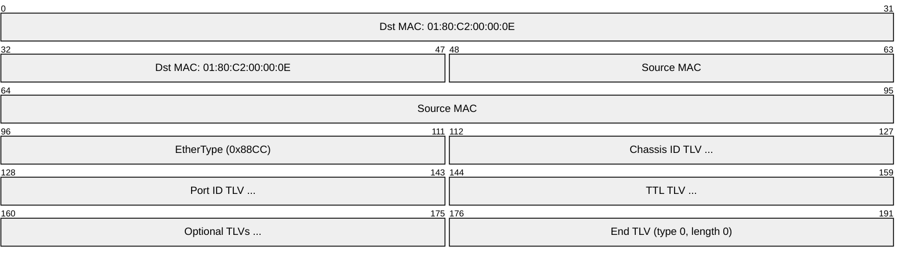
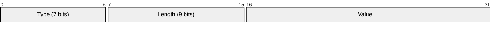
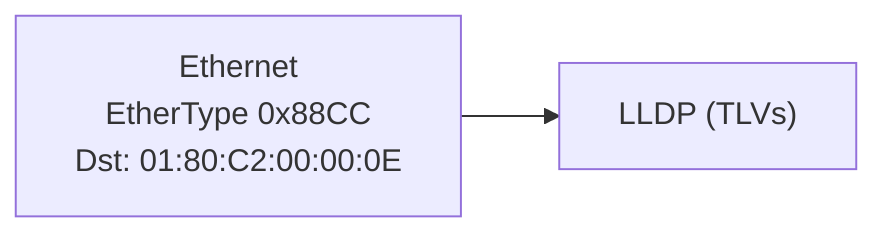

# LLDP (Link Layer Discovery Protocol)

> **Standard:** [IEEE 802.1AB-2016](https://standards.ieee.org/standard/802_1AB-2016.html) | **Layer:** Data Link (Layer 2) | **Wireshark filter:** `lldp`

LLDP is a vendor-neutral, one-way protocol that allows network devices to advertise their identity, capabilities, and neighbors on a local network. Each device periodically sends LLDP frames containing TLV (Type-Length-Value) information to a well-known multicast address. Neighboring devices collect and store this information in an LLDP MIB, enabling network management tools to automatically discover the physical topology. LLDP is essential for VoIP phone provisioning, PoE negotiation, and network documentation.

## Frame

## TLV Format

## Mandatory TLVs

| Type | Name | Description |
|------|------|-------------|
| 1 | Chassis ID | Device identifier (MAC, hostname, IP, etc.) |
| 2 | Port ID | Port identifier (interface name, MAC, etc.) |
| 3 | TTL | Time to live in seconds (0 = delete this entry) |
| 0 | End of LLDPDU | Marks end of TLV list (type=0, length=0) |

## Optional TLVs

| Type | Name | Description |
|------|------|-------------|
| 4 | Port Description | Interface description string |
| 5 | System Name | Device hostname |
| 6 | System Description | Device model, OS, software version |
| 7 | System Capabilities | Capabilities bitmap (bridge, router, phone, etc.) |
| 8 | Management Address | IP address for device management |
| 127 | Organizationally Specific | Vendor extensions (IEEE 802.1, 802.3, LLDP-MED, etc.) |

### System Capabilities Bitmap

| Bit | Capability |
|-----|-----------|
| 0 | Other |
| 1 | Repeater |
| 2 | Bridge |
| 3 | WLAN Access Point |
| 4 | Router |
| 5 | Telephone |
| 6 | DOCSIS Cable Device |
| 7 | Station Only |

## Common Organizationally Specific TLVs

### IEEE 802.1 (OUI: 00-80-C2)

| Subtype | Name | Description |
|---------|------|-------------|
| 1 | Port VLAN ID | Native/untagged VLAN on this port |
| 2 | Port and Protocol VLAN ID | Protocol-based VLAN |
| 3 | VLAN Name | Name for a VLAN ID |
| 4 | Protocol Identity | Protocols supported on this port |

### IEEE 802.3 (OUI: 00-12-0F)

| Subtype | Name | Description |
|---------|------|-------------|
| 1 | MAC/PHY Config/Status | Speed, duplex, auto-negotiation |
| 2 | Power via MDI (PoE) | Power class, pair, required power |
| 3 | Link Aggregation | LACP status |
| 4 | Maximum Frame Size | Maximum supported frame size |

### LLDP-MED (Media Endpoint Discovery)

LLDP-MED extends LLDP for VoIP devices:

| Subtype | Name | Description |
|---------|------|-------------|
| 1 | LLDP-MED Capabilities | Supported MED TLVs |
| 2 | Network Policy | VLAN, L2/L3 priority for voice/video/signaling |
| 3 | Location Identification | Emergency location (E911) |
| 4 | Extended Power-via-MDI | Detailed PoE power info |
| 5 | Inventory | Hardware/firmware/software/serial/model |

## Timing

| Parameter | Default |
|-----------|---------|
| Transmit interval | 30 seconds |
| TTL | 120 seconds |
| Reinit delay | 2 seconds |
| Fast start | 1 second (first 4 frames after link up) |

## Encapsulation

LLDP frames are **not forwarded** by bridges — they are consumed by the directly connected neighbor only.

## Standards

| Document | Title |
|----------|-------|
| [IEEE 802.1AB-2016](https://standards.ieee.org/standard/802_1AB-2016.html) | Station and Media Access Control Connectivity Discovery (LLDP) |
| [ANSI/TIA-1057](https://tiaonline.org/) | LLDP for Media Endpoint Devices (LLDP-MED) |

## See Also

- [Ethernet](ethernet.md) — LLDP runs directly on Ethernet
- [802.1Q](vlan8021q.md) — VLAN info advertised via LLDP
- [LACP](lacp.md) — aggregation status reported in LLDP
- [STP](stp.md) — another L2 protocol using the same multicast range
