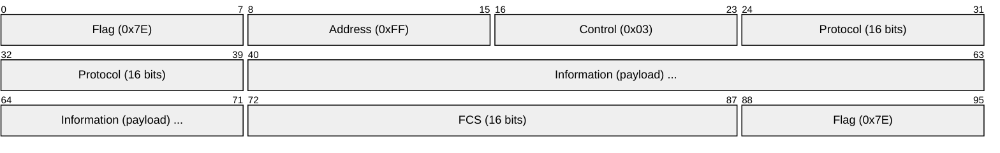
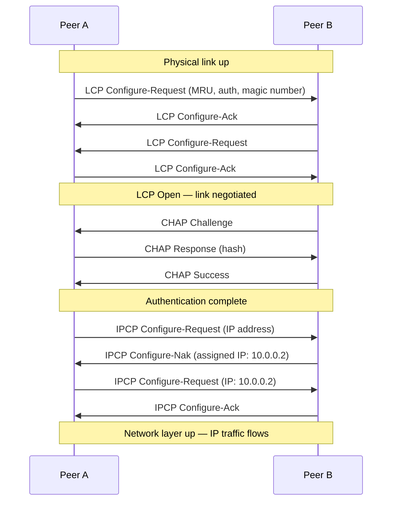
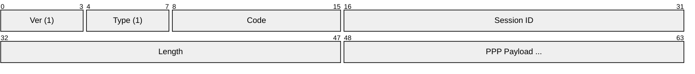
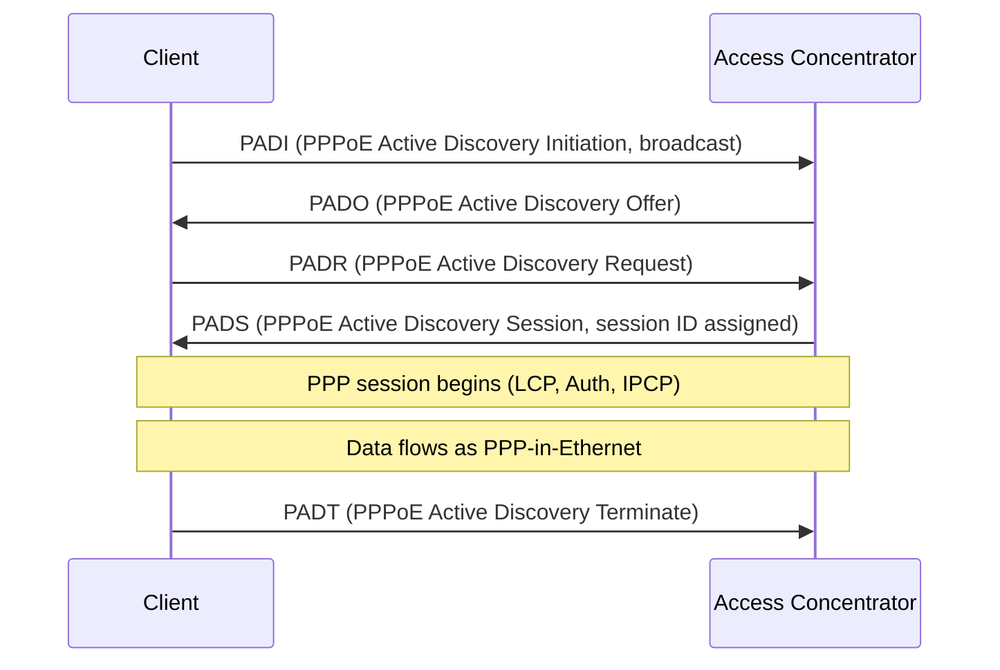
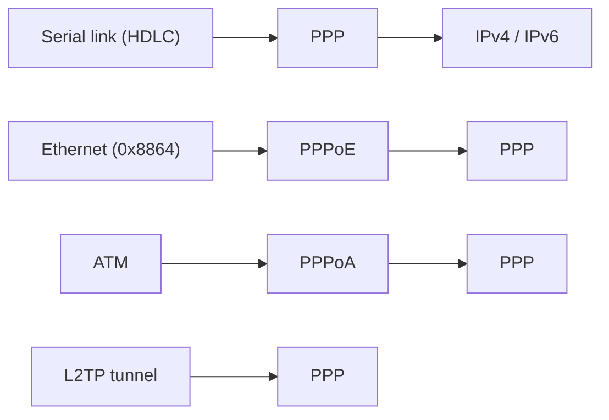

# PPP (Point-to-Point Protocol)

> **Standard:** [RFC 1661](https://www.rfc-editor.org/rfc/rfc1661) | **Layer:** Data Link (Layer 2) | **Wireshark filter:** `ppp`

PPP is a data link protocol for establishing a direct connection between two nodes. It provides framing, link negotiation (LCP), authentication (PAP/CHAP/EAP), and network-layer configuration (IPCP for IPv4, IPV6CP for IPv6). PPP was the standard protocol for dial-up Internet and remains the foundation of PPPoE (broadband DSL/fiber), PPPoA (ATM), L2TP tunnels, and some serial WAN links.

## Frame

## Key Fields

| Field | Size | Description |
|-------|------|-------------|
| Flag | 8 bits | HDLC frame delimiter `0x7E` |
| Address | 8 bits | Always `0xFF` (all-stations broadcast) |
| Control | 8 bits | Always `0x03` (unnumbered information) |
| Protocol | 16 bits | Identifies the encapsulated protocol |
| Information | Variable | Payload (default max 1500 bytes, negotiable) |
| FCS | 16 or 32 bits | Frame Check Sequence (CRC-16 default, CRC-32 optional) |

Address and Control fields can be compressed away via LCP negotiation (ACFC), and the Protocol field can be compressed to 1 byte (PFC).

## Protocol Field Values

| Value | Protocol |
|-------|----------|
| 0x0021 | IPv4 |
| 0x0057 | IPv6 |
| 0x002B | IPX |
| 0x8021 | IPCP (IP Control Protocol) |
| 0x8057 | IPV6CP (IPv6 Control Protocol) |
| 0xC021 | LCP (Link Control Protocol) |
| 0xC023 | PAP (Password Authentication Protocol) |
| 0xC223 | CHAP (Challenge Handshake Authentication Protocol) |
| 0xC227 | EAP |
| 0x8281 | MPLSCP |

## Link Establishment

## LCP (Link Control Protocol)

| Code | Name | Description |
|------|------|-------------|
| 1 | Configure-Request | Propose link options |
| 2 | Configure-Ack | Accept all options |
| 3 | Configure-Nak | Reject option values (suggest alternatives) |
| 4 | Configure-Reject | Reject option types entirely |
| 5 | Terminate-Request | Close the link |
| 6 | Terminate-Ack | Acknowledge closure |
| 9 | Echo-Request | Keepalive |
| 10 | Echo-Reply | Keepalive response |

### LCP Options

| Type | Name | Description |
|------|------|-------------|
| 1 | MRU | Maximum Receive Unit (default 1500) |
| 3 | Authentication Protocol | PAP (0xC023), CHAP (0xC223), EAP (0xC227) |
| 5 | Magic Number | Loop detection |
| 7 | PFC | Protocol Field Compression |
| 8 | ACFC | Address/Control Field Compression |

## Authentication

| Method | Security | Description |
|--------|----------|-------------|
| PAP | Weak | Sends password in cleartext |
| CHAP | Moderate | Challenge-response with MD5 hash |
| MS-CHAPv2 | Moderate | Microsoft variant with mutual authentication |
| EAP | Strong | Extensible framework (TLS, PEAP, etc.) |

## PPPoE (PPP over Ethernet)

PPPoE encapsulates PPP in Ethernet frames for broadband access (DSL, fiber):

### PPPoE Phases

### PPPoE EtherTypes

| EtherType | Phase |
|-----------|-------|
| 0x8863 | Discovery (PADI, PADO, PADR, PADS, PADT) |
| 0x8864 | Session (PPP data) |

### MTU Impact

PPPoE adds 8 bytes of overhead, reducing the effective MTU from 1500 to **1492 bytes** — a common cause of path MTU issues.

## Encapsulation

## Standards

| Document | Title |
|----------|-------|
| [RFC 1661](https://www.rfc-editor.org/rfc/rfc1661) | The Point-to-Point Protocol (PPP) |
| [RFC 1662](https://www.rfc-editor.org/rfc/rfc1662) | PPP in HDLC-like Framing |
| [RFC 1332](https://www.rfc-editor.org/rfc/rfc1332) | PPP IPCP (IP Control Protocol) |
| [RFC 5072](https://www.rfc-editor.org/rfc/rfc5072) | PPP IPV6CP (IPv6 Control Protocol) |
| [RFC 1334](https://www.rfc-editor.org/rfc/rfc1334) | PPP Authentication: PAP and CHAP |
| [RFC 2516](https://www.rfc-editor.org/rfc/rfc2516) | PPP over Ethernet (PPPoE) |
| [RFC 2364](https://www.rfc-editor.org/rfc/rfc2364) | PPP over ATM (PPPoA) |

## See Also

- [Ethernet](ethernet.md) — PPPoE carrier
- [IPv4](../network-layer/ip.md) — configured via IPCP
- [RADIUS](../security/radius.md) — authenticates PPP/PPPoE sessions
