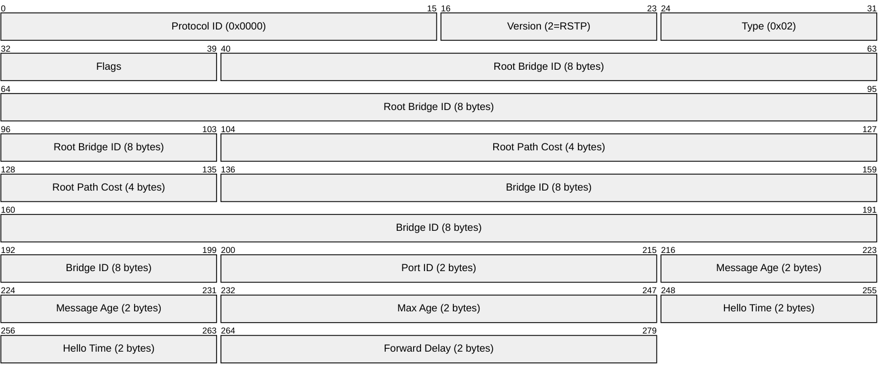
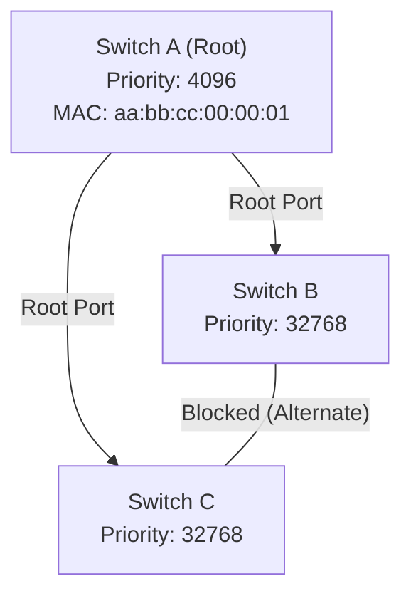
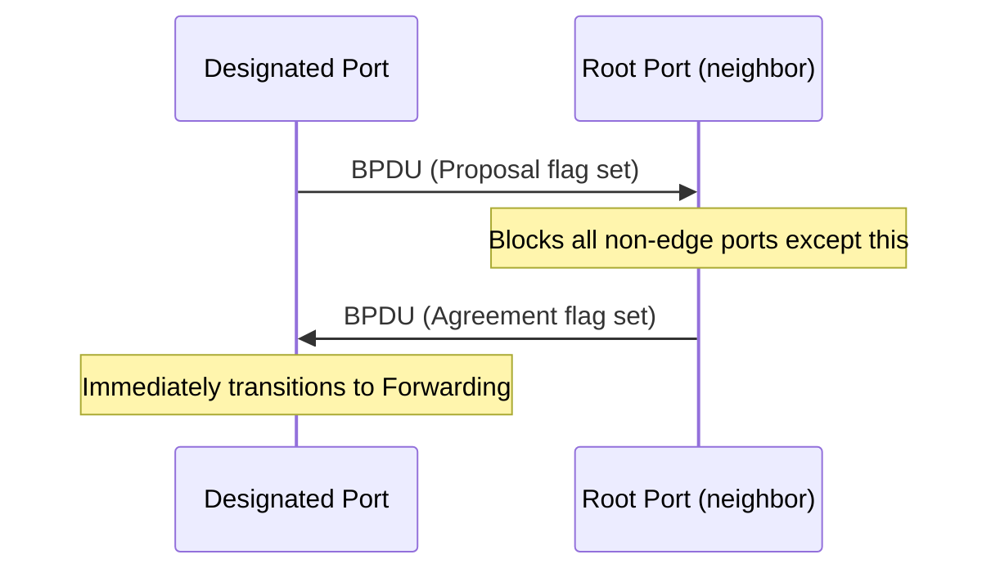
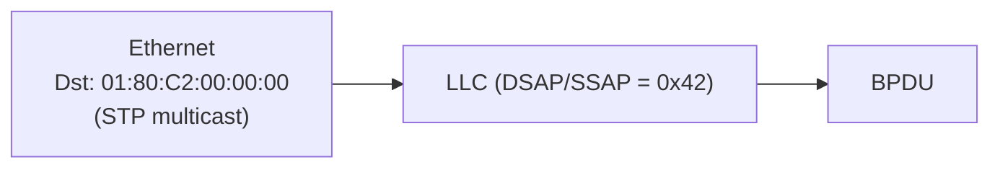

# STP / RSTP / MSTP (Spanning Tree Protocols)

> **Standard:** [IEEE 802.1D (STP/RSTP)](https://standards.ieee.org/standard/802_1D-2004.html) / [IEEE 802.1Q (MSTP)](https://standards.ieee.org/standard/802_1Q-2022.html) | **Layer:** Data Link (Layer 2) | **Wireshark filter:** `stp`

STP prevents forwarding loops in networks with redundant Layer 2 paths by selectively blocking ports. Without STP, a single loop causes a broadcast storm that can bring down an entire network in seconds. STP elects a Root Bridge, calculates shortest paths, and blocks redundant links. RSTP (Rapid STP) provides sub-second convergence (vs. 30-50 seconds for classic STP). MSTP maps multiple VLANs to spanning tree instances for efficient use of redundant links.

## BPDU (Bridge Protocol Data Unit)

### RSTP BPDU



## Key Fields

| Field | Size | Description |
|-------|------|-------------|
| Protocol ID | 16 bits | Always 0x0000 |
| Version | 8 bits | 0 = STP, 2 = RSTP, 3 = MSTP |
| Type | 8 bits | 0x00 = Config BPDU, 0x02 = RST BPDU, 0x80 = TCN |
| Flags | 8 bits | TC (bit 0), Proposal, Port Role, Learning, Forwarding, Agreement, TCA (bit 7) |
| Root Bridge ID | 8 bytes | Priority (4 bits) + System ID Extension (12 bits) + MAC (6 bytes) |
| Root Path Cost | 4 bytes | Cumulative cost from this bridge to the root |
| Bridge ID | 8 bytes | This bridge's ID (same format as Root Bridge ID) |
| Port ID | 2 bytes | Priority (4 bits) + Port Number (12 bits) |
| Message Age | 2 bytes | Age of this BPDU (in 1/256ths of a second) |
| Max Age | 2 bytes | Maximum BPDU age before discard (default 20s) |
| Hello Time | 2 bytes | Interval between BPDUs (default 2s) |
| Forward Delay | 2 bytes | Time in Listening/Learning states (default 15s) |

## Port States

### Classic STP

| State | Learns MACs | Forwards Data | Duration |
|-------|-------------|---------------|----------|
| Disabled | No | No | — |
| Blocking | No | No | Until topology change |
| Listening | No | No | Forward Delay (15s) |
| Learning | Yes | No | Forward Delay (15s) |
| Forwarding | Yes | Yes | Normal operation |

### RSTP (simplified)

| State | Description |
|-------|-------------|
| Discarding | Not forwarding (combines Disabled/Blocking/Listening) |
| Learning | Learning MACs, not yet forwarding |
| Forwarding | Fully operational |

## Port Roles

| Role | Description |
|------|-------------|
| Root Port | Best path to the Root Bridge (one per non-root bridge) |
| Designated Port | Best path for a segment toward the Root (one per segment) |
| Alternate Port | Backup path to the Root (RSTP — blocked, ready for fast failover) |
| Backup Port | Redundant path on the same segment (rare) |
| Disabled | Administratively shut down |

## Root Bridge Election

The bridge with the lowest Bridge ID becomes Root:

```
Bridge ID = Priority (4 bits) + VLAN / Sys-ID-Ext (12 bits) + MAC Address (48 bits)
```

Default priority is 32768. Lower priority wins. If equal, lowest MAC wins.

### Example Topology



## RSTP Convergence

RSTP converges in 1-3 seconds (vs. 30-50 for classic STP) using:

| Mechanism | Description |
|-----------|-------------|
| Proposal/Agreement | Rapid handshake to transition to Forwarding |
| Edge Ports | Ports connected to hosts skip Listening/Learning (like PortFast) |
| Alternate Ports | Pre-computed backup paths for instant failover |



## MSTP (Multiple Spanning Tree)

MSTP maps VLANs to spanning tree instances, allowing different VLANs to use different paths:

| Instance | VLANs | Root Bridge |
|----------|-------|-------------|
| MSTI 1 | 10, 20 | Switch A |
| MSTI 2 | 30, 40 | Switch B |

This provides load balancing across redundant links.

## Path Cost

| Link Speed | STP Cost (802.1D-1998) | RSTP Cost (802.1t) |
|------------|----------------------|---------------------|
| 10 Mbps | 100 | 2,000,000 |
| 100 Mbps | 19 | 200,000 |
| 1 Gbps | 4 | 20,000 |
| 10 Gbps | 2 | 2,000 |
| 100 Gbps | — | 200 |

## Encapsulation



STP BPDUs are sent to the well-known multicast address `01:80:C2:00:00:00` with LLC encapsulation.

## Standards

| Document | Title |
|----------|-------|
| [IEEE 802.1D-2004](https://standards.ieee.org/standard/802_1D-2004.html) | MAC Bridges (includes RSTP) |
| [IEEE 802.1Q-2022](https://standards.ieee.org/standard/802_1Q-2022.html) | Bridges and Bridged Networks (includes MSTP) |
| [IEEE 802.1w](https://standards.ieee.org/standard/802_1w-2001.html) | Rapid Spanning Tree (merged into 802.1D-2004) |

## See Also

- [Ethernet](ethernet.md) — the frames STP protects from loops
- [802.1Q](vlan8021q.md) — VLAN tagging (MSTP maps VLANs to instances)
- [LLDP](lldp.md) — link-layer discovery
- [LACP](lacp.md) — link aggregation (alternative to blocking redundant links)
