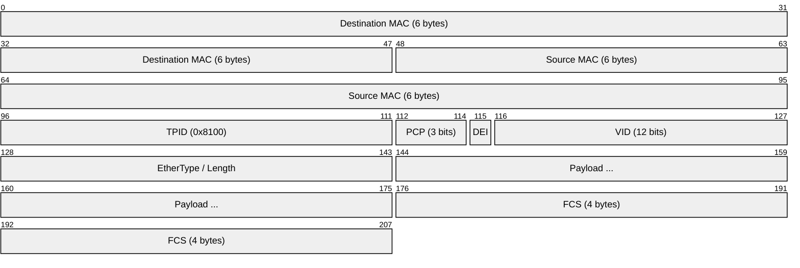
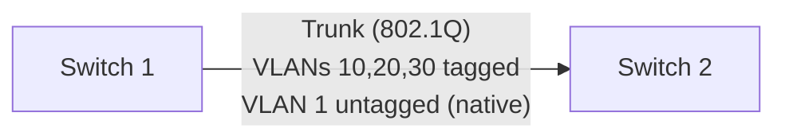
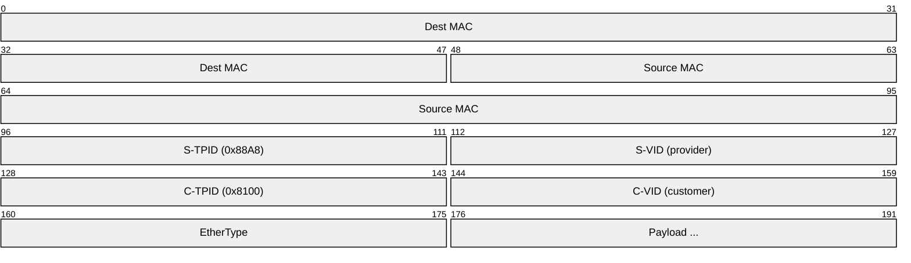

# IEEE 802.1Q (VLAN Tagging)

> **Standard:** [IEEE 802.1Q-2022](https://standards.ieee.org/standard/802_1Q-2022.html) | **Layer:** Data Link (Layer 2) | **Wireshark filter:** `vlan`

IEEE 802.1Q defines VLAN (Virtual LAN) tagging — a 4-byte tag inserted into Ethernet frames to identify which virtual network a frame belongs to. VLANs segment a physical network into isolated broadcast domains without requiring separate physical infrastructure. 802.1Q is implemented on virtually every managed switch and is fundamental to enterprise, data center, and service provider network design.

## Tagged Frame

The 4-byte 802.1Q tag is inserted between the Source MAC and the original EtherType field.

## Tag Fields

| Field | Size | Description |
|-------|------|-------------|
| TPID | 16 bits | Tag Protocol Identifier — `0x8100` for 802.1Q |
| PCP | 3 bits | Priority Code Point — 802.1p QoS priority (0-7) |
| DEI | 1 bit | Drop Eligible Indicator (formerly CFI) |
| VID | 12 bits | VLAN Identifier (0-4095) |

### VLAN ID Ranges

| VID | Purpose |
|-----|---------|
| 0 | Priority tag only (no VLAN) |
| 1 | Default VLAN |
| 2-1001 | Normal range |
| 1002-1005 | Reserved (Token Ring, FDDI — Cisco) |
| 1006-4094 | Extended range |
| 4095 | Reserved |

### Priority Code Point (PCP)

| PCP | Priority | Traffic Type |
|-----|----------|-------------|
| 0 | Best Effort | Default |
| 1 | Background | Bulk data |
| 2 | Excellent Effort | Important business |
| 3 | Critical Applications | Signaling |
| 4 | Video | Video streaming |
| 5 | Voice | VoIP bearer |
| 6 | Internetwork Control | Routing protocols |
| 7 | Network Control | Spanning tree, LLDP |

## Port Types

| Type | Behavior |
|------|----------|
| Access port | Carries one VLAN; frames are untagged on the wire |
| Trunk port | Carries multiple VLANs; frames are 802.1Q tagged |
| Native VLAN | VLAN carried untagged on a trunk (default: VLAN 1) |
| Voice VLAN | Separate VLAN for VoIP phones (tagged by the phone) |

### Trunk Operation

## Q-in-Q (802.1ad — Double Tagging)

Service providers use a second tag (S-Tag) to tunnel customer VLANs across their network:

| Tag | TPID | Purpose |
|-----|------|---------|
| S-Tag (outer) | 0x88A8 | Service provider VLAN |
| C-Tag (inner) | 0x8100 | Customer VLAN (preserved) |

## MTU Impact

The 4-byte tag increases the maximum Ethernet frame from 1518 to **1522 bytes**. Q-in-Q adds another 4 bytes (1526 bytes). Baby giant frame support is needed on all intermediate equipment.

## Standards

| Document | Title |
|----------|-------|
| [IEEE 802.1Q-2022](https://standards.ieee.org/standard/802_1Q-2022.html) | Bridges and Bridged Networks (VLANs, STP, and more) |
| [IEEE 802.1ad](https://standards.ieee.org/standard/802_1ad-2005.html) | Provider Bridges (Q-in-Q) |
| [IEEE 802.1p](https://standards.ieee.org/standard/802_1D-2004.html) | Priority (incorporated into 802.1Q) |

## See Also

- [Ethernet](ethernet.md) — base frame that 802.1Q extends
- [STP](stp.md) — prevents loops in VLAN-segmented networks
- [LLDP](lldp.md) — discovers VLAN assignments on neighbors
- [LACP](lacp.md) — link aggregation across trunk ports
