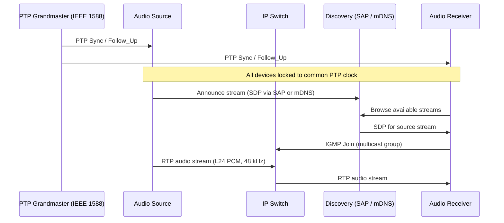
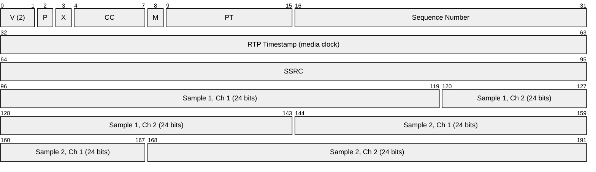
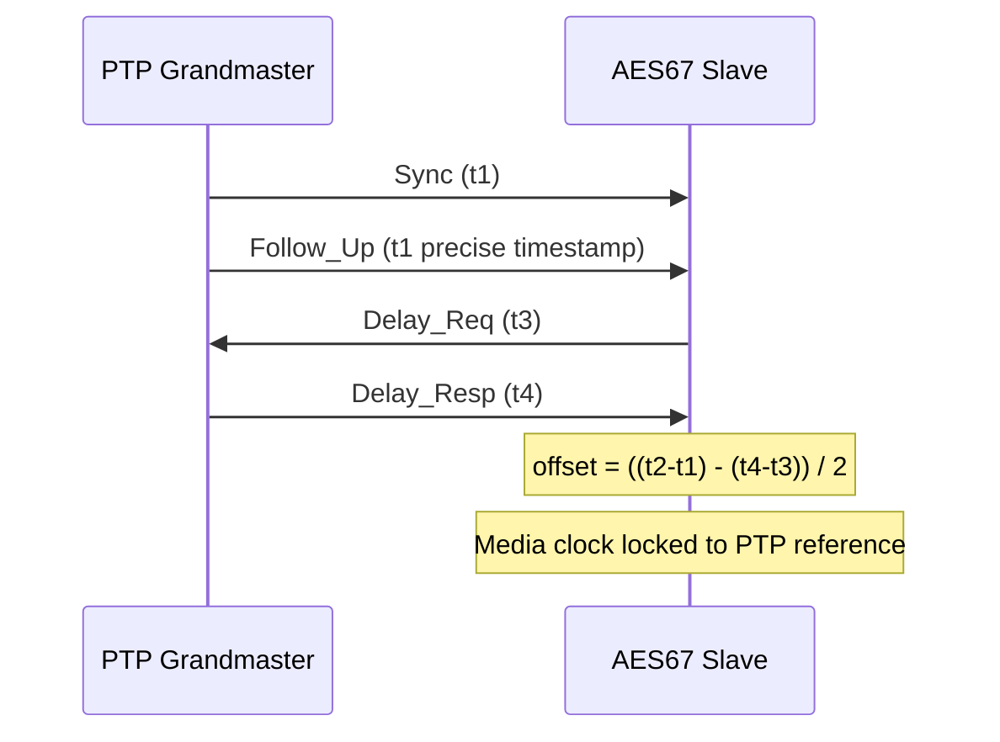
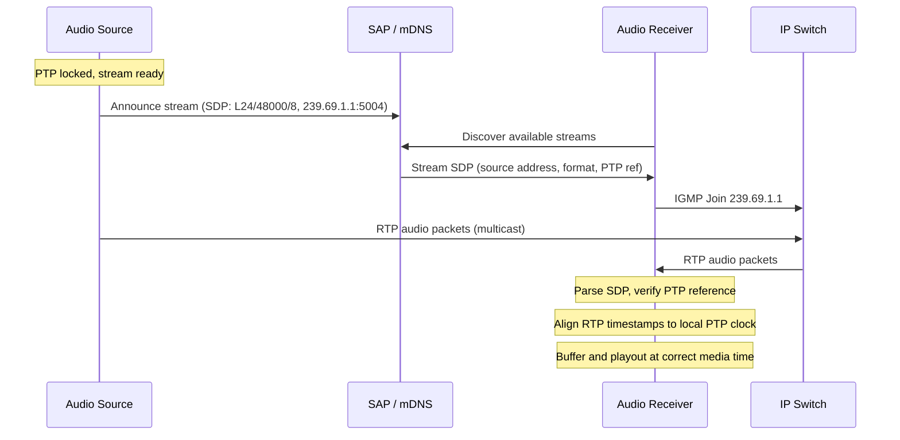
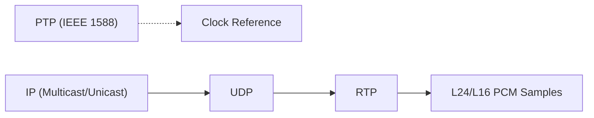

# AES67 (High-Performance Audio over IP)

> **Standard:** [AES67-2018](https://www.aes.org/publications/standards/search.cfm?docID=96) | **Layer:** Application (Layer 7) | **Wireshark filter:** `rtp`

AES67 is an interoperability standard published by the Audio Engineering Society for high-performance audio-over-IP transport. Rather than inventing a new protocol, AES67 defines a constrained profile of existing standards -- RTP for media transport, IEEE 1588 PTP for synchronization, SDP for session description, and SAP or mDNS for discovery -- creating a common ground where proprietary audio networking ecosystems (Dante, Ravenna, Livewire+, Q-LAN) can exchange audio streams. AES67 delivers uncompressed linear PCM audio with latencies as low as 1 ms over standard Layer 3 IP networks, and serves as the audio transport foundation for SMPTE ST 2110-30 in broadcast.

## Architecture

AES67 decomposes audio networking into four functional layers, each built on well-established standards:



## Protocol Stack

| Layer | Protocol | Role |
|-------|----------|------|
| Synchronization | IEEE 1588-2008 (PTPv2) | Sub-microsecond media clock alignment |
| Media Transport | RTP over UDP | Carries PCM audio samples |
| Session Description | SDP (RFC 4566) | Describes stream parameters (codec, rate, channels, multicast address) |
| Discovery | SAP (RFC 2974), mDNS/DNS-SD, NMOS IS-04 | Advertise and locate available streams |
| Network | IPv4 multicast (or unicast) | Standard Layer 3 IP infrastructure |

## RTP Payload

AES67 uses standard RTP (RFC 3550) with linear PCM payloads. No compression is applied -- samples are packed directly into the RTP payload:



Samples are packed in channel-interleaved order: all channels for sample 1, then all channels for sample 2, and so on. For L24 encoding, each sample is a 24-bit signed two's-complement integer in network byte order.

## Key Parameters

| Parameter | Value |
|-----------|-------|
| Encoding | L16 (16-bit linear PCM) or L24 (24-bit linear PCM) |
| Sample rate | 48 kHz (mandatory), 44.1 kHz (optional), 96 kHz (optional) |
| Channels per stream | 1 to 64 (typically 8 or 16) |
| Packet time | 1 ms (default, 48 samples at 48 kHz) |
| Other packet times | 125 us (6 samples), 250 us (12 samples), 4 ms (192 samples) |
| RTP payload type | Dynamic (negotiated via SDP, typically 96-127) |
| RTP clock rate | Matches sample rate (48000 for 48 kHz) |
| Transport | UDP unicast or multicast |
| IP version | IPv4 (mandatory), IPv6 (optional) |

## Packet Time and Latency

The packet time determines the number of samples per RTP packet and directly impacts latency:

| Packet Time | Samples (48 kHz) | Payload (stereo L24) | Total Bandwidth (stereo) | Use Case |
|-------------|-------------------|----------------------|--------------------------|----------|
| 125 us | 6 | 36 bytes | ~2.9 Mbps | Ultra-low latency |
| 250 us | 12 | 72 bytes | ~2.6 Mbps | Low latency |
| 1 ms | 48 | 288 bytes | ~2.5 Mbps | Default / recommended |
| 4 ms | 192 | 1152 bytes | ~2.4 Mbps | Higher channel count |

### Bandwidth per Channel

| Bit Depth | Sample Rate | Packet Time | Bandwidth per Channel |
|-----------|-------------|-------------|----------------------|
| L24 (24-bit) | 48 kHz | 1 ms | ~1.2 Mbps |
| L16 (16-bit) | 48 kHz | 1 ms | ~0.8 Mbps |
| L24 (24-bit) | 96 kHz | 1 ms | ~2.4 Mbps |

Bandwidth includes RTP/UDP/IP headers. At 1 ms packet time with L24/48 kHz, a 64-channel stream requires approximately 76 Mbps.

## PTP Synchronization (IEEE 1588-2008)

AES67 requires PTPv2 (IEEE 1588-2008) to synchronize media clocks across all devices with sub-microsecond accuracy:



### AES67 PTP Profile

| Parameter | AES67 Default Profile | AES67 Media Profile |
|-----------|-----------------------|---------------------|
| PTP version | IEEE 1588-2008 (PTPv2) | IEEE 1588-2008 (PTPv2) |
| Domain | 0 | 0 |
| Transport | UDP/IPv4 multicast (239.x.x.x) | UDP/IPv4 multicast |
| Sync interval | 1/8 s (125 ms) | 1/8 s (125 ms) |
| Announce interval | 1 s | 1 s |
| Delay mechanism | End-to-end (E2E) | End-to-end (E2E) |
| BMCA | Default (IEEE 1588) | Default (IEEE 1588) |
| Priority1 / Priority2 | 128 / 128 | 128 / 128 |

## Session Description (SDP)

Each AES67 stream is described by an SDP (RFC 4566) document specifying the media format, multicast address, and PTP clock reference:

```
v=0
o=- 1234 5678 IN IP4 192.168.1.10
s=AES67 Mic Array
t=0 0
m=audio 5004 RTP/AVP 98
c=IN IP4 239.69.1.1/32
a=rtpmap:98 L24/48000/8
a=ptime:1
a=mediaclk:direct=0
a=ts-refclk:ptp=IEEE1588-2008:00-1D-C1-FF-FE-00-12-34:0
a=recvonly
```

### Key SDP Attributes

| Attribute | Description |
|-----------|-------------|
| `rtpmap:98 L24/48000/8` | Payload type 98, L24 encoding, 48 kHz sample rate, 8 channels |
| `ptime:1` | 1 ms packet time |
| `mediaclk:direct=0` | Media clock offset from RTP timestamp |
| `ts-refclk:ptp=IEEE1588-2008:...` | PTP clock identity and domain for this stream |

## Discovery

AES67 does not mandate a single discovery mechanism. Multiple methods are used depending on the ecosystem:

| Method | Protocol | Description |
|--------|----------|-------------|
| SAP | RFC 2974 (UDP 9875, multicast 239.255.255.255) | Session Announcement Protocol -- periodic SDP broadcast |
| Bonjour/mDNS | RFC 6762/6763 (UDP 5353, multicast 224.0.0.251) | DNS-SD service registration (`_rtsp._tcp` or `_ravenna._tcp`) |
| NMOS IS-04 | AMWA REST API | Networked Media Open Specifications registry and query API |
| Manual | SDP file import | Direct SDP exchange for static configurations |

## Stream Setup Flow



## Interoperability

AES67 serves as a common interoperability layer between proprietary audio networking ecosystems. Each system can generate and receive AES67-compliant streams:

| Ecosystem | Vendor | AES67 Interop | Method |
|-----------|--------|---------------|--------|
| Dante | Audinate | Bidirectional | AES67 mode enabled per device |
| Ravenna | ALC NetworX | Native | Ravenna is AES67-superset |
| Livewire+ | Telos Alliance | Bidirectional | AES67 mode in Axia devices |
| Q-LAN | QSC | Bidirectional | AES67 compatibility mode |
| SMPTE ST 2110-30 | Broadcast | Native | ST 2110-30 is AES67-compliant |
| NMOS | AMWA | Discovery | IS-04/IS-05 for AES67 stream management |

## AES67 vs Dante vs AVB

| Feature | AES67 | Dante | AVB (IEEE 802.1) |
|---------|-------|-------|-------------------|
| Standard | AES67-2018 (open) | Audinate (proprietary) | IEEE 802.1BA (open) |
| Layer | Layer 3 (IP/UDP/RTP) | Layer 3 (IP/UDP) | Layer 2 (Ethernet) |
| Synchronization | PTP (IEEE 1588-2008) | PTP (IEEE 1588) | gPTP (IEEE 802.1AS) |
| Audio format | L16/L24 PCM, uncompressed | 16/24/32-bit PCM | AAF (AVTP Audio Format) |
| Sample rates | 44.1, 48, 96 kHz | 44.1, 48, 88.2, 96 kHz | 44.1, 48, 96 kHz |
| Channels per stream | Up to 64 | Up to 512 per device | Up to 60 per stream (Class A) |
| Latency | 1-5 ms typical | 0.15-5 ms (selectable) | 2 ms / 7 hops (Class A) |
| Infrastructure | Standard IP (Layer 3) | Standard IP (Layer 3) | AVB-capable switches (Layer 2) |
| Discovery | SAP, mDNS, NMOS | mDNS/DNS-SD, Dante Controller | AVDECC (IEEE 1722.1) |
| Multicast | Supported (primary) | Unicast and multicast | Multicast (Layer 2) |
| Bandwidth reservation | None (best effort or QoS) | None (QoS recommended) | SRP (IEEE 802.1Qat) guaranteed |
| Routing across subnets | Yes (Layer 3) | Yes (Layer 3) | No (Layer 2 only without TSN) |
| Ecosystem size | Growing (interop standard) | Dominant (100,000+ products) | Niche (automotive, some pro audio) |

## Encapsulation



## Standards

| Document | Title |
|----------|-------|
| [AES67-2018](https://www.aes.org/publications/standards/search.cfm?docID=96) | High-performance streaming audio-over-IP interoperability |
| [IEEE 1588-2008](https://standards.ieee.org/ieee/1588/4355/) | Precision Time Protocol (PTPv2) |
| [RFC 3550](https://www.rfc-editor.org/rfc/rfc3550) | RTP: A Transport Protocol for Real-Time Applications |
| [RFC 3190](https://www.rfc-editor.org/rfc/rfc3190) | RTP Payload Format for 12-bit DAT, 20/24-bit Linear (L24) |
| [RFC 4566](https://www.rfc-editor.org/rfc/rfc4566) | SDP: Session Description Protocol |
| [RFC 2974](https://www.rfc-editor.org/rfc/rfc2974) | SAP: Session Announcement Protocol |
| [RFC 7273](https://www.rfc-editor.org/rfc/rfc7273) | RTP Clock Source Signalling (ts-refclk, mediaclk) |
| [AMWA NMOS IS-04](https://specs.amwa.tv/is-04/) | Discovery & Registration |
| [AMWA NMOS IS-05](https://specs.amwa.tv/is-05/) | Device Connection Management |

## See Also

- [SMPTE ST 2110](smpte2110.md) -- professional media over IP (ST 2110-30 audio is AES67-compatible)
- [RTP](../voip/rtp.md) -- underlying transport protocol for AES67 audio
- [SDP](../voip/sdp.md) -- session description format for AES67 stream parameters
- [mDNS](../naming/mdns.md) -- multicast DNS used for Bonjour/DNS-SD discovery
- [NTP](../naming/ntp.md) -- time synchronization (PTP is the high-precision variant)
- [Dante](dante.md) -- proprietary audio networking with AES67 interoperability
- [AVB / TSN](avb.md) -- IEEE Layer 2 audio/video bridging
