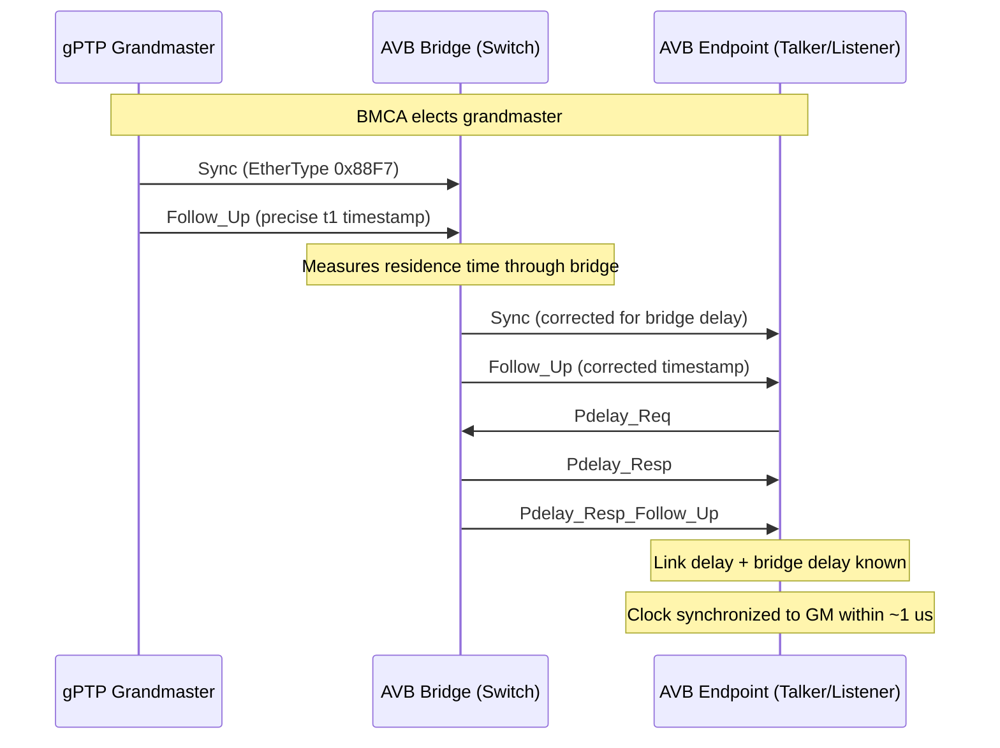
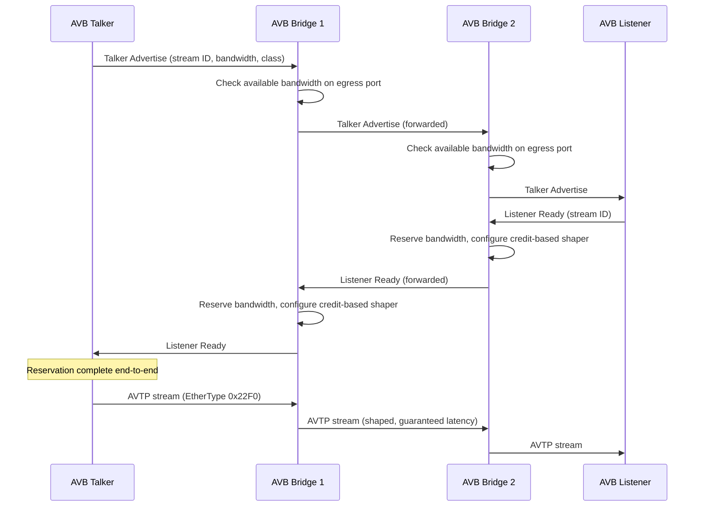
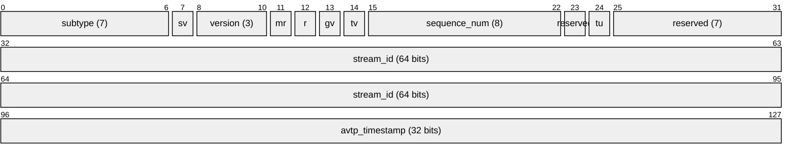
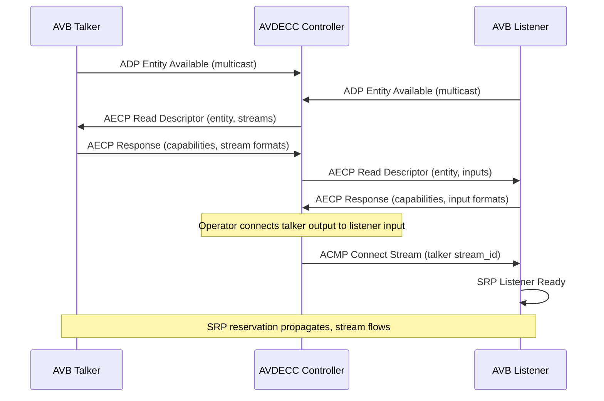
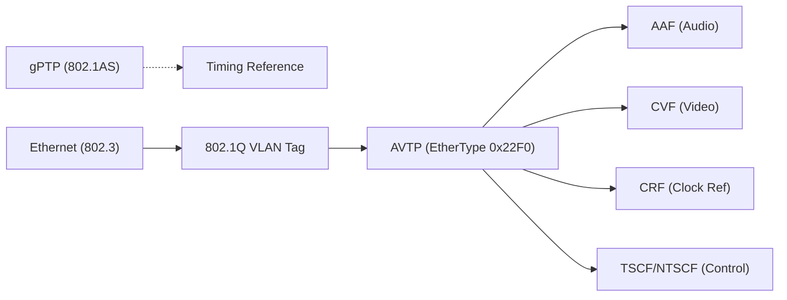

# AVB / TSN (Audio Video Bridging / Time-Sensitive Networking)

> **Standard:** [IEEE 802.1BA](https://standards.ieee.org/ieee/802.1BA/4869/) | **Layer:** Data Link (Layer 2) | **Wireshark filter:** `avtp` or `ieee1722`

AVB (Audio Video Bridging) is a suite of IEEE 802.1 standards that provides guaranteed, low-latency transport of time-sensitive audio and video streams over standard Ethernet at Layer 2, without requiring IP. AVB delivers deterministic timing, bandwidth reservation, and bounded latency -- capabilities absent from standard Ethernet. The IEEE later expanded AVB into TSN (Time-Sensitive Networking), adding scheduled traffic, centralized configuration, and frame replication for industrial, automotive, and aerospace applications. AVB/TSN operates below the IP layer, using a dedicated EtherType (0x22F0) and requiring AVB-capable switches, but in return guarantees worst-case latency of 2 ms over 7 hops for Class A streams.

## Standards Suite

### AVB (Original Suite)

| Standard | Name | Description |
|----------|------|-------------|
| IEEE 802.1AS | gPTP | Generalized Precision Time Protocol -- profile of IEEE 1588 for Layer 2 |
| IEEE 802.1Qav | FQTSS | Forwarding and Queuing for Time-Sensitive Streams -- credit-based shaper |
| IEEE 802.1Qat | SRP | Stream Reservation Protocol -- bandwidth reservation via MMRP/MVRP |
| IEEE 802.1BA | AVB Systems | Profile combining the above into a complete AVB system |

### TSN Extensions (Superset of AVB)

| Standard | Name | Description |
|----------|------|-------------|
| IEEE 802.1Qbv | TAS | Time-Aware Shaper -- scheduled traffic with gate control lists |
| IEEE 802.1Qcc | SRP Enhancements | Centralized and hybrid stream reservation models |
| IEEE 802.1CB | FRER | Frame Replication and Elimination for Reliability |
| IEEE 802.1Qci | PSFP | Per-Stream Filtering and Policing |
| IEEE 802.1Qcr | ATS | Asynchronous Traffic Shaping |
| IEEE 802.1AS-2020 | gPTP rev | Revised gPTP with multiple domains, hot standby |
| IEEE 802.1Qch | CQF | Cyclic Queuing and Forwarding |

## gPTP Synchronization (IEEE 802.1AS)

All AVB/TSN devices synchronize to a common time base using gPTP, a profile of IEEE 1588 optimized for bridged Ethernet networks. gPTP operates at Layer 2 and measures link delay on each hop:

### gPTP Parameters

| Parameter | Value |
|-----------|-------|
| PTP profile | IEEE 802.1AS (gPTP) |
| Transport | Layer 2, EtherType 0x88F7 |
| Delay mechanism | Peer-to-peer (Pdelay) only |
| Sync interval | 125 ms (default) |
| Pdelay interval | 1 s (default) |
| Accuracy | < 1 us across 7 hops (typical) |
| Domain | Single domain (AVB), multiple domains (802.1AS-2020) |
| BMCA | gPTP BMCA (similar to IEEE 1588 but simplified) |

## Stream Reservation Protocol (IEEE 802.1Qat)

Before an AVB talker can transmit, it must reserve bandwidth along the entire path to the listener. SRP uses MMRP (Multiple MAC Registration Protocol) to propagate reservation requests hop by hop:

### SRP Bandwidth Reservation

| Parameter | Class A | Class B |
|-----------|---------|---------|
| Maximum latency per hop | 250 us | 2 ms |
| Maximum latency (7 hops) | 2 ms | 50 ms |
| Reserved bandwidth | Up to 75% of link capacity | Up to 75% of link capacity |
| VLAN Priority (PCP) | 3 | 2 |
| VLAN ID | 2 (default) | 2 (default) |
| Observation interval | 125 us | 250 us |

## AVTP (IEEE 1722) -- Audio Video Transport Protocol

AVTP is the media transport protocol for AVB, operating at Layer 2 with EtherType 0x22F0. It carries audio, video, clock reference, and control data in a common framing structure:

### AVTP Common Header

### AVTP Key Fields

| Field | Size | Description |
|-------|------|-------------|
| subtype | 7 bits | AVTP data type (AAF=0x02, CVF=0x03, CRF=0x04, etc.) |
| sv | 1 bit | Stream ID valid |
| version | 3 bits | AVTP version (0) |
| mr | 1 bit | Media clock restart |
| gv | 1 bit | Gateway info valid |
| tv | 1 bit | AVTP timestamp valid |
| sequence_num | 8 bits | Per-stream packet sequence counter |
| tu | 1 bit | Timestamp uncertain |
| stream_id | 64 bits | Unique stream identifier (MAC + unique ID) |
| avtp_timestamp | 32 bits | Presentation time (gPTP-derived, nanoseconds) |

### AVTP Subtypes

| Subtype | Value | Name | Description |
|---------|-------|------|-------------|
| AAF | 0x02 | AVTP Audio Format | Uncompressed PCM audio (L16, L24, L32, float) |
| CVF | 0x03 | Compressed Video Format | H.264, MJPEG compressed video |
| CRF | 0x04 | Clock Reference Format | Clock recovery for non-gPTP media clocks |
| TSCF | 0x05 | Time-Synchronous Control Format | Timestamped control messages |
| NTSCF | 0x06 | Non-Time-Synchronous Control Format | Non-timestamped control |
| ACF | -- | AVTP Control Format | Vehicle bus tunneling (CAN, LIN, FlexRay) |

### AAF (AVTP Audio Format) Parameters

| Parameter | Value |
|-----------|-------|
| Bit depths | 16, 24, 32-bit integer; 32-bit float |
| Sample rates | 8, 16, 32, 44.1, 48, 88.2, 96, 176.4, 192 kHz |
| Channels per stream | 1 to 60+ (Class A), limited by bandwidth reservation |
| Frames per packet | Configurable (8 typical at 48 kHz for Class A) |
| Presentation time | gPTP-derived timestamp in AVTP header |

## AVDECC (IEEE 1722.1) -- Discovery and Control

AVDECC provides discovery, enumeration, connection management, and control for AVB endpoints:

### AVDECC Protocols

| Protocol | Full Name | Description |
|----------|-----------|-------------|
| ADP | AVDECC Discovery Protocol | Entity advertisement and discovery (multicast) |
| AECP | AVDECC Enumeration and Control Protocol | Read/write entity descriptors and parameters |
| ACMP | AVDECC Connection Management Protocol | Establish and tear down stream connections |

## MAAP (MAC Address Acquisition Protocol)

AVB streams use multicast destination MAC addresses from the reserved range 91:E0:F0:00:00:00 to 91:E0:F0:00:FD:FF. MAAP dynamically allocates these addresses to avoid conflicts:

| Parameter | Value |
|-----------|-------|
| EtherType | 0x22F0 (shared with AVTP) |
| MAC range | 91:E0:F0:00:00:00 -- 91:E0:F0:00:FD:FF |
| Allocation | Dynamic per-stream (MAAP protocol) |
| Probe count | 3 probes before claiming |

## TSN Traffic Shaping

TSN extends AVB with more sophisticated traffic shaping mechanisms:

### Credit-Based Shaper (802.1Qav -- AVB)

The original AVB shaper limits burst size using a credit counter. A stream can only transmit when its credit is non-negative:

| Parameter | Description |
|-----------|-------------|
| idleSlope | Rate at which credit accumulates when not transmitting |
| sendSlope | Rate at which credit depletes when transmitting |
| maxCredit | Maximum accumulated credit |
| minCredit | Maximum negative credit (debt from last frame) |

### Time-Aware Shaper (802.1Qbv -- TSN)

TAS adds scheduled time windows (gates) for different traffic classes, enabling deterministic worst-case latency:

| Feature | Description |
|---------|-------------|
| Gate Control List (GCL) | Cyclic schedule defining which queues can transmit in each time slot |
| Guard band | Protected interval before gate close to prevent frame truncation |
| Cycle time | Repetition period of the gate schedule |
| Time source | gPTP synchronized across all bridges |

## Layer 2 Operation

AVB/TSN operates entirely at Layer 2 -- no IP stack is required:

| Parameter | Value |
|-----------|-------|
| AVTP EtherType | 0x22F0 |
| gPTP EtherType | 0x88F7 |
| VLAN | Required (802.1Q tagged, default VLAN ID 2) |
| Priority (PCP) | 3 (Class A), 2 (Class B) |
| Link speeds | 100 Mbps, 1 Gbps, 2.5 Gbps, 5 Gbps, 10 Gbps |
| Switch requirement | AVB/TSN-capable bridges (hardware support required) |
| IP encapsulation | Not required, but possible (RTP/IP over TSN) |

## Use Cases

| Domain | Application | Why AVB/TSN |
|--------|-------------|-------------|
| Automotive | In-vehicle audio, camera, ADAS | Deterministic latency, Layer 2 efficiency, weight savings |
| Pro Audio | Live sound, installed AV (Milan) | Guaranteed bandwidth, interoperability (Milan profile) |
| Industrial | Motion control, factory automation | Hard real-time, frame replication (FRER) |
| Aerospace | Avionics data buses | Deterministic, redundant, standard Ethernet |
| Broadcast | Studio audio/video | Bounded latency, synchronization |

### Milan

Milan is an AVB profile defined by the Avnu Alliance for pro audio and AV interoperability. It mandates specific AVTP formats, AVDECC behaviors, and SRP parameters to ensure plug-and-play operation across Milan-certified devices.

## AVB/TSN vs AES67 vs Dante vs SMPTE ST 2110

| Feature | AVB/TSN | AES67 | Dante | SMPTE ST 2110 |
|---------|---------|-------|-------|---------------|
| Standard | IEEE 802.1 (open) | AES67-2018 (open) | Audinate (proprietary) | SMPTE (open) |
| OSI Layer | Layer 2 | Layer 3 (IP) | Layer 3 (IP) | Layer 3 (IP) |
| Synchronization | gPTP (802.1AS) | PTP (IEEE 1588) | PTP (IEEE 1588) | PTP (ST 2059) |
| Bandwidth guarantee | SRP reservation (guaranteed) | None (QoS/DSCP) | None (QoS/DSCP) | None (QoS/DSCP) |
| Latency | 2 ms / 7 hops (Class A) | 1-5 ms (typical) | 0.15-5 ms (selectable) | < 1 frame |
| Routing | Layer 2 only (no IP routing) | Layer 3 routable | Layer 3 routable | Layer 3 routable |
| Switch requirement | AVB/TSN capable | Standard IP | Standard IP | Managed IP |
| Media types | Audio + video + control | Audio only | Audio (+ video via Dante AV) | Video + audio + data |
| Discovery | AVDECC (IEEE 1722.1) | SAP, mDNS, NMOS | mDNS, Dante Controller | NMOS IS-04/IS-05 |
| Video support | CVF (H.264, MJPEG) | No | JPEG 2000 (Dante AV) | Uncompressed / JPEG XS |
| AES67 interop | Via IP gateway | Native | AES67 mode | ST 2110-30 (AES67) |
| Redundancy | FRER (802.1CB) | ST 2022-7 (at IP layer) | Dual NIC | ST 2022-7 |
| Ecosystem | Automotive, Milan pro audio | Broadcast interop layer | 100,000+ pro audio products | Broadcast facilities |

## Encapsulation

## Standards

| Document | Title |
|----------|-------|
| [IEEE 802.1AS](https://standards.ieee.org/ieee/802.1AS/6023/) | Timing and Synchronization for Time-Sensitive Applications (gPTP) |
| [IEEE 802.1Qav](https://standards.ieee.org/ieee/802.1Qav/3964/) | Forwarding and Queuing for Time-Sensitive Streams (FQTSS) |
| [IEEE 802.1Qat](https://standards.ieee.org/ieee/802.1Qat/3939/) | Stream Reservation Protocol (SRP) |
| [IEEE 802.1BA](https://standards.ieee.org/ieee/802.1BA/4869/) | Audio Video Bridging Systems |
| [IEEE 1722-2016](https://standards.ieee.org/ieee/1722/5765/) | Audio Video Transport Protocol (AVTP) |
| [IEEE 1722.1-2013](https://standards.ieee.org/ieee/1722.1/5238/) | AVDECC Discovery, Enumeration, Connection management, and Control |
| [IEEE 802.1Qbv](https://standards.ieee.org/ieee/802.1Qbv/5765/) | Enhancements for Scheduled Traffic (TAS) |
| [IEEE 802.1Qcc](https://standards.ieee.org/ieee/802.1Qcc/6074/) | Stream Reservation Protocol Enhancements and Performance Improvements |
| [IEEE 802.1CB](https://standards.ieee.org/ieee/802.1CB/6457/) | Frame Replication and Elimination for Reliability (FRER) |
| [IEEE 802.1Qci](https://standards.ieee.org/ieee/802.1Qci/5765/) | Per-Stream Filtering and Policing (PSFP) |
| [Avnu Alliance Milan](https://avnu.org/milan/) | Pro AV profile for AVB interoperability |

## See Also

- [AES67](aes67.md) -- Layer 3 audio-over-IP interoperability standard
- [Dante](dante.md) -- dominant proprietary audio networking protocol
- [SMPTE ST 2110](smpte2110.md) -- professional media over managed IP networks
- [Ethernet](../link-layer/ethernet.md) -- underlying link layer for AVB/TSN
- [VLAN (802.1Q)](../link-layer/vlan8021q.md) -- VLAN tagging required by AVB streams
- [NTP](../naming/ntp.md) -- time synchronization (gPTP is the precision Layer 2 variant)
- [RTP](../voip/rtp.md) -- transport protocol used by IP-based alternatives (AES67, ST 2110)
