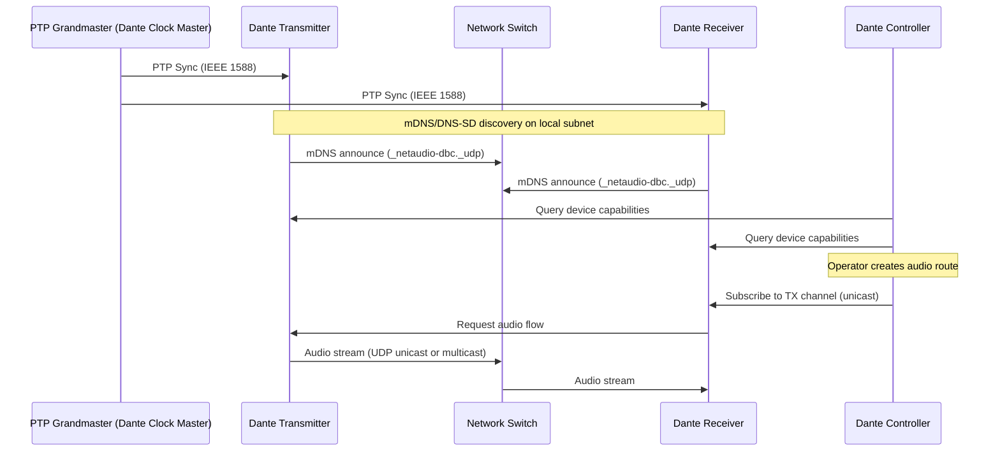
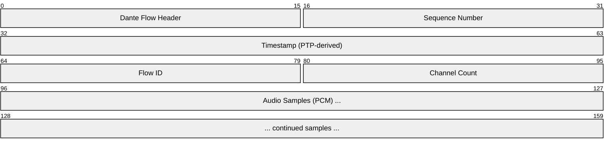
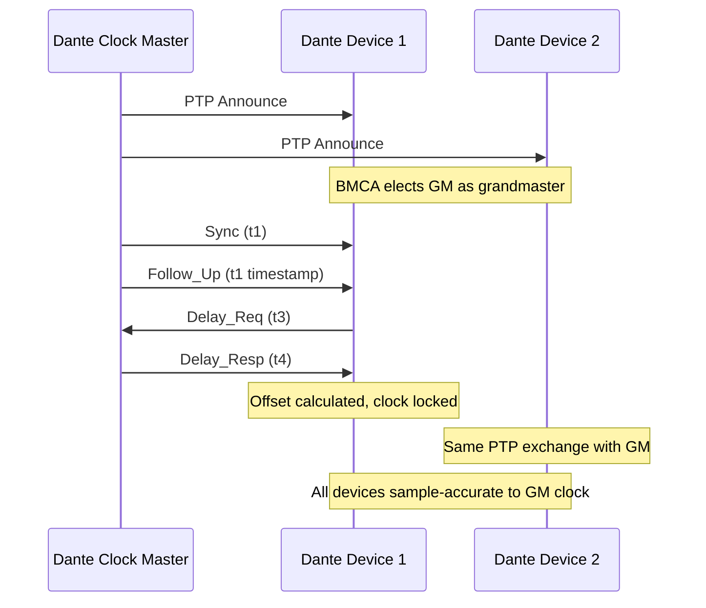
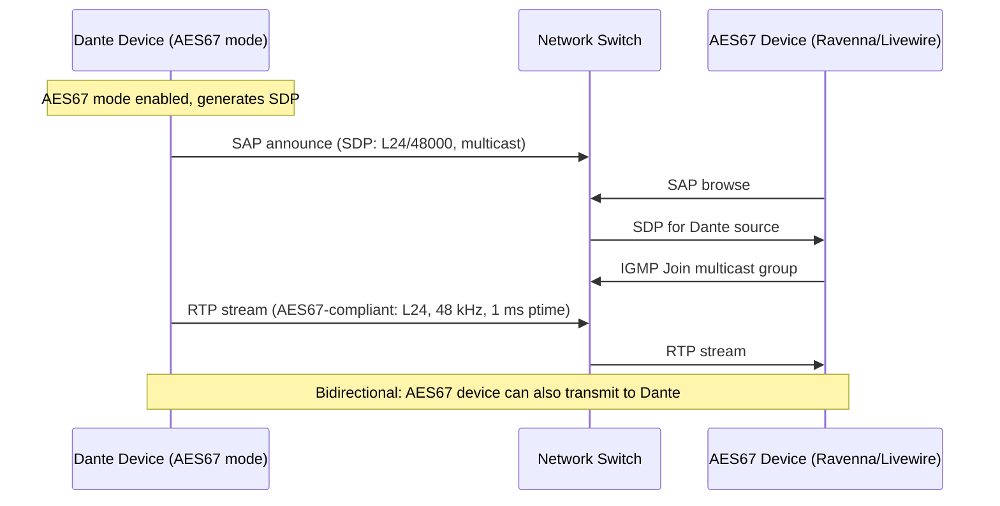
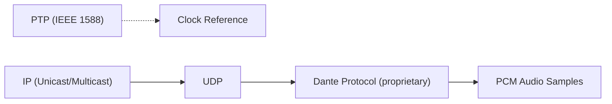
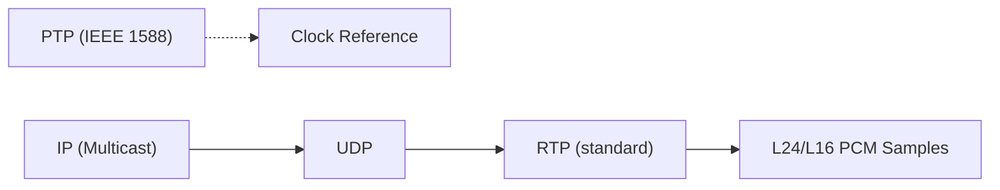

# Dante (Digital Audio Network Through Ethernet)

> **Standard:** [Audinate Dante](https://www.audinate.com/meet-dante/what-is-dante) | **Layer:** Application (Layer 7) | **Wireshark filter:** `mdns` (discovery) or `rtp` (AES67 mode)

Dante is a proprietary audio (and video) networking technology developed by Audinate that transports uncompressed, multi-channel digital audio over standard Ethernet networks using Layer 3 IP. It is the dominant audio networking protocol in professional audio, integrated into over 100,000 products from more than 500 manufacturers including Shure, Yamaha, Harman, Bose, and Biamp. Dante uses IEEE 1588 PTP for synchronization, mDNS/DNS-SD for zero-configuration device discovery, and a proprietary framing and management protocol for audio routing. Dante supports AES67 bidirectional interoperability and has expanded into video transport with Dante AV.

## Architecture

Dante uses a controller-managed architecture where devices discover each other automatically and audio routing is established through Dante Controller software or Dante Domain Manager:

## Discovery

Dante uses mDNS/DNS-SD (Bonjour) for automatic zero-configuration device discovery on the local subnet. Devices register service instances that describe their capabilities:

### Service Types

| Service | Protocol | Description |
|---------|----------|-------------|
| `_netaudio-dbc._udp` | mDNS/DNS-SD | Dante device browsing and control |
| `_netaudio-arc._udp` | mDNS/DNS-SD | Dante audio routing control |
| `_netaudio-cmc._udp` | mDNS/DNS-SD | Dante clock management |
| `_netaudio-dcp._udp` | mDNS/DNS-SD | Dante control protocol |

### Discovery Methods

| Method | Scope | Description |
|--------|-------|-------------|
| mDNS/DNS-SD | Local subnet | Automatic zero-config discovery (default) |
| Dante Controller | Single/multi-subnet | Software application for managing routing |
| Dante Domain Manager | Enterprise | Server-based management, cross-subnet, LDAP auth |
| Dante Discovery (unicast DNS) | Multi-subnet | DNS-SD via unicast DNS for routed networks |

## Audio Transport

Dante carries audio as uncompressed PCM samples in a proprietary UDP framing format. Flows are established as unicast (point-to-point) or multicast (one-to-many):

Note: The exact Dante framing format is proprietary and not publicly documented. The above represents the general structure based on observed behavior.

### Audio Parameters

| Parameter | Value |
|-----------|-------|
| Bit depths | 16-bit, 24-bit, 32-bit integer |
| Sample rates | 44.1 kHz, 48 kHz, 88.2 kHz, 96 kHz |
| Channels per device | Up to 512 transmit and 512 receive (hardware dependent) |
| Channels per flow | Typically 1-8 (unicast), 1-8 (multicast) |
| Encoding | Linear PCM, uncompressed |
| Transport | UDP unicast (default) or UDP multicast |
| Multicast range | 239.255.x.x (auto-assigned) |

### Latency Presets

Dante offers device-configurable latency presets that determine the receive buffer depth:

| Latency Preset | Buffer | Network Hops | Use Case |
|----------------|--------|--------------|----------|
| 0.15 ms | 150 us | 1-2 | Single switch, lowest latency |
| 0.25 ms | 250 us | 1-3 | Small networks |
| 0.5 ms | 500 us | 3-5 | Medium networks (default for many devices) |
| 1 ms | 1 ms | 5-10 | Large switched networks |
| 2 ms | 2 ms | 10+ | Very large networks, multiple subnets |
| 5 ms | 5 ms | Any | Routed networks, Wi-Fi bridges |

Latency is measured from the transmitter DAC to the receiver DAC. All receiving devices on a network should use the same latency setting for synchronous playout.

## PTP Synchronization

Dante uses IEEE 1588-2008 (PTPv2) for network-wide clock synchronization. One Dante device is elected as the PTP Grandmaster (clock master) using the Best Master Clock Algorithm (BMCA):

### Dante PTP Parameters

| Parameter | Value |
|-----------|-------|
| PTP version | IEEE 1588-2008 (PTPv2) |
| Transport | UDP/IPv4 (ports 319, 320) |
| Domain | 0 (default) |
| Sync interval | 1/8 s (125 ms) |
| BMCA priority | Automatic or user-configurable (Preferred Master) |
| Accuracy | Sub-microsecond (< 1 us across managed switches) |

## Network Requirements

| Requirement | Details |
|-------------|---------|
| Minimum link speed | 100 Mbps (limited channels), 1 Gbps recommended |
| QoS (DSCP) | EF (46) for audio, CS7 (56) for PTP, CS5 (40) for control |
| IGMP snooping | Required for multicast flows |
| EEE (Energy Efficient Ethernet) | Must be disabled (802.3az causes timing issues) |
| Spanning Tree | RSTP recommended, convergence time affects redundancy |
| Managed switches | Recommended (required for QoS and multicast management) |

## Ports

| Port Range | Protocol | Purpose |
|------------|----------|---------|
| 319, 320 | UDP | PTP (IEEE 1588) synchronization |
| 5353 | UDP | mDNS discovery (multicast 224.0.0.251) |
| 8700-8706 | TCP/UDP | Dante control and monitoring |
| 14336-14600 | UDP | Audio transport (auto-negotiated per flow) |
| 4321, 4440 | TCP | Dante Controller communication |
| 38700-38800 | UDP | Dante AV video transport |

## Dante Products and Software

| Product | Description |
|---------|-------------|
| Dante Controller | Free Windows/Mac application for routing and device management |
| Dante Domain Manager | Enterprise server software: user auth (LDAP), multi-subnet routing, audit logging |
| Dante Via | Software driver for routing computer audio (any application) as Dante |
| Dante Virtual Soundcard | ASIO/WDM/Core Audio driver connecting a computer to Dante |
| Dante AVIO | Hardware adapters (analog, AES3, USB, Bluetooth to Dante) |
| Dante AV | Video extension using JPEG 2000 compression |

## Dante AV

Dante AV extends the Dante ecosystem to include synchronized video transport:

| Parameter | Value |
|-----------|-------|
| Video codec | JPEG 2000 (low latency profile) |
| Video latency | < 1 frame (typical) |
| Resolutions | Up to 4K UHD (3840x2160) |
| Synchronization | PTP (shared with audio clock) |
| Transport | UDP (proprietary framing) |
| Audio | Standard Dante audio (synchronized with video) |

## AES67 Interoperability

Dante devices can enable AES67 compatibility mode, allowing bidirectional audio exchange with any AES67-compliant system:

### AES67 Mode Constraints

| Parameter | Dante Native | Dante AES67 Mode |
|-----------|-------------|------------------|
| Encoding | 16/24/32-bit PCM | L16 or L24 PCM only |
| Sample rate | 44.1-96 kHz | 48 kHz (mandatory), 44.1/96 kHz (optional) |
| Packet time | Device-dependent | 1 ms (required for interop) |
| Transport | Proprietary UDP | Standard RTP/UDP |
| Discovery | mDNS (Dante) | SAP + mDNS |
| Channels per flow | Up to 8 | Up to 8 per multicast flow |

## Redundancy

Dante supports network redundancy via dual-NIC (primary and secondary) Ethernet ports on supported devices:

| Feature | Description |
|---------|-------------|
| Mode | Redundant (active backup) or Switched (daisy-chain) |
| Failover | Automatic, hitless (< 1 ms interruption) |
| Topology | Two independent network fabrics (primary/secondary) |
| Requirement | Both NICs must be same speed, separate switches |

## Dante vs AES67 vs AVB vs MADI

| Feature | Dante | AES67 | AVB (802.1BA) | MADI (AES10) |
|---------|-------|-------|---------------|--------------|
| Standard | Proprietary (Audinate) | AES67-2018 (open) | IEEE 802.1 (open) | AES10-2008 (open) |
| Layer | Layer 3 (IP/UDP) | Layer 3 (IP/UDP/RTP) | Layer 2 (Ethernet) | Physical (coax/fiber) |
| Channels | 512 per device | 64 per stream | 60 per stream (Class A) | 64 per link |
| Sample rates | 44.1-96 kHz | 44.1, 48, 96 kHz | 48, 96 kHz | 44.1, 48 kHz |
| Bit depth | 16/24/32-bit | 16/24-bit | 16/24/32-bit | 24-bit |
| Latency | 0.15-5 ms (selectable) | 1-5 ms | 2 ms / 7 hops (Class A) | Fixed (frame-based) |
| Distance | Unlimited (IP routed) | Unlimited (IP routed) | Layer 2 domain | 2 km (fiber), 100 m (coax) |
| Sync | PTP (IEEE 1588) | PTP (IEEE 1588) | gPTP (802.1AS) | Word clock / internal |
| Bandwidth reservation | QoS (DSCP) | QoS (DSCP) | SRP (guaranteed) | Dedicated link |
| Infrastructure | Standard IP switches | Standard IP switches | AVB-capable switches | Point-to-point |
| Products | 100,000+ | Growing (interop) | Limited (pro audio) | Widespread (studios) |

## Encapsulation

In AES67 interop mode:

## Standards

| Document | Title |
|----------|-------|
| [Audinate Dante](https://www.audinate.com/meet-dante/what-is-dante) | Dante technology overview and specifications |
| [AES67-2018](https://www.aes.org/publications/standards/search.cfm?docID=96) | AES67 interoperability standard |
| [IEEE 1588-2008](https://standards.ieee.org/ieee/1588/4355/) | Precision Time Protocol (PTPv2) |
| [RFC 6762](https://www.rfc-editor.org/rfc/rfc6762) | Multicast DNS (mDNS) |
| [RFC 6763](https://www.rfc-editor.org/rfc/rfc6763) | DNS-Based Service Discovery (DNS-SD) |

## See Also

- [AES67](aes67.md) -- open interoperability standard for audio over IP
- [SMPTE ST 2110](smpte2110.md) -- professional media over IP (ST 2110-30 audio via AES67)
- [AVB / TSN](avb.md) -- IEEE Layer 2 audio/video bridging with guaranteed bandwidth
- [RTP](../voip/rtp.md) -- transport protocol used in Dante AES67 mode
- [mDNS](../naming/mdns.md) -- multicast DNS used for Dante device discovery
- [SDP](../voip/sdp.md) -- session description for AES67 interop streams
- [NTP](../naming/ntp.md) -- time synchronization (PTP is the precision variant used by Dante)
