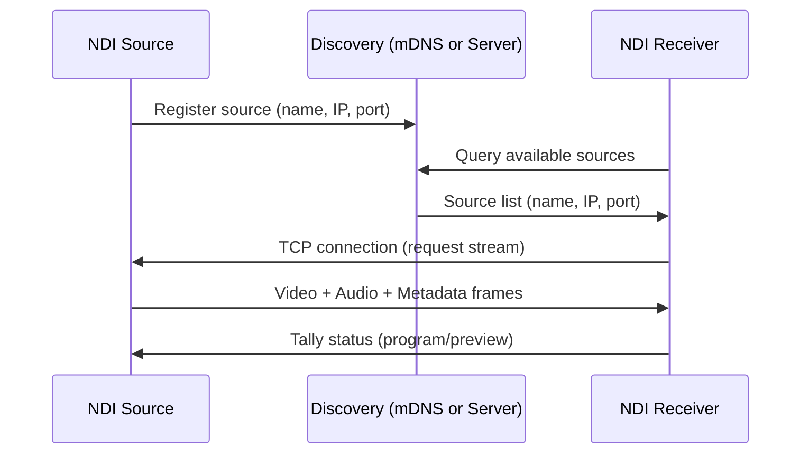
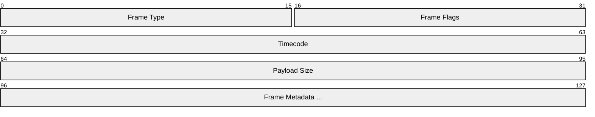
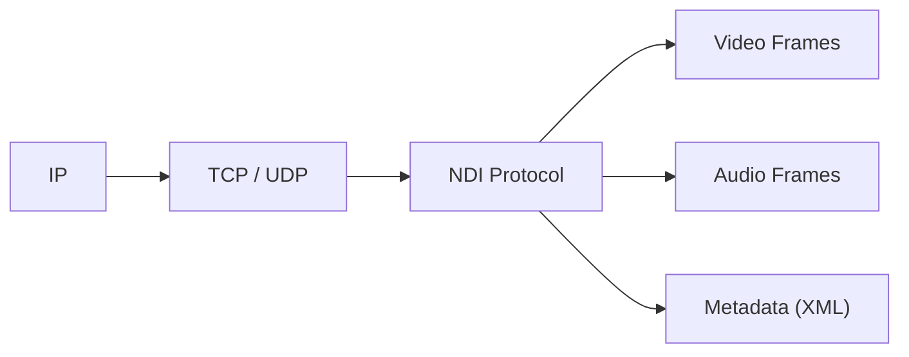

# NDI (Network Device Interface)

> **Standard:** [NDI SDK](https://ndi.video/for-developers/ndi-sdk/) | **Layer:** Application (Layer 7) | **Wireshark filter:** `ndi` (limited; proprietary protocol)

NDI is a royalty-free IP video protocol developed by NewTek (now Vizrt) for high-performance, low-latency video transport over standard Ethernet. It enables video sources and receivers to discover each other automatically and exchange video, audio, and metadata frames with minimal configuration. NDI is widely used in live production, streaming, corporate AV, and esports where sub-frame latency video over commodity networks is needed. Unlike SMPTE ST 2110, NDI runs on standard gigabit infrastructure without PTP synchronization or network engineering.

## Discovery

NDI sources are discovered automatically using mDNS multicast (UDP port 5353) on the local subnet, or via a centralized NDI Discovery Server for cross-subnet environments:



### Discovery Methods

| Method | Transport | Scope | Port |
|--------|-----------|-------|------|
| mDNS (default) | UDP multicast 224.0.0.251 | Local subnet | 5353 |
| NDI Discovery Server | TCP unicast | Cross-subnet / WAN | 5959 |
| NDI 5 Bridge | TCP + reliable UDP | WAN / internet | Configurable |

## Transport Modes

NDI supports multiple transport variants optimized for different bandwidth and quality tradeoffs:

| Variant | Compression | Typical Bandwidth (1080p60) | Latency | Use Case |
|---------|-------------|----------------------------|---------|----------|
| NDI (full) | SpeedHQ (visually lossless) | ~125 Mbps | < 1 frame | LAN production, switching |
| NDI\|HX | H.264 | ~12-20 Mbps | 2-4 frames | WiFi, limited bandwidth |
| NDI\|HX2 | H.264 / H.265 | ~8-15 Mbps | 1-2 frames | Cameras, mobile |
| NDI\|HX3 | H.264 / H.265 / NDI codec | ~6-20 Mbps | < 1 frame | Low-latency compressed |

### Transport Protocols

| Mode | Protocol | Description |
|------|----------|-------------|
| Reliable TCP (default) | TCP | Single connection, lossless delivery, adaptive bitrate |
| Reliable UDP (NDI 5+) | UDP with FEC + ARQ | Lower latency, better congestion handling |
| Multicast UDP | UDP multicast | One-to-many, forward error correction |
| Unicast UDP | UDP | Single receiver, FEC |

## Frame Types

NDI carries three frame types over the transport connection:



### Video Frame

| Field | Description |
|-------|-------------|
| Resolution | Any resolution (common: 720p, 1080i, 1080p, 2160p) |
| Frame rate | Any rational rate (23.976, 25, 29.97, 30, 50, 59.94, 60, etc.) |
| Pixel format | UYVY, BGRA, BGRX, NV12, I420, P216, PA16 |
| Alpha channel | Supported via BGRA and PA16 formats |
| Progressive/interlaced | Both supported; field-based or frame-based |
| Line stride | Configurable bytes-per-line for memory alignment |

### Audio Frame

| Field | Description |
|-------|-------------|
| Sample rate | Any rate (common: 44100, 48000, 96000 Hz) |
| Channels | Any count (mono through immersive audio) |
| Sample format | 32-bit float (interleaved or planar) |
| Samples per frame | Variable (typically matches video frame duration) |

### Metadata Frame

Metadata is carried as UTF-8 XML strings, enabling arbitrary structured data exchange between sources and receivers:

```xml
<ndi_metadata>
  <source name="Camera 1" />
  <tally on_program="true" on_preview="false" />
  <custom key="scene">Interview</custom>
</ndi_metadata>
```

## Tally

NDI includes bidirectional tally signaling. Receivers send tally status back to sources indicating whether the source is currently on program (live) or preview:

| State | Meaning |
|-------|---------|
| Program (PGM) | Source is live on air (red tally) |
| Preview (PVW) | Source is selected for preview (green tally) |
| Neither | Source is not actively selected |

## NDI 5 Features

| Feature | Description |
|---------|-------------|
| NDI Bridge | Connects NDI sources across WAN / internet via relay servers |
| NDI Remote | Allows remote contribution from any location |
| Reliable UDP | New transport layer with FEC and ARQ for improved performance |
| NDI KVM | Remote desktop control (keyboard, video, mouse) over NDI |
| Discovery Server | Centralized cross-subnet source registration |

## Ports

| Port | Protocol | Purpose |
|------|----------|---------|
| 5353 | UDP | mDNS discovery (multicast 224.0.0.251) |
| 5959 | TCP | NDI Discovery Server |
| 5960+ | TCP/UDP | Media transport (auto-assigned per source) |

## NDI vs SDI vs SMPTE ST 2110

| Feature | NDI | SDI (3G/12G) | SMPTE ST 2110 |
|---------|-----|-------------|----------------|
| Infrastructure | Standard GigE / 10GbE | Dedicated coax (BNC) | Managed 10/25/100GbE |
| Compression | SpeedHQ (full) / H.264/H.265 (HX) | None | None (ST 2110-20) or JPEG XS (ST 2110-22) |
| Bandwidth (1080p60) | ~125 Mbps (full), ~15 Mbps (HX) | 3 Gbps | ~3 Gbps (uncompressed) |
| Latency | < 1 frame (full), 1-4 frames (HX) | Zero (point-to-point) | < 1 frame |
| Synchronization | NTP / internal | Genlock / black burst | PTP (IEEE 1588) |
| Discovery | mDNS / Discovery Server | Physical cabling | NMOS IS-04/IS-05 |
| Multicast | Supported | N/A (point-to-point) | Required |
| Max distance | Network reach (unlimited with Bridge) | ~100m (coax), km (fiber) | Network reach |
| Alpha channel | Yes (BGRA, PA16) | Yes (dual-link, 12-bit) | Yes (ST 2110-20) |
| Cost | Low (commodity network) | Medium (dedicated infrastructure) | High (managed network + PTP) |

## Encapsulation



## Standards

| Document | Title |
|----------|-------|
| [NDI SDK](https://ndi.video/for-developers/ndi-sdk/) | NDI Software Development Kit and API reference |
| [NDI Advanced SDK](https://ndi.video/for-developers/ndi-advanced-sdk/) | Low-level SDK for hardware integration |
| [NDI Specification](https://ndi.video) | Protocol and ecosystem overview |

## See Also

- [SMPTE ST 2110](smpte2110.md) -- professional uncompressed media over IP
- [SMPTE ST 2022](smpte2022.md) -- professional video over IP (predecessor to ST 2110)
- [RTP](../voip/rtp.md) -- transport protocol used by ST 2110 and many streaming systems
- [RTSP](../voip/rtsp.md) -- streaming control protocol
- [mDNS](../naming/mdns.md) -- multicast DNS used for NDI discovery
- [SDP](../voip/sdp.md) -- session description used by ST 2110
