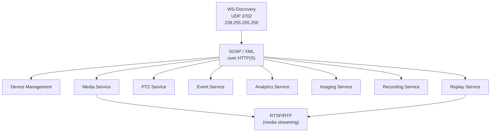
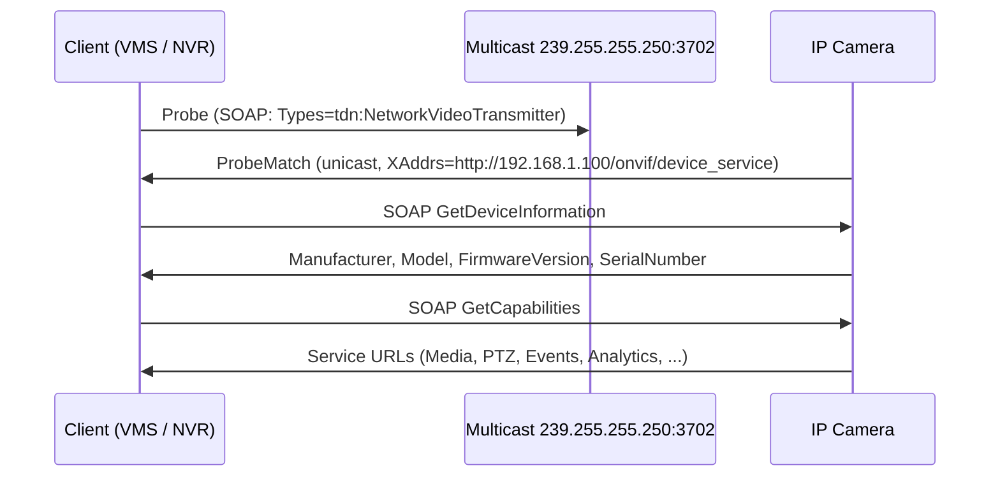
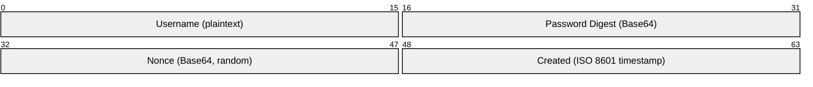
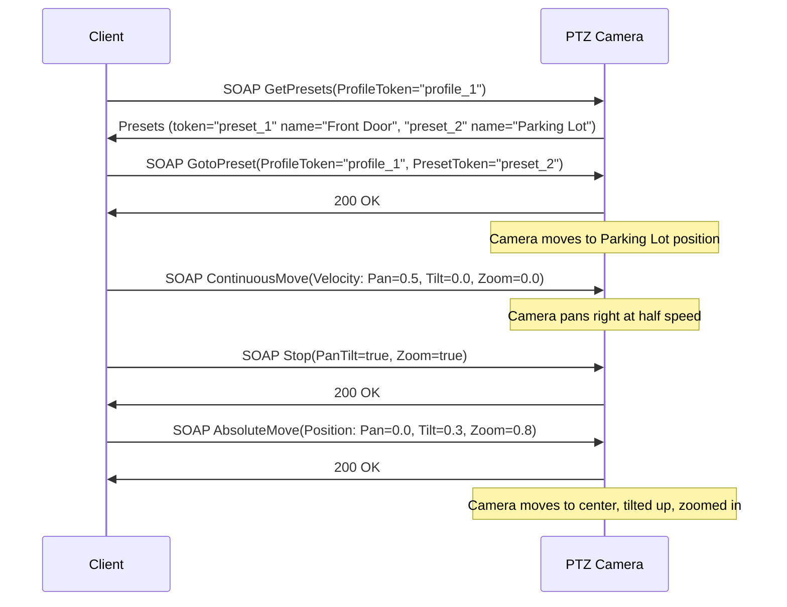
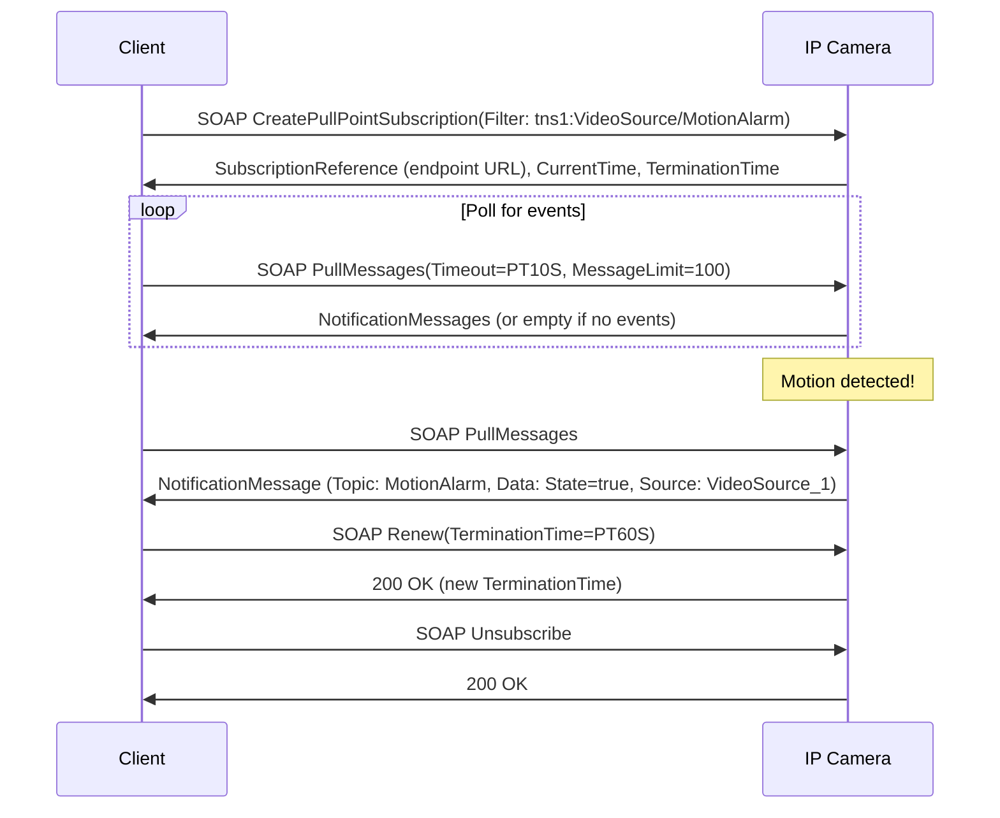
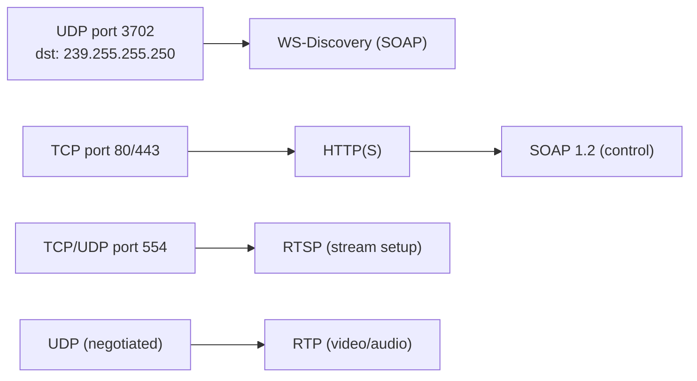

# ONVIF (Open Network Video Interface Forum)

> **Standard:** [ONVIF Core Specification](https://www.onvif.org/specs/core/ONVIF-Core-Specification.pdf) | **Layer:** Application (Layer 7) | **Wireshark filter:** `xml`

ONVIF is an open industry standard for IP-based security products — primarily network cameras, video encoders, and NVRs (Network Video Recorders). It defines a common interface for device discovery, media streaming configuration, PTZ (Pan-Tilt-Zoom) control, event handling, analytics, and recording. ONVIF uses SOAP/XML web services for device management and control, while actual video streaming is delegated to RTSP/RTP. Nearly every major IP camera manufacturer supports ONVIF, making it the de facto standard for IP surveillance interoperability.

## Profiles

ONVIF organizes functionality into profiles that define conformance requirements:

| Profile | Name | Description |
|---------|------|-------------|
| Profile S | Streaming | Video/audio streaming, PTZ control, multicast, relay outputs |
| Profile G | Recording & Storage | Edge storage, recording, search, replay via RTSP |
| Profile T | Advanced Streaming | H.265, imaging settings, motion alarms, metadata streaming |
| Profile C | Access Control | Door control, access point management, credential handling |
| Profile A | Access Control Config | Configuration of access rules, credentials, and schedules |
| Profile D | Peripheral Devices | Token-based access, peripherals (card readers, REX devices) |
| Profile M | Metadata & Analytics | Analytics configuration, metadata streaming, scene description |

## Protocol Stack



## WS-Discovery (Device Discovery)

ONVIF devices are discovered using WS-Discovery (OASIS standard), which sends SOAP messages over UDP multicast.

| Parameter | Value |
|-----------|-------|
| Multicast Address (IPv4) | 239.255.255.250 |
| UDP Port | 3702 |
| Message Format | SOAP 1.2 over UDP |

### Discovery Flow



### Probe Message (Simplified)

```xml
<s:Envelope xmlns:s="http://www.w3.org/2003/05/soap-envelope"
            xmlns:a="http://schemas.xmlsoap.org/ws/2004/08/addressing"
            xmlns:d="http://schemas.xmlsoap.org/ws/2005/04/discovery"
            xmlns:tdn="http://www.onvif.org/ver10/network/wsdl">
  <s:Header>
    <a:Action>http://schemas.xmlsoap.org/ws/2005/04/discovery/Probe</a:Action>
    <a:MessageID>uuid:msg-1234</a:MessageID>
    <a:To>urn:schemas-xmlsoap-org:ws:2005:04:discovery</a:To>
  </s:Header>
  <s:Body>
    <d:Probe>
      <d:Types>tdn:NetworkVideoTransmitter</d:Types>
    </d:Probe>
  </s:Body>
</s:Envelope>
```

## Authentication

ONVIF uses WS-UsernameToken with password digest for SOAP authentication:



The password digest is computed as:

```
PasswordDigest = Base64(SHA-1(Nonce + Created + Password))
```

| Field | Description |
|-------|-------------|
| Username | Plaintext username |
| PasswordDigest | `Base64(SHA-1(nonce_raw + created_utf8 + password_utf8))` |
| Nonce | Random value (Base64 encoded), prevents replay |
| Created | Timestamp (ISO 8601), limits validity window |

The WS-UsernameToken header is embedded in the SOAP Security header of every authenticated request. ONVIF also supports HTTP Digest authentication for RTSP streams.

## ONVIF Services

### Device Management Service

| Action | Description |
|--------|-------------|
| GetDeviceInformation | Manufacturer, model, firmware version, serial number, hardware ID |
| GetCapabilities | List of supported services and their endpoint URLs |
| GetServices | Detailed service list with version info (replaces GetCapabilities) |
| GetNetworkInterfaces | Network interface configuration |
| SetNetworkInterfaces | Configure IP, DHCP, DNS settings |
| GetSystemDateAndTime | Camera date/time and NTP settings |
| SystemReboot | Reboot the device |
| GetScopes | Discovery scopes (location, hardware, name) |
| SetScopes | Set discovery scope metadata |

### Media Service

The Media service manages media profiles — named configurations that bind video/audio sources, encoders, PTZ, and analytics into a streamable unit.

| Action | Description |
|--------|-------------|
| GetProfiles | List all media profiles |
| GetProfile | Get a specific profile by token |
| GetStreamUri | Get the RTSP URI for a profile |
| GetSnapshotUri | Get the HTTP URI for a JPEG snapshot |
| GetVideoEncoderConfigurations | List video encoder settings |
| SetVideoEncoderConfiguration | Set resolution, framerate, bitrate, codec |
| GetVideoSourceConfigurations | List video source settings |
| GetAudioEncoderConfigurations | List audio encoder settings |

### Stream Setup Flow

```mermaid
sequenceDiagram
  participant C as Client (VMS)
  participant CAM as IP Camera
  participant RTSP as RTSP/RTP

  C->>CAM: SOAP GetProfiles
  CAM->>C: Profile list (token="profile_1", H.264, 1080p, PTZ)

  C->>CAM: SOAP GetStreamUri(ProfileToken="profile_1", Protocol=RTSP)
  CAM->>C: rtsp://192.168.1.100:554/stream1

  C->>RTSP: DESCRIBE rtsp://192.168.1.100:554/stream1
  RTSP->>C: 200 OK (SDP: H.264, 90000 Hz)

  C->>RTSP: SETUP (Transport: RTP/AVP;unicast)
  RTSP->>C: 200 OK (Session, server ports)

  C->>RTSP: PLAY
  RTSP->>C: 200 OK
  Note over C,RTSP: RTP video stream flows
```

### Video Encoder Settings

| Parameter | Description |
|-----------|-------------|
| Encoding | H.264, H.265, MPEG-4, JPEG |
| Resolution | Width x Height (e.g., 1920x1080) |
| Quality | Encoder quality factor (1-100) |
| FrameRateLimit | Maximum frame rate |
| BitrateLimit | Maximum bitrate (kbps) |
| GovLength | GOP length (keyframe interval) |
| H264Profile | Baseline, Main, Extended, High |
| RateControlType | CBR, VBR |

## PTZ Service

The PTZ service controls pan, tilt, and zoom on motorized cameras and virtual PTZ on fixed cameras.

| Action | Description |
|--------|-------------|
| ContinuousMove | Start continuous movement at given velocity (pan, tilt, zoom) |
| AbsoluteMove | Move to absolute position (x, y, zoom) |
| RelativeMove | Move relative to current position |
| Stop | Stop all PTZ movement |
| GotoPreset | Move to a saved preset position |
| SetPreset | Save current position as a preset |
| RemovePreset | Delete a preset |
| GetPresets | List all saved presets |
| GotoHomePosition | Move to home position |
| GetStatus | Current PTZ position and move status |
| GetConfigurations | PTZ ranges and limits |

### PTZ Coordinate System

| Axis | Range | Description |
|------|-------|-------------|
| Pan | -1.0 to +1.0 | Horizontal: -1.0 = far left, +1.0 = far right |
| Tilt | -1.0 to +1.0 | Vertical: -1.0 = down, +1.0 = up |
| Zoom | 0.0 to +1.0 | 0.0 = wide, 1.0 = maximum telephoto |

### PTZ Control Flow



## Event Service

The Event service provides alarm and status notifications using WS-BaseNotification.

| Action | Description |
|--------|-------------|
| CreatePullPointSubscription | Create a subscription and poll for events |
| PullMessages | Retrieve queued events from the pull point |
| GetEventProperties | List all supported event topics |
| Subscribe | Real-time push notification (WS-BaseNotification) |
| Unsubscribe | Cancel a subscription |
| Renew | Extend subscription timeout |

### Common Event Topics

| Topic | Description |
|-------|-------------|
| `tns1:VideoSource/MotionAlarm` | Motion detection triggered |
| `tns1:RuleEngine/CellMotionDetector/Motion` | Cell-based motion detected |
| `tns1:RuleEngine/TamperDetector/Tamper` | Camera tamper detected |
| `tns1:Device/Trigger/DigitalInput` | Digital input (alarm contact) state change |
| `tns1:Device/HardwareFailure/StorageFailure` | Storage failure (Profile G) |
| `tns1:VideoAnalytics/...` | Analytics events (line crossing, intrusion) |
| `tns1:PTZController/PTZPresets/Reached` | PTZ reached a preset position |

### Pull-Point Event Flow



## Other Services

### Analytics Service

| Action | Description |
|--------|-------------|
| GetSupportedAnalyticsModules | List available analytics (motion, face, LPR, line crossing) |
| CreateAnalyticsModules | Configure analytics on a profile |
| GetSupportedRules | List available rule types |
| CreateRules | Create analytics rules (e.g., line crossing, field intrusion) |

### Imaging Service

| Action | Description |
|--------|-------------|
| GetImagingSettings | Brightness, contrast, saturation, sharpness, exposure, WDR |
| SetImagingSettings | Adjust image parameters |
| GetOptions | Valid ranges for imaging parameters |
| Move | Focus control (absolute, relative, continuous) |

### Recording Service (Profile G)

| Action | Description |
|--------|-------------|
| CreateRecording | Create a recording on edge storage |
| CreateRecordingJob | Start/schedule recording |
| GetRecordings | List recordings |
| GetRecordingJobs | List recording jobs and states |

### Replay Service (Profile G)

| Action | Description |
|--------|-------------|
| GetReplayUri | Get RTSP URI for recorded playback |

The replay URI supports RTSP Range headers for seeking through recorded video.

## ONVIF SOAP Endpoint Structure

A typical ONVIF device exposes these HTTP endpoints:

| Service | Typical Endpoint |
|---------|-----------------|
| Device | `http://<ip>/onvif/device_service` |
| Media | `http://<ip>/onvif/media_service` |
| Media2 | `http://<ip>/onvif/media2_service` |
| PTZ | `http://<ip>/onvif/ptz_service` |
| Events | `http://<ip>/onvif/event_service` |
| Analytics | `http://<ip>/onvif/analytics_service` |
| Imaging | `http://<ip>/onvif/imaging_service` |
| Recording | `http://<ip>/onvif/recording_service` |
| Replay | `http://<ip>/onvif/replay_service` |

All endpoints accept SOAP 1.2 POST requests with `Content-Type: application/soap+xml`.

## Encapsulation



## Standards

| Document | Title |
|----------|-------|
| [ONVIF Core Spec](https://www.onvif.org/specs/core/ONVIF-Core-Specification.pdf) | Core framework, discovery, security |
| [ONVIF Media Service](https://www.onvif.org/specs/srv/media/ONVIF-Media-Service-Spec.pdf) | Media profiles, streaming, encoding |
| [ONVIF PTZ Service](https://www.onvif.org/specs/srv/ptz/ONVIF-PTZ-Service-Spec.pdf) | Pan-tilt-zoom control |
| [ONVIF Event Service](https://www.onvif.org/specs/srv/event/ONVIF-Event-Service-Spec.pdf) | Alarms, notifications, pull points |
| [ONVIF Analytics Service](https://www.onvif.org/specs/srv/analytics/ONVIF-Analytics-Service-Spec.pdf) | Video analytics configuration |
| [ONVIF Profile S](https://www.onvif.org/profiles/profile-s/) | Streaming conformance |
| [ONVIF Profile G](https://www.onvif.org/profiles/profile-g/) | Recording and storage conformance |
| [ONVIF Profile T](https://www.onvif.org/profiles/profile-t/) | Advanced streaming (H.265, imaging) |
| [WS-Discovery](http://docs.oasis-open.org/ws-dd/discovery/1.1/os/wsdd-discovery-1.1-spec-os.html) | OASIS Web Services Dynamic Discovery |

## See Also

- [RTSP](../voip/rtsp.md) — media streaming control (carries ONVIF video)
- [RTP](../voip/rtp.md) — real-time media transport for video/audio
- [UPnP/DLNA](upnp.md) — consumer media sharing with similar discovery patterns
- [SIP](../voip/sip.md) — VoIP signaling, sometimes used alongside ONVIF
- [HTTP](../web/http.md) — transport for SOAP control messages
