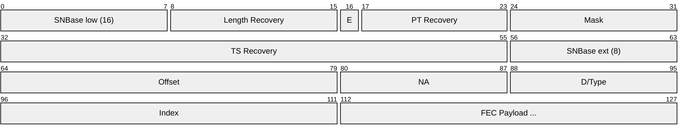
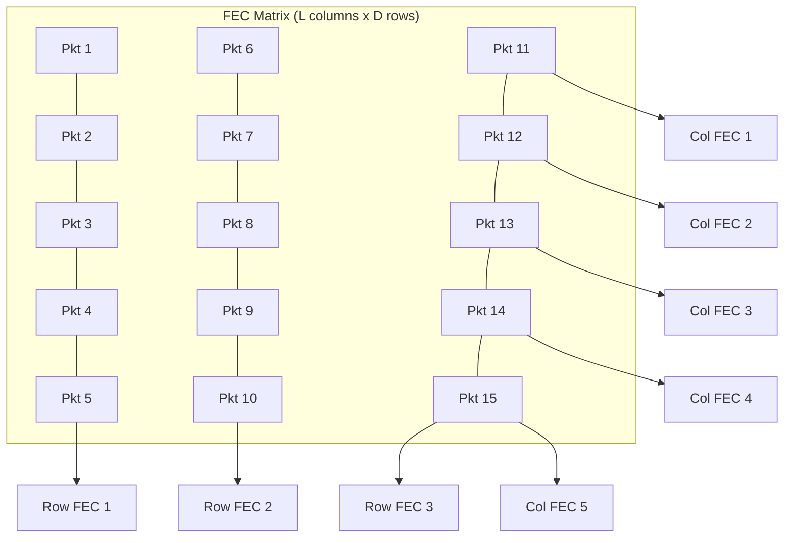
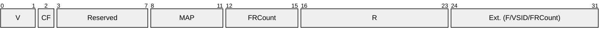
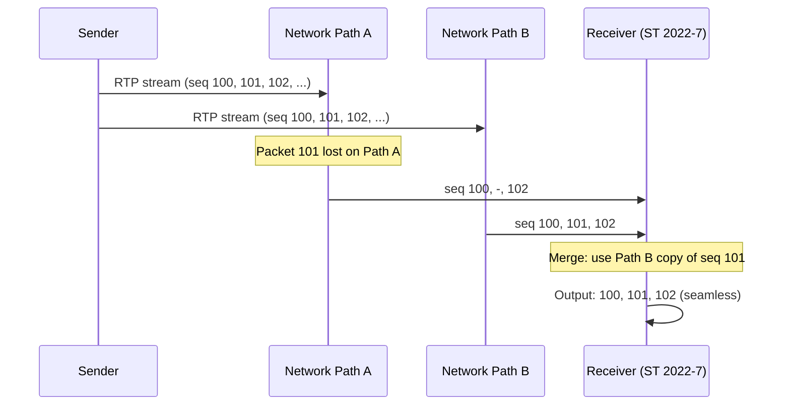
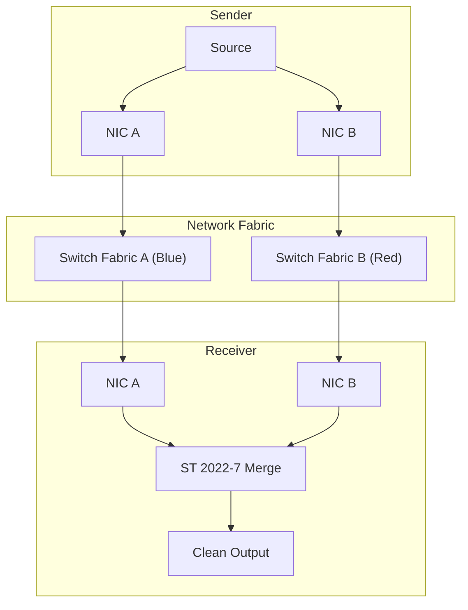
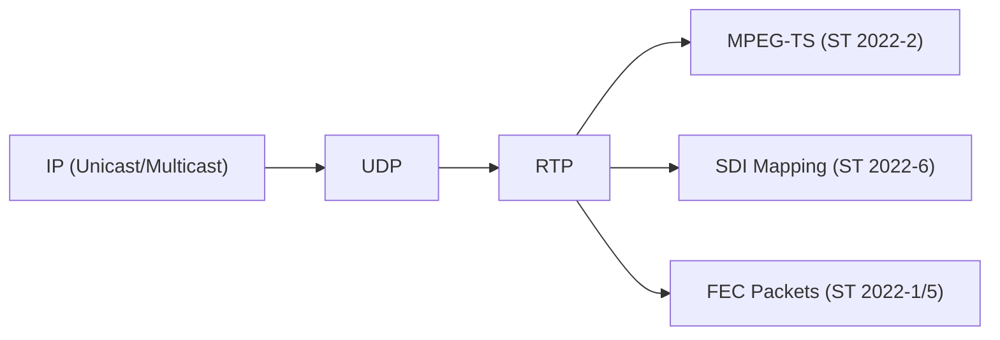

# SMPTE ST 2022 (Professional Video over IP)

> **Standard:** [SMPTE ST 2022](https://www.smpte.org/standards/st2022) | **Layer:** Application (Layer 7) | **Wireshark filter:** `smpte_2022` or `rtp`

SMPTE ST 2022 is a suite of standards for transporting professional video over IP networks, developed as the broadcast industry's first standardized approach to replacing SDI with IP. It covers MPEG transport streams, uncompressed SDI mapping, forward error correction (FEC), and seamless network redundancy. While ST 2110 has largely superseded ST 2022 for new facility designs, ST 2022-7 (seamless protection switching) remains fundamental to ST 2110 deployments, and ST 2022-6 (uncompressed SDI over IP) is still found in many operational broadcast facilities.

## Suite of Standards

| Standard | Title | Description |
|----------|-------|-------------|
| ST 2022-1 | FEC for MPEG-TS | Forward Error Correction for MPEG transport streams |
| ST 2022-2 | Unidirectional MPEG-TS over IP | Constant bitrate MPEG-TS in UDP/RTP |
| ST 2022-5 | FEC for High Bitrate Media | FEC for uncompressed and high-bitrate streams |
| ST 2022-6 | Uncompressed SDI over IP | Maps entire SDI signal into RTP (HBRMT) |
| ST 2022-7 | Seamless Protection Switching | Dual-path hitless redundancy for any RTP stream |

## Forward Error Correction (ST 2022-1 / ST 2022-5)

ST 2022-1 defines a 2D FEC scheme based on Pro-MPEG CoP3 that recovers lost packets without retransmission. Media packets are arranged in a matrix, and XOR-based FEC packets are generated for each column and row:

### FEC Key Fields

| Field | Size | Description |
|-------|------|-------------|
| SNBase | 24 bits | Base sequence number of protected packets |
| Length Recovery | 16 bits | XOR of payload lengths of protected packets |
| E (Extension) | 1 bit | RTP header extension recovery |
| PT Recovery | 7 bits | XOR of payload type fields |
| Mask | 8 bits | Bitmask identifying protected packets |
| TS Recovery | 24 bits | XOR of timestamps of protected packets |
| Offset | 16 bits | Column spacing in the FEC matrix |
| NA | 8 bits | Number of media packets per FEC group |
| D | 1 bit | Direction: 0 = column FEC, 1 = row FEC |
| Index | 16 bits | FEC packet index within the group |

### FEC Matrix

The 2D FEC matrix arranges media packets in rows and columns. Column FEC protects against burst loss; row FEC protects against random loss:

### FEC Parameters

| Parameter | Symbol | Description |
|-----------|--------|-------------|
| Columns | L | Number of packets per row (1-20) |
| Rows | D | Number of packets per column (4-20) |
| Column FEC | | Recovers from burst loss up to L consecutive packets |
| Row FEC | | Recovers from random single-packet loss per row |
| 2D Recovery | | Can recover multiple losses using both dimensions |
| Overhead | | 1/L + 1/D (e.g., L=10, D=10: 20% overhead) |

## MPEG Transport Stream over IP (ST 2022-2)

ST 2022-2 defines the carriage of MPEG-2 transport streams over IP. Each RTP packet carries 7 TS packets (7 x 188 = 1316 bytes) for a standard MTU:

| Parameter | Value |
|-----------|-------|
| RTP payload type | Dynamic (negotiated via SDP) |
| Clock rate | 90 kHz |
| TS packets per RTP | 7 (typical, for 1316-byte payload) |
| Transport | UDP unicast or multicast |
| FEC | ST 2022-1 (optional but recommended) |

## Uncompressed SDI over IP (ST 2022-6)

ST 2022-6 maps an entire SDI signal (including blanking, embedded audio, and ancillary data) directly into RTP using the High Bitrate Media Transport (HBRMT) payload format:

### HBRMT Payload Header

### HBRMT Key Fields

| Field | Size | Description |
|-------|------|-------------|
| V (Version) | 2 bits | HBRMT version (0) |
| CF (Clock Frequency) | 1 bit | 0 = not locked, 1 = locked to reference |
| MAP | 4 bits | SDI mapping mode (identifies signal format) |
| FRCount | 8 bits | Frame count (wrapping counter for frame tracking) |
| R | 8 bits | Reference for timing reconstruction |

### MAP Values (SDI Formats)

| MAP | SDI Standard | Data Rate | Description |
|-----|-------------|-----------|-------------|
| 0 | ST 259 (SD-SDI) | 270 Mbps | Standard definition |
| 1 | ST 292-1 (HD-SDI) | 1.485 Gbps | High definition |
| 2 | ST 425-1 (3G-SDI) A | 2.97 Gbps | 3G Level A |
| 3 | ST 425-1 (3G-SDI) B-DL | 2.97 Gbps | 3G Level B (dual-link) |
| 4 | ST 2081-10 (6G-SDI) | 5.94 Gbps | 6G single-link |
| 5 | ST 2082-10 (12G-SDI) | 11.88 Gbps | 12G single-link |

## Seamless Protection Switching (ST 2022-7)

ST 2022-7 provides hitless redundancy by transmitting identical RTP streams over two physically separate network paths. The receiver reconstructs a single clean output by selecting the first-arriving copy of each packet:

### ST 2022-7 Architecture

### ST 2022-7 Parameters

| Parameter | Value |
|-----------|-------|
| Path difference tolerance | Configurable (typically up to 450 ms) |
| Buffer depth | Must accommodate max path differential |
| Packet matching | By RTP sequence number |
| Failover time | Zero (hitless, no frame loss) |
| Scope | Per-flow (each RTP stream independently protected) |
| Applicable protocols | Any RTP stream (ST 2022-6, ST 2110, AES67, etc.) |

## ST 2022 vs ST 2110

| Feature | SMPTE ST 2022-6 | SMPTE ST 2110 |
|---------|-----------------|---------------|
| Video mapping | Entire SDI signal (active + blanking) | Active video pixels only |
| Audio | Embedded in SDI stream | Separate audio flow (ST 2110-30) |
| Ancillary data | Embedded in SDI stream | Separate data flow (ST 2110-40) |
| Bandwidth (1080i) | ~1.5 Gbps (full SDI rate) | ~1.3 Gbps (active video only) |
| Essence routing | All-or-nothing (single flow) | Independent per-essence routing |
| Synchronization | PTP (ST 2059) | PTP (ST 2059) |
| Multicast | Supported | Required |
| Compression | No (raw SDI mapping) | Optional (ST 2110-22: JPEG XS) |
| Redundancy | ST 2022-7 | ST 2022-7 |
| SDP | One SDP per SDI signal | One SDP per essence flow |
| Ideal use | SDI migration, simple installations | New IP-native facility builds |

## Encapsulation

## Standards

| Document | Title |
|----------|-------|
| [SMPTE ST 2022-1](https://www.smpte.org/standards/st2022) | Forward Error Correction for MPEG-2 TS over IP |
| [SMPTE ST 2022-2](https://www.smpte.org/standards/st2022) | Unidirectional Transport of Constant Bit Rate MPEG-2 TS over IP |
| [SMPTE ST 2022-5](https://www.smpte.org/standards/st2022) | Forward Error Correction for High Bit Rate Media Transport over IP |
| [SMPTE ST 2022-6](https://www.smpte.org/standards/st2022) | High Bit Rate Media Transport over IP (HBRMT) |
| [SMPTE ST 2022-7](https://www.smpte.org/standards/st2022) | Seamless Protection Switching of RTP Datagrams |
| [SMPTE ST 2059-2](https://www.smpte.org/standards/st2059) | SMPTE Profile for Use of IEEE-1588 PTP |
| [Pro-MPEG CoP3](https://tech.ebu.ch/docs/tech/tech3348.pdf) | Code of Practice #3: FEC framework (basis for ST 2022-1) |

## See Also

- [SMPTE ST 2110](smpte2110.md) -- successor suite for professional media over IP
- [NDI](ndi.md) -- alternative IP video protocol for production
- [RTP](../voip/rtp.md) -- underlying transport protocol for all ST 2022 media
- [SDP](../voip/sdp.md) -- session description for ST 2022 flows
- [NTP](../naming/ntp.md) -- time synchronization (PTP is a related precision protocol)
