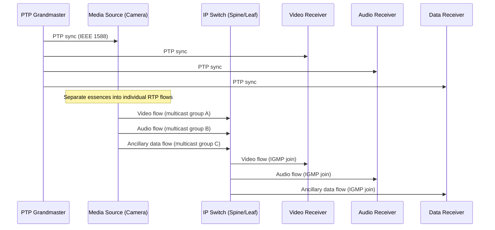
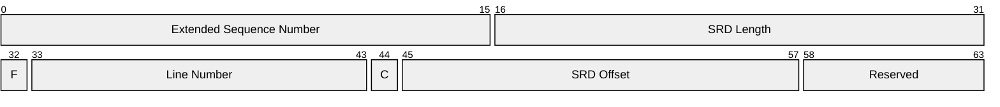
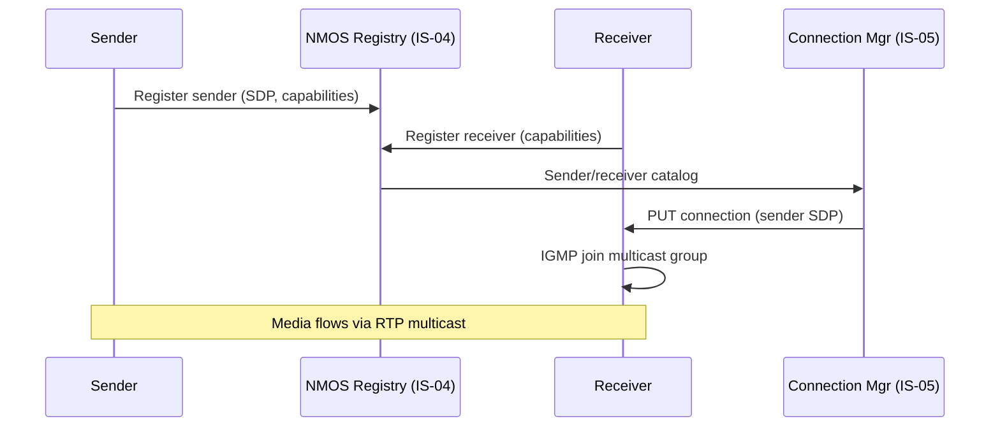
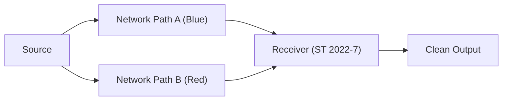
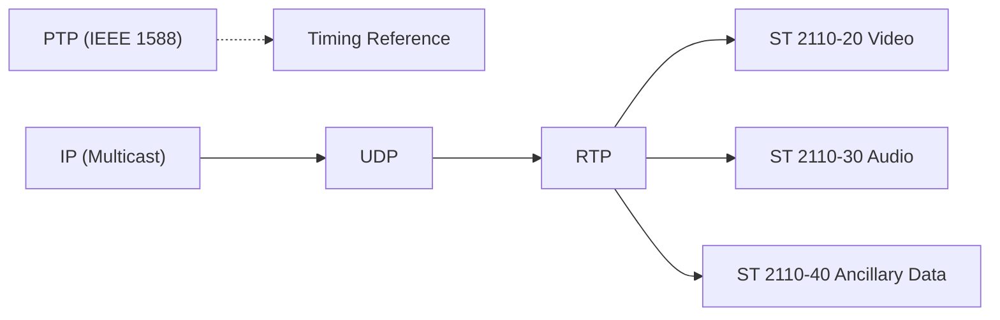

# SMPTE ST 2110 (Professional Media over Managed IP Networks)

> **Standard:** [SMPTE ST 2110](https://www.smpte.org/standards/st2110) | **Layer:** Application (Layer 7) | **Wireshark filter:** `rtp` (with SMPTE dissector plugins)

SMPTE ST 2110 is a suite of standards for transporting professional-grade uncompressed video, audio, and ancillary data over managed IP networks using RTP. It is the broadcast industry's replacement for SDI (Serial Digital Interface), enabling facilities to route any media essence independently over standard IP infrastructure. Unlike SDI's single multiplex, ST 2110 separates video, audio, and data into individual IP flows, each synchronized via PTP (Precision Time Protocol). ST 2110 is used in broadcast studios, OB trucks, and large-scale production facilities worldwide.

## Suite of Standards

| Standard | Title | Description |
|----------|-------|-------------|
| ST 2110-10 | System Timing and Definitions | PTP-based system clock, epoch, media clock relationships |
| ST 2110-20 | Uncompressed Active Video | Raw raster video in RTP (line-by-line or frame-by-frame) |
| ST 2110-21 | Traffic Shaping and Delivery Timing | Sender pacing models: Narrow, Narrow Linear, Wide |
| ST 2110-22 | Compressed Video | Constant bitrate compressed video (JPEG XS, etc.) in RTP |
| ST 2110-30 | PCM Digital Audio | AES67-compatible uncompressed audio in RTP |
| ST 2110-31 | AES3 Transparent Transport | AES3 audio (with non-PCM data) in RTP |
| ST 2110-40 | Ancillary Data | Captions, timecode, AFD, SCTE-104 in RTP |

## Architecture

ST 2110 decomposes the traditional SDI multiplex into separate essence flows, each carried in its own RTP multicast stream:



## PTP Synchronization (ST 2110-10 / ST 2059)

All ST 2110 devices synchronize to a common PTP grandmaster clock. SMPTE ST 2059 defines the PTP profile for professional media:

| Parameter | Value |
|-----------|-------|
| PTP Profile | SMPTE ST 2059-2 |
| Domain | 127 (default for broadcast) |
| Epoch | SMPTE Epoch (1970-01-01 00:00:00 TAI) |
| Transport | IEEE 1588 over UDP (ports 319, 320) or L2 (EtherType 0x88F7) |
| Accuracy | Sub-microsecond (< 1 us across the network) |
| Grandmaster | Dedicated GPS-locked PTP server |

## Uncompressed Video (ST 2110-20)

### RTP Payload Header

Each RTP packet carries a portion of the active video raster. The ST 2110-20 payload header identifies the line and offset:



### Key Fields

| Field | Size | Description |
|-------|------|-------------|
| Extended Seq Num | 16 bits | High bits of extended RTP sequence number |
| SRD Length | 16 bits | Sample Row Data length in bytes |
| F (Field ID) | 1 bit | 0 = field 1 / progressive, 1 = field 2 |
| Line Number | 11 bits | Video line number (1-based) |
| C (Continuation) | 1 bit | 1 = more SRD headers follow in this packet |
| SRD Offset | 13 bits | Pixel offset from start of line |

### Common Video Formats and Bandwidth

| Format | Resolution | Frame Rate | Bit Depth | Bandwidth |
|--------|-----------|------------|-----------|-----------|
| HD 1080i | 1920x1080 | 59.94i | 10-bit | ~1.5 Gbps |
| HD 1080p | 1920x1080 | 59.94p | 10-bit | ~3.0 Gbps |
| UHD 2160p | 3840x2160 | 59.94p | 10-bit | ~12.0 Gbps |
| UHD 2160p | 3840x2160 | 59.94p | 12-bit HDR | ~14.4 Gbps |

## Traffic Shaping (ST 2110-21)

ST 2110-21 defines how senders pace packets to prevent network congestion:

| Sender Type | Pacing Model | Burst Behavior | Use Case |
|-------------|-------------|----------------|----------|
| Narrow (N) | Gapped at line rate | Small, evenly spaced bursts | Hardware senders |
| Narrow Linear (NL) | Linear spread across frame | Minimal burstiness | Preferred for new designs |
| Wide (W) | Gapped with larger bursts | Larger bursts allowed | Software senders, gateways |

## Compressed Video (ST 2110-22)

ST 2110-22 carries constant-bitrate compressed video (typically JPEG XS) in RTP, enabling HD and UHD transport within 10GbE links:

| Codec | Typical Ratio | Bandwidth (1080p60) | Latency |
|-------|--------------|---------------------|---------|
| JPEG XS (ISO 21122) | 5:1 to 10:1 | ~300-600 Mbps | < 1 ms (encode + decode) |
| TICO (intoPIX) | 4:1 | ~750 Mbps | < 1 us |

## Audio (ST 2110-30 / AES67)

ST 2110-30 is fully compatible with AES67 for PCM audio transport:

| Parameter | Value |
|-----------|-------|
| Encoding | Linear PCM (L16, L24) |
| Sample rate | 48 kHz (broadcast standard) |
| Channels per stream | 1 to 64+ (typically 2, 8, or 16) |
| Packet time | 1 ms (48 samples at 48 kHz) or 125 us |
| RTP payload type | Dynamic (negotiated via SDP) |
| Compatibility | AES67 interoperable |

## Ancillary Data (ST 2110-40)

ST 2110-40 carries ancillary data that was previously embedded in SDI VANC/HANC:

| Data Type | SMPTE Standard | Description |
|-----------|----------------|-------------|
| Closed captions | CEA-708 / CEA-608 | Subtitles and captions |
| Timecode | ST 12-1 (VITC/LTC) | Frame-accurate timecode |
| AFD | ST 2016-1 | Active Format Description (aspect ratio) |
| SCTE-104 | SCTE-104 | Ad insertion triggers |
| Teletext | OP-47 | European subtitles |

## Session Description (SDP)

Each ST 2110 flow is described by an SDP file specifying the connection address, media type, and RTP payload format:

```
v=0
o=- 1234567 1234567 IN IP4 10.0.1.1
s=Camera 1 - Video
t=0 0
m=video 5004 RTP/AVP 96
c=IN IP4 239.1.1.1/32
a=source-filter: incl IN IP4 239.1.1.1 10.0.1.1
a=rtpmap:96 raw/90000
a=fmtp:96 sampling=YCbCr-4:2:2; width=1920; height=1080;
  depth=10; interlace; exactframerate=30000/1001;
  colorimetry=BT709; PM=2110GPM; SSN=ST2110-20:2017;
  TP=2110TPN
a=mediaclk:direct=0
a=ts-refclk:ptp=IEEE1588-2008:AA-BB-CC-FF-FE-DD-EE-FF:127
```

## Discovery and Connection Management (NMOS)

NMOS (Networked Media Open Specifications) from AMWA provides discovery and connection management for ST 2110 systems:

| Specification | Title | Description |
|---------------|-------|-------------|
| IS-04 | Discovery & Registration | Register nodes, devices, senders, receivers via REST API |
| IS-05 | Device Connection Management | Make and break connections between senders and receivers |
| IS-06 | Network Control | Interface to SDN controllers for network resource management |
| IS-07 | Event & Tally | Transport tally, GPIO, and event data |
| IS-08 | Audio Channel Mapping | Map audio channels between senders and receivers |



## Redundancy (ST 2022-7)

ST 2110 systems use SMPTE ST 2022-7 for hitless redundancy. Each flow is transmitted on two physically separate network paths, and receivers reconstruct a seamless output:



Both paths carry identical RTP streams with matching sequence numbers. The receiver selects the first-arriving packet and discards duplicates, providing seamless protection against single-path failures.

## ST 2110 vs SDI vs NDI

| Feature | SMPTE ST 2110 | SDI (3G/12G) | NDI |
|---------|---------------|-------------|-----|
| Transport | RTP over managed IP | Dedicated coax/fiber | TCP/UDP over standard IP |
| Compression | None (20) / JPEG XS (22) | None | SpeedHQ / H.264/H.265 |
| Synchronization | PTP (IEEE 1588) | Genlock / black burst | NTP / internal |
| Infrastructure | Managed 10/25/100GbE + PTP | BNC coax / fiber | Standard GigE |
| Discovery | NMOS IS-04/IS-05 | Physical cabling | mDNS / Discovery Server |
| Bandwidth (1080p60) | ~3 Gbps (uncompressed) | 3 Gbps | ~125 Mbps |
| Redundancy | ST 2022-7 (hitless) | Dual cabling | Application-level |
| Multicast | Required | N/A | Optional |
| Essence separation | Yes (independent flows) | No (single multiplex) | No (single stream) |
| Standards body | SMPTE / AMWA | SMPTE | Vizrt (proprietary) |

## Encapsulation



## Standards

| Document | Title |
|----------|-------|
| [SMPTE ST 2110-10](https://www.smpte.org/standards/st2110) | System Timing and Definitions |
| [SMPTE ST 2110-20](https://www.smpte.org/standards/st2110) | Uncompressed Active Video |
| [SMPTE ST 2110-21](https://www.smpte.org/standards/st2110) | Traffic Shaping and Delivery Timing |
| [SMPTE ST 2110-22](https://www.smpte.org/standards/st2110) | Compressed Video |
| [SMPTE ST 2110-30](https://www.smpte.org/standards/st2110) | PCM Digital Audio (AES67 compatible) |
| [SMPTE ST 2110-31](https://www.smpte.org/standards/st2110) | AES3 Transparent Transport |
| [SMPTE ST 2110-40](https://www.smpte.org/standards/st2110) | Ancillary Data |
| [SMPTE ST 2059-2](https://www.smpte.org/standards/st2059) | PTP Profile for Professional Media |
| [SMPTE ST 2022-7](https://www.smpte.org/standards/st2022) | Seamless Protection Switching |
| [AES67](https://www.aes.org/publications/standards/search.cfm?docID=96) | High-Performance Audio over IP |
| [AMWA NMOS IS-04](https://specs.amwa.tv/is-04/) | Discovery & Registration |
| [AMWA NMOS IS-05](https://specs.amwa.tv/is-05/) | Device Connection Management |

## See Also

- [SMPTE ST 2022](smpte2022.md) -- predecessor video-over-IP suite (FEC, uncompressed SDI mapping)
- [NDI](ndi.md) -- alternative IP video protocol for production environments
- [RTP](../voip/rtp.md) -- underlying transport for all ST 2110 media flows
- [SDP](../voip/sdp.md) -- session description format used for ST 2110 flow parameters
- [NTP](../naming/ntp.md) -- time synchronization (PTP is a related precision protocol)
