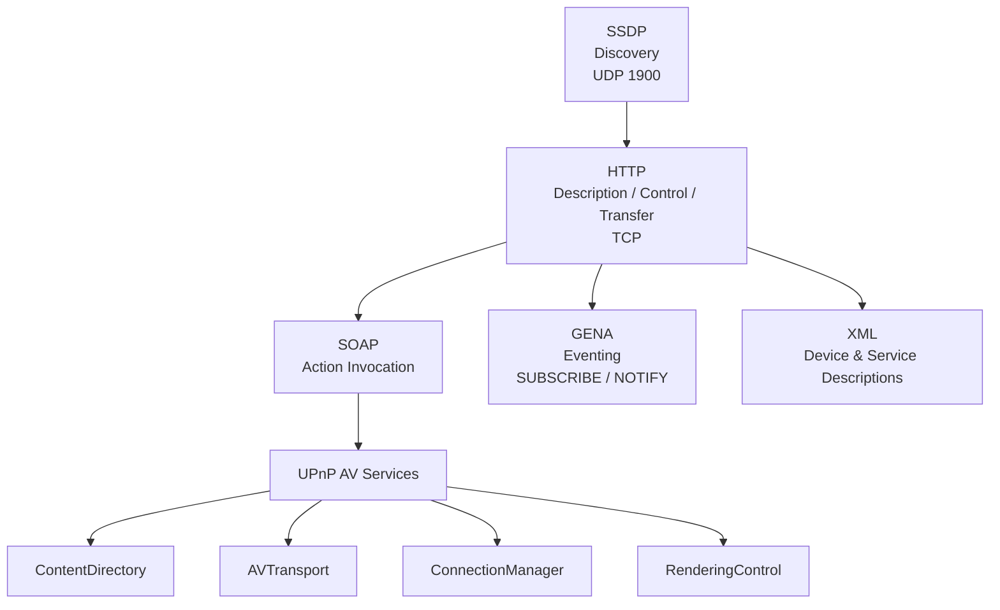
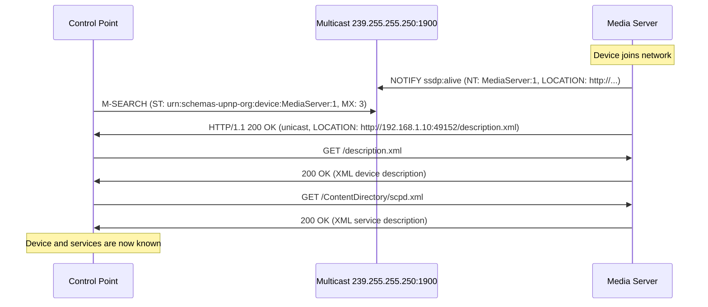
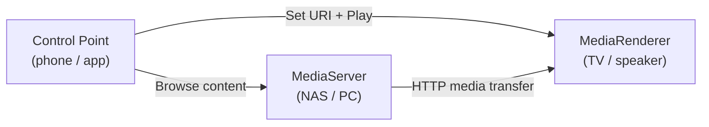
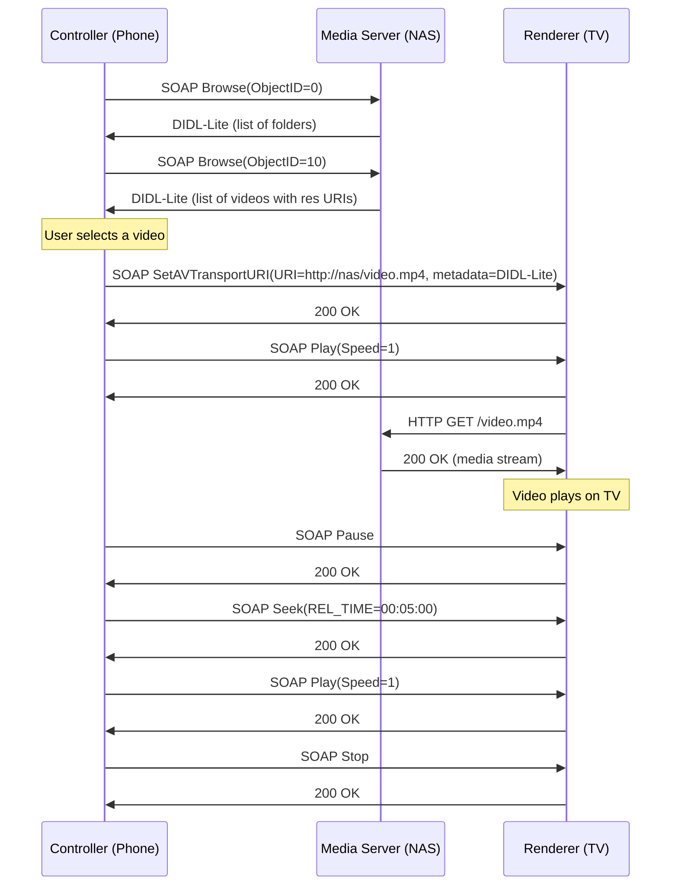
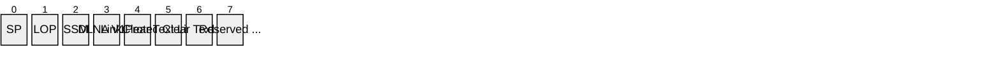
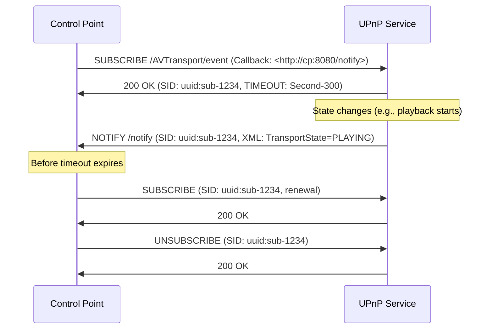
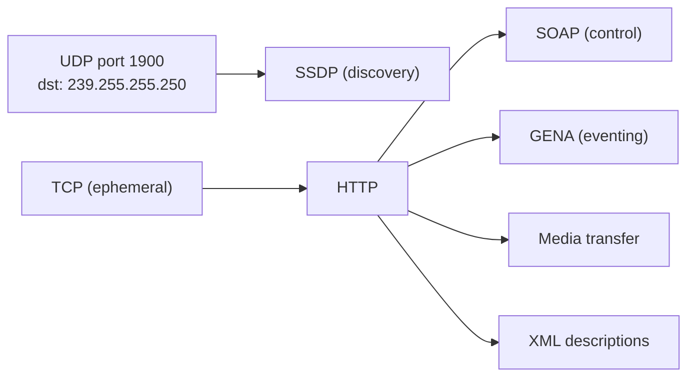

# UPnP / DLNA (Universal Plug and Play / Digital Living Network Alliance)

> **Standard:** [UPnP Device Architecture 2.0](https://openconnectivity.org/developer/specifications/upnp-resources/upnp/) | **Layer:** Application (Layer 7) | **Wireshark filter:** `ssdp`

UPnP is a set of networking protocols that allows devices to discover each other and establish services on a local network without manual configuration. DLNA builds on UPnP AV to define interoperability guidelines for media sharing across consumer electronics — TVs, speakers, phones, NAS devices, and media players. The protocol stack combines SSDP for discovery, HTTP for description and media transfer, SOAP for action invocation, and GENA for eventing. UPnP/DLNA remains the most widely deployed home media sharing protocol.

## Protocol Stack



## SSDP (Simple Service Discovery Protocol)

SSDP uses HTTP-like messages over UDP multicast to discover and advertise UPnP devices on the network.

| Parameter | Value |
|-----------|-------|
| Multicast Address (IPv4) | 239.255.255.250 |
| Multicast Address (IPv6) | ff02::c / ff05::c |
| UDP Port | 1900 |
| Search Target Port | Ephemeral (unicast response) |

### M-SEARCH (Discovery Request)

```
M-SEARCH * HTTP/1.1
HOST: 239.255.255.250:1900
MAN: "ssdp:discover"
MX: 3
ST: urn:schemas-upnp-org:device:MediaServer:1
```

| Field | Description |
|-------|-------------|
| HOST | Multicast address and port |
| MAN | Required: `"ssdp:discover"` |
| MX | Maximum wait time in seconds before responding |
| ST | Search Target — device type, service type, or `ssdp:all` |

### Common Search Targets (ST)

| ST Value | Description |
|----------|-------------|
| `ssdp:all` | All UPnP devices and services |
| `upnp:rootdevice` | All root devices |
| `urn:schemas-upnp-org:device:MediaServer:1` | UPnP Media Servers |
| `urn:schemas-upnp-org:device:MediaRenderer:1` | UPnP Media Renderers |
| `urn:schemas-upnp-org:service:ContentDirectory:1` | ContentDirectory service |
| `urn:schemas-upnp-org:service:AVTransport:1` | AVTransport service |

### NOTIFY (Advertisement)

Devices periodically announce their presence (alive) and departure (byebye):

```
NOTIFY * HTTP/1.1
HOST: 239.255.255.250:1900
CACHE-CONTROL: max-age=1800
LOCATION: http://192.168.1.10:49152/description.xml
NT: urn:schemas-upnp-org:device:MediaServer:1
NTS: ssdp:alive
SERVER: Linux/4.15 UPnP/2.0 MiniDLNA/1.3.0
USN: uuid:4d696e69-444c-164e-9d41-b827eba72d56::urn:schemas-upnp-org:device:MediaServer:1
```

| Field | Description |
|-------|-------------|
| CACHE-CONTROL | How long to cache this advertisement (seconds) |
| LOCATION | URL of the device description XML |
| NT | Notification Type — device or service type |
| NTS | Notification Sub-type: `ssdp:alive` or `ssdp:byebye` |
| SERVER | OS, UPnP version, and product name |
| USN | Unique Service Name — unique identity of this device/service |

## Device Discovery Flow



## UPnP AV Architecture



| Role | Description |
|------|-------------|
| MediaServer | Hosts and serves media content (NAS, PC, camera) |
| MediaRenderer | Plays/displays media content (TV, speaker, set-top box) |
| Control Point | Discovers servers and renderers, browses content, controls playback |

## DLNA Device Classes

| Class | Abbreviation | Description |
|-------|-------------|-------------|
| Digital Media Server | DMS | Stores and shares media content |
| Digital Media Renderer | DMR | Renders (plays) media content pushed to it |
| Digital Media Player | DMP | Finds and plays content from servers (combined browse + render) |
| Digital Media Controller | DMC | Finds content on servers and pushes to renderers (3-box model) |
| Digital Media Printer | DMPr | Prints images from servers |

## ContentDirectory Service

The ContentDirectory service allows browsing and searching media libraries.

### Key Actions

| Action | Description |
|--------|-------------|
| Browse | Navigate the content hierarchy (containers and items) |
| Search | Query items by metadata (title, artist, class, etc.) |
| GetSearchCapabilities | List searchable metadata fields |
| GetSortCapabilities | List sortable metadata fields |
| GetSystemUpdateID | Check if content has changed since last browse |

### Browse Action Parameters

| Parameter | Description |
|-----------|-------------|
| ObjectID | Container to browse (`0` = root) |
| BrowseFlag | `BrowseDirectChildren` or `BrowseMetadata` |
| Filter | Comma-separated list of metadata properties to return (`*` for all) |
| StartingIndex | Offset for paging (0-based) |
| RequestedCount | Number of results to return (0 = all) |
| SortCriteria | Sort order (e.g., `+dc:title`, `-dc:date`) |

### DIDL-Lite Result Format

Browse and Search return results as DIDL-Lite XML:

```xml
<DIDL-Lite xmlns="urn:schemas-upnp-org:metadata-1-0/DIDL-Lite/"
           xmlns:dc="http://purl.org/dc/elements/1.1/"
           xmlns:upnp="urn:schemas-upnp-org:metadata-1-0/upnp/">
  <item id="101" parentID="10" restricted="1">
    <dc:title>Song Title</dc:title>
    <upnp:class>object.item.audioItem.musicTrack</upnp:class>
    <upnp:artist>Artist Name</upnp:artist>
    <upnp:album>Album Name</upnp:album>
    <res protocolInfo="http-get:*:audio/mpeg:DLNA.ORG_PN=MP3;DLNA.ORG_OP=01;DLNA.ORG_FLAGS=01700000000000000000000000000000"
         size="5242880" duration="0:03:45" bitrate="320000">
      http://192.168.1.10:49152/media/101.mp3
    </res>
  </item>
</DIDL-Lite>
```

### UPnP Content Classes

| Class | Description |
|-------|-------------|
| `object.container` | Generic container (folder) |
| `object.container.album.musicAlbum` | Music album |
| `object.container.album.photoAlbum` | Photo album |
| `object.item.audioItem.musicTrack` | Music track |
| `object.item.videoItem.movie` | Movie |
| `object.item.imageItem.photo` | Photo |

## AVTransport Service

The AVTransport service controls media playback on a renderer.

### Key Actions

| Action | Description |
|--------|-------------|
| SetAVTransportURI | Load a media URI for playback |
| Play | Start playback (Speed: "1" for normal) |
| Pause | Pause playback |
| Stop | Stop playback |
| Seek | Seek to a position (REL_TIME, ABS_TIME, TRACK_NR) |
| Next / Previous | Skip to next/previous track |
| GetTransportInfo | Get current transport state (PLAYING, PAUSED, STOPPED) |
| GetPositionInfo | Get current position, duration, and track URI |
| GetMediaInfo | Get information about current media |

## Media Playback Flow (3-Box Model)



## Other UPnP AV Services

### ConnectionManager

| Action | Description |
|--------|-------------|
| GetProtocolInfo | List supported media formats (Source and Sink) |
| PrepareForConnection | Set up a connection for media transfer |
| ConnectionComplete | Tear down a connection |
| GetCurrentConnectionIDs | List active connections |
| GetCurrentConnectionInfo | Details of a specific connection |

### RenderingControl

| Action | Description |
|--------|-------------|
| GetVolume | Get current volume (0-100) |
| SetVolume | Set volume level |
| GetMute | Get mute state |
| SetMute | Set mute on/off |
| ListPresets | List available rendering presets |
| SelectPreset | Activate a preset (e.g., "FactoryDefaults") |

## DLNA Media Formats and Profile IDs

DLNA mandates baseline format support and uses Profile IDs (DLNA.ORG_PN) to identify specific codec/container combinations:

| Profile ID | Format | Description |
|------------|--------|-------------|
| MP3 | audio/mpeg | MPEG-1 Layer 3 audio |
| LPCM | audio/L16 | Linear PCM audio |
| AAC_ISO_320 | audio/mp4 | AAC-LC up to 320 kbps |
| JPEG_SM | image/jpeg | Small JPEG (640x480) |
| JPEG_LRG | image/jpeg | Large JPEG (up to 4096x4096) |
| PNG_LRG | image/png | Large PNG |
| MPEG_PS_NTSC | video/mpeg | MPEG-2 Program Stream (NTSC) |
| MPEG_TS_HD_NA | video/vnd.dlna.mpeg-tts | MPEG-2 Transport Stream HD |
| AVC_MP4_MP_SD_AAC | video/mp4 | H.264 Main Profile SD + AAC |
| AVC_MP4_HP_HD_AAC | video/mp4 | H.264 High Profile HD + AAC |
| AVC_TS_MP_HD_AAC | video/vnd.dlna.mpeg-tts | H.264 MP HD in MPEG-TS |

## DLNA Protocol Info (4th Field)

The `protocolInfo` attribute in DIDL-Lite `<res>` elements follows a 4-field format:

```
<protocol>:<network>:<content-type>:<additional-info>
```

Example: `http-get:*:video/mp4:DLNA.ORG_PN=AVC_MP4_MP_SD_AAC;DLNA.ORG_OP=01;DLNA.ORG_FLAGS=...`

### DLNA.ORG_OP (Operations Parameter)


| Value | Description |
|-------|-------------|
| 00 | No seeking supported |
| 01 | Byte-range seek supported |
| 10 | Time-based seek supported |
| 11 | Both seek modes supported |

### DLNA.ORG_FLAGS (32 hex characters)



| Bit | Flag | Description |
|-----|------|-------------|
| 0 (MSB) | Sender Paced | Server controls transfer rate |
| 1 | Limited Operations (time) | Time-based seek supported |
| 2 | Limited Operations (byte) | Byte-based seek supported |
| 3 | Playcontainer Support | Play container support |
| 4 | S0 Increasing | Start of content grows |
| 5 | SN Increasing | End of content grows (live) |
| 20 | DLNA V1.5 Flag | DLNA 1.5 device |
| 21 | HTTP Stalling | Server supports connection stalling |
| 22 | Background Transfer | Background transfer mode |
| 23 | Interactive Transfer | Interactive transfer mode |
| 24 | Streaming Transfer | Streaming transfer mode |

## DLNA HTTP Headers

| Header | Description |
|--------|-------------|
| `transferMode.dlna.org` | Transfer mode: `Streaming`, `Interactive`, or `Background` |
| `contentFeatures.dlna.org` | DLNA content features (profile, ops, flags) |
| `getcontentFeatures.dlna.org` | Request header: `1` to request content features in response |
| `TimeSeekRange.dlna.org` | Time-based byte-range request/response |
| `availableSeekRange.dlna.org` | Available seek range for live content |
| `realTimeInfo.dlna.org` | Real-time info for live streaming |

### Transfer Modes

| Mode | Description |
|------|-------------|
| Streaming | Server-paced or client-paced streaming (video/audio playback) |
| Interactive | Standard HTTP request/response (browsing metadata, images) |
| Background | Background download (not time-sensitive) |

## GENA (General Event Notification Architecture)

GENA allows control points to subscribe to state changes from services:



## Encapsulation



## Standards

| Document | Title |
|----------|-------|
| [UPnP Device Architecture 2.0](https://openconnectivity.org/developer/specifications/upnp-resources/upnp/) | Core UPnP specification (OCF) |
| [UPnP AV Architecture](https://openconnectivity.org/developer/specifications/upnp-resources/upnp/) | Audio/Video device and service specifications |
| [UPnP ContentDirectory:4](https://openconnectivity.org/developer/specifications/upnp-resources/upnp/) | Content browsing and searching |
| [UPnP AVTransport:3](https://openconnectivity.org/developer/specifications/upnp-resources/upnp/) | Media transport control |
| [DLNA Guidelines](https://www.dlna.org/) | Device interoperability and media format guidelines |
| [RFC 6970](https://www.rfc-editor.org/rfc/rfc6970) | UPnP IGD WANIPConnection (NAT traversal) |

## See Also

- [HTTP](../web/http.md) — transport for descriptions, control, and media transfer
- [RTSP](../voip/rtsp.md) — alternative streaming control protocol
- [mDNS](../naming/mdns.md) — complementary local discovery (Bonjour/Avahi)
- [ONVIF](onvif.md) — SOAP-based IP camera management with similar discovery
