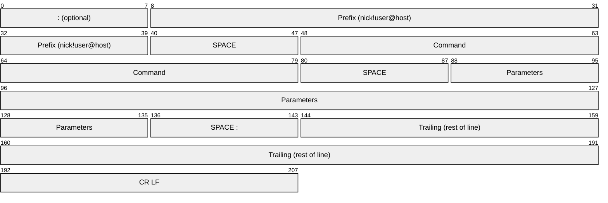
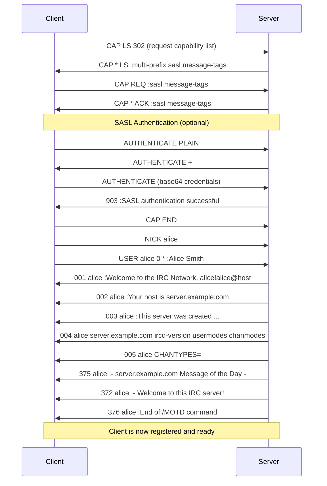
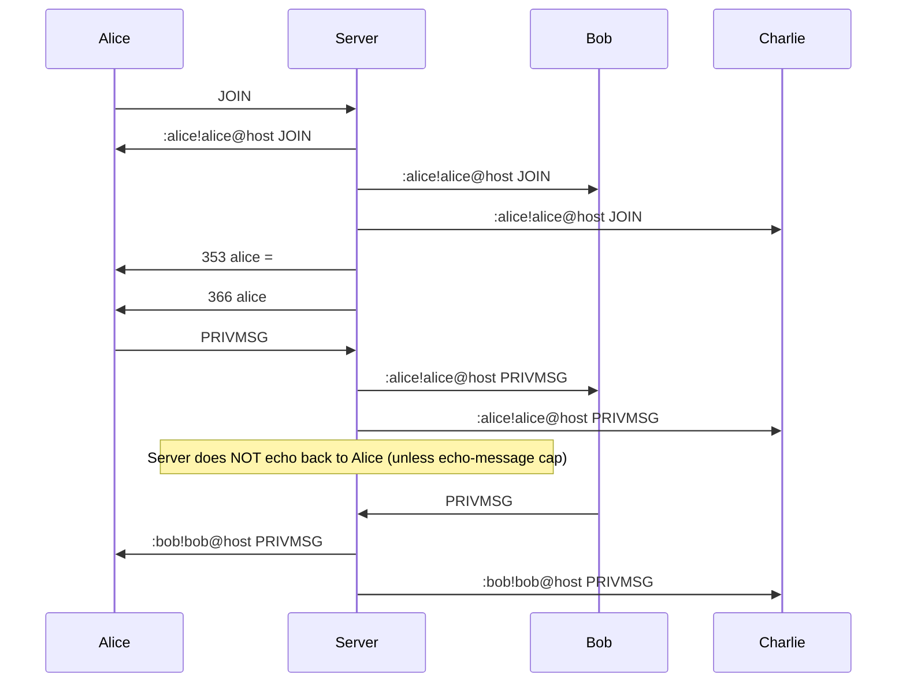
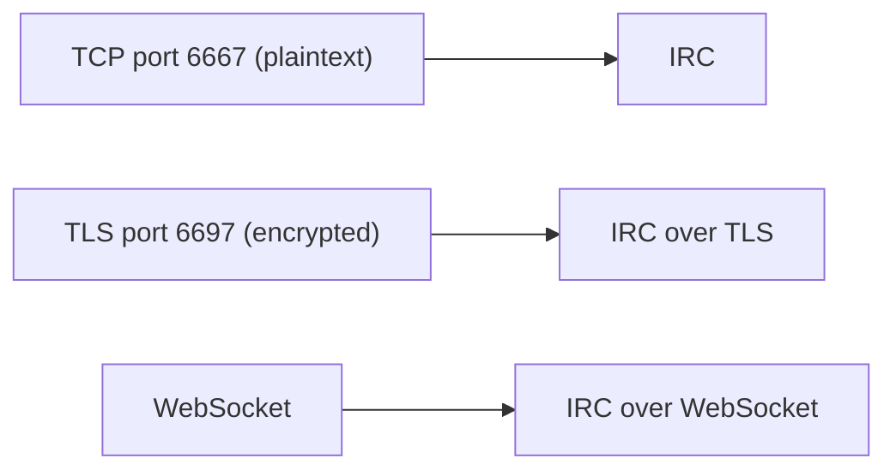

# IRC (Internet Relay Chat)

> **Standard:** [RFC 1459](https://www.rfc-editor.org/rfc/rfc1459) / [RFC 2812](https://www.rfc-editor.org/rfc/rfc2812) | **Layer:** Application (Layer 7) | **Wireshark filter:** `irc`

IRC is a text-based real-time messaging protocol for group and private communication. Developed in 1988, it remains widely used for open-source project coordination (Libera.Chat, OFTC), community chat, and technical collaboration. IRC uses a simple line-oriented protocol over TCP --- each message is a single line of UTF-8 text terminated by CR-LF, with a maximum length of 512 bytes (including the trailing `\r\n`). Clients connect to servers, which can be linked together to form networks. IRC defined the model of channels, operators, and real-time chat that influenced every messaging platform that followed.

## Message Format

Every IRC message follows this structure:

```
[:prefix] command [params] [:trailing]\r\n
```



| Field | Required | Description |
|-------|----------|-------------|
| Prefix | No | Source of the message `:nick!user@host` or `:servername` (server-added for relayed messages) |
| Command | Yes | IRC command (PRIVMSG, JOIN, etc.) or 3-digit numeric reply (001, 353, etc.) |
| Parameters | Varies | Space-separated parameters (max 15) |
| Trailing | No | Final parameter prefixed with `:` --- may contain spaces (used for message text) |
| CR LF | Yes | `\r\n` terminator (messages must not exceed 512 bytes total) |

### Example Messages

```
:alice!alice@user.example.com PRIVMSG #general :Hello everyone!
PING :server.example.com
:server.example.com 001 alice :Welcome to the IRC Network
JOIN #general
```

## Client Registration

When a client connects, it must register with the server:



## Registration Commands

| Command | Parameters | Description |
|---------|------------|-------------|
| PASS | password | Set connection password (before NICK/USER) |
| NICK | nickname | Set or change nickname |
| USER | username mode * :realname | Provide username and real name |
| CAP | LS / REQ / ACK / END | IRCv3 capability negotiation |
| QUIT | [:message] | Disconnect from server |

## Channel Commands

| Command | Parameters | Description |
|---------|------------|-------------|
| JOIN | #channel [key] | Join a channel (creates it if it does not exist) |
| PART | #channel [:message] | Leave a channel |
| KICK | #channel nick [:reason] | Remove a user from a channel (requires operator) |
| INVITE | nick #channel | Invite a user to a channel |
| TOPIC | #channel [:new topic] | View or set the channel topic |
| MODE | #channel +/-modes [params] | Set channel or user modes |
| NAMES | #channel | List users in a channel |
| LIST | [#channel] | List channels and topics on the server |

## Messaging Commands

| Command | Parameters | Description |
|---------|------------|-------------|
| PRIVMSG | target :message | Send a message to a user or channel |
| NOTICE | target :message | Send a notice (must not trigger auto-reply) |

### Channel Messaging Flow



## Server Commands

| Command | Parameters | Description |
|---------|------------|-------------|
| PING | :token | Server keepalive request (client must respond with PONG) |
| PONG | :token | Response to PING |
| WHO | mask | Query user information |
| WHOIS | nick | Detailed user information |
| MOTD | [server] | Request Message of the Day |
| LUSERS | | Server/network statistics |
| VERSION | [server] | Server version information |

## Numeric Replies

| Code | Name | Description |
|------|------|-------------|
| 001 | RPL_WELCOME | Welcome message after successful registration |
| 002 | RPL_YOURHOST | Server host information |
| 003 | RPL_CREATED | Server creation date |
| 004 | RPL_MYINFO | Server name, version, available modes |
| 005 | RPL_ISUPPORT | Server-supported features (NETWORK, CHANTYPES, PREFIX, etc.) |
| 332 | RPL_TOPIC | Channel topic |
| 353 | RPL_NAMREPLY | List of nicknames in a channel |
| 366 | RPL_ENDOFNAMES | End of NAMES list |
| 372 | RPL_MOTD | Message of the Day line |
| 375 | RPL_MOTDSTART | Start of MOTD |
| 376 | RPL_ENDOFMOTD | End of MOTD |
| 401 | ERR_NOSUCHNICK | No such nick/channel |
| 403 | ERR_NOSUCHCHANNEL | No such channel |
| 433 | ERR_NICKNAMEINUSE | Nickname is already in use |
| 461 | ERR_NEEDMOREPARAMS | Not enough parameters |
| 473 | ERR_INVITEONLYCHAN | Cannot join invite-only channel |
| 474 | ERR_BANNEDFROMCHAN | Cannot join --- banned |
| 475 | ERR_BADCHANNELKEY | Cannot join --- wrong key |

## Channel Modes

| Mode | Name | Description |
|------|------|-------------|
| +o nick | Operator | Grants channel operator status (prefix @) |
| +v nick | Voice | Grants voice in moderated channels (prefix +) |
| +b mask | Ban | Bans a hostmask from joining or speaking |
| +i | Invite Only | Only invited users can join |
| +k key | Key | Requires a password to join |
| +l count | Limit | Maximum number of users in the channel |
| +m | Moderated | Only operators and voiced users can speak |
| +n | No External | Only channel members can send messages to the channel |
| +s | Secret | Channel hidden from LIST and WHOIS |
| +t | Topic Lock | Only operators can change the topic |

## User Modes

| Mode | Name | Description |
|------|------|-------------|
| +i | Invisible | User hidden from WHO/NAMES unless in a shared channel |
| +o | Operator | IRC operator (server admin) |
| +w | Wallops | Receives WALLOPS (network-wide operator messages) |
| +r | Registered | Identified with NickServ (varies by implementation) |

## IRCv3 Extensions

Modern IRC implementations support IRCv3 extensions negotiated via CAP:

| Extension | Description |
|-----------|-------------|
| message-tags | Arbitrary key-value metadata on messages |
| sasl | SASL authentication (PLAIN, EXTERNAL, SCRAM) |
| server-time | Server-provided timestamp on each message |
| batch | Group related messages (e.g., history replay) |
| labeled-response | Correlate commands with their replies |
| echo-message | Server echoes your messages back (for multi-client sync) |
| away-notify | Real-time notification when contacts go away/return |
| account-notify | Notification when users authenticate to services |
| cap-notify | Dynamic capability add/remove notification |
| chathistory | Request channel history from the server |
| multi-prefix | Show all channel prefixes (@+) in NAMES |

## CTCP (Client-To-Client Protocol)

CTCP messages are embedded within PRIVMSG using `\x01` (SOH) delimiters:

```
PRIVMSG alice :\x01VERSION\x01
PRIVMSG #general :\x01ACTION waves hello\x01
```

| Command | Description |
|---------|-------------|
| ACTION | Emote (/me does something) |
| VERSION | Request client name/version |
| PING | Round-trip latency measurement |
| TIME | Request client's local time |
| CLIENTINFO | List supported CTCP commands |

## DCC (Direct Client-to-Client)

DCC establishes direct TCP connections between clients (bypassing the server):

| Type | Description |
|------|-------------|
| DCC SEND | File transfer (sender opens a listening port) |
| DCC CHAT | Private chat over a direct TCP connection |
| DCC RESUME | Resume an interrupted file transfer |

DCC is initiated via CTCP: `PRIVMSG bob :\x01DCC SEND filename ip port filesize\x01`

## Server Linking

IRC servers can link together to form a network. Each server maintains connections to other servers in a spanning tree topology --- there is exactly one path between any two servers.

| Concept | Description |
|---------|-------------|
| Spanning Tree | Server topology forms a tree (no loops) |
| Netsplit | A server link breaks, dividing the network; users on each side cannot see users on the other |
| Netjoin | Link re-established, network merges (burst of JOIN messages) |
| Services | Pseudoservers providing NickServ (nick registration), ChanServ (channel management), etc. |

## IRC vs Matrix vs XMPP

| Feature | IRC | Matrix | XMPP |
|---------|-----|--------|------|
| Protocol | Line-based text over TCP | JSON over HTTPS | XML streams over TCP |
| Federation | Server linking (spanning tree) | Homeserver federation (DAG replication) | Server-to-server (S2S) |
| Persistence | None (ephemeral by default; bouncer or IRCv3 chathistory needed) | Full history (server-stored DAG) | MAM (XEP-0313) |
| E2EE | None built-in (OTR/OMEMO via clients) | Olm/Megolm | OMEMO (XEP-0384) |
| File sharing | DCC (direct) or external pastes | Native (mxc:// URIs) | HTTP Upload (XEP-0363) |
| Identity | Nickname (ephemeral; NickServ for registration) | @user:server (permanent) | user@server (permanent JID) |
| Message size | 512 bytes (IRCv3: 4096+ with tags) | Unlimited (JSON) | Unlimited (XML) |
| Extensibility | IRCv3 capabilities, CTCP | Event types, MSCs | XEPs (XML extensions) |
| Clients | HexChat, irssi, WeeChat, Halloy | Element, FluffyChat, Beeper | Conversations, Gajim, Dino |
| Typical use | Open-source communities, tech chat | Government, enterprise, bridged platforms | Enterprise IM, IoT |

## Encapsulation



## Standards

| Document | Title |
|----------|-------|
| [RFC 1459](https://www.rfc-editor.org/rfc/rfc1459) | Internet Relay Chat Protocol (original, 1993) |
| [RFC 2810](https://www.rfc-editor.org/rfc/rfc2810) | IRC: Architecture |
| [RFC 2811](https://www.rfc-editor.org/rfc/rfc2811) | IRC: Channel Management |
| [RFC 2812](https://www.rfc-editor.org/rfc/rfc2812) | IRC: Client Protocol (updated) |
| [RFC 2813](https://www.rfc-editor.org/rfc/rfc2813) | IRC: Server Protocol |
| [IRCv3](https://ircv3.net/irc/) | IRCv3 Working Group Specifications |

## See Also

- [XMPP](xmpp.md) --- XML-based federated messaging (more structured, heavier)
- [Matrix](matrix.md) --- modern federated messaging with history and E2EE
- [Telnet](../remote-access/telnet.md) --- similar line-based text protocol
- [TLS](../security/tls.md) --- encrypts IRC connections on port 6697
