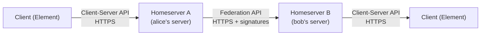
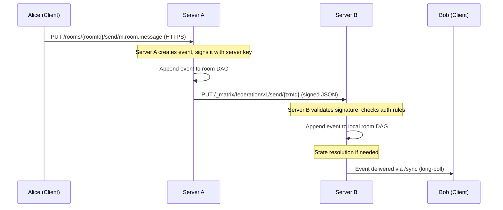
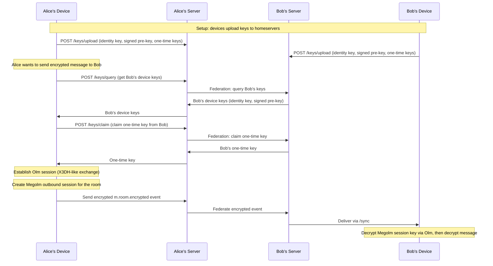
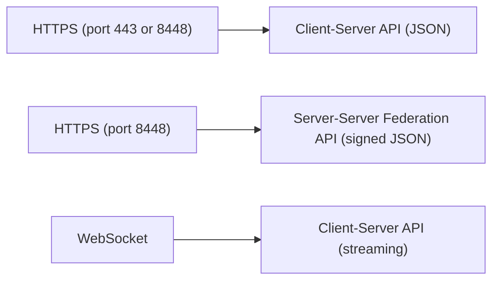

# Matrix

> **Standard:** [Matrix Specification](https://spec.matrix.org/) | **Layer:** Application (Layer 7) | **Wireshark filter:** `http || http2`

Matrix is an open federated protocol for decentralized, real-time communication. It provides interoperable instant messaging, VoIP, and IoT communication with no single point of control. Each user has a homeserver (e.g., matrix.org), and homeservers federate with each other over HTTPS so users on different servers can communicate seamlessly --- like email, but for real-time messaging. Matrix supports end-to-end encryption (Olm/Megolm), bridges to other platforms (Slack, Discord, IRC, WhatsApp, Signal, Telegram), and is used by governments (France, Germany), enterprises, and open-source communities. Major clients include Element, FluffyChat, and Beeper.

## Architecture

## Identifiers

| Identifier | Format | Example | Description |
|------------|--------|---------|-------------|
| User ID | @localpart:domain | @alice:matrix.org | Unique user identifier |
| Room ID | !opaque_id:domain | !abc123:matrix.org | Unique room identifier |
| Room Alias | #name:domain | #general:matrix.org | Human-readable room name |
| Event ID | $opaque_id | $event123 | Unique event identifier |
| Device ID | String | ABCDEF | User's device for E2EE |

## Room Model

Rooms are the fundamental data structure. Each room is a replicated DAG (Directed Acyclic Graph) of events synchronized across all participating homeservers.

| Concept | Description |
|---------|-------------|
| Room | A shared data structure (chat room, DM, or space) replicated across homeservers |
| Event | An immutable JSON object in the room DAG (message, state change, membership) |
| State Event | An event that persists as room configuration (name, topic, power levels, membership) |
| Timeline Event | An event in the message timeline (messages, reactions, redactions) |
| DAG | Directed Acyclic Graph of events --- enables eventually consistent replication |
| State Resolution | Algorithm to deterministically resolve conflicting state across federated servers |

## Event Types

### State Events

| Type | Description |
|------|-------------|
| m.room.create | Room creation event (first event in any room) |
| m.room.member | Membership change (join, leave, invite, ban, knock) |
| m.room.power_levels | Permission levels for actions within the room |
| m.room.name | Room display name |
| m.room.topic | Room topic / description |
| m.room.encryption | Enables E2EE for the room (Megolm settings) |
| m.room.encrypted | An encrypted event payload |
| m.room.avatar | Room avatar image |
| m.room.canonical_alias | Primary room alias |
| m.room.join_rules | Who can join (public, invite, knock, restricted) |
| m.room.history_visibility | Who can see history (joined, invited, shared, world_readable) |
| m.space.child | Links a room as a child of a Space |
| m.space.parent | Links a room to its parent Space |

### Message Types (inside m.room.message)

| msgtype | Description |
|---------|-------------|
| m.text | Plain text or formatted (HTML) message |
| m.image | Image attachment |
| m.video | Video attachment |
| m.audio | Audio attachment |
| m.file | Generic file attachment |
| m.notice | Bot/automated notification (clients may render differently) |
| m.emote | Emote (/me action) |
| m.location | Geographic location |

## Client-Server API

The Client-Server API is RESTful JSON over HTTPS:

| Endpoint | Method | Description |
|----------|--------|-------------|
| /login | POST | Authenticate and obtain access token |
| /register | POST | Create a new account |
| /sync | GET | Long-poll for new events (main sync loop) |
| /rooms/{roomId}/send/{eventType}/{txnId} | PUT | Send a message event |
| /rooms/{roomId}/state/{eventType}/{stateKey} | PUT | Set room state |
| /join/{roomIdOrAlias} | POST | Join a room |
| /rooms/{roomId}/leave | POST | Leave a room |
| /rooms/{roomId}/invite | POST | Invite a user |
| /rooms/{roomId}/messages | GET | Paginate room history |
| /keys/upload | POST | Upload E2EE device keys |
| /keys/query | POST | Query other users' device keys |
| /keys/claim | POST | Claim one-time keys for Olm sessions |
| /createRoom | POST | Create a new room |
| /publicRooms | GET | List public rooms on the server |

## Federation (Server-Server) Flow

When Alice on Server A sends a message to a room with Bob on Server B:

Federation uses HTTPS with server-to-server signing keys. Each event is signed by its origin server, and servers validate signatures before accepting events. Server discovery uses `.well-known/matrix/server` or DNS SRV records.

## End-to-End Encryption

Matrix uses two cryptographic ratchets for E2EE:

| Protocol | Use Case | Based On | Description |
|----------|----------|----------|-------------|
| Olm | 1:1 device sessions | Double Ratchet (Signal) | Establishes encrypted session between two devices |
| Megolm | Group sessions | Forward ratchet only | Efficient group encryption --- one outbound session per device per room |

### E2EE Key Exchange

### Key Verification

| Method | Description |
|--------|-------------|
| SAS (Emoji) | Both devices display 7 emoji --- users compare out of band |
| QR Code | One device shows QR, other scans --- cross-signing verification |
| Cross-Signing | Master key signs device keys; verified users auto-trust new devices |

## Spaces, Threads, and VoIP

| Feature | Description |
|---------|-------------|
| Spaces | Hierarchical grouping of rooms (like Discord servers or Slack workspaces) |
| Threads | In-room threaded replies (m.thread relation) |
| VoIP | 1:1 and group calls via WebRTC (m.call.invite, m.call.answer, m.call.candidates) |
| Sliding Sync | MSC3575 --- efficient sync for mobile (request only visible rooms/events) |

## Bridges

Matrix bridges connect to external platforms, translating messages bidirectionally:

| Bridge | Platform | Protocol |
|--------|----------|----------|
| mautrix-whatsapp | WhatsApp | WhatsApp Web API |
| mautrix-signal | Signal | Signal Protocol (libsignal) |
| mautrix-telegram | Telegram | Telegram Bot/User API |
| mautrix-slack | Slack | Slack API |
| mautrix-discord | Discord | Discord API |
| matrix-appservice-irc | IRC | IRC protocol |

## Matrix vs XMPP vs Signal

| Feature | Matrix | XMPP | Signal |
|---------|--------|------|--------|
| Federation | Yes (any server) | Yes (any server) | No (centralized) |
| Data model | Room DAG (replicated) | XML streams | Centralized store |
| E2EE | Olm/Megolm (opt-in per room) | OMEMO (XEP-0384) | Always on (Double Ratchet) |
| Group encryption | Megolm (efficient) | OMEMO (per-device) | Sender Keys |
| History | Full history on join (configurable) | MAM (XEP-0313) | No server-side history |
| Message format | JSON | XML | Protobuf |
| Bridges | Extensive (Slack, Discord, IRC, WhatsApp) | Limited (Biboumi for IRC) | None |
| Spaces/hierarchy | Spaces (room grouping) | MUC only | Groups (basic) |
| VoIP | WebRTC (1:1 and group) | Jingle (XEP-0166) | Built-in calling |
| Specification | spec.matrix.org | RFCs + XEPs | signal.org/docs |

## Encapsulation

## Standards

| Document | Title |
|----------|-------|
| [Matrix Spec](https://spec.matrix.org/) | Matrix Specification (Client-Server, Server-Server, Application Service, Identity Service) |
| [MSC Process](https://spec.matrix.org/proposals/) | Matrix Spec Changes (proposals for new features) |
| [MSC3575](https://github.com/matrix-org/matrix-spec-proposals/pull/3575) | Sliding Sync |

## See Also

- [XMPP](xmpp.md) --- federated messaging alternative (XML-based)
- [HTTP](../web/http.md) --- underlying transport for Matrix APIs
- [WebSocket](../web/websocket.md) --- streaming transport for clients
