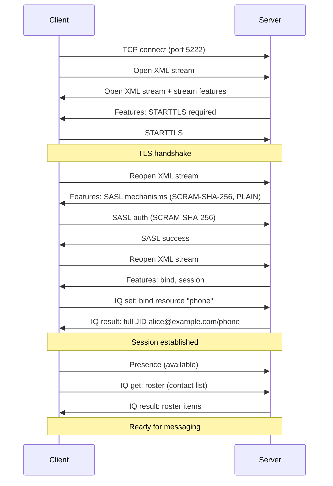
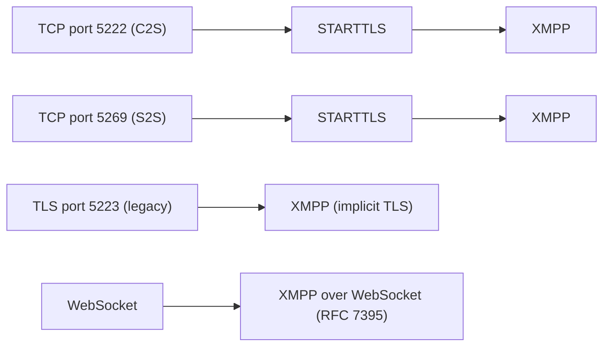

# XMPP (Extensible Messaging and Presence Protocol)

> **Standard:** [RFC 6120](https://www.rfc-editor.org/rfc/rfc6120) | **Layer:** Application (Layer 7) | **Wireshark filter:** `xmpp`

XMPP is an open, decentralized protocol for real-time messaging, presence, and general XML routing. Originally developed as Jabber in 1999, it was standardized by the IETF and is used for instant messaging, multi-user chat, voice/video signaling (Jingle), IoT, and as the foundation of Google Talk (historically), WhatsApp's internal signaling, and ejabberd/Prosody-based deployments. XMPP uses persistent XML streams over TCP and a federated server architecture similar to email — any XMPP server can communicate with any other.

## XML Streams

An XMPP session consists of two XML streams — one in each direction — wrapped in `<stream:stream>` root elements:

```xml
<!-- Client to Server -->
<stream:stream to="example.com" xmlns="jabber:client"
  xmlns:stream="http://etherx.jabber.org/streams" version="1.0">

<!-- Server to Client -->
<stream:stream from="example.com" id="abc123"
  xmlns="jabber:client" version="1.0">
```

All stanzas are XML elements within these streams. The streams remain open for the session's lifetime.

## Stanza Types

XMPP defines three core stanza types:

| Stanza | Purpose | Description |
|--------|---------|-------------|
| `<message>` | Communication | Deliver a message to a user or room |
| `<presence>` | Status | Broadcast availability (online, away, DND) |
| `<iq>` | Info/Query | Request-response operations (get/set/result/error) |

### Common Attributes

| Attribute | Description |
|-----------|-------------|
| from | Sender's JID (set by server) |
| to | Recipient's JID |
| id | Stanza identifier (for matching responses) |
| type | Stanza subtype (see per-stanza tables) |
| xml:lang | Language of the stanza content |

## Addressing (JID — Jabber ID)

```
user@domain/resource
```

| Part | Description | Example |
|------|-------------|---------|
| user (localpart) | Account name | `alice` |
| domain | Server hostname | `example.com` |
| resource | Specific client/session | `phone`, `laptop` |
| Bare JID | user@domain | `alice@example.com` |
| Full JID | user@domain/resource | `alice@example.com/phone` |

## Message Stanza

```xml
<message from="alice@example.com/phone"
         to="bob@example.com"
         type="chat">
  <body>Hello Bob!</body>
</message>
```

### Message Types

| Type | Description |
|------|-------------|
| chat | One-to-one conversation |
| groupchat | Multi-user chat (MUC) room message |
| headline | Alert/notification (no reply expected) |
| normal | Single message (standalone, like email) |
| error | Error response |

## Presence Stanza

```xml
<presence from="alice@example.com/phone">
  <show>away</show>
  <status>In a meeting</status>
  <priority>5</priority>
</presence>
```

### Show Values

| Value | Meaning |
|-------|---------|
| (absent) | Available (online) |
| away | Away |
| chat | Actively looking to chat |
| dnd | Do Not Disturb |
| xa | Extended Away |

### Presence Types

| Type | Description |
|------|-------------|
| (absent) | Available |
| unavailable | Going offline |
| subscribe | Request to subscribe to someone's presence |
| subscribed | Approve a subscription request |
| unsubscribe | Cancel a subscription |
| unsubscribed | Deny/revoke a subscription |
| probe | Server-to-server presence probe |
| error | Presence error |

## IQ (Info/Query) Stanza

```xml
<iq from="alice@example.com/phone"
    to="example.com"
    id="roster1"
    type="get">
  <query xmlns="jabber:iq:roster"/>
</iq>
```

### IQ Types

| Type | Description |
|------|-------------|
| get | Request information |
| set | Provide or update information |
| result | Successful response |
| error | Error response |

## Connection Flow



## Federation

XMPP servers federate like email — `alice@server-a.com` can message `bob@server-b.com`:


Server-to-server connections use DNS SRV records (`_xmpp-server._tcp.example.com`) for discovery.

## Key Extensions (XEPs)

| XEP | Name | Description |
|-----|------|-------------|
| XEP-0045 | Multi-User Chat (MUC) | Group chat rooms |
| XEP-0060 | Publish-Subscribe (PubSub) | Event distribution |
| XEP-0166 | Jingle | Voice/video call signaling (like SIP over XMPP) |
| XEP-0280 | Message Carbons | Sync messages across multiple clients |
| XEP-0313 | Message Archive Management (MAM) | Server-side message history |
| XEP-0384 | OMEMO | End-to-end encryption (Signal Protocol) |
| XEP-0363 | HTTP File Upload | Share files via HTTP URL |
| XEP-0198 | Stream Management | Reliable delivery, session resumption |

## Encapsulation



## Standards

| Document | Title |
|----------|-------|
| [RFC 6120](https://www.rfc-editor.org/rfc/rfc6120) | XMPP: Core |
| [RFC 6121](https://www.rfc-editor.org/rfc/rfc6121) | XMPP: Instant Messaging and Presence |
| [RFC 7590](https://www.rfc-editor.org/rfc/rfc7590) | Use of TLS in XMPP |
| [RFC 7395](https://www.rfc-editor.org/rfc/rfc7395) | XMPP Subprotocol for WebSocket |
| [XEP Index](https://xmpp.org/extensions/) | XMPP Extension Protocols (XEPs) |

## See Also

- [TCP](../transport-layer/tcp.md)
- [TLS](../security/tls.md) — encrypts XMPP connections
- [SIP](../voip/sip.md) — alternative signaling for voice/video (Jingle is XMPP's equivalent)
- [WebSocket](../web/websocket.md) — browser-based XMPP transport
- [DNS](../naming/dns.md) — SRV records for server discovery
