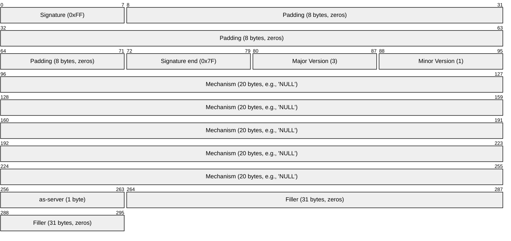
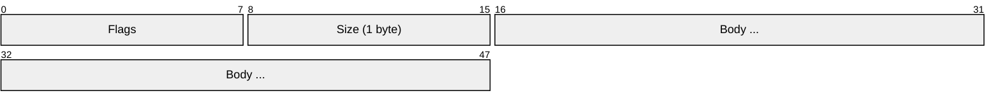
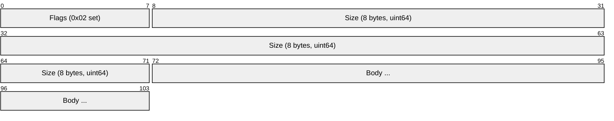
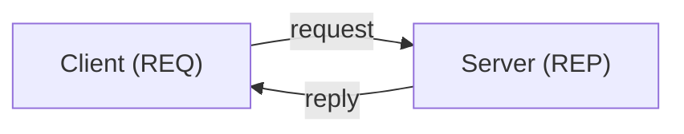
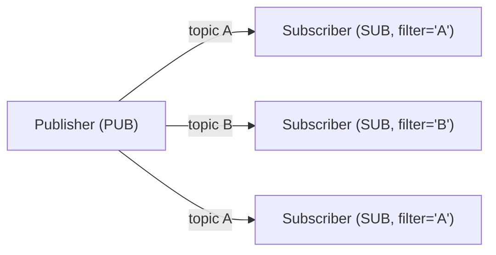
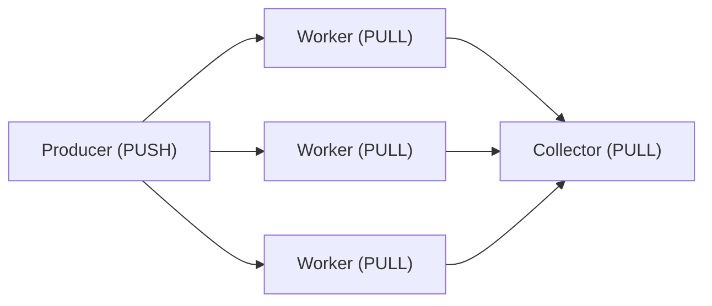
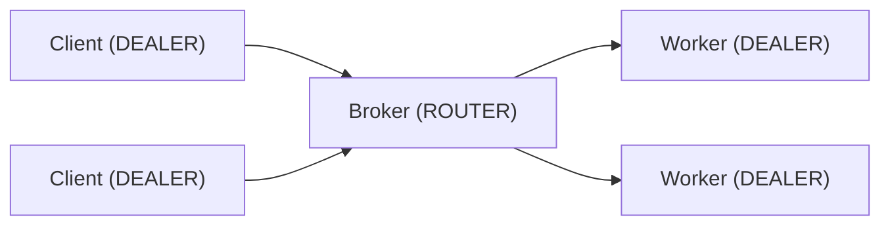

# ZeroMQ (ØMQ / ZMTP)

> **Standard:** [ZMTP 3.1 (rfc.zeromq.org)](https://rfc.zeromq.org/spec/23/) | **Layer:** Application / Transport (Layer 7) | **Wireshark filter:** `zmtp`

ZeroMQ (also written ØMQ or 0MQ) is a high-performance asynchronous messaging library that provides socket-like abstractions for building distributed systems. Unlike broker-based systems (MQTT, AMQP, NATS), ZeroMQ is **brokerless** — messages are sent directly between application endpoints with no intermediary. The wire protocol is ZMTP (ZeroMQ Message Transport Protocol), which defines framing, greeting, handshake, and multiple socket patterns over TCP, IPC, in-process, UDP multicast, and WebSocket.

## ZMTP Greeting

When two ZeroMQ sockets connect, they exchange a greeting to negotiate version and security:



| Field | Size | Description |
|-------|------|-------------|
| Signature | 1 + 8 + 1 bytes | `0xFF` + 8 padding bytes + `0x7F` (identifies ZMTP) |
| Version | 2 bytes | Major.minor (3.1) |
| Mechanism | 20 bytes | Security mechanism: `NULL`, `PLAIN`, `CURVE`, `GSSAPI` |
| as-server | 1 byte | 0 = client role, 1 = server role |

## Frame Format

ZMTP messages are composed of one or more frames:

### Short Frame (0-255 bytes)



### Long Frame (256+ bytes)



### Flags

| Bit | Name | Description |
|-----|------|-------------|
| 0 | MORE | 1 = more frames follow (multi-part message) |
| 1 | LONG | 1 = size is 8 bytes (uint64); 0 = size is 1 byte |
| 2 | COMMAND | 1 = this is a command frame (not data) |

## Socket Patterns

ZeroMQ's core innovation is its socket patterns — each pattern defines a messaging topology:

### REQ-REP (Request-Reply)



Strict alternation: send → recv → send → recv. Lock-step request-response.

### PUB-SUB (Publish-Subscribe)



Publisher sends to all matching subscribers. Subscribers set topic prefix filters. No broker — publisher fans out directly.

### PUSH-PULL (Pipeline)



Round-robin distribution to workers. Load-balanced task distribution.

### ROUTER-DEALER (Advanced Async)



ROUTER tracks sender identity (prepends identity frame). DEALER round-robins. Together they build brokers, proxies, and load balancers.

### All Socket Types

| Socket | Pattern | Send | Receive | Description |
|--------|---------|------|---------|-------------|
| REQ | Request-Reply | Yes (then must recv) | Yes (after send) | Client request |
| REP | Request-Reply | Yes (after recv) | Yes (then must send) | Server reply |
| PUB | Pub-Sub | Yes | No | Publish to all subscribers |
| SUB | Pub-Sub | No | Yes (filtered) | Subscribe to topics |
| PUSH | Pipeline | Yes | No | Push to a worker |
| PULL | Pipeline | No | Yes | Pull from a producer |
| DEALER | Async | Yes (round-robin) | Yes (fair-queue) | Async request/reply |
| ROUTER | Async | Yes (routed by identity) | Yes (with identity) | Routing/brokering |
| PAIR | Exclusive | Yes | No | 1-to-1 bidirectional (inter-thread) |
| XPUB | Extended Pub | Yes | Yes (subscriptions) | PUB with subscription visibility |
| XSUB | Extended Sub | Yes (subscriptions) | Yes | SUB that forwards subscriptions |

## Multi-Part Messages

ZeroMQ messages can consist of multiple frames (MORE flag):

```
Frame 1: "topic" (MORE=1)
Frame 2: "key:value" (MORE=1)
Frame 3: <binary payload> (MORE=0, final)
```

The receiver gets all frames atomically — either the entire multi-part message arrives or nothing. This is how PUB-SUB topic filtering works: the first frame is the topic prefix.

## Security Mechanisms

| Mechanism | Description |
|-----------|-------------|
| NULL | No authentication or encryption |
| PLAIN | Username + password (plaintext — use with TLS only) |
| CURVE | CurveZMQ — elliptic curve encryption and authentication (NaCl/libsodium) |
| GSSAPI | Kerberos-based authentication |

### CurveZMQ

CurveZMQ provides encryption + authentication using Curve25519:

| Feature | Description |
|---------|-------------|
| Key exchange | Curve25519 ECDH |
| Encryption | XSalsa20 + Poly1305 (NaCl crypto_box) |
| Authentication | Server has long-term key pair; client has long-term + transient |
| Perfect forward secrecy | Yes (transient keys per connection) |

## Transports

| Transport | URI | Description |
|-----------|-----|-------------|
| TCP | `tcp://host:port` | Network communication (most common) |
| IPC | `ipc:///tmp/feed` | Unix domain sockets (same machine, fast) |
| In-process | `inproc://name` | Inter-thread (zero-copy, fastest) |
| PGM/EPGM | `pgm://interface;multicast:port` | Reliable multicast (PGM protocol) |
| UDP | `udp://host:port` | Unreliable datagram (RADIO-DISH pattern) |
| WebSocket | `ws://host:port` | Browser-compatible (ZMTP over WS) |

## ZeroMQ vs Other Messaging

| Feature | ZeroMQ | NATS | MQTT | AMQP | Kafka |
|---------|--------|------|------|------|-------|
| Broker | **None** (peer-to-peer) | Required | Required | Required | Required |
| Patterns | REQ-REP, PUB-SUB, PUSH-PULL, ROUTER-DEALER | Pub-Sub, Queue, Request-Reply | Pub-Sub | Queue, Exchange, Topic | Partitioned Log |
| Persistence | None (in-memory only) | JetStream (optional) | Retained messages | Per-message | Always persisted |
| Language | C (libzmq) + 40+ bindings | Go server + clients | Various | Various | JVM + clients |
| Latency | Microseconds | Microseconds | Milliseconds | Milliseconds | Milliseconds |
| Throughput | Millions msg/s | Millions msg/s | Thousands msg/s | Thousands msg/s | Millions msg/s |
| Use case | Low-latency distributed systems, HPC, trading | Cloud-native microservices | IoT | Enterprise integration | Event streaming |

## Common Libraries

| Language | Library |
|----------|---------|
| C | libzmq (reference) |
| C++ | cppzmq |
| Python | pyzmq |
| Java | JeroMQ (pure Java) or JZMq (JNI) |
| Go | pebbe/zmq4, go-zeromq/zmq4 |
| Rust | zmq.rs |
| Node.js | zeromq.js |
| C# | NetMQ |

## Standards

| Document | Title |
|----------|-------|
| [ZMTP 3.1](https://rfc.zeromq.org/spec/23/) | ZeroMQ Message Transport Protocol |
| [CurveZMQ](https://rfc.zeromq.org/spec/26/) | CurveZMQ security mechanism |
| [ZeroMQ RFCs](https://rfc.zeromq.org/) | All ZeroMQ specifications |
| [ZeroMQ Guide](https://zguide.zeromq.org/) | Official guide (patterns, examples) |

## See Also

- [MQTT](mqtt.md) — broker-based IoT messaging
- [AMQP](amqp.md) — broker-based enterprise messaging
- [NATS](nats.md) — lightweight cloud messaging
- [Kafka](kafka.md) — distributed event streaming
- [TCP](../transport-layer/tcp.md) — primary ZeroMQ transport
- [DDS / ROS 2](../robotics/dds.md) — another brokerless pub-sub (different domain)
