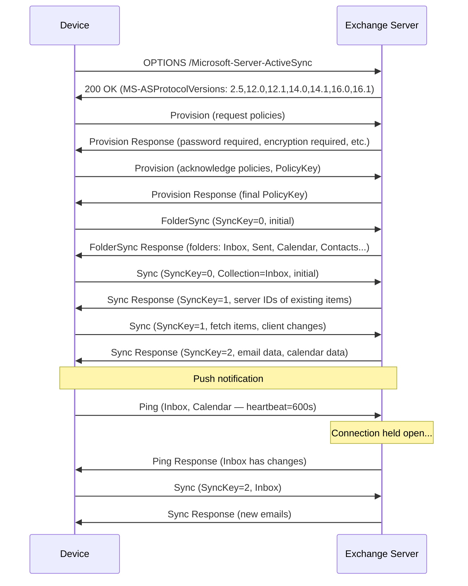
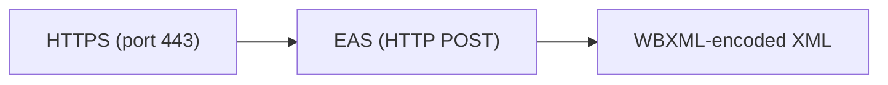

# Exchange ActiveSync (EAS)

> **Standard:** [MS-ASCMD / MS-ASHTTP (Microsoft Open Specifications)](https://learn.microsoft.com/en-us/openspecs/exchange_server_protocols/ms-ascmd/) | **Layer:** Application (Layer 7) | **Wireshark filter:** `http` (EAS runs over HTTPS with WBXML bodies)

Exchange ActiveSync (EAS) is Microsoft's protocol for synchronizing email, calendar, contacts, tasks, and notes between a mobile device and an Exchange server (or compatible server). It uses HTTP/HTTPS as transport with WBXML-encoded request/response bodies for compact over-the-air transfer. EAS provides push email notification, remote device wipe, policy enforcement, and direct push (long-lived HTTP connections for real-time notifications). It became the dominant mobile sync protocol on iOS, Android, and Windows Phone, and is licensed to many third-party server implementations.

## How EAS Works

EAS uses HTTP POST requests to a single endpoint, with the command specified in the query string:

```
POST /Microsoft-Server-ActiveSync?Cmd=Sync&User=alice&DeviceId=ABC123&DeviceType=iPhone
Content-Type: application/vnd.ms-sync.wbxml
```

The request and response bodies are WBXML-encoded XML documents.

## Commands

| Command | Description |
|---------|-------------|
| FolderSync | Synchronize the folder hierarchy |
| FolderCreate | Create a new folder |
| FolderDelete | Delete a folder |
| FolderUpdate | Rename or move a folder |
| Sync | Synchronize items (email, calendar, contacts, tasks, notes) |
| GetItemEstimate | Get the count of items to sync (plan before downloading) |
| MoveItems | Move items between folders |
| Search | Search the mailbox, GAL, or document library |
| SendMail | Send an email message |
| SmartReply | Reply to an email (server appends original) |
| SmartForward | Forward an email (server appends original) |
| Ping | Register for push notifications (direct push) |
| ItemOperations | Fetch attachments, empty folder, move items |
| Provision | Negotiate device security policies |
| Settings | Get/set OOF, device info, user info |
| MeetingResponse | Accept, tentatively accept, or decline a meeting |
| ResolveRecipients | Look up recipients in the GAL |
| ValidateCert | Validate an S/MIME certificate |
| Find | Search for items (EAS 16.1+) |

## Sync Flow



## SyncKey

The SyncKey is the core state-tracking mechanism:

| SyncKey | Meaning |
|---------|---------|
| 0 | Initial sync — server returns all item IDs |
| 1+ | Incremental sync — only changes since this key |

If the server doesn't recognize the SyncKey, it forces a re-sync (reset to 0).

## Push Email — Direct Push (Ping)

EAS provides real-time email notification without polling:

1. Device sends a `Ping` request listing the folders to monitor and a heartbeat interval (up to 3600 seconds)
2. Server holds the HTTP connection open
3. When new mail arrives, the server immediately responds
4. Device issues a `Sync` to fetch the new items
5. Device sends another `Ping` to wait for the next change

This is essentially HTTP long polling, giving push-like behavior without a persistent socket.

## Protocol Versions

| Version | Exchange | Year | Key Features |
|---------|----------|------|-------------|
| 2.5 | Exchange 2003 SP2 | 2005 | Basic sync, GAL |
| 12.0 | Exchange 2007 | 2006 | Document search, HTML email |
| 12.1 | Exchange 2007 SP1 | 2008 | Header compression (Base64 binary), bundled sync |
| 14.0 | Exchange 2010 | 2009 | SMS sync, conversation view |
| 14.1 | Exchange 2010 SP1 | 2010 | S/MIME, IRM, body preferences |
| 16.0 | Exchange 2016 | 2015 | Improved Find command |
| 16.1 | Exchange Online | 2018 | Find enhancements, body part preferences |

## Provisioning (Device Policies)

The Provision command enforces security policies on managed devices:

| Policy | Description |
|--------|-------------|
| DevicePasswordEnabled | Require a device password/PIN |
| MinDevicePasswordLength | Minimum password length |
| MaxInactivityTimeDeviceLock | Auto-lock timeout |
| MaxDevicePasswordFailedAttempts | Wipe after N failed attempts |
| AllowSimpleDevicePassword | Allow simple PINs (1234, 0000) |
| DeviceEncryptionEnabled | Require device encryption |
| AllowCamera | Allow/disallow camera |
| AllowBrowser | Allow/disallow web browser |
| RemoteWipe | Remotely erase the device |

## WBXML Encoding

EAS uses WBXML to compress XML requests/responses for efficient mobile transmission. Each EAS namespace (AirSync, Email, Calendar, Contacts, etc.) has its own WBXML code page with token-to-element mappings.

| Code Page | Namespace | Description |
|-----------|-----------|-------------|
| 0 | AirSync | Core sync commands |
| 2 | Email | Email-specific elements |
| 4 | Calendar | Calendar elements |
| 5 | Move | Move operations |
| 7 | FolderHierarchy | Folder management |
| 14 | Provision | Policy management |
| 15 | Search | Search operations |
| 17 | AirSyncBase | Common elements (body, attachments) |
| 18 | Settings | Device/user settings |
| 20 | ItemOperations | Fetch/empty/move operations |

## Encapsulation



EAS always runs over HTTPS. The endpoint path is `/Microsoft-Server-ActiveSync`.

## Standards

| Document | Title |
|----------|-------|
| [MS-ASCMD](https://learn.microsoft.com/en-us/openspecs/exchange_server_protocols/ms-ascmd/) | Exchange ActiveSync: Command Reference Protocol |
| [MS-ASHTTP](https://learn.microsoft.com/en-us/openspecs/exchange_server_protocols/ms-ashttp/) | Exchange ActiveSync: HTTP Protocol |
| [MS-ASWBXML](https://learn.microsoft.com/en-us/openspecs/exchange_server_protocols/ms-aswbxml/) | Exchange ActiveSync: WBXML Algorithm |
| [MS-ASPROV](https://learn.microsoft.com/en-us/openspecs/exchange_server_protocols/ms-asprov/) | Exchange ActiveSync: Provisioning Protocol |
| [MS-ASAIRS](https://learn.microsoft.com/en-us/openspecs/exchange_server_protocols/ms-asairs/) | Exchange ActiveSync: AirSyncBase Namespace |

## See Also

- [WBXML](wbxml.md) — compact XML encoding used by EAS
- [HTTP](http.md) — transport protocol
- [IMAP](../email/imap.md) — alternative email access (server-side sync)
- [SyncML](syncml.md) — open standard that EAS competed with
- [DeltaSync](deltasync.md) — Microsoft's earlier Hotmail sync protocol
- [TLS](../security/tls.md) — HTTPS encryption
