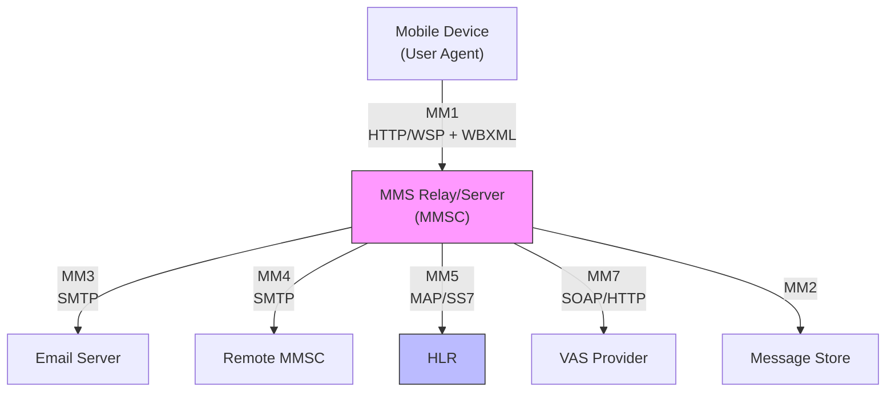
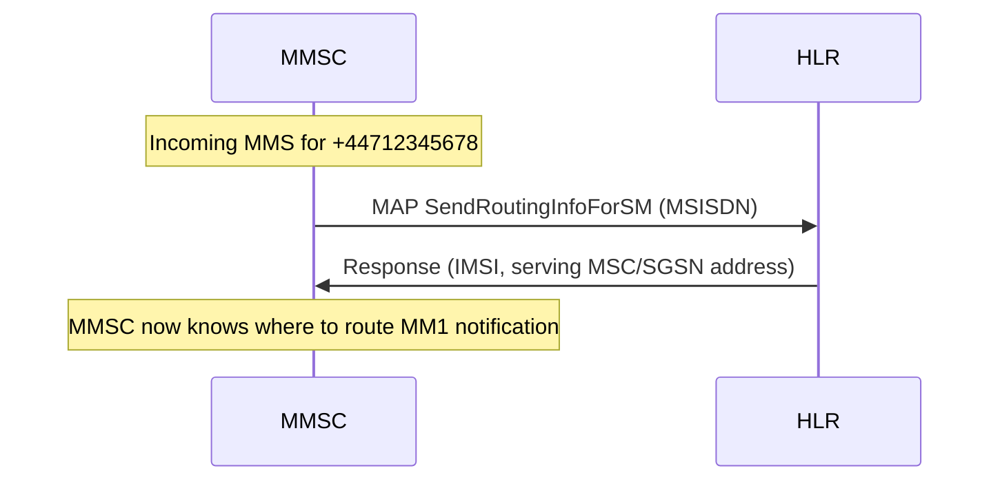
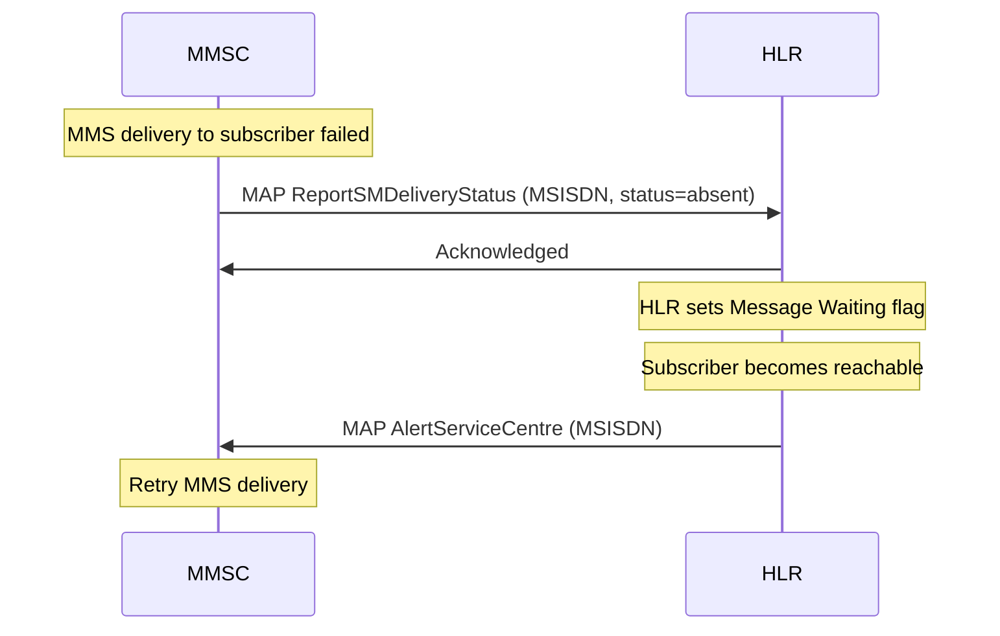
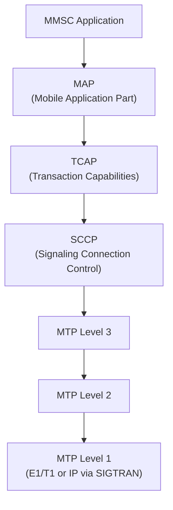

# MM5 (MMS MMSC-to-HLR Interface)

> **Standard:** [3GPP TS 23.140](https://www.3gpp.org/DynaReport/23140.htm) | **Layer:** Application (Layer 7) | **Wireshark filter:** `gsm_map`

MM5 is the reference interface between the MMS Relay/Server (MMSC) and the Home Location Register (HLR) in the 3GPP Multimedia Messaging Service architecture. The MMSC uses MM5 to query subscriber information needed for message routing and delivery — specifically, to resolve an MSISDN to a serving network element and to check subscriber service entitlements. MM5 is based on MAP (Mobile Application Part), the same signaling protocol used for voice call routing in GSM/UMTS networks.

## MMS Architecture Interfaces

MM5 is one of several interfaces defined in the MMS architecture. Each interface serves a different role.

## Interface Summary

| Interface | Endpoints | Protocol | Purpose |
|-----------|-----------|----------|---------|
| MM1 | UE ↔ MMSC | HTTP/WSP + WBXML | Message submission and retrieval |
| MM2 | MMSC ↔ Message Store | Implementation-specific | Message storage |
| MM3 | MMSC ↔ Email | SMTP | Email interworking |
| MM4 | MMSC ↔ MMSC | SMTP | Inter-operator MMS relay |
| **MM5** | **MMSC ↔ HLR** | **MAP (SS7)** | **Subscriber info and routing** |
| MM6 | MMSC ↔ User DB | Implementation-specific | User profile management |
| MM7 | MMSC ↔ VAS | SOAP/HTTP | Value-added service integration |

## MM5 Operations

The MMSC uses MM5 to perform MAP queries against the HLR:

| MAP Operation | Purpose |
|---------------|---------|
| SendRoutingInfoForSM | Resolve MSISDN to serving MSC/SGSN address and IMSI |
| ReportSMDeliveryStatus | Inform HLR of delivery failure (for retry notification) |
| AlertServiceCentre | HLR notifies MMSC when a subscriber becomes reachable |
| AnyTimeInterrogation | Query subscriber location and status |

### Typical MM5 Flow (Message Delivery)

### Delivery Retry Notification

## Protocol Stack

MM5 is carried over the SS7 signaling network:

In modern deployments, the lower SS7 layers are often replaced by SIGTRAN (SS7 over IP), using M3UA and SCTP.

## Standards

| Document | Title |
|----------|-------|
| [3GPP TS 23.140](https://www.3gpp.org/DynaReport/23140.htm) | Multimedia Messaging Service (MMS) — Functional description; Stage 2 |
| [3GPP TS 29.002](https://www.3gpp.org/DynaReport/29002.htm) | Mobile Application Part (MAP) specification |
| [3GPP TS 23.040](https://www.3gpp.org/DynaReport/23040.htm) | Technical realization of SMS (related procedures) |

## See Also

- [SMPP](smpp.md) — alternative interface for SMS submission
- [SMTP](../email/smtp.md) — used by MM3 (email) and MM4 (inter-MMSC) interfaces
- [WBXML](wbxml.md) — encoding used on the MM1 interface
- [SS7](../telecom/ss7.md) — signaling network that carries MAP
