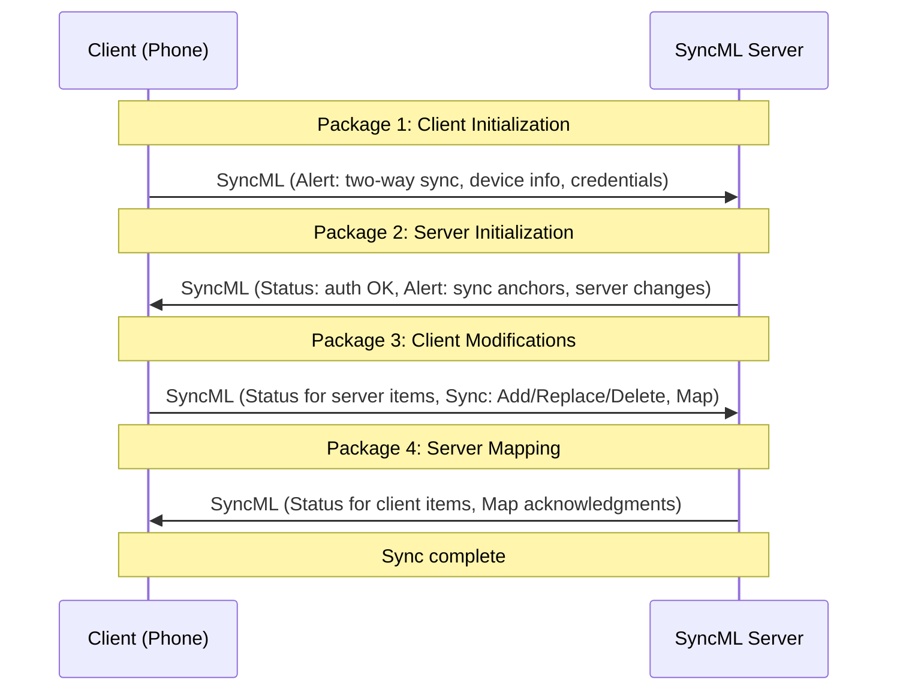
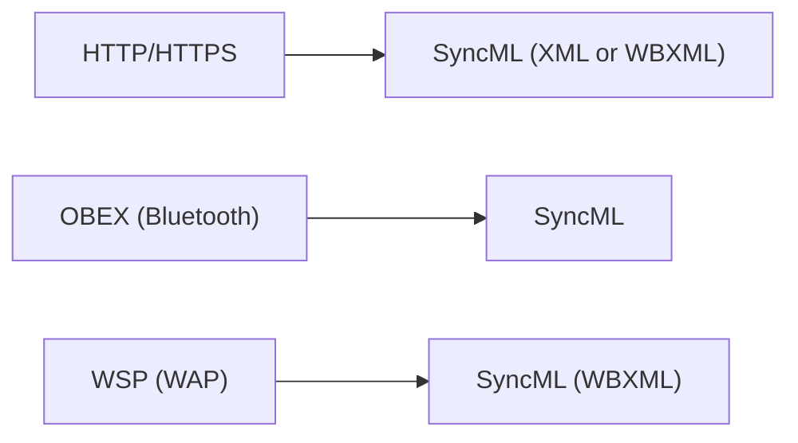

# SyncML / OMA DS & DM (Synchronization Markup Language)

> **Standard:** [OMA Data Synchronization (DS) v1.2 / OMA Device Management (DM) v1.2](https://www.openmobilealliance.org/) | **Layer:** Application (Layer 7) | **Wireshark filter:** `xml` or `wbxml` (SyncML is XML/WBXML over HTTP)

SyncML is a platform-independent protocol for synchronizing data between a server and client devices. It was developed by the SyncML Initiative (later merged into the Open Mobile Alliance) and covers two use cases: **OMA DS** (Data Synchronization — contacts, calendar, tasks, notes) and **OMA DM** (Device Management — firmware updates, configuration, policy). SyncML was the standard sync protocol on feature phones and early smartphones (Nokia, Sony Ericsson, Motorola) before platform-specific cloud sync (iCloud, Google Sync, EAS) took over.

## Protocol Overview

SyncML messages are XML documents (or WBXML for compact transmission) exchanged over HTTP, OBEX (Bluetooth/IrDA), or WSP (WAP). Each message contains a header and a body with one or more sync commands.

### Message Structure

```xml
<SyncML>
  <SyncHdr>
    <VerDTD>1.2</VerDTD>
    <VerProto>SyncML/1.2</VerProto>
    <SessionID>1</SessionID>
    <MsgID>1</MsgID>
    <Target><LocURI>http://server/syncml</LocURI></Target>
    <Source><LocURI>IMEI:123456789</LocURI></Source>
    <Cred>...</Cred>
  </SyncHdr>
  <SyncBody>
    <Alert>...</Alert>
    <Sync>...</Sync>
    <Final/>
  </SyncBody>
</SyncML>
```

## Key Fields

| Element | Description |
|---------|-------------|
| SyncHdr | Message header (version, session, source, target, credentials) |
| SessionID | Unique session identifier |
| MsgID | Sequence number within the session |
| Target | URI of the recipient |
| Source | URI of the sender (device IMEI, phone number, etc.) |
| Cred | Authentication credentials (Basic, MD5 digest, HMAC) |
| SyncBody | Contains one or more sync commands |
| Final | Marks the last message in an exchange |

## Sync Commands (OMA DS)

| Command | Description |
|---------|-------------|
| Alert | Initiate sync, specify sync type |
| Sync | Container for data operations |
| Add | Add a new item |
| Replace | Update an existing item |
| Delete | Delete an item |
| Copy | Copy an item |
| Move | Move an item |
| Get | Retrieve data |
| Put | Send device info/capabilities |
| Map | Map client-side IDs to server-side IDs |
| Results | Return results of a Get command |
| Status | Return status code for a command |

## Sync Types (Alert Codes)

| Code | Name | Description |
|------|------|-------------|
| 200 | Two-way sync | Full bidirectional sync |
| 201 | Slow sync | Exchange all items (initial sync or recovery) |
| 202 | One-way from client | Client sends changes to server |
| 203 | Refresh from client | Client replaces all server data |
| 204 | One-way from server | Server sends changes to client |
| 205 | Refresh from server | Server replaces all client data |
| 206 | Two-way by server | Server-initiated two-way sync |
| 207 | One-way from client by server | Server-initiated, client sends |
| 208 | Refresh from client by server | Server-initiated, client replaces server |
| 209 | One-way from server by server | Server-initiated, server sends |
| 210 | Refresh from server by server | Server-initiated, server replaces client |

## Sync Session Flow



### Change Detection — Anchors

SyncML uses **sync anchors** (timestamps or change counters) to track what has been synchronized:

| Anchor | Description |
|--------|-------------|
| Last | Anchor from the previous successful sync |
| Next | Anchor for this sync session |

If the server's Last anchor doesn't match the client's, a slow sync is triggered (exchange all items).

## Data Formats

SyncML carries data in various formats depending on the data type:

| Data Type | Format | MIME Type |
|-----------|--------|-----------|
| Contacts | vCard 2.1 or 3.0 | text/x-vcard or text/vcard |
| Calendar | vCalendar 1.0 or iCalendar 2.0 | text/x-vcalendar or text/calendar |
| Tasks | vCalendar VTODO | text/x-vcalendar |
| Notes | Plain text | text/plain |
| Email | RFC 5322 | message/rfc822 |

## Device Management (OMA DM)

OMA DM uses the same SyncML message format but with different commands for managing device configuration:

| Command | Description |
|---------|-------------|
| Get | Read a device management node value |
| Replace | Set a device management node value |
| Add | Create a new management node |
| Delete | Remove a management node |
| Exec | Execute a command on the device (firmware update, factory reset) |
| Copy | Copy a management node |
| Sequence | Execute commands in order |
| Atomic | Execute commands atomically (all or nothing) |

### DM Tree

Device configuration is organized as a tree:

```
./DevInfo/DevId       → IMEI:123456789
./DevInfo/Man         → Nokia
./DevInfo/Mod         → N95
./Email/Account1/     → Email account settings
./WiFi/SSID1/         → Wi-Fi configuration
./Firmware/Update/    → Firmware update management
```

## Transport Bindings

| Transport | Usage |
|-----------|-------|
| HTTP/HTTPS | Most common (mobile data, Wi-Fi) |
| OBEX | Bluetooth or IrDA (local sync) |
| WSP | WAP Session Protocol (legacy mobile) |

## Status Codes

| Code | Meaning |
|------|---------|
| 200 | OK |
| 201 | Item added |
| 212 | Authentication accepted |
| 401 | Invalid credentials |
| 403 | Forbidden |
| 404 | Not found |
| 406 | Optional feature not supported |
| 407 | Credentials required |
| 415 | Unsupported media type |
| 500 | Server error |
| 508 | Refresh required (slow sync needed) |

## SyncML Ecosystem

| Implementation | Description |
|---------------|-------------|
| Nokia PC Suite | Synced contacts/calendar via SyncML |
| Funambol | Open-source SyncML server |
| Horde | PHP groupware with SyncML support |
| ScheduleWorld | Cloud SyncML service (defunct) |
| Memotoo | Cloud SyncML service |
| Android (pre-4.0) | Some vendors included SyncML clients |

## Encapsulation



## Standards

| Document | Title |
|----------|-------|
| [OMA DS v1.2](https://www.openmobilealliance.org/release/DS/) | OMA Data Synchronization Protocol |
| [OMA DM v1.2](https://www.openmobilealliance.org/release/DM/) | OMA Device Management Protocol |
| [SyncML Representation Protocol](https://www.openmobilealliance.org/) | XML/WBXML representation |
| [SyncML HTTP Binding](https://www.openmobilealliance.org/) | HTTP transport specification |

## See Also

- [WBXML](wbxml.md) — compact encoding used for SyncML on mobile
- [HTTP](http.md) — primary transport
- [Exchange ActiveSync](eas.md) — Microsoft's competing sync protocol
- [IMAP](../email/imap.md) — email sync alternative
