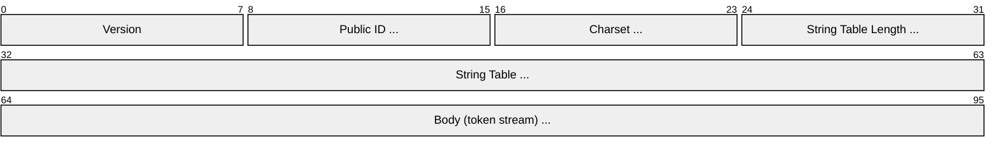
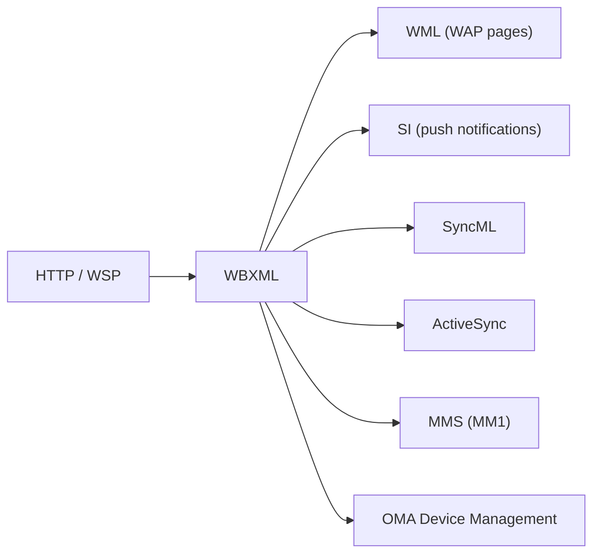

# WBXML (WAP Binary XML)

> **Standard:** [WAP-192-WBXML](https://www.openmobilealliance.org/tech/affiliates/wap/wap-192-wbxml-20010725-a.pdf) | **Layer:** Application (Layer 7) | **Wireshark filter:** `wbxml`

WBXML is a compact binary encoding of XML developed by the WAP Forum (now Open Mobile Alliance) for efficient transmission of XML documents over low-bandwidth mobile networks. Instead of sending verbose text tags, WBXML maps element names, attribute names, and common attribute values to single-byte tokens, dramatically reducing message size. WBXML is used by WAP provisioning, Microsoft Exchange ActiveSync, SyncML, MMS (MM1 interface), and OMA Device Management.

## Document Structure



All multi-byte integers use a variable-length encoding (high bit = continuation flag, 7 bits of value per byte).

## Key Fields

| Field | Size | Description |
|-------|------|-------------|
| Version | 1 byte | WBXML version (e.g., 0x03 = version 1.3) |
| Public ID | mb_u_int32 | Document type identifier (or 0x01 + string table index) |
| Charset | mb_u_int32 | IANA MIBenum character encoding (e.g., 0x6A = UTF-8) |
| String Table Length | mb_u_int32 | Length of the string table in bytes |
| String Table | Variable | Null-terminated strings referenced by offset |
| Body | Variable | Stream of tokens representing the XML document |

## Field Details

### Version

| Value | WBXML Version |
|-------|---------------|
| 0x00 | 1.0 |
| 0x01 | 1.1 |
| 0x02 | 1.2 |
| 0x03 | 1.3 (current) |

### Token Types

The body is a stream of single-byte tokens:

| Token | Name | Description |
|-------|------|-------------|
| 0x00 | SWITCH_PAGE | Change the active code page |
| 0x01 | END | Close current element |
| 0x02 | ENTITY | Character entity (followed by mb_u_int32 code point) |
| 0x03 | STR_I | Inline string (followed by null-terminated UTF-8) |
| 0x40 | EXT_I_0 | Extension token (inline string) |
| 0x43 | PI | Processing instruction |
| 0x44 | LITERAL | Element tag from string table |
| 0x80 | EXT_T_0 | Extension token (table reference) |
| 0x83 | STR_T | String table reference (followed by offset) |
| 0xC0 | EXT_0 | Extension token (no data) |
| 0xC3 | OPAQUE | Opaque binary data (followed by length + bytes) |

### Tag Encoding

Element tags are encoded as a single byte. The two high bits have special meaning:


| Bit | Name | Meaning |
|-----|------|---------|
| 7 | A (Attributes) | 1 = element has attributes |
| 6 | C (Content) | 1 = element has child content |
| 5-0 | Tag | Token value (0x05-0x3F mapped to element names) |

Tokens 0x05 through 0x3F represent element names. The mapping from token to element name is defined by the document type's code page (e.g., WML, SI, SL, ActiveSync).

### Code Pages

Different document types define different token-to-element mappings:

| Public ID | Document Type | Usage |
|-----------|---------------|-------|
| 0x02 | WML 1.0 | WAP Markup Language |
| 0x04 | WML 1.1 | WAP Markup Language |
| 0x09 | WML 1.3 | WAP Markup Language |
| 0x05 | SI 1.0 | Service Indication (push) |
| 0x06 | SL 1.0 | Service Loading (push) |
| 0x0B | WV CSP 1.1 | Wireless Village (IM) |
| — | ActiveSync | Microsoft Exchange sync (uses literal tags) |

### String Table

The string table stores commonly repeated strings. References in the token stream point to byte offsets within the table. This avoids repeating the same string multiple times in the document.

### Multi-Byte Integer (mb_u_int32)

```
Byte 1: 1xxxxxxx  (continuation, 7 bits of value)
Byte 2: 1xxxxxxx  (continuation, 7 bits of value)
Byte N: 0xxxxxxx  (final byte, 7 bits of value)
```

The high bit of each byte indicates whether more bytes follow. Value is assembled from the 7-bit fields, most significant first.

## Example: XML to WBXML

XML:
```xml
<SI>
  <indication href="http://example.com">New message</indication>
</SI>
```

Becomes approximately 30 bytes of WBXML instead of ~90 bytes of text XML — a ~70% reduction.

## Encapsulation



## Standards

| Document | Title |
|----------|-------|
| [WAP-192-WBXML](https://www.openmobilealliance.org/tech/affiliates/wap/wap-192-wbxml-20010725-a.pdf) | WAP Binary XML Content Format v1.3 |
| [W3C NOTE-wbxml](https://www.w3.org/1999/06/NOTE-wbxml-19990624/) | WAP Binary XML Content Format (W3C Note) |
| [MS-ASWBXML](https://learn.microsoft.com/en-us/openspecs/exchange_server_protocols/ms-aswbxml/) | Exchange ActiveSync: WBXML Algorithm |
| [OMA SyncML](https://www.openmobilealliance.org/) | SyncML Representation Protocol (uses WBXML) |

## See Also

- [HTTP](http.md) — common transport for WBXML content
- [SMPP](smpp.md) — alternative messaging protocol (text-based addressing)
- [SMTP](../email/smtp.md) — email transport (XML/WBXML used in ActiveSync over HTTP)
