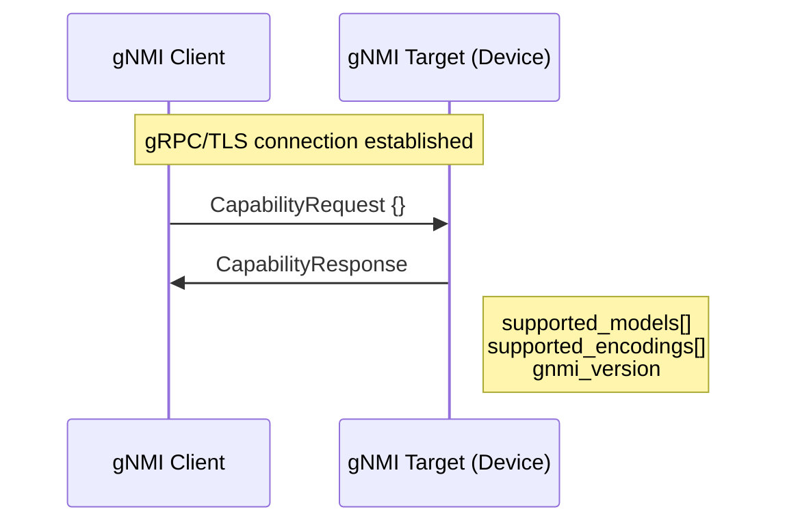
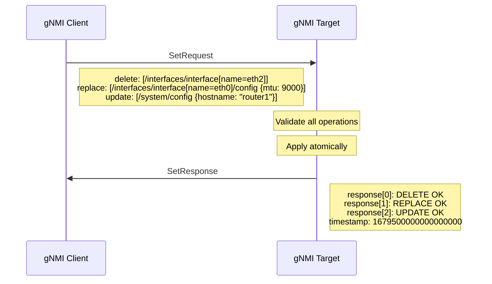
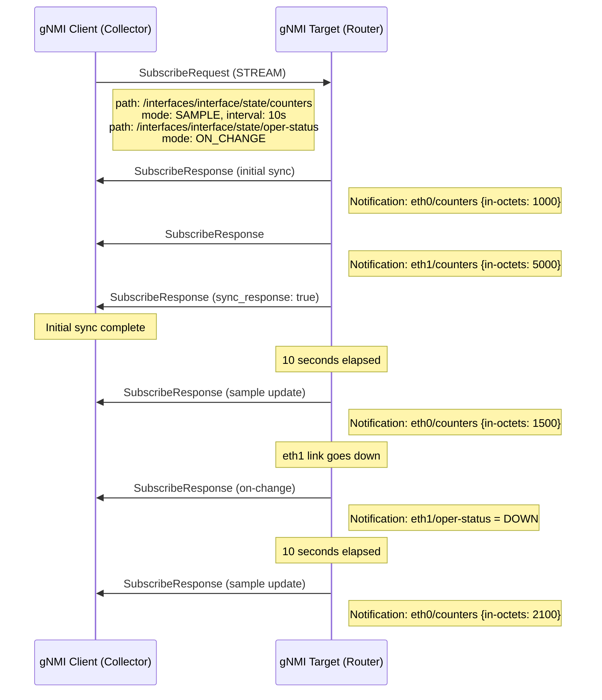
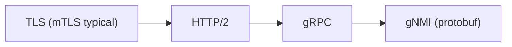

# gNMI (gRPC Network Management Interface)

> **Standard:** [OpenConfig gNMI Specification](https://github.com/openconfig/reference/blob/master/rpc/gnmi/gnmi-specification.md) | **Layer:** Application (Layer 7) | **Wireshark filter:** `grpc`

gNMI is a gRPC-based protocol for network device configuration and telemetry, developed by the OpenConfig consortium. It provides a modern, high-performance alternative to SNMP and NETCONF for streaming operational data and pushing configuration changes. gNMI uses Protocol Buffers for serialization over HTTP/2 (gRPC), enabling bidirectional streaming, strong typing, and efficient binary encoding. It operates on YANG-modeled data using XPath-style paths and supports streaming telemetry with sub-second granularity -- a fundamental shift from the poll-based approach of SNMP.

## gRPC Service Definition

gNMI defines four RPCs in its protobuf service:

```
service gNMI {
  rpc Capabilities(CapabilityRequest) returns (CapabilityResponse);
  rpc Get(GetRequest)                 returns (GetResponse);
  rpc Set(SetRequest)                 returns (SetResponse);
  rpc Subscribe(stream SubscribeRequest) returns (stream SubscribeResponse);
}
```

## RPCs

| RPC | Type | Description |
|-----|------|-------------|
| Capabilities | Unary | Discover supported models, encodings, and gNMI version |
| Get | Unary | Retrieve snapshots of data from the target |
| Set | Unary | Modify configuration on the target (transactional) |
| Subscribe | Bidirectional streaming | Stream telemetry data from the target |

## Path Encoding

gNMI uses structured paths based on YANG schema nodes:

```
/interfaces/interface[name=eth0]/state/counters/in-octets
```

Encoded as a protobuf `Path` message:

| Field | Description |
|-------|-------------|
| origin | Schema origin (e.g., `openconfig`, `ietf`) |
| elem[] | Ordered list of path elements |
| elem.name | Node name in the YANG tree |
| elem.key | Map of key-value pairs for list entries |

### Path Examples

| Path | Description |
|------|-------------|
| `/interfaces/interface[name=eth0]/config/mtu` | MTU config for eth0 |
| `/interfaces/interface[name=eth0]/state/counters` | All counters for eth0 |
| `/network-instances/network-instance[name=default]/protocols` | Routing protocols |
| `/system/config/hostname` | Device hostname |
| `/components/component[name=*]/state/temperature` | All component temperatures |

## Capabilities Exchange



### CapabilityResponse Fields

| Field | Description |
|-------|-------------|
| supported_models[] | YANG models with name, organization, and version |
| supported_encodings[] | JSON, JSON_IETF, PROTO, ASCII, BYTES |
| gnmi_version | Protocol version string (e.g., "0.10.0") |

## Get Operation

| GetRequest Field | Description |
|------------------|-------------|
| path[] | List of paths to retrieve |
| type | CONFIG, STATE, OPERATIONAL, or ALL |
| encoding | Desired response encoding |

| GetResponse Field | Description |
|-------------------|-------------|
| notification[] | List of Notification messages with timestamped data |

## Set Operation

Set is transactional -- all operations in a single SetRequest either succeed or fail atomically:



### Set Operation Types

| Operation | Description |
|-----------|-------------|
| delete | Remove the data at the specified path |
| replace | Replace the entire subtree at the path (missing leaves reset to defaults) |
| update | Merge the provided data with existing config (like NETCONF merge) |

All operations in a single SetRequest are applied as one transaction. If any operation fails, the entire Set is rolled back.

## Subscribe (Streaming Telemetry)

Subscribe is the core differentiator of gNMI -- enabling push-based, real-time telemetry:

### Subscription Modes

| Mode | Description |
|------|-------------|
| STREAM | Long-lived subscription; target continuously sends updates |
| ONCE | One-shot retrieval; target sends current values then closes |
| POLL | Client-driven; client sends Poll messages to trigger updates on demand |

### Stream Sub-Modes

| Sub-Mode | Description |
|----------|-------------|
| TARGET_DEFINED | Target chooses the best mode per leaf (vendor-optimized) |
| ON_CHANGE | Send update only when the value changes |
| SAMPLE | Send current value at a fixed interval (sample_interval) |

### Streaming Telemetry Flow



### Notification Message

| Field | Description |
|-------|-------------|
| timestamp | Nanoseconds since Unix epoch |
| prefix | Common path prefix for all updates in this notification |
| update[] | List of path-value pairs (updated/current data) |
| delete[] | List of paths removed from the data tree |
| atomic | If true, all updates must be treated as a single snapshot |

## Encoding Formats

| Encoding | Description |
|----------|-------------|
| JSON | Standard JSON (deprecated in favor of JSON_IETF) |
| JSON_IETF | JSON per RFC 7951 (YANG-to-JSON mapping rules) |
| PROTO | Binary protobuf encoding of typed values |
| ASCII | CLI-style text (vendor-specific) |
| BYTES | Raw bytes (opaque to gNMI) |

## gNOI (gRPC Network Operations Interface)

gNOI extends the gRPC management model with operational RPCs beyond config/telemetry:

| gNOI Service | Description |
|-------------|-------------|
| System | Reboot, SetPackage, SwitchControlProcessor, Ping, Traceroute, Time |
| OS | Install, Activate, Verify device OS images |
| Cert | Rotate, Install, GetCertificates -- certificate management |
| File | Get, Put, Stat, Remove -- file operations on device |
| BGP | ClearBGPNeighbor -- clear BGP sessions |
| Interface | ClearInterfaceCounters |
| Layer2 | ClearLLDPInterface, ClearSpanningTree |
| Healthz | Get, Check, Acknowledge -- component health |
| Factory Reset | Start -- return device to factory defaults |

## gNMI vs NETCONF vs SNMP

| Feature | gNMI | NETCONF | SNMP |
|---------|------|---------|------|
| Transport | gRPC/HTTP2 (TLS) | SSH (port 830) | UDP (port 161/162) |
| Encoding | Protobuf, JSON_IETF | XML | ASN.1 BER |
| Data model | YANG (OpenConfig) | YANG | MIB (SMI) |
| Streaming telemetry | Native (Subscribe) | Limited (RFC 5277) | No (poll only) |
| Config transactions | Yes (Set) | Yes (lock/commit) | No |
| Sub-second telemetry | Yes (SAMPLE mode) | No | No |
| On-change updates | Yes (ON_CHANGE mode) | Notification streams | Traps only |
| Bidirectional streaming | Yes (gRPC) | No | No |
| Binary efficiency | High (protobuf) | Low (XML) | Medium (BER) |
| Human-readable | JSON_IETF option | Somewhat (XML) | No |
| Origin | OpenConfig (2015) | IETF (2006/2011) | IETF (1988/2002) |
| Operations (gNOI) | Reboot, OS install, cert, file | Via vendor RPCs | Very limited |

## Encapsulation



Default port varies by implementation (commonly 9339, 6030, or 57400). No IANA-assigned port.

## Standards

| Document | Title |
|----------|-------|
| [gNMI Specification](https://github.com/openconfig/reference/blob/master/rpc/gnmi/gnmi-specification.md) | gRPC Network Management Interface specification |
| [gNMI Proto](https://github.com/openconfig/gnmi/blob/master/proto/gnmi/gnmi.proto) | gNMI Protocol Buffers definition |
| [gNOI Repository](https://github.com/openconfig/gnoi) | gRPC Network Operations Interface definitions |
| [OpenConfig Models](https://github.com/openconfig/public) | OpenConfig YANG models |
| [RFC 7951](https://www.rfc-editor.org/rfc/rfc7951) | JSON Encoding of Data Modeled with YANG |
| [RFC 7950](https://www.rfc-editor.org/rfc/rfc7950) | The YANG 1.1 Data Modeling Language |

## See Also

- [NETCONF](netconf.md) -- XML/SSH-based YANG datastore management
- [SNMP](snmp.md) -- legacy polling-based network monitoring
- [RESTCONF](restconf.md) -- HTTP-based YANG datastore access
- [OTLP](otlp.md) -- application-layer observability telemetry
