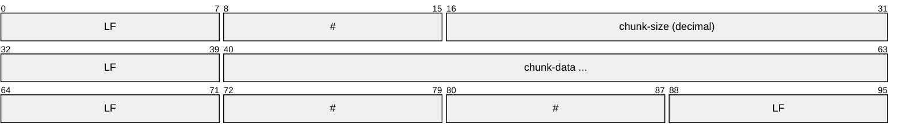
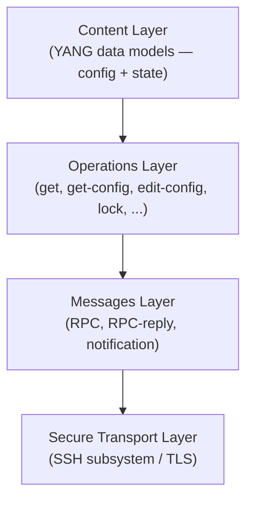
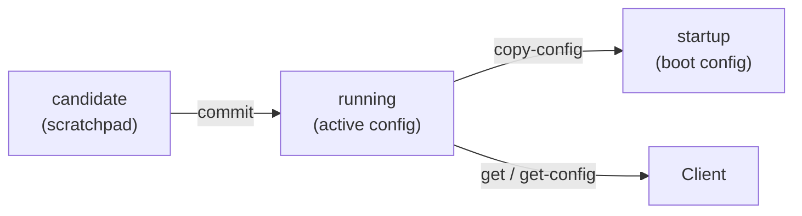
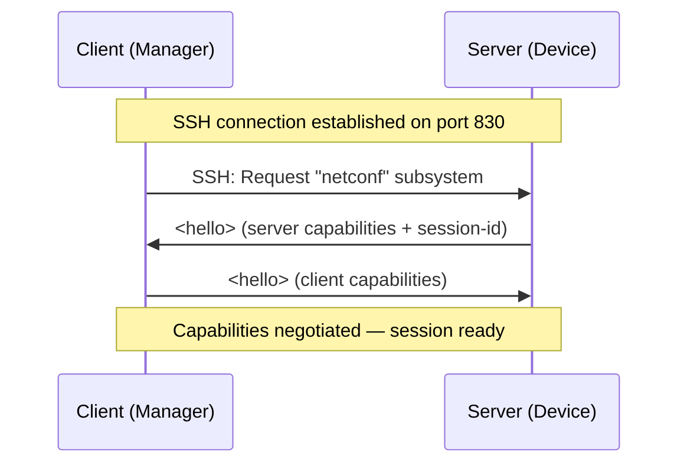
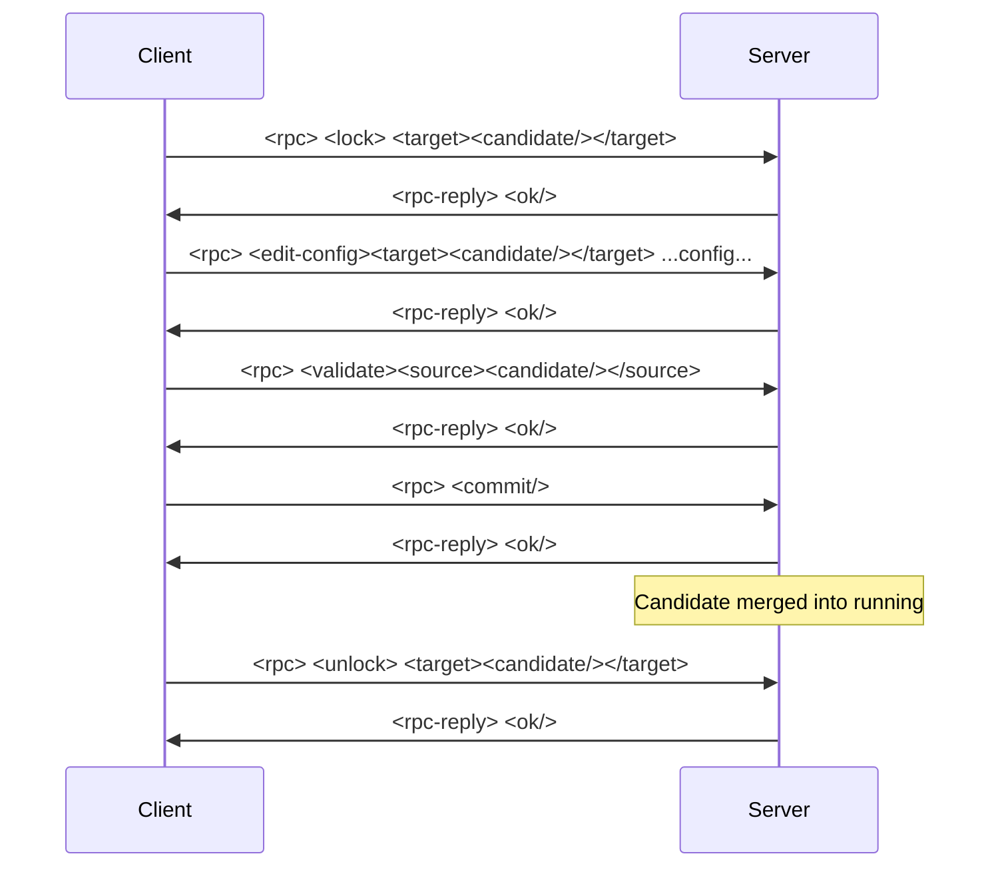
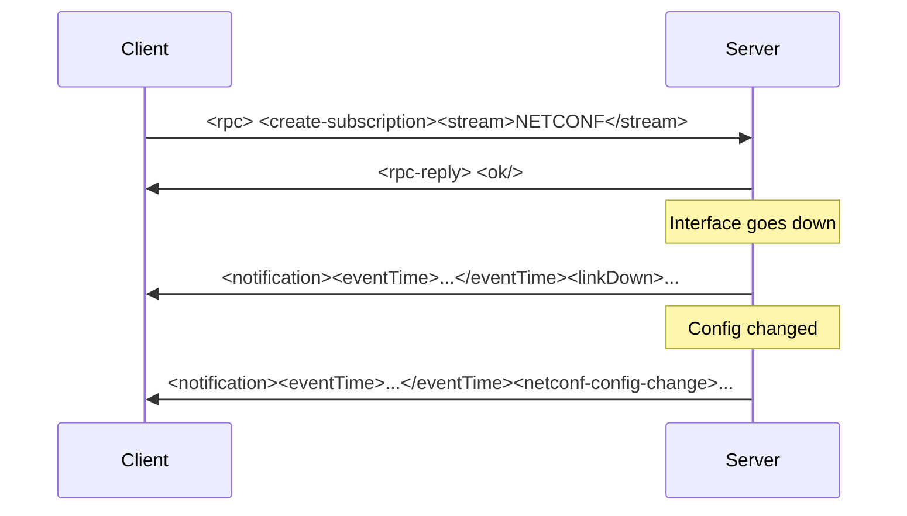
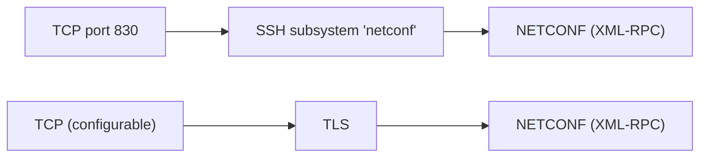

# NETCONF (Network Configuration Protocol)

> **Standard:** [RFC 6241](https://www.rfc-editor.org/rfc/rfc6241) | **Layer:** Application (Layer 7) | **Wireshark filter:** `netconf`

NETCONF is an IETF protocol for installing, manipulating, and deleting the configuration of network devices. It uses an RPC-based communication model where a client (manager) sends XML-encoded requests to a server (agent) over a secure transport, primarily SSH. Configuration data is modeled using YANG (RFC 7950), a rich data modeling language that defines the structure, constraints, and semantics of device configuration and state data. NETCONF supports multiple configuration datastores (running, candidate, startup) and provides transactional operations with locking, validation, and commit/rollback.

## NETCONF Message Framing

### NETCONF 1.0 (End-of-Message)

Messages are delimited by the character sequence `]]>]]>`:

```
<?xml version="1.0" encoding="UTF-8"?>
<rpc message-id="1" xmlns="urn:ietf:params:xml:ns:netconf:base:1.0">
  <get-config><source><running/></source></get-config>
</rpc>
]]>]]>
```

### NETCONF 1.1 (Chunked Framing)

Messages use chunked framing (RFC 6242) with explicit byte counts:



| Element | Description |
|---------|-------------|
| `\n#<size>\n` | Chunk header with byte count in decimal |
| chunk-data | XML message bytes (up to chunk-size) |
| `\n##\n` | End-of-message marker |

## NETCONF Layers



## RPC Message Structure

All NETCONF messages use a simple RPC envelope:

| Message | Root Element | Description |
|---------|-------------|-------------|
| Request | `<rpc>` | Client-to-server operation request |
| Reply | `<rpc-reply>` | Server-to-client response |
| Notification | `<notification>` | Server-to-client async event |

### Key Attributes

| Attribute | Description |
|-----------|-------------|
| message-id | Matches requests to replies (required on `<rpc>`) |
| xmlns | Namespace — `urn:ietf:params:xml:ns:netconf:base:1.0` |

## Operations

| Operation | Description |
|-----------|-------------|
| `<get>` | Retrieve running config and device state data |
| `<get-config>` | Retrieve all or part of a configuration datastore |
| `<edit-config>` | Modify a configuration datastore |
| `<copy-config>` | Copy entire configuration between datastores or to/from URL |
| `<delete-config>` | Delete a configuration datastore (not running) |
| `<lock>` | Lock a datastore for exclusive access |
| `<unlock>` | Release a datastore lock |
| `<close-session>` | Gracefully close the NETCONF session |
| `<kill-session>` | Force-close another NETCONF session |
| `<commit>` | Commit candidate configuration to running (`:candidate` capability) |
| `<discard-changes>` | Revert candidate datastore to current running config |
| `<validate>` | Validate a datastore or inline config (`:validate` capability) |

### edit-config Operations

The `operation` attribute on elements within `<edit-config>` controls merge behavior:

| Operation | Description |
|-----------|-------------|
| merge | Merge with existing config (default) |
| replace | Replace the target element entirely |
| create | Create new element; error if it already exists |
| delete | Delete the element; error if it does not exist |
| remove | Delete the element if it exists; no error if absent |

## Datastores



| Datastore | Description |
|-----------|-------------|
| running | Currently active configuration on the device |
| candidate | Working copy for staged changes before commit |
| startup | Configuration loaded at boot (if separate from running) |

## Capability Exchange

When a NETCONF session starts, both sides exchange `<hello>` messages advertising their capabilities:



### Common Capabilities

| Capability URI (suffix) | Description |
|------------------------|-------------|
| `:base:1.0` | NETCONF base protocol (RFC 4741) |
| `:base:1.1` | NETCONF base with chunked framing (RFC 6241) |
| `:candidate` | Candidate configuration datastore |
| `:confirmed-commit` | Commit with automatic rollback timer |
| `:rollback-on-error` | Roll back entire edit-config on any error |
| `:validate` | Configuration validation support |
| `:startup` | Separate startup datastore |
| `:writable-running` | Direct edit of running datastore |
| `:xpath` | XPath filter support |
| `:notification` | Event notification support (RFC 5277) |
| `:with-defaults` | Control retrieval of default values |

## Edit-Config with Candidate Commit



## Notification Subscription



## YANG Data Modeling Language

YANG (RFC 7950) defines the schema for NETCONF data:

### YANG Node Types

| Node Type | Description |
|-----------|-------------|
| module | Top-level unit of YANG definition; defines namespace |
| container | Grouping node with no value itself (like a directory) |
| list | Sequence of entries identified by key leaf(s) |
| leaf | Single scalar value (string, integer, boolean, etc.) |
| leaf-list | Sequence of scalar values (like a leaf array) |
| choice / case | Mutually exclusive branches |
| rpc | Defines an operation with input/output |
| notification | Defines an async event structure |
| augment | Extends another module's data tree |
| deviation | Documents how an implementation differs from the model |
| grouping / uses | Reusable node templates |
| typedef | Named type definition with constraints |

### YANG Built-in Types

| Type | Description |
|------|-------------|
| string | Text with optional length/pattern constraints |
| int8, int16, int32, int64 | Signed integers |
| uint8, uint16, uint32, uint64 | Unsigned integers |
| boolean | true or false |
| enumeration | One of a fixed set of named values |
| bits | Set of named bit flags |
| binary | Base64-encoded binary data |
| leafref | Reference to another leaf in the data tree |
| identityref | Reference to a YANG identity |
| union | One of several types |
| empty | Presence/absence indicator (no value) |
| inet:ipv4-address | IPv4 address (from ietf-inet-types) |
| inet:ipv6-address | IPv6 address (from ietf-inet-types) |
| yang:date-and-time | Timestamp (from ietf-yang-types) |

### Example YANG Module

```
module example-interfaces {
  namespace "urn:example:interfaces";
  prefix if;

  container interfaces {
    list interface {
      key "name";
      leaf name        { type string; }
      leaf enabled     { type boolean; default true; }
      leaf mtu         { type uint16 { range "68..9000"; } }
      leaf ip-address  { type inet:ipv4-address; }
    }
  }
}
```

Maps to NETCONF XML:

```
<interfaces>
  <interface>
    <name>eth0</name>
    <enabled>true</enabled>
    <mtu>1500</mtu>
    <ip-address>10.0.0.1</ip-address>
  </interface>
</interfaces>
```

## NETCONF Error Handling

| Error Tag | Description |
|-----------|-------------|
| in-use | Resource is locked by another session |
| invalid-value | Value does not meet YANG constraints |
| data-missing | Required data is absent |
| data-exists | Element already exists (create operation) |
| operation-not-supported | Operation not supported by server |
| lock-denied | Lock held by another session |
| access-denied | Insufficient authorization |
| rollback-failed | Rollback-on-error failed |

## NETCONF vs SNMP vs RESTCONF

| Feature | NETCONF | SNMP | RESTCONF |
|---------|---------|------|----------|
| Transport | SSH (port 830), TLS | UDP (port 161/162) | HTTPS (port 443) |
| Encoding | XML | ASN.1 BER | JSON or XML |
| Data model | YANG | MIB (SMI) | YANG |
| Config operations | Full CRUD + commit | SetRequest only | HTTP CRUD |
| Transactions | Yes (lock, validate, commit) | No | Partial (YANG Patch) |
| Candidate config | Yes | No | No (typically) |
| Rollback | Yes (confirmed-commit) | No | No |
| Streaming events | Yes (RFC 5277) | Traps/Informs | SSE |
| Human-readable | Somewhat (XML) | No (BER) | Yes (JSON) |
| Tooling | ncclient, YANG Explorer | Net-SNMP, snmpwalk | curl, Postman |
| Adoption | All major vendors | Universal | Growing |

## Encapsulation



## Standards

| Document | Title |
|----------|-------|
| [RFC 6241](https://www.rfc-editor.org/rfc/rfc6241) | Network Configuration Protocol (NETCONF) |
| [RFC 6242](https://www.rfc-editor.org/rfc/rfc6242) | Using the NETCONF Protocol over SSH |
| [RFC 7950](https://www.rfc-editor.org/rfc/rfc7950) | The YANG 1.1 Data Modeling Language |
| [RFC 5277](https://www.rfc-editor.org/rfc/rfc5277) | NETCONF Event Notifications |
| [RFC 6470](https://www.rfc-editor.org/rfc/rfc6470) | NETCONF Base Notifications |
| [RFC 7895](https://www.rfc-editor.org/rfc/rfc7895) | YANG Module Library |
| [RFC 8040](https://www.rfc-editor.org/rfc/rfc8040) | RESTCONF Protocol (HTTP-based alternative) |
| [RFC 8341](https://www.rfc-editor.org/rfc/rfc8341) | Network Configuration Access Control Model (NACM) |
| [RFC 8525](https://www.rfc-editor.org/rfc/rfc8525) | YANG Library |
| [RFC 4741](https://www.rfc-editor.org/rfc/rfc4741) | NETCONF (original, obsoleted by 6241) |

## See Also

- [SNMP](snmp.md) -- polling/trap-based management predecessor
- [RESTCONF](restconf.md) -- HTTP-based YANG datastore access
- [gNMI](gnmi.md) -- gRPC-based streaming telemetry and config
- [SSH](../remote-access/ssh.md) -- primary transport for NETCONF
