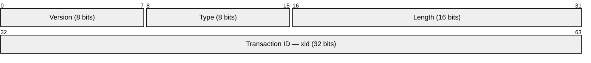
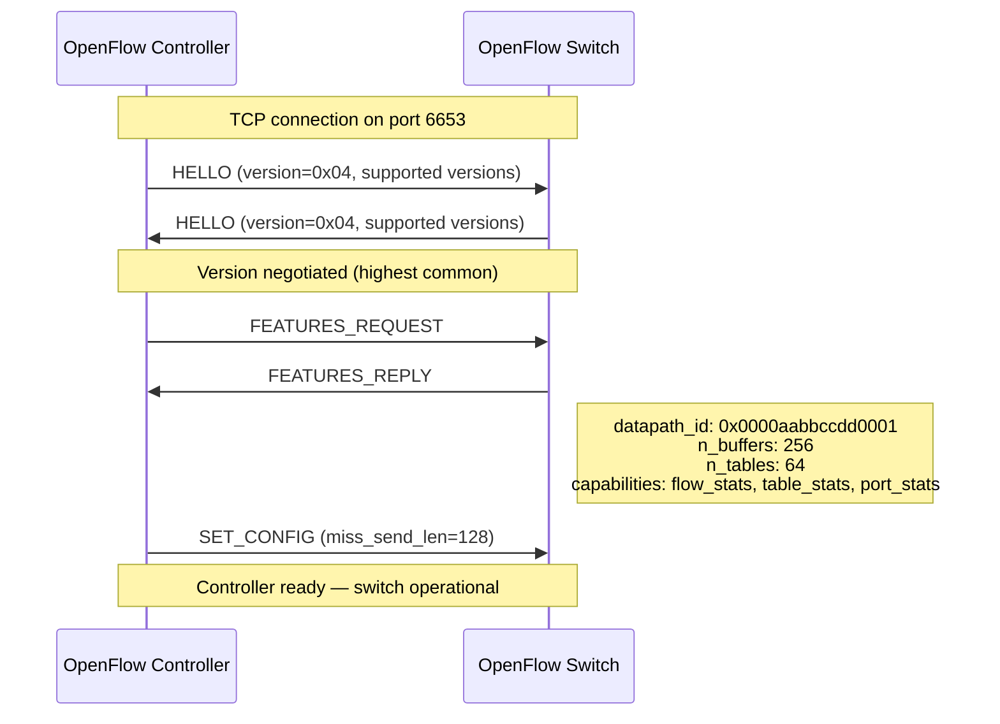
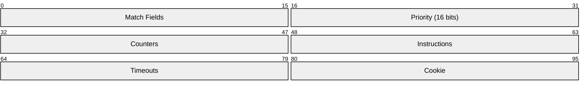
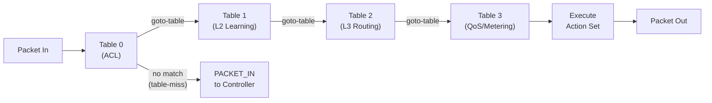
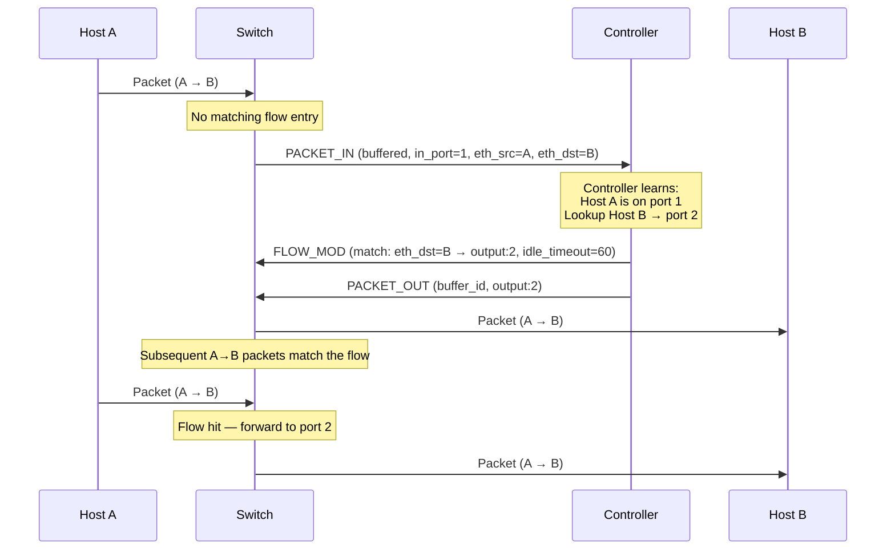
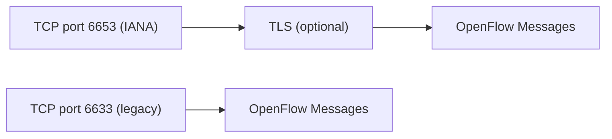

# OpenFlow

> **Standard:** [ONF OpenFlow Switch Specification 1.3.5](https://opennetworking.org/wp-content/uploads/2014/10/openflow-switch-v1.3.5.pdf) | **Layer:** Application (Layer 7) | **Wireshark filter:** `openflow` or `openflow_v4`

OpenFlow is the foundational protocol of Software-Defined Networking (SDN), enabling an external controller to program the forwarding behavior of network switches. It separates the control plane (routing decisions) from the data plane (packet forwarding), allowing centralized, programmable network management. The controller communicates with switches over a secure TCP connection, installing flow rules that define how packets are matched and what actions to apply. OpenFlow transforms switches from autonomous devices with embedded control logic into simple forwarding elements driven by a logically centralized controller.

## OpenFlow Header

Every OpenFlow message begins with an 8-byte header:

## Key Fields

| Field | Size | Description |
|-------|------|-------------|
| Version | 8 bits | Protocol version (0x01=1.0, 0x02=1.1, 0x03=1.2, 0x04=1.3, 0x06=1.5) |
| Type | 8 bits | Message type (see Message Types table) |
| Length | 16 bits | Total message length including header (in bytes) |
| xid | 32 bits | Transaction ID — matches requests to replies |

## Message Types (OpenFlow 1.3)

### Controller-to-Switch

| Type | Value | Description |
|------|-------|-------------|
| HELLO | 0 | Version negotiation on connection startup |
| ERROR | 1 | Error notification |
| ECHO_REQUEST | 2 | Keepalive / latency measurement |
| ECHO_REPLY | 3 | Response to Echo Request |
| FEATURES_REQUEST | 5 | Request switch capabilities |
| FEATURES_REPLY | 6 | Switch capabilities (datapath ID, buffers, tables) |
| GET_CONFIG_REQUEST | 7 | Request switch configuration |
| GET_CONFIG_REPLY | 8 | Switch configuration response |
| SET_CONFIG | 9 | Set switch configuration |
| PACKET_OUT | 13 | Send a packet out of a switch port |
| FLOW_MOD | 14 | Add, modify, or delete flow table entries |
| GROUP_MOD | 15 | Add, modify, or delete group table entries |
| PORT_MOD | 16 | Modify port configuration |
| TABLE_MOD | 17 | Modify table configuration |
| STATS_REQUEST | 18 | Request statistics |
| STATS_REPLY | 19 | Statistics response |
| BARRIER_REQUEST | 20 | Ensure all prior messages are processed |
| BARRIER_REPLY | 21 | Confirmation that barrier is complete |
| ROLE_REQUEST | 24 | Set controller role (master/slave/equal) |
| ROLE_REPLY | 25 | Controller role response |
| METER_MOD | 29 | Add, modify, or delete meter entries |

### Switch-to-Controller (Async)

| Type | Value | Description |
|------|-------|-------------|
| PACKET_IN | 10 | Forward a packet to the controller |
| FLOW_REMOVED | 11 | Notify controller that a flow was removed |
| PORT_STATUS | 12 | Notify controller of port state change |

## Switch Connection Setup

## Flow Table

Each switch contains one or more flow tables. Packets are matched against entries in priority order:

### Flow Entry Structure

| Component | Description |
|-----------|-------------|
| Match Fields | Packet header fields to match against |
| Priority | Higher value = higher priority (0-65535) |
| Counters | Packet count, byte count, duration |
| Instructions | Actions to apply to matching packets |
| Idle Timeout | Remove flow after N seconds of inactivity (0 = never) |
| Hard Timeout | Remove flow after N seconds regardless (0 = never) |
| Cookie | Opaque value set by the controller for identification |

### Match Fields (OXM)

| Field | OXM Type | Description |
|-------|----------|-------------|
| IN_PORT | 0 | Ingress switch port |
| ETH_DST | 3 | Destination MAC address |
| ETH_SRC | 4 | Source MAC address |
| ETH_TYPE | 5 | EtherType (0x0800=IPv4, 0x0806=ARP, 0x86DD=IPv6) |
| VLAN_VID | 6 | VLAN ID |
| VLAN_PCP | 7 | VLAN priority |
| IP_DSCP | 8 | IP DSCP (differentiated services) |
| IP_PROTO | 10 | IP protocol (6=TCP, 17=UDP, 1=ICMP) |
| IPV4_SRC | 11 | Source IPv4 address (with mask) |
| IPV4_DST | 12 | Destination IPv4 address (with mask) |
| TCP_SRC | 13 | TCP source port |
| TCP_DST | 14 | TCP destination port |
| UDP_SRC | 15 | UDP source port |
| UDP_DST | 16 | UDP destination port |
| ICMPV4_TYPE | 19 | ICMPv4 type |
| ARP_OP | 21 | ARP opcode |
| IPV6_SRC | 26 | Source IPv6 address |
| IPV6_DST | 27 | Destination IPv6 address |
| TUNNEL_ID | 38 | Logical tunnel metadata |

### Instructions

| Instruction | Description |
|-------------|-------------|
| Apply-Actions | Execute actions immediately on the packet |
| Write-Actions | Add actions to the packet's action set (executed at end of pipeline) |
| Clear-Actions | Clear the action set |
| Goto-Table | Continue processing at a specified table |
| Write-Metadata | Write metadata for use by subsequent tables |
| Meter | Direct packet to a meter for rate limiting |

### Actions

| Action | Description |
|--------|-------------|
| OUTPUT | Forward packet to a port (or CONTROLLER, FLOOD, ALL, IN_PORT) |
| SET_FIELD | Modify a packet header field (rewrite MAC, IP, port, etc.) |
| PUSH_VLAN | Push a new VLAN tag onto the packet |
| POP_VLAN | Remove the outermost VLAN tag |
| PUSH_MPLS | Push an MPLS label |
| POP_MPLS | Pop an MPLS label |
| GROUP | Forward to a group table entry |
| SET_QUEUE | Set the output queue for QoS |
| DROP | (implicit) No output action = drop the packet |

## Pipeline Processing

Packets traverse multiple flow tables in sequence:

Each table processes the packet independently. A table-miss entry (priority=0, match-all) defines what happens when no flow matches -- typically send to controller via PACKET_IN.

## Reactive Forwarding (Packet-In / Flow-Mod / Packet-Out)

## FLOW_MOD Commands

| Command | Value | Description |
|---------|-------|-------------|
| ADD | 0 | Add a new flow entry |
| MODIFY | 1 | Modify matching flow entries |
| MODIFY_STRICT | 2 | Modify entry with exact match + priority |
| DELETE | 3 | Delete matching flow entries |
| DELETE_STRICT | 4 | Delete entry with exact match + priority |

## Group Table

Groups enable complex forwarding like multicast, load balancing, and fast failover:

| Group Type | Description |
|------------|-------------|
| ALL | Execute all action buckets (multicast/broadcast) |
| SELECT | Execute one bucket (load balancing — round-robin or weighted) |
| INDIRECT | Execute a single defined bucket (next-hop indirection) |
| FAST_FAILOVER | Execute first live bucket (link failover) |

## Meter Table

Meters provide per-flow rate limiting:

| Meter Band Type | Description |
|-----------------|-------------|
| DROP | Drop packets exceeding the rate |
| DSCP_REMARK | Lower DSCP value for exceeding packets |

## Controller Roles (Multi-Controller)

| Role | Description |
|------|-------------|
| EQUAL | Full access (default); all controllers are equal |
| MASTER | Full read/write; only one master at a time |
| SLAVE | Read-only; receives async messages based on config |

## OpenFlow vs Traditional Networking

| Aspect | OpenFlow / SDN | Traditional Networking |
|--------|---------------|----------------------|
| Control plane | Centralized (external controller) | Distributed (per-device) |
| Forwarding decisions | Controller programs flow tables | Each device runs routing protocols |
| Configuration | Programmatic (controller API) | CLI / SNMP per device |
| Flexibility | Arbitrary match/action rules | Fixed protocol behavior |
| Vendor lock-in | Reduced (standard southbound API) | High (proprietary CLI/features) |
| Convergence | Controller-driven (can be instant) | Protocol-dependent (seconds to minutes) |
| Scalability | Controller must handle all switches | Each device operates independently |
| Failure mode | Controller failure = no new flows | Devices continue autonomously |
| Network visibility | Global view at controller | Per-device local view |
| Use cases | Data centers, WANs, research, campus | Enterprise, ISP, general purpose |

## Version History

| Version | Year | Key Additions |
|---------|------|---------------|
| 1.0 | 2009 | Single table, basic match/action |
| 1.1 | 2011 | Multiple tables, groups, MPLS |
| 1.2 | 2011 | IPv6 matching, controller roles |
| 1.3 | 2012 | Meters, per-flow rate limiting, table-miss entry, OXM match |
| 1.4 | 2013 | Optical ports, bundles, synchronized tables |
| 1.5 | 2014 | Egress tables, copy-field action, scheduled bundles |

## Encapsulation

Port 6653 is the IANA-assigned port (since OpenFlow 1.3.3). Port 6633 was used by earlier implementations and remains common. TLS is recommended for production deployments.

## Standards

| Document | Title |
|----------|-------|
| [OpenFlow 1.3.5](https://opennetworking.org/wp-content/uploads/2014/10/openflow-switch-v1.3.5.pdf) | OpenFlow Switch Specification 1.3.5 (most widely deployed) |
| [OpenFlow 1.5.1](https://opennetworking.org/wp-content/uploads/2014/10/openflow-switch-v1.5.1.pdf) | OpenFlow Switch Specification 1.5.1 (latest) |
| [ONF TR-523](https://opennetworking.org/) | OpenFlow Table Type Patterns |
| [ONF](https://opennetworking.org/) | Open Networking Foundation (standards body) |

## See Also

- [SNMP](snmp.md) -- device monitoring (complementary to SDN control)
- [NETCONF](netconf.md) -- configuration management for network devices
- [LLDP](../link-layer/lldp.md) -- topology discovery used alongside SDN
- [BGP](../routing/bgp.md) -- traditional distributed routing protocol
